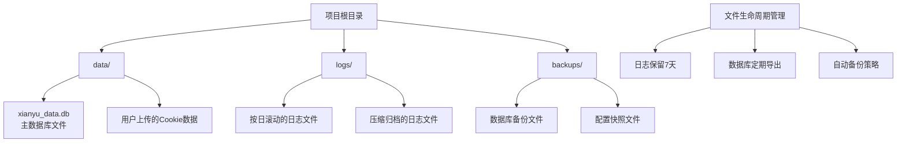
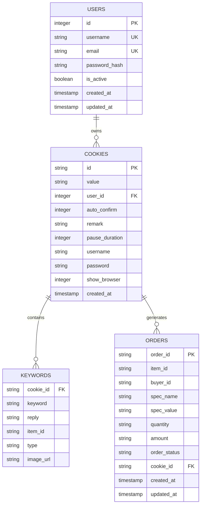
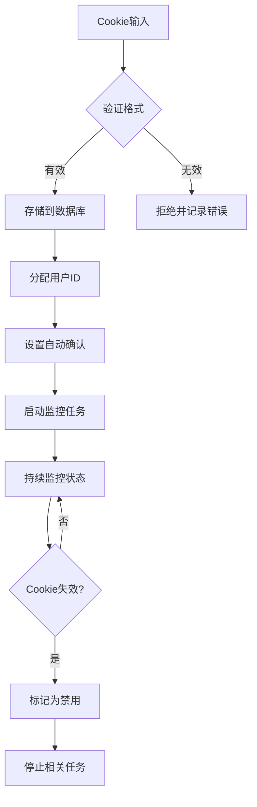
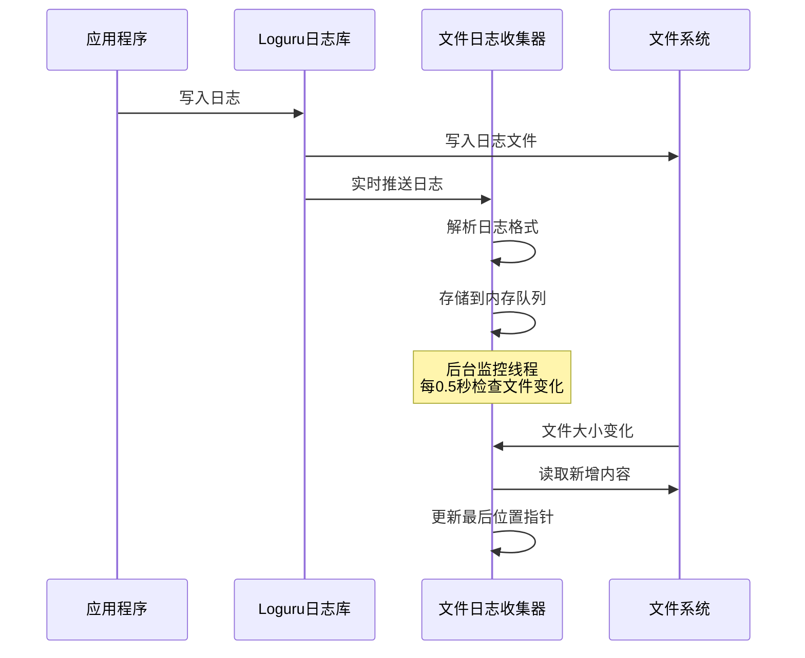
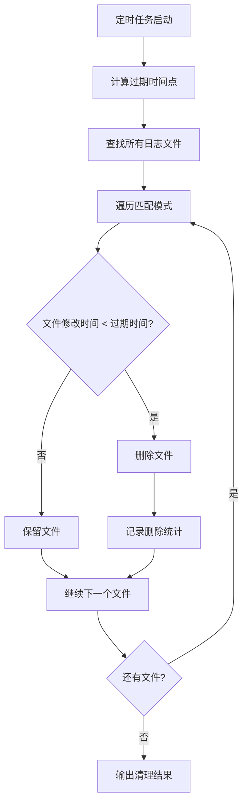
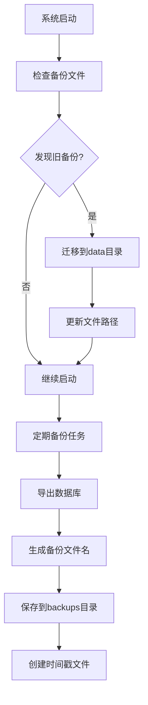
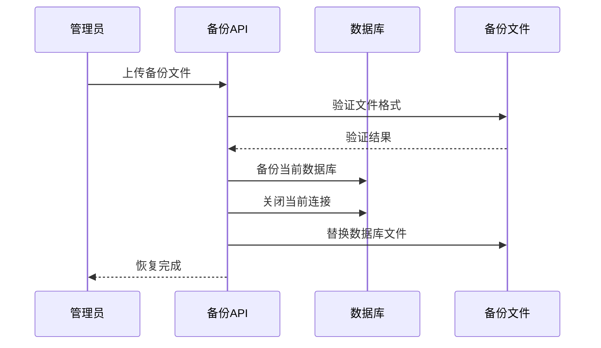
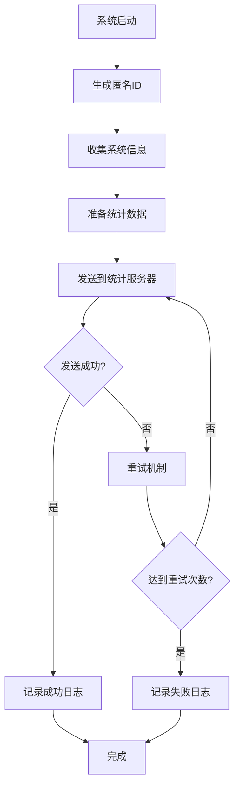

# 数据目录说明

<cite>
**本文档中引用的文件**
- [db_manager.py](file://db_manager.py)
- [file_log_collector.py](file://file_log_collector.py)
- [usage_statistics.py](file://usage_statistics.py)
- [config.py](file://config.py)
- [global_config.yml](file://global_config.yml)
- [Start.py](file://Start.py)
- [reply_server.py](file://reply_server.py)
- [XianyuAutoAsync.py](file://XianyuAutoAsync.py)
</cite>

## 目录结构概览

该项目采用三层持久化目录结构，分别用于存储不同类型的数据：

**图表来源**
- [Start.py](file://Start.py#L67-L137)
- [db_manager.py](file://db_manager.py#L19-L48)

## 1. ./data 目录 - 主要数据存储

### 1.1 SQLite数据库文件

**核心文件：xianyu_data.db**

该目录是系统的核心数据存储中心，主要负责持久化存储以下关键数据：

#### 1.1.1 主数据库结构

**图表来源**
- [db_manager.py](file://db_manager.py#L74-L281)

#### 1.1.2 数据库管理特性

- **自动初始化**：首次运行时自动创建数据库表结构
- **版本升级**：支持数据库schema的自动升级和迁移
- **事务安全**：所有数据库操作都使用事务保证数据一致性
- **并发控制**：使用可重入锁保护数据库操作

#### 1.1.3 用户数据管理

系统支持多用户架构，每个用户可以拥有独立的Cookie配置和回复规则：

- **用户认证**：基于用户名和密码的认证系统
- **Cookie隔离**：不同用户的Cookie数据完全隔离
- **权限控制**：管理员可以管理所有用户数据

**节来源**
- [db_manager.py](file://db_manager.py#L16-L48)
- [db_manager.py](file://db_manager.py#L67-L447)

### 1.2 Cookie数据管理

#### 1.2.1 Cookie存储机制

系统支持多种Cookie存储方式：

- **数据库存储**：主要的Cookie数据存储在SQLite数据库中
- **环境变量**：支持通过环境变量传递Cookie信息
- **配置文件**：支持从配置文件中加载Cookie

#### 1.2.2 Cookie生命周期

**图表来源**
- [Start.py](file://Start.py#L530-L548)

**节来源**
- [Start.py](file://Start.py#L524-L576)

## 2. ./logs 目录 - 日志管理系统

### 2.1 日志收集架构

系统采用双层日志收集机制，确保日志数据的完整性和实时性：

**图表来源**
- [file_log_collector.py](file://file_log_collector.py#L78-L98)
- [XianyuAutoAsync.py](file://XianyuAutoAsync.py#L140-L156)

### 2.2 日志配置参数

#### 2.2.1 Loguru配置

系统使用Loguru库进行日志管理，配置参数如下：

| 参数 | 值 | 说明 |
|------|-----|------|
| rotation | "1 day" | 按天滚动日志文件 |
| retention | "7 days" | 保留7天的日志文件 |
| compression | "zip" | 使用ZIP压缩归档旧日志 |
| level | "DEBUG" | 日志级别（开发环境） |
| format | 自定义格式 | 包含时间、级别、源文件、行号 |

#### 2.2.2 文件监控配置

- **监控频率**：每0.5秒检查一次日志文件变化
- **缓冲模式**：行缓冲，确保日志立即写入
- **队列模式**：禁用队列，避免写入延迟
- **最大容量**：内存中最多保存2000条日志记录

### 2.3 日志清理机制

系统实现了自动化的日志清理机制：

**图表来源**
- [XianyuAutoAsync.py](file://XianyuAutoAsync.py#L568-L626)

#### 2.3.1 清理策略

- **保留期限**：默认保留7天的日志文件
- **文件模式**：清理`xianyu_*.log`、`app_*.log`及其压缩版本
- **空间回收**：自动删除过期文件，释放磁盘空间
- **统计报告**：记录清理的文件数量和释放的空间

**节来源**
- [file_log_collector.py](file://file_log_collector.py#L18-L71)
- [XianyuAutoAsync.py](file://XianyuAutoAsync.py#L568-L626)

## 3. ./backups 目录 - 备份管理系统

### 3.1 备份策略

系统提供了多层次的备份策略，确保数据安全：

#### 3.1.1 自动备份

**图表来源**
- [Start.py](file://Start.py#L113-L137)

#### 3.1.2 备份文件格式

- **文件扩展名**：`.db`（SQLite数据库文件）
- **命名规则**：`xianyu_data_backup_YYYYMMDD_HHMMSS.db`
- **存储位置**：默认在`data/`目录下
- **文件大小**：根据数据库实际大小动态生成

### 3.2 备份管理功能

#### 3.2.1 备份导出

系统支持两种备份导出方式：

1. **全量备份**：导出整个数据库的所有表
2. **增量备份**：支持用户级别的数据备份

#### 3.2.2 备份恢复

**图表来源**
- [reply_server.py](file://reply_server.py#L5207-L5351)

#### 3.2.3 备份验证

系统在恢复备份时会进行严格的验证：

- **文件格式检查**：确保是有效的SQLite数据库文件
- **表结构验证**：检查必需的表是否存在
- **数据完整性**：验证数据库文件的完整性

**节来源**
- [Start.py](file://Start.py#L113-L137)
- [reply_server.py](file://reply_server.py#L5207-L5351)

## 4. 数据采集与分析流程

### 4.1 使用统计收集

系统实现了匿名的使用统计收集机制：

**图表来源**
- [usage_statistics.py](file://usage_statistics.py#L137-L144)

#### 4.1.1 匿名标识符

系统使用SHA256哈希算法生成唯一的匿名用户ID：

- **生成依据**：基于机器特征（CPU、操作系统、Python版本）
- **持久化**：保存到数据库中，确保Docker重建时ID不变
- **隐私保护**：不收集任何个人身份信息

#### 4.1.2 统计内容

收集的统计信息包括：

- **操作系统信息**：Windows/Linux/macOS
- **软件版本**：从version.txt文件读取
- **使用情况**：用户数量统计
- **性能指标**：系统运行状态

### 4.2 数据生命周期管理

#### 4.2.1 文件生命周期策略

| 目录 | 生命周期 | 清理策略 | 存储格式 |
|------|----------|----------|----------|
| ./data | 永久存储 | 手动清理 | SQLite数据库 |
| ./logs | 7天 | 自动清理 | 文本文件+压缩 |
| ./backups | 手动管理 | 手动清理 | SQLite数据库 |

#### 4.2.2 自动化管理

- **日志轮转**：按天自动创建新的日志文件
- **备份调度**：支持定时自动备份
- **空间监控**：定期检查磁盘使用情况
- **清理任务**：自动删除过期文件

**节来源**
- [usage_statistics.py](file://usage_statistics.py#L18-L144)

## 5. 总结

该项目的数据目录设计体现了以下特点：

### 5.1 分层存储架构

- **./data**：核心业务数据，使用SQLite数据库持久化
- **./logs**：系统运行日志，采用Loguru进行高效管理
- **./backups**：数据备份，支持手动和自动备份策略

### 5.2 自动化管理

- **自动迁移**：启动时自动迁移旧版本数据文件
- **自动清理**：定期清理过期日志和备份文件
- **自动备份**：支持定时自动备份数据库

### 5.3 数据安全

- **数据隔离**：不同用户的数据完全隔离
- **备份保护**：多重备份策略确保数据安全
- **隐私保护**：使用匿名统计，不收集个人身份信息

### 5.4 性能优化

- **内存管理**：合理控制日志内存占用
- **磁盘优化**：自动压缩和清理减少磁盘占用
- **并发控制**：使用锁机制保证数据一致性

这种设计确保了系统的稳定性、可维护性和数据安全性，同时提供了良好的用户体验和运维便利性。