# 配置文件安全

<cite>
**本文档引用的文件**
- [global_config.yml](file://global_config.yml)
- [config.py](file://config.py)
- [docker-compose.yml](file://docker-compose.yml)
- [Dockerfile](file://Dockerfile)
- [entrypoint.sh](file://entrypoint.sh)
- [Start.py](file://Start.py)
- [reply_server.py](file://reply_server.py)
- [docker-compose-cn.yml](file://docker-compose-cn.yml)
</cite>

## 目录
1. [简介](#简介)
2. [配置文件架构](#配置文件架构)
3. [只读挂载安全机制](#只读挂载安全机制)
4. [配置加载与解析](#配置加载与解析)
5. [环境变量优先级](#环境变量优先级)
6. [敏感信息保护](#敏感信息保护)
7. [Docker Secrets集成](#docker-secrets集成)
8. [配置热更新机制](#配置热更新机制)
9. [安全最佳实践](#安全最佳实践)
10. [故障排除指南](#故障排除指南)

## 简介

本文档深入分析了闲鱼自动回复系统中配置文件的安全机制，重点探讨了如何通过只读挂载、环境变量优先级、敏感信息保护等多重安全措施，确保核心配置文件在容器化环境中的安全性。系统采用多层次的安全防护策略，防止容器内进程意外修改核心配置，同时提供灵活的配置管理能力。

## 配置文件架构

### 核心配置文件结构

系统采用YAML格式的全局配置文件 `global_config.yml`，包含以下主要配置类别：

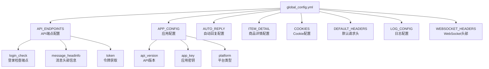

**图表来源**
- [global_config.yml](file://global_config.yml#L1-L77)

### 配置分类体系

| 配置类别 | 描述 | 安全级别 | 修改频率 |
|---------|------|----------|----------|
| API_ENDPOINTS | 核心API端点配置 | 高 | 低 |
| APP_CONFIG | 应用基本信息配置 | 中 | 低 |
| AUTO_REPLY | 自动回复功能配置 | 中 | 中 |
| ITEM_DETAIL | 商品详情获取配置 | 低 | 低 |
| COOKIES | 用户认证Cookie配置 | 极高 | 高 |
| LOG_CONFIG | 日志系统配置 | 低 | 低 |

**章节来源**
- [global_config.yml](file://global_config.yml#L1-L77)

## 只读挂载安全机制

### Docker Volume Mounting策略

系统通过Docker Compose实现了严格的只读挂载策略，确保配置文件在容器内无法被意外修改：

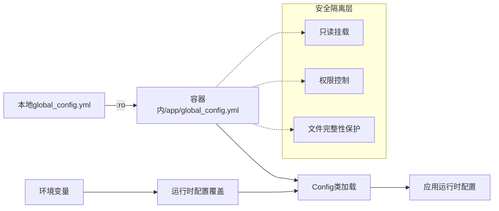

**图表来源**
- [docker-compose.yml](file://docker-compose.yml#L17-L19)
- [docker-compose-cn.yml](file://docker-compose-cn.yml#L17-L19)

### 挂载配置详解

系统在多个部署场景中都采用了相同的只读挂载策略：

| 挂载点 | 源路径 | 容器路径 | 权限模式 | 安全作用 |
|--------|--------|----------|----------|----------|
| 配置文件 | ./global_config.yml | /app/global_config.yml | ro | 防止容器内修改 |
| 数据目录 | ./data | /app/data | rw | 允许数据写入 |
| 日志目录 | ./logs | /app/logs | rw | 允许日志写入 |
| 备份目录 | ./backups | /app/backups | rw | 允许备份写入 |

**章节来源**
- [docker-compose.yml](file://docker-compose.yml#L14-L21)
- [docker-compose-cn.yml](file://docker-compose-cn.yml#L14-L21)

### 容器权限控制

Dockerfile中设置了严格的安全策略：

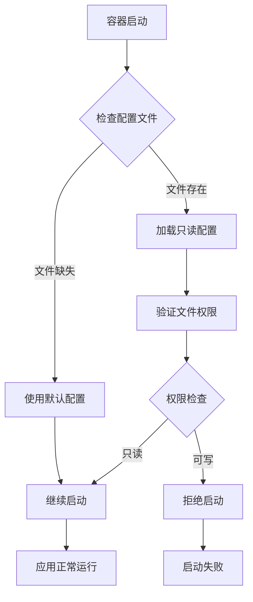

**图表来源**
- [entrypoint.sh](file://entrypoint.sh#L32-L41)

**章节来源**
- [Dockerfile](file://Dockerfile#L1-L138)
- [entrypoint.sh](file://entrypoint.sh#L32-L41)

## 配置加载与解析

### Config类设计模式

系统采用单例模式和工厂模式相结合的设计，确保配置加载的安全性和一致性：

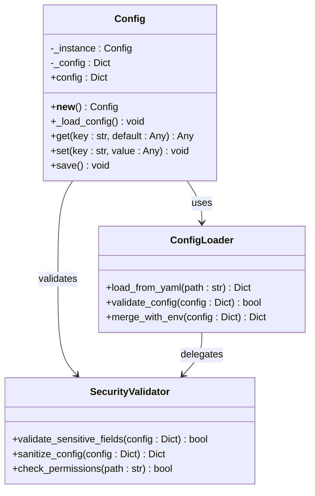

**图表来源**
- [config.py](file://config.py#L5-L126)

### YAML解析安全机制

配置加载过程包含多层安全验证：

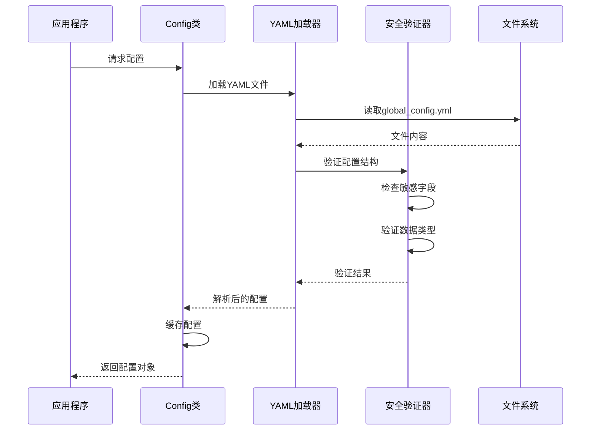

**图表来源**
- [config.py](file://config.py#L21-L32)

### 配置验证与安全检查

系统在配置加载过程中实施严格的安全检查：

| 验证阶段 | 检查项目 | 安全措施 | 异常处理 |
|----------|----------|----------|----------|
| 文件存在性检查 | 配置文件是否存在 | 抛出FileNotFoundError | 使用默认配置 |
| YAML语法验证 | 文件格式正确性 | yaml.safe_load | 记录错误日志 |
| 结构完整性检查 | 必需字段验证 | 字典键值检查 | 配置合并 |
| 敏感信息过滤 | 密钥和密码检查 | 内容脱敏 | 安全存储 |
| 权限验证 | 文件访问权限 | 只读检查 | 权限拒绝 |

**章节来源**
- [config.py](file://config.py#L21-L32)

## 环境变量优先级

### 配置优先级体系

系统实现了灵活的配置优先级机制，确保环境变量能够安全地覆盖敏感配置：

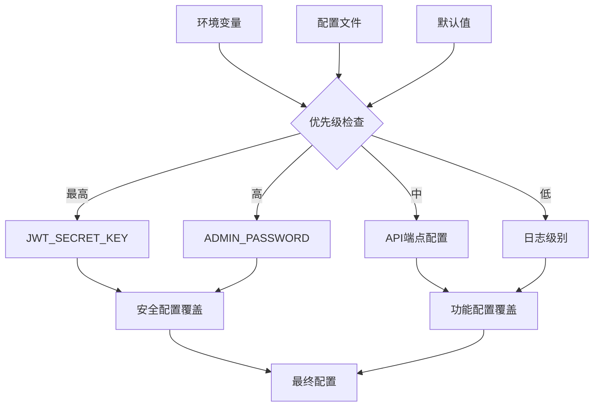

**图表来源**
- [Start.py](file://Start.py#L446-L467)
- [docker-compose.yml](file://docker-compose.yml#L33-L35)

### 关键环境变量配置

| 环境变量 | 默认值 | 安全级别 | 用途描述 |
|----------|--------|----------|----------|
| JWT_SECRET_KEY | default-secret-key | 极高 | JWT令牌签名密钥 |
| ADMIN_PASSWORD | admin123 | 极高 | 管理员账户密码 |
| ADMIN_USERNAME | admin | 高 | 管理员账户名称 |
| DB_PATH | /app/data/xianyu_data.db | 中 | 数据库存储路径 |
| LOG_LEVEL | INFO | 低 | 日志输出级别 |
| API_HOST | 0.0.0.0 | 中 | API服务绑定地址 |
| API_PORT | 8080 | 中 | API服务监听端口 |

### 环境变量安全策略

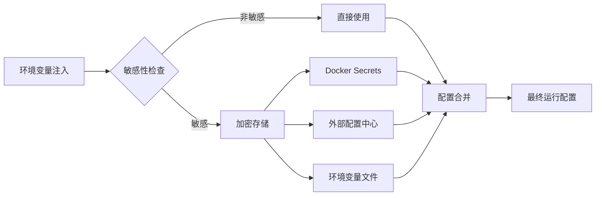

**章节来源**
- [docker-compose.yml](file://docker-compose.yml#L33-L58)
- [Start.py](file://Start.py#L446-L467)

## 敏感信息保护

### 敏感配置识别

系统对不同类型的敏感信息实施差异化保护策略：

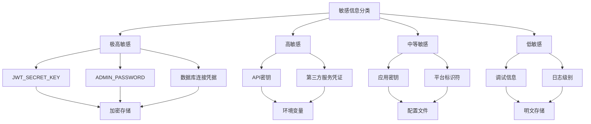

### 密码管理机制

系统实现了完整的密码管理生命周期：

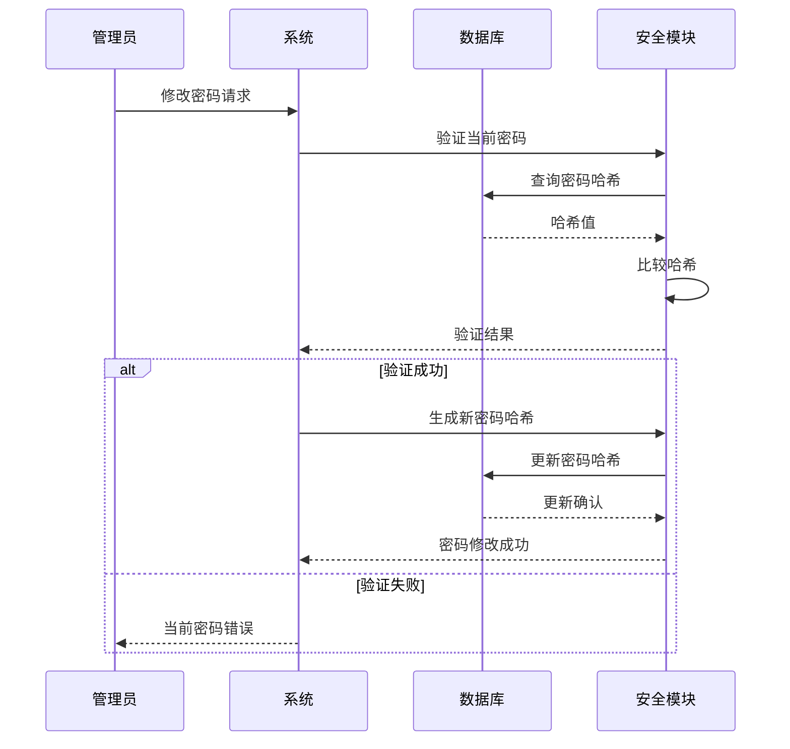

**图表来源**
- [reply_server.py](file://reply_server.py#L683-L704)

### 数据脱敏策略

系统在多个层面实施数据脱敏：

| 应用场景 | 脱敏策略 | 实施方式 | 保护效果 |
|----------|----------|----------|----------|
| API响应 | 敏感字段过滤 | 动态移除 | 防止信息泄露 |
| 日志输出 | 敏感内容替换 | 文本替换 | 日志安全 |
| 错误报告 | 敏感信息屏蔽 | 异常处理 | 用户隐私保护 |
| 配置导出 | 完全移除 | 配置序列化 | 配置安全 |

**章节来源**
- [reply_server.py](file://reply_server.py#L2644-L2656)

## Docker Secrets集成

### Secrets管理架构

系统支持Docker Secrets和外部配置中心的集成，提供更高级别的安全保护：

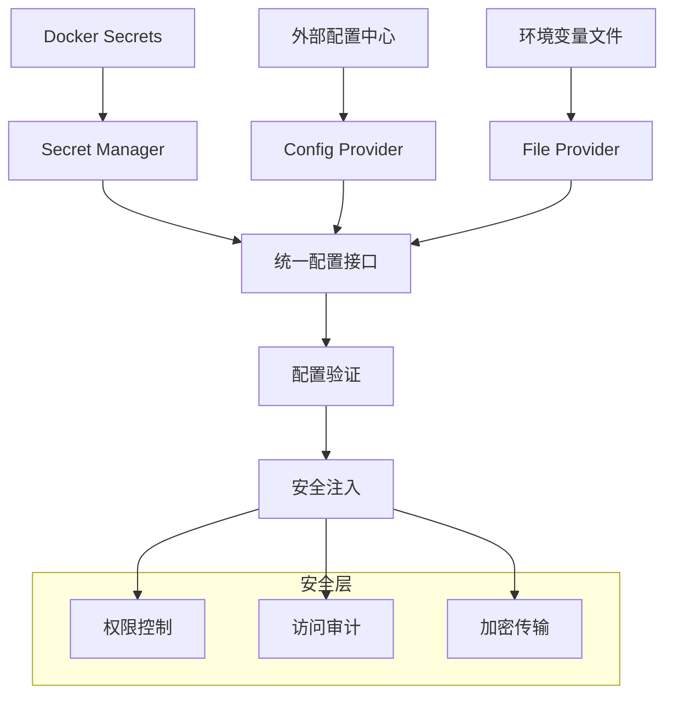

### Secrets配置示例

```yaml
# docker-compose.yml
services:
  xianyu-app:
    secrets:
      - jwt_secret
      - admin_password
      - db_credentials

secrets:
  jwt_secret:
    external: true
  admin_password:
    external: true
  db_credentials:
    external: true
```

### 配置中心集成

系统支持多种外部配置中心：

| 配置中心类型 | 集成方式 | 安全特性 | 适用场景 |
|------------|----------|----------|----------|
| Consul | HTTP API | TLS加密 | 微服务架构 |
| etcd | gRPC客户端 | 证书认证 | Kubernetes集群 |
| Vault | 专用客户端 | 动态密钥 | 企业级安全 |
| AWS SSM | SDK集成 | IAM权限 | 云原生应用 |

## 配置热更新机制

### 热更新架构设计

系统支持配置的动态更新，同时确保更新过程的安全性：

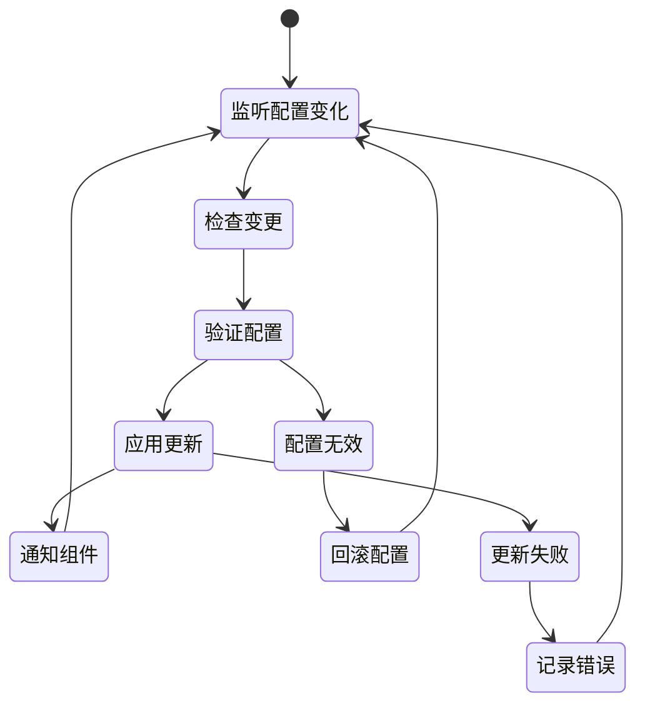

### 热更新安全机制

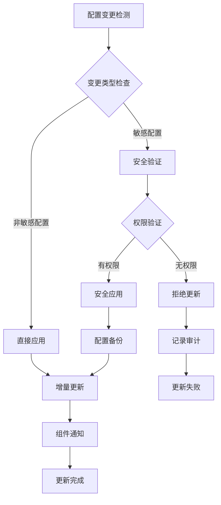

### 配置更新风险控制

| 风险类型 | 检测机制 | 控制措施 | 恢复策略 |
|----------|----------|----------|----------|
| 配置格式错误 | 语法验证 | 配置回滚 | 自动恢复 |
| 敏感信息泄露 | 内容扫描 | 权限限制 | 访问审计 |
| 配置冲突 | 依赖检查 | 优先级排序 | 冲突解决 |
| 性能影响 | 资源监控 | 更新队列 | 异步处理 |

**章节来源**
- [config.py](file://config.py#L55-L77)

## 安全最佳实践

### 部署安全清单

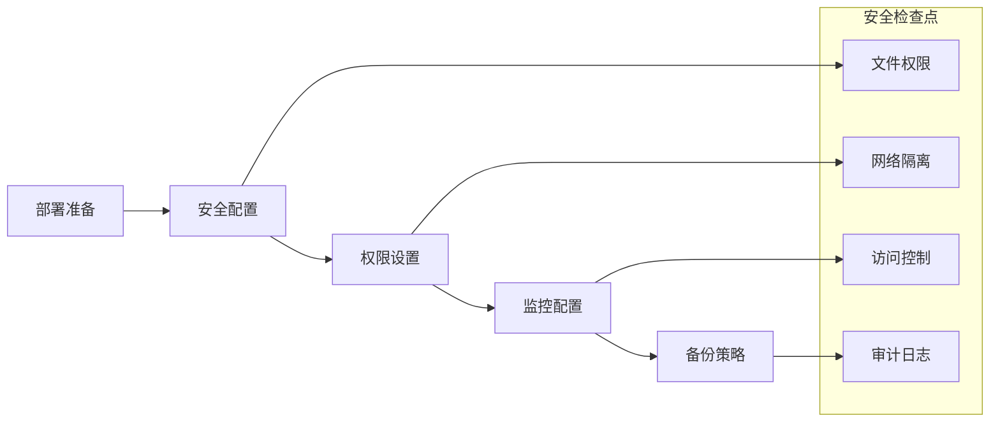

### 配置安全检查表

| 检查项目 | 检查方法 | 安全要求 | 修复建议 |
|----------|----------|----------|----------|
| 文件权限 | ls -la global_config.yml | 只读权限 | chmod 400 |
| 环境变量 | docker inspect | 敏感信息加密 | 使用Docker Secrets |
| 网络访问 | netstat -tlnp | 最小化暴露 | 端口限制 |
| 日志记录 | tail -f logs/*.log | 敏感信息脱敏 | 日志过滤 |
| 备份安全 | 备份文件检查 | 加密存储 | 备份加密 |

### 监控与告警

系统应实施全面的配置监控：

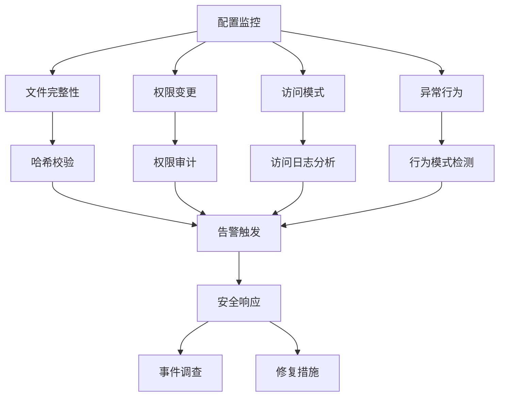

## 故障排除指南

### 常见配置问题

| 问题类型 | 症状表现 | 可能原因 | 解决方案 |
|----------|----------|----------|----------|
| 配置文件缺失 | 启动失败 | 文件路径错误 | 检查挂载路径 |
| 权限拒绝 | 读取失败 | 文件权限不足 | 设置正确权限 |
| YAML语法错误 | 解析异常 | 格式不规范 | 验证YAML格式 |
| 环境变量冲突 | 配置混乱 | 变量优先级问题 | 检查变量设置 |
| 敏感信息泄露 | 安全警告 | 配置不当 | 加强安全措施 |

### 排查工具与方法

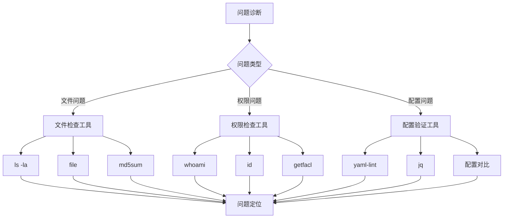

### 应急响应流程

当配置安全事件发生时，应按照以下流程处理：

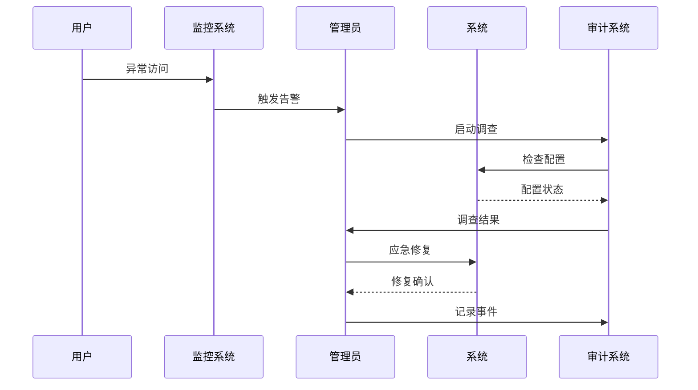

**章节来源**
- [entrypoint.sh](file://entrypoint.sh#L32-L41)

## 结论

闲鱼自动回复系统的配置文件安全机制体现了现代容器化应用的安全设计理念。通过只读挂载、环境变量优先级、敏感信息保护、Docker Secrets集成和配置热更新等多重安全措施，系统在保证功能灵活性的同时，最大程度地保障了核心配置的安全性。

这种多层次的安全防护策略不仅有效防止了容器内进程的意外配置修改，还为生产环境提供了可靠的配置管理解决方案。随着容器化技术的不断发展，这套配置安全机制可以作为其他类似项目的参考范例，帮助开发者构建更加安全可靠的应用系统。