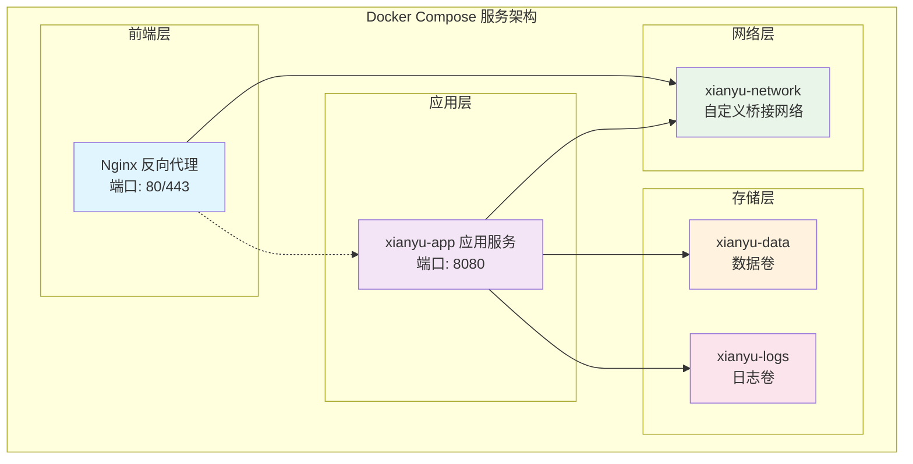
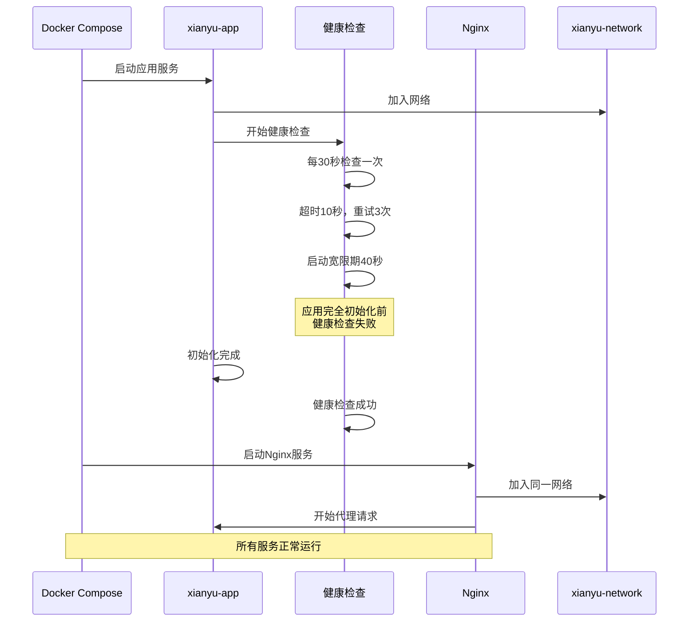
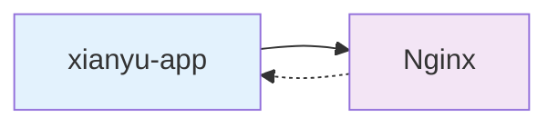
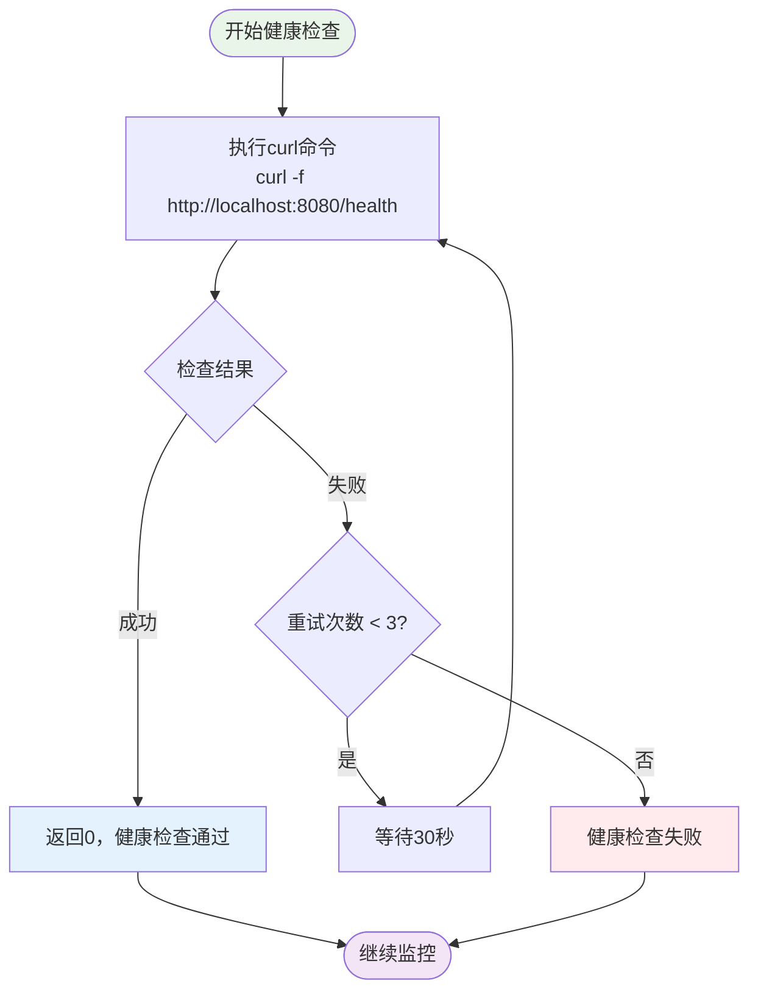
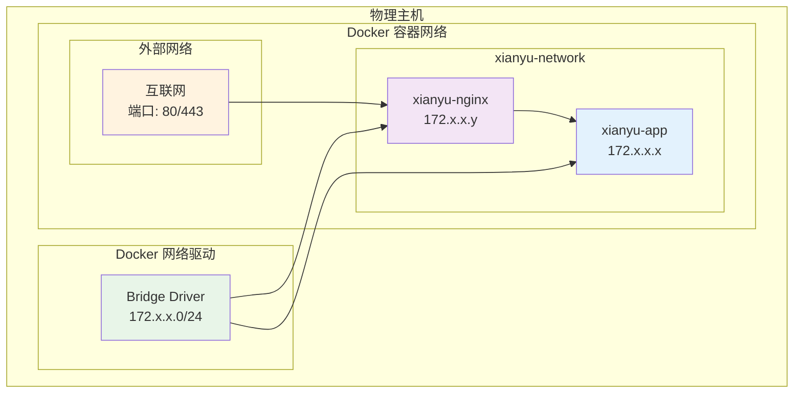
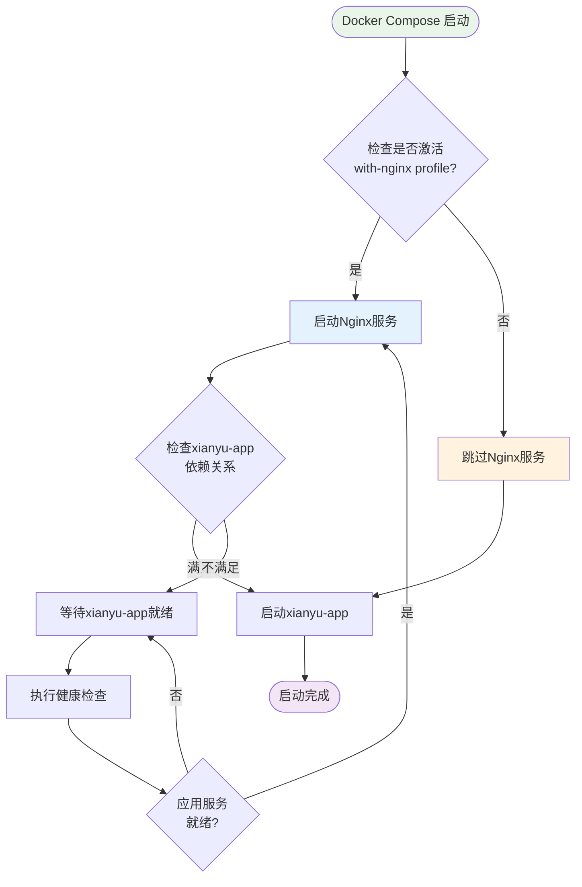
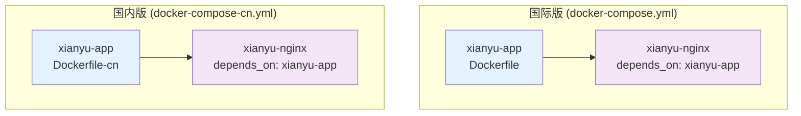

# 依赖管理

<cite>
**本文档中引用的文件**
- [docker-compose.yml](file://docker-compose.yml)
- [docker-compose-cn.yml](file://docker-compose-cn.yml)
- [Dockerfile](file://Dockerfile)
- [Dockerfile-cn](file://Dockerfile-cn)
- [nginx.conf](file://nginx/nginx.conf)
- [reply_server.py](file://reply_server.py)
</cite>

## 目录
1. [概述](#概述)
2. [服务依赖关系架构](#服务依赖关系架构)
3. [depends_on指令实现机制](#depends_on指令实现机制)
4. [健康检查配置详解](#健康检查配置详解)
5. [网络配置与服务通信](#网络配置与服务通信)
6. [条件化服务启动](#条件化服务启动)
7. [跨地域部署的一致性](#跨地域部署的一致性)
8. [故障排除指南](#故障排除指南)
9. [最佳实践建议](#最佳实践建议)

## 概述

本文档详细阐述了Xianyu Auto Reply项目中docker-compose.yml文件的依赖管理机制，重点分析了如何通过`depends_on`指令、健康检查配置和网络隔离等技术手段，确保Nginx反向代理服务在xianyu-app应用服务完全启动并就绪后才启动，从而避免反向代理出现502错误。

该系统采用容器化架构，通过精心设计的服务依赖关系和健康检查机制，实现了高可用性和容错能力。

## 服务依赖关系架构

### 整体架构图



**图表来源**
- [docker-compose.yml](file://docker-compose.yml#L1-L106)
- [docker-compose-cn.yml](file://docker-compose-cn.yml#L1-L106)

### 服务启动顺序



**图表来源**
- [docker-compose.yml](file://docker-compose.yml#L61-L68)
- [docker-compose.yml](file://docker-compose.yml#L90-L95)

**节来源**
- [docker-compose.yml](file://docker-compose.yml#L1-L106)
- [docker-compose-cn.yml](file://docker-compose-cn.yml#L1-L106)

## depends_on指令实现机制

### 基本语法结构

在docker-compose.yml中，`depends_on`指令用于声明服务间的依赖关系：

```yaml
services:
  nginx:
    depends_on:
      - xianyu-app
```

### 实现原理分析

#### 1. 服务启动顺序控制

`depends_on`指令确保以下启动顺序：
- **阶段1**: 同时启动所有服务（无依赖关系的服务）
- **阶段2**: 启动被依赖的服务（xianyu-app）
- **阶段3**: 启动依赖服务（nginx）

#### 2. 与传统启动方式的区别

传统的启动方式可能导致的问题：
- Nginx先启动，尝试连接xianyu-app但服务未就绪
- 导致502 Bad Gateway错误
- 需要手动重启或等待

使用`depends_on`后的正确流程：
- Nginx等待xianyu-app完全启动并就绪
- 避免不必要的重试和错误

#### 3. 依赖关系的单向性



**图表来源**
- [docker-compose.yml](file://docker-compose.yml#L90-L91)

**节来源**
- [docker-compose.yml](file://docker-compose.yml#L90-L91)
- [docker-compose-cn.yml](file://docker-compose-cn.yml#L90-L91)

## 健康检查配置详解

### 健康检查参数详解

#### 1. 健康检查测试命令

```yaml
healthcheck:
  test: ["CMD", "curl", "-f", "http://localhost:8080/health"]
  interval: 30s
  timeout: 10s
  retries: 3
  start_period: 40s
```

#### 2. 参数配置说明

| 参数 | 值 | 说明 |
|------|-----|------|
| 测试命令 | `curl -f http://localhost:8080/health` | 使用curl检测健康端点 |
| 检查间隔 | 30秒 | 每30秒执行一次健康检查 |
| 超时时间 | 10秒 | 健康检查最多等待10秒 |
| 重试次数 | 3次 | 失败后最多重试3次 |
| 启动宽限期 | 40秒 | 应用启动后等待40秒再开始检查 |

#### 3. 健康检查流程图



**图表来源**
- [docker-compose.yml](file://docker-compose.yml#L63-L68)
- [Dockerfile](file://Dockerfile#L132-L133)

#### 4. 应用内部健康检查实现

应用服务内部实现了专门的健康检查端点：

```python
@app.get('/health')
async def health_check():
    """健康检查端点，用于Docker健康检查和负载均衡器"""
    try:
        # 检查Cookie管理器状态
        manager_status = "ok" if cookie_manager.manager is not None else "error"
        
        # 检查数据库连接
        from db_manager import db_manager
        try:
            db_manager.get_all_cookies()
            db_status = "ok"
        except Exception:
            db_status = "error"
            
        status = {
            "status": "healthy" if manager_status == "ok" and db_status == "ok" else "unhealthy",
            "services": {
                "cookie_manager": manager_status,
                "database": db_status
            }
        }
        return status
    except Exception:
        return {"status": "unhealthy"}
```

**节来源**
- [docker-compose.yml](file://docker-compose.yml#L63-L68)
- [Dockerfile](file://Dockerfile#L132-L133)
- [reply_server.py](file://reply_server.py#L374-L406)

## 网络配置与服务通信

### 自定义桥接网络

#### 1. 网络配置结构

```yaml
networks:
  xianyu-network:
    driver: bridge
```

#### 2. 网络架构图



**图表来源**
- [docker-compose.yml](file://docker-compose.yml#L98-L100)

#### 3. 服务间通信机制

##### Nginx配置中的上游服务器

```nginx
upstream xianyu_backend {
    server xianyu-app:8080;
    keepalive 32;
}
```

##### 代理配置

```nginx
location / {
    proxy_pass http://xianyu_backend;
    proxy_http_version 1.1;
    proxy_set_header Upgrade $http_upgrade;
    proxy_set_header Connection 'upgrade';
    proxy_set_header Host $host;
    proxy_set_header X-Real-IP $remote_addr;
    proxy_set_header X-Forwarded-For $proxy_add_x_forwarded_for;
    proxy_set_header X-Forwarded-Proto $scheme;
}
```

#### 4. 网络安全特性

- **隔离性**: 不同服务运行在独立的容器中
- **访问控制**: 仅通过指定端口进行通信
- **DNS解析**: 容器内可通过服务名称直接访问

**节来源**
- [docker-compose.yml](file://docker-compose.yml#L98-L100)
- [nginx/nginx.conf](file://nginx/nginx.conf#L43-L45)
- [nginx/nginx.conf](file://nginx/nginx.conf#L61-L74)

## 条件化服务启动

### Profiles配置机制

#### 1. Profile定义

```yaml
profiles:
  - with-nginx
```

#### 2. 条件启动流程



**图表来源**
- [docker-compose.yml](file://docker-compose.yml#L94-L95)

#### 3. 使用示例

激活Nginx服务的命令：
```bash
docker-compose --profile with-nginx up -d
```

禁用Nginx服务的命令：
```bash
docker-compose up -d
```

#### 4. 条件启动的优势

- **灵活性**: 根据需求选择是否启用Nginx
- **性能优化**: 减少不必要的服务启动
- **资源节约**: 降低系统资源占用

**节来源**
- [docker-compose.yml](file://docker-compose.yml#L94-L95)
- [docker-compose-cn.yml](file://docker-compose-cn.yml#L94-L95)

## 跨地域部署的一致性

### 地域差异对比

#### 1. 构建配置对比

| 特性 | docker-compose.yml | docker-compose-cn.yml |
|------|-------------------|----------------------|
| Dockerfile路径 | Dockerfile | Dockerfile-cn |
| Python包源 | 默认PyPI | 清华大学镜像源 |
| 网络配置 | 完全相同 | 完全相同 |
| 服务依赖 | 完全相同 | 完全相同 |
| 健康检查 | 完全相同 | 完全相同 |
| 网络驱动 | bridge | bridge |
| Profile配置 | with-nginx | with-nginx |

#### 2. 服务依赖逻辑一致性



**图表来源**
- [docker-compose.yml](file://docker-compose.yml#L5-L6)
- [docker-compose-cn.yml](file://docker-compose-cn.yml#L5-L6)

#### 3. 一致性验证

两个配置文件在关键依赖管理方面保持完全一致：

1. **依赖关系**: 两者都使用相同的`depends_on`配置
2. **健康检查**: 使用相同的健康检查参数和端点
3. **网络配置**: 都创建相同的`xianyu-network`桥接网络
4. **条件启动**: 都使用相同的`with-nginx` profile配置

#### 4. 地域部署的最佳实践

- **代码复用**: 依赖管理逻辑在两地保持一致
- **运维简化**: 统一的部署和维护流程
- **故障排除**: 相同的排查方法适用于两地

**节来源**
- [docker-compose.yml](file://docker-compose.yml#L1-L106)
- [docker-compose-cn.yml](file://docker-compose-cn.yml#L1-L106)

## 故障排除指南

### 常见问题及解决方案

#### 1. Nginx启动过早导致的502错误

**症状**: 访问网站时出现502 Bad Gateway错误

**原因**: Nginx在xianyu-app服务未完全启动时就开始代理请求

**解决方案**:
- 确认`depends_on`配置正确
- 检查健康检查配置
- 验证服务启动顺序

#### 2. 健康检查失败

**症状**: xianyu-app容器频繁重启

**诊断步骤**:
```bash
# 查看容器日志
docker-compose logs xianyu-app

# 手动测试健康检查端点
docker exec -it xianyu-auto-reply curl -f http://localhost:8080/health

# 检查容器状态
docker-compose ps
```

#### 3. 网络连接问题

**症状**: Nginx无法连接到后端服务

**解决方案**:
```bash
# 检查网络配置
docker network ls
docker network inspect xianyu-network

# 测试容器间连通性
docker exec -it xianyu-nginx ping xianyu-app
```

#### 4. Profile配置问题

**症状**: Nginx服务未按预期启动

**解决方案**:
```bash
# 检查当前激活的profile
docker-compose config --profiles

# 明确激活with-nginx profile
docker-compose --profile with-nginx up -d
```

### 监控和调试工具

#### 1. 健康检查监控

```bash
# 实时查看健康检查状态
docker-compose events --format '{{.Actor.Attributes.name}} {{.Status}}'

# 检查容器健康状态
docker inspect --format='{{json .State.Health}}' xianyu-auto-reply
```

#### 2. 网络流量监控

```bash
# 查看网络接口统计
docker stats

# 监控网络连接
docker exec -it xianyu-nginx netstat -tlnp
```

## 最佳实践建议

### 1. 服务依赖设计原则

- **最小依赖**: 只声明必要的依赖关系
- **明确顺序**: 使用`depends_on`确保正确的启动顺序
- **健康检查**: 配置适当的健康检查机制
- **网络隔离**: 使用自定义网络实现服务隔离

### 2. 性能优化建议

- **资源限制**: 合理配置内存和CPU限制
- **健康检查间隔**: 根据应用特点调整检查频率
- **启动宽限期**: 设置合适的启动等待时间

### 3. 运维管理建议

- **日志监控**: 启用详细的日志记录
- **健康检查监控**: 监控健康检查的成功率
- **网络监控**: 定期检查容器间网络连通性
- **定期更新**: 保持容器镜像和依赖的最新状态

### 4. 安全考虑

- **用户权限**: 使用非root用户运行应用
- **网络隔离**: 限制不必要的端口暴露
- **健康检查安全**: 避免在健康检查端点暴露敏感信息

通过遵循这些最佳实践，可以确保系统的稳定性、安全性和可维护性，同时最大化利用Docker Compose的依赖管理功能。