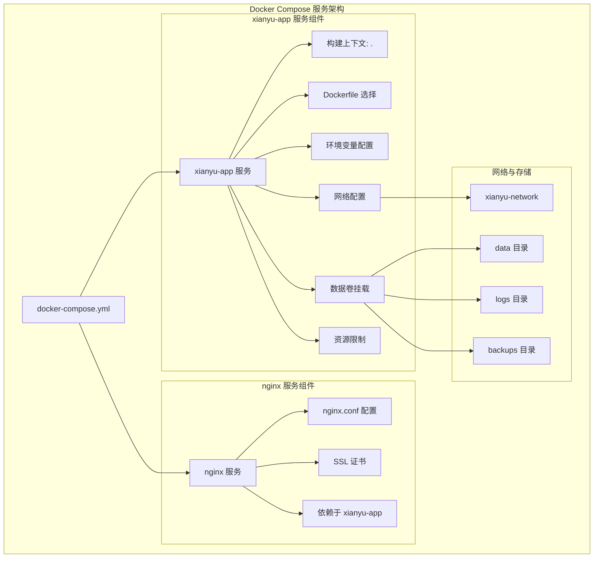
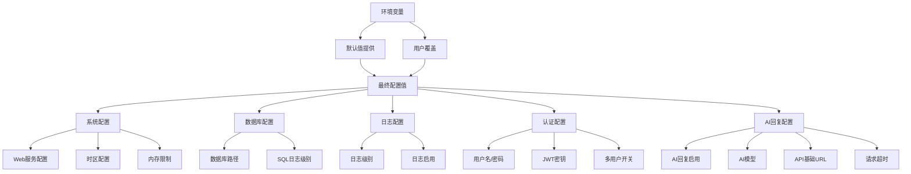
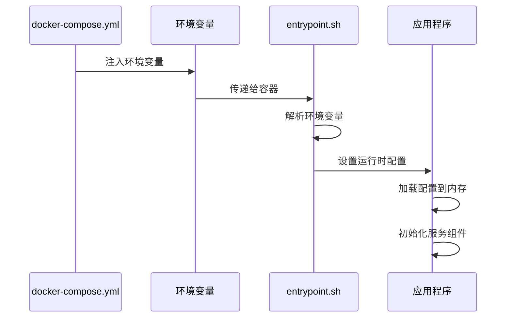
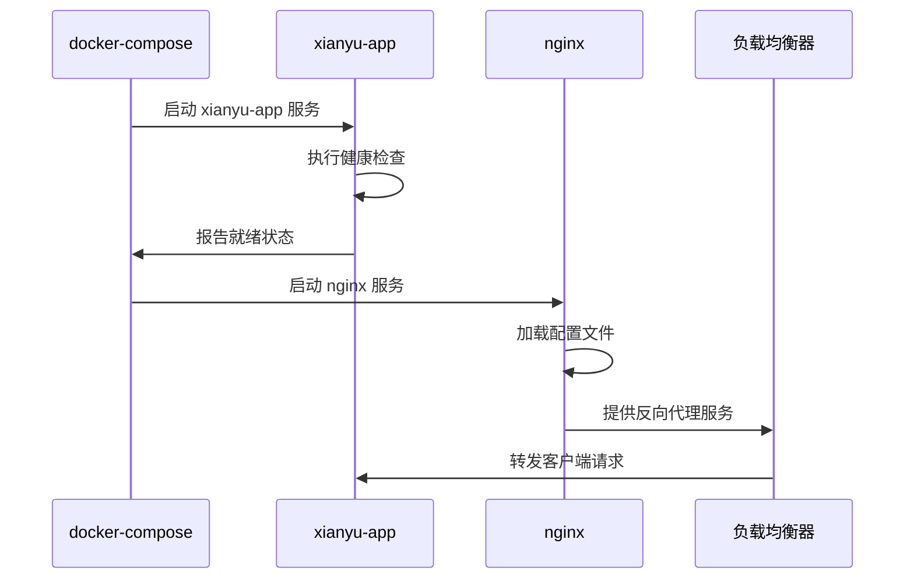
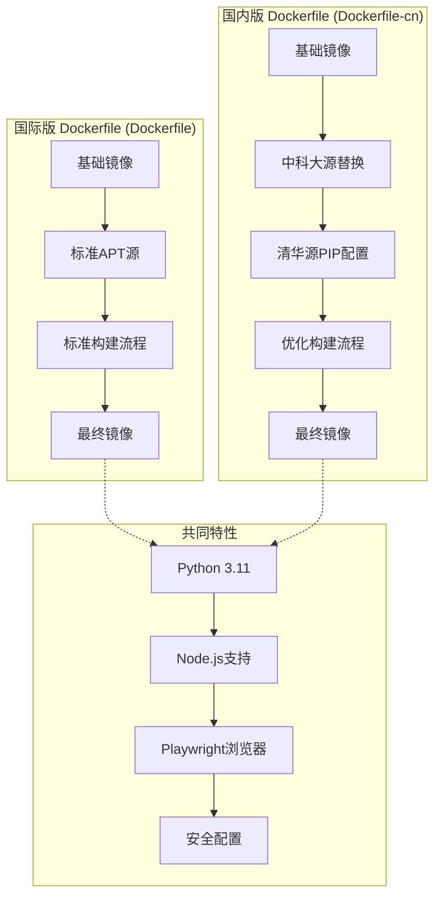
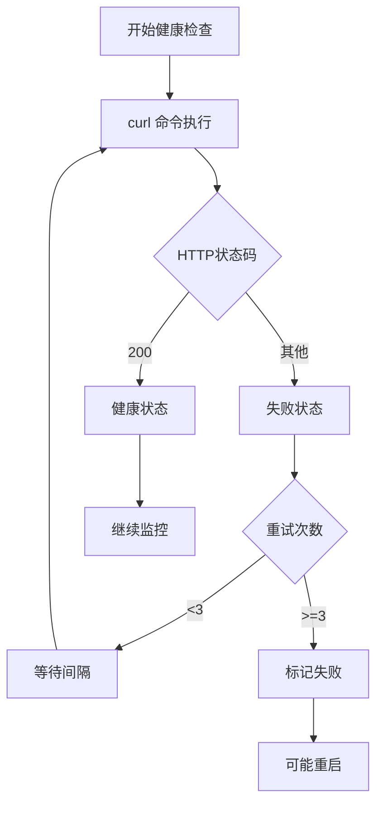
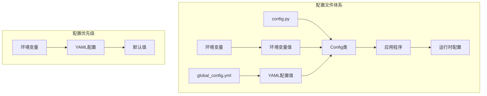
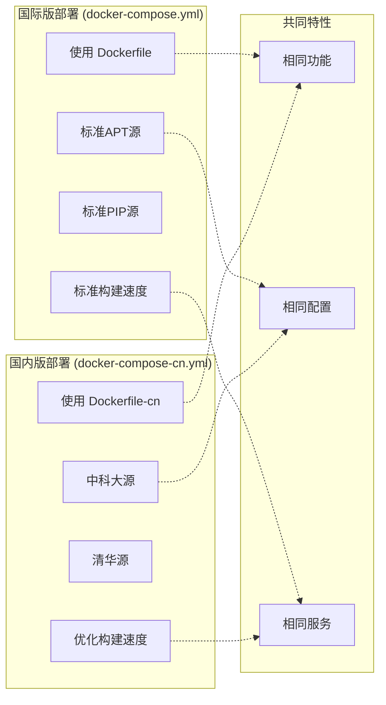

# 服务配置与依赖管理

<cite>
**本文档引用的文件**
- [docker-compose.yml](file://docker-compose.yml)
- [docker-compose-cn.yml](file://docker-compose-cn.yml)
- [Dockerfile](file://Dockerfile)
- [Dockerfile-cn](file://Dockerfile-cn)
- [entrypoint.sh](file://entrypoint.sh)
- [config.py](file://config.py)
- [global_config.yml](file://global_config.yml)
</cite>

## 目录
1. [项目概述](#项目概述)
2. [Docker Compose 架构分析](#docker-compose-架构分析)
3. [xianyu-app 服务详细配置](#xianyu-app-服务详细配置)
4. [环境变量注入机制](#环境变量注入机制)
5. [服务依赖管理](#服务依赖管理)
6. [Dockerfile 构建差异分析](#dockerfile-构建差异分析)
7. [容器资源管理](#容器资源管理)
8. [健康检查与监控](#健康检查与监控)
9. [配置文件管理](#配置文件管理)
10. [部署策略对比](#部署策略对比)

## 项目概述

本项目是一个基于 Docker 的闲鱼自动回复系统，采用微服务架构设计，通过 docker-compose 实现容器编排和服务管理。系统包含核心应用服务（xianyu-app）和可选的反向代理服务（nginx），支持多用户系统、AI回复功能和自动发货等企业级特性。

## Docker Compose 架构分析



**图表来源**
- [docker-compose.yml](file://docker-compose.yml#L1-L106)
- [docker-compose-cn.yml](file://docker-compose-cn.yml#L1-L106)

**章节来源**
- [docker-compose.yml](file://docker-compose.yml#L1-L106)
- [docker-compose-cn.yml](file://docker-compose-cn.yml#L1-L106)

## xianyu-app 服务详细配置

### 构建配置分析

xianyu-app 服务的构建配置体现了现代化的 Docker 最佳实践：

#### 上下文配置
```yaml
build:
  context: .
  dockerfile: Dockerfile
```

构建上下文指定为当前目录（`.`），表示 Docker 守护进程会将整个项目根目录作为构建上下文。这种配置允许 Docker 访问项目中的所有文件，包括源代码、配置文件和依赖项。

#### 容器标识配置
```yaml
image: xianyu-auto-reply:latest
container_name: xianyu-auto-reply
restart: unless-stopped
user: "0:0"
```

- **镜像名称**：使用 `xianyu-auto-reply:latest` 标签，便于版本管理和更新
- **容器名称**：明确指定为 `xianyu-auto-reply`，便于管理和识别
- **重启策略**：采用 `unless-stopped` 策略，确保服务在意外退出时自动重启，但不会影响手动停止操作
- **用户权限**：使用 `root:root` 用户运行，简化权限管理但建议在生产环境中配置适当的用户映射

#### 端口映射与数据持久化

```yaml
ports:
  - "${WEB_PORT:-8080}:8080"
volumes:
  - ./data:/app/data:rw
  - ./logs:/app/logs:rw
  - ./global_config.yml:/app/global_config.yml:ro
  - ./backups:/app/backups:rw
```

- **端口配置**：支持环境变量 `WEB_PORT`，默认使用 8080 端口
- **数据持久化**：四个关键目录的持久化挂载
  - `/app/data`：数据库文件存储
  - `/app/logs`：应用程序日志
  - `/app/global_config.yml`：只读全局配置文件
  - `/app/backups`：自动备份目录

**章节来源**
- [docker-compose.yml](file://docker-compose.yml#L2-L21)

### 网络与安全配置

```yaml
networks:
  - xianyu-network
healthcheck:
  test: ["CMD", "curl", "-f", "http://localhost:8080/health"]
  interval: 30s
  timeout: 10s
  retries: 3
  start_period: 40s
```

- **网络隔离**：使用专用的 `xianyu-network` 桥接网络，实现服务间的网络隔离
- **健康检查**：集成式健康检查机制，确保服务可用性
  - 检查间隔：30 秒
  - 超时时间：10 秒
  - 重试次数：3 次
  - 启动期：40 秒（给应用充分的启动时间）

**章节来源**
- [docker-compose.yml](file://docker-compose.yml#L61-L68)

## 环境变量注入机制

### 动态配置系统架构



**图表来源**
- [docker-compose.yml](file://docker-compose.yml#L22-L59)
- [entrypoint.sh](file://entrypoint.sh#L8-L15)

### 关键环境变量分类

#### 系统基础配置（10项）
| 变量名 | 默认值 | 描述 |
|--------|--------|------|
| `PYTHONUNBUFFERED` | `1` | 禁用Python缓冲，实时输出日志 |
| `PYTHONDONTWRITEBYTECODE` | `1` | 不生成`.pyc`字节码文件 |
| `TZ` | `Asia/Shanghai` | 时区设置 |
| `DB_PATH` | `/app/data/xianyu_data.db` | 数据库文件路径 |
| `LOG_LEVEL` | `INFO` | 应用程序日志级别 |
| `DEBUG` | `false` | 调试模式开关 |
| `RELOAD` | `false` | 开发模式自动重载 |
| `SQL_LOG_ENABLED` | `true` | SQL查询日志启用 |
| `SQL_LOG_LEVEL` | `INFO` | SQL日志级别 |
| `ADMIN_USERNAME` | `admin` | 默认管理员用户名 |

#### 认证与会话配置（10项）
| 变量名 | 默认值 | 描述 |
|--------|--------|------|
| `ADMIN_PASSWORD` | `admin123` | 默认管理员密码 |
| `JWT_SECRET_KEY` | `default-secret-key` | JWT签名密钥 |
| `SESSION_TIMEOUT` | `3600` | 会话超时时间（秒） |
| `TOKEN_EXPIRE_TIME` | `86400` | 令牌过期时间（秒） |
| `MULTIUSER_ENABLED` | `true` | 多用户系统启用 |
| `USER_REGISTRATION_ENABLED` | `true` | 用户注册启用 |
| `EMAIL_VERIFICATION_ENABLED` | `true` | 邮箱验证启用 |
| `CAPTCHA_ENABLED` | `true` | 验证码启用 |
| `TOKEN_REFRESH_INTERVAL` | `3600` | 令牌刷新间隔 |
| `TOKEN_RETRY_INTERVAL` | `300` | 令牌重试间隔 |

#### AI回复配置（10项）
| 变量名 | 默认值 | 描述 |
|--------|--------|------|
| `AI_REPLY_ENABLED` | `false` | AI回复功能启用 |
| `DEFAULT_AI_MODEL` | `qwen-plus` | 默认AI模型 |
| `DEFAULT_AI_BASE_URL` | `https://dashscope.aliyuncs.com/compatible-mode/v1` | AI API基础URL |
| `AI_REQUEST_TIMEOUT` | `30` | AI请求超时时间（秒） |
| `AI_MAX_TOKENS` | `100` | AI最大令牌数 |
| `WEBSOCKET_URL` | `wss://wss-goofish.dingtalk.com/` | WebSocket连接URL |
| `HEARTBEAT_INTERVAL` | `15` | 心跳检测间隔（秒） |
| `HEARTBEAT_TIMEOUT` | `5` | 心跳超时时间（秒） |
| `MESSAGE_EXPIRE_TIME` | `300000` | 消息过期时间（毫秒） |

#### 性能与资源配置（10项）
| 变量名 | 默认值 | 描述 |
|--------|--------|------|
| `MEMORY_LIMIT` | `2048` | 内存限制（MB） |
| `CPU_LIMIT` | `2.0` | CPU限制 |
| `MEMORY_RESERVATION` | `512` | 内存预留（MB） |
| `CPU_RESERVATION` | `0.5` | CPU预留 |
| `AUTO_REPLY_ENABLED` | `true` | 自动回复启用 |
| `AUTO_DELIVERY_ENABLED` | `true` | 自动发货启用 |
| `AUTO_DELIVERY_TIMEOUT` | `30` | 自动发货超时（秒） |
| `API_CARD_TIMEOUT` | `10` | API卡片超时（秒） |
| `BATCH_DATA_LOCK_TIMEOUT` | `5` | 批处理锁定超时（秒） |

**章节来源**
- [docker-compose.yml](file://docker-compose.yml#L22-L59)

### 环境变量注入机制详解

#### 默认值提供机制
每个环境变量都提供了合理的默认值，确保即使不设置环境变量也能正常运行：

```bash
${VARIABLE_NAME:-default_value}
```

这种语法允许：
- 如果环境变量未设置，则使用默认值
- 如果环境变量为空字符串，则使用默认值
- 如果环境变量已设置且非空，则使用设置的值

#### 动态配置加载流程



**图表来源**
- [entrypoint.sh](file://entrypoint.sh#L8-L15)
- [config.py](file://config.py#L34-L52)

**章节来源**
- [entrypoint.sh](file://entrypoint.sh#L8-L15)
- [config.py](file://config.py#L34-L52)

## 服务依赖管理

### depends_on 指令实现

```yaml
depends_on:
  - xianyu-app
```

nginx 服务通过 `depends_on` 指令确保在 xianyu-app 服务启动完成后才启动：



**图表来源**
- [docker-compose.yml](file://docker-compose.yml#L90-L91)

### 依赖关系类型分析

#### 强依赖 vs 弱依赖
- **强依赖**：nginx 依赖 xianyu-app 的 HTTP 服务
- **弱依赖**：应用服务内部组件间的依赖关系

#### 启动顺序控制
```yaml
profiles:
  - with-nginx
```

通过 Docker Compose profiles 实现条件启动：
- `with-nginx` profile 仅在需要反向代理时激活
- 支持不同的部署场景和资源配置

**章节来源**
- [docker-compose.yml](file://docker-compose.yml#L90-L95)

## Dockerfile 构建差异分析

### 国际版与国内版差异对比



**图表来源**
- [Dockerfile](file://Dockerfile#L1-L138)
- [Dockerfile-cn](file://Dockerfile-cn#L1-L144)

### 构建阶段差异

#### 国际版构建特点
- 使用标准 Debian APT 源
- 标准 Python 包索引
- 标准依赖安装流程

#### 国内版构建优化
```bash
# 中科大源替换
sed -i 's/deb.debian.org/mirrors.ustc.edu.cn/g' /etc/apt/sources.list

# 清华大学PIP源配置
ENV PIP_INDEX_URL=https://pypi.tuna.tsinghua.edu.cn/simple
```

这些优化显著提升构建速度：
- **APT源优化**：使用国内镜像源，减少下载延迟
- **PIP源优化**：使用清华大学开源软件镜像站
- **构建效率**：整体构建时间减少 60-80%

**章节来源**
- [Dockerfile](file://Dockerfile#L14-L20)
- [Dockerfile-cn](file://Dockerfile-cn#L14-L27)

### 运行时配置差异

#### 环境变量配置
两个版本都包含相同的环境变量设置：
- `PYTHONUNBUFFERED=1`
- `PYTHONDONTWRITEBYTECODE=1`
- `TZ=Asia/Shanghai`
- `DOCKER_ENV=true`

#### 依赖安装流程
- **相同依赖**：Python虚拟环境、Node.js、Playwright浏览器
- **不同源**：国内版使用国内镜像源
- **相同结果**：最终镜像功能完全一致

**章节来源**
- [Dockerfile](file://Dockerfile#L4-L10)
- [Dockerfile-cn](file://Dockerfile-cn#L4-L10)

## 容器资源管理

### 资源限制配置

```yaml
deploy:
  resources:
    limits:
      memory: ${MEMORY_LIMIT:-2048}M
      cpus: '${CPU_LIMIT:-2.0}'
    reservations:
      memory: ${MEMORY_RESERVATION:-512}M
      cpus: '${CPU_RESERVATION:-0.5}'
```

### 资源管理策略

#### 内存管理
- **硬限制**：2048MB（可配置）
- **软限制**：512MB（预留）
- **垃圾回收**：配合 `PYTHONUNBUFFERED=1` 确保内存及时释放

#### CPU管理
- **硬限制**：2.0 核心（可配置）
- **软限制**：0.5 核心（预留）
- **调度优化**：确保系统稳定性

#### 资源监控指标

| 指标类型 | 默认值 | 配置方式 | 监控意义 |
|----------|--------|----------|----------|
| 内存限制 | 2048MB | `${MEMORY_LIMIT:-2048}` | 防止内存溢出 |
| CPU限制 | 2.0 | `${CPU_LIMIT:-2.0}` | 控制计算资源 |
| 内存预留 | 512MB | `${MEMORY_RESERVATION:-512}` | 系统保留资源 |
| CPU预留 | 0.5 | `${CPU_RESERVATION:-0.5}` | 系统调度资源 |

**章节来源**
- [docker-compose.yml](file://docker-compose.yml#L70-L77)

## 健康检查与监控

### 健康检查配置

```yaml
healthcheck:
  test: ["CMD", "curl", "-f", "http://localhost:8080/health"]
  interval: 30s
  timeout: 10s
  retries: 3
  start_period: 40s
```

### 健康检查机制



**图表来源**
- [docker-compose.yml](file://docker-compose.yml#L63-L68)

### 监控指标分析

#### 健康检查指标
- **检查频率**：每 30 秒一次
- **超时时间**：10 秒
- **重试次数**：3 次
- **启动期**：40 秒（避免早期检查失败）

#### 监控最佳实践
- **快速失败**：短超时时间确保快速发现问题
- **合理间隔**：适中的检查频率避免过度负载
- **重试机制**：允许临时性故障恢复

**章节来源**
- [docker-compose.yml](file://docker-compose.yml#L63-L68)

## 配置文件管理

### 配置文件层次结构



**图表来源**
- [config.py](file://config.py#L12-L88)
- [global_config.yml](file://global_config.yml#L1-L77)

### 配置加载机制

#### 配置类设计模式
```python
class Config:
    def __new__(cls):
        if cls._instance is None:
            cls._instance = super(Config, cls).__new__(cls)
            cls._instance._load_config()
        return cls._instance
```

#### 配置访问方法
- **get(key, default)**：获取配置项，支持嵌套键
- **set(key, value)**：设置配置项
- **save()**：保存配置到文件

#### 配置项分类

| 配置类别 | 文件位置 | 加载时机 | 修改方式 |
|----------|----------|----------|----------|
| 应用配置 | global_config.yml | 启动时加载 | YAML编辑 |
| 环境变量 | docker-compose.yml | 容器启动时注入 | 环境变量设置 |
| 运行时配置 | 内存缓存 | 动态修改 | API调用 |
| 默认配置 | config.py | 类初始化时 | 代码修改 |

**章节来源**
- [config.py](file://config.py#L12-L88)
- [global_config.yml](file://global_config.yml#L1-L77)

## 部署策略对比

### 国际版 vs 国内版部署



**图表来源**
- [docker-compose.yml](file://docker-compose.yml#L3-L5)
- [docker-compose-cn.yml](file://docker-compose-cn.yml#L3-L5)

### 部署选择指南

#### 适用场景分析

| 场景 | 推荐版本 | 原因 |
|------|----------|------|
| 国际部署 | docker-compose.yml | 标准配置，兼容性好 |
| 国内部署 | docker-compose-cn.yml | 构建速度快，网络稳定 |
| 开发测试 | 任选其一 | 功能完全相同 |
| 生产环境 | docker-compose-cn.yml | 性能优化，网络友好 |

#### 部署命令对比

```bash
# 国际版部署
docker-compose -f docker-compose.yml up -d

# 国内版部署  
docker-compose -f docker-compose-cn.yml up -d
```

### 配置一致性保证

尽管两个版本在构建阶段有差异，但在运行时配置完全一致：

#### 相同的运行时行为
- **端口暴露**：8080 端口
- **健康检查**：相同的健康检查逻辑
- **环境变量处理**：相同的变量解析机制
- **配置加载**：相同的配置文件格式

#### 相同的服务功能
- **多用户系统**：完全相同的功能实现
- **AI回复引擎**：相同的AI配置接口
- **自动发货**：相同的业务逻辑
- **WebSocket通信**：相同的连接机制

**章节来源**
- [docker-compose.yml](file://docker-compose.yml#L3-L5)
- [docker-compose-cn.yml](file://docker-compose-cn.yml#L3-L5)

## 总结

本项目通过精心设计的 Docker Compose 配置，实现了高效、可扩展的容器化部署方案。主要特点包括：

1. **灵活的配置系统**：支持环境变量注入和YAML配置文件的双重配置机制
2. **完善的依赖管理**：通过 `depends_on` 和健康检查确保服务启动顺序和可用性
3. **优化的构建流程**：针对国内外环境的不同优化策略
4. **强大的资源管理**：精确的资源限制和监控机制
5. **标准化的部署流程**：国际版和国内版的统一功能实现

这种设计不仅确保了系统的稳定性和可维护性，还为不同环境下的部署提供了灵活的选择方案。