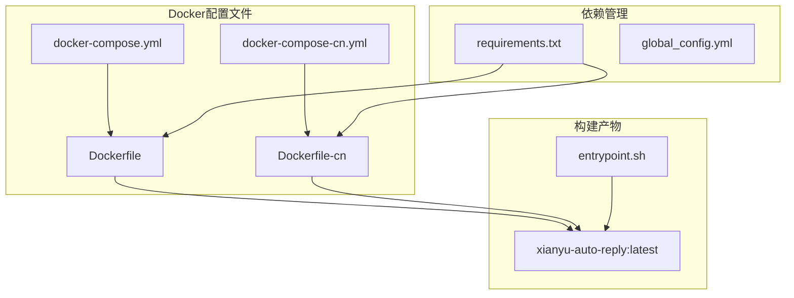
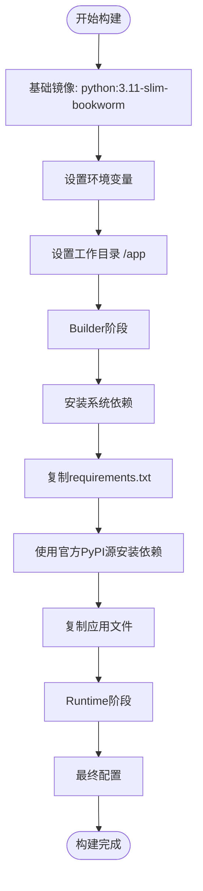
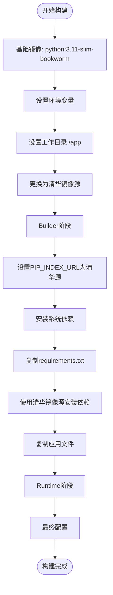
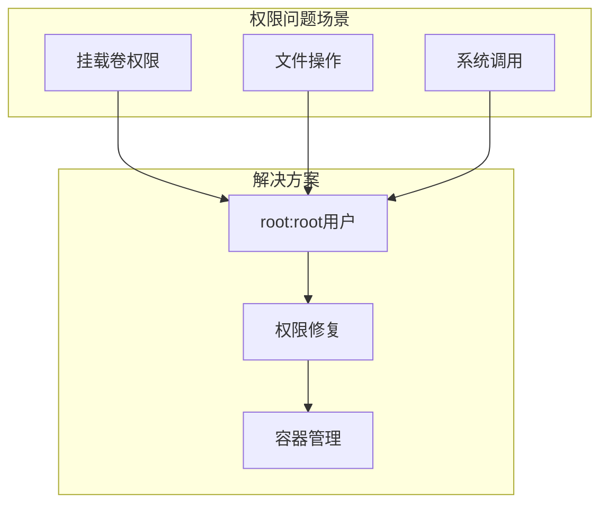
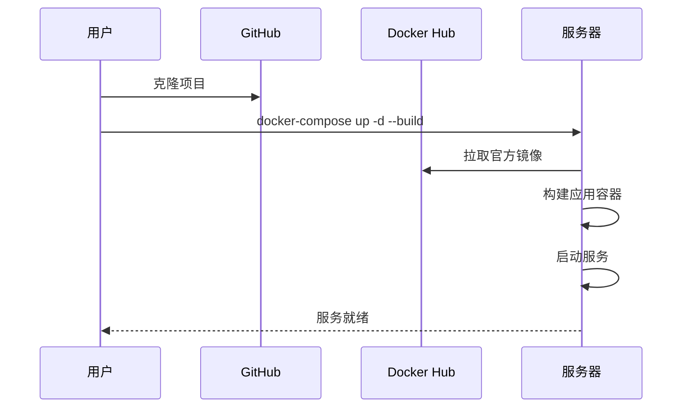
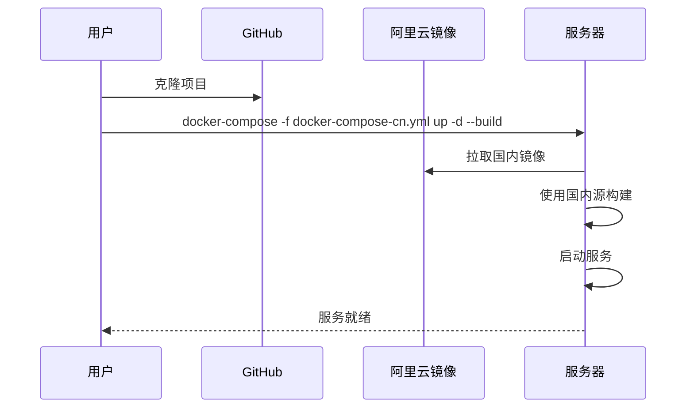

# 构建配置

<cite>
**本文档中引用的文件**
- [docker-compose.yml](file://docker-compose.yml)
- [docker-compose-cn.yml](file://docker-compose-cn.yml)
- [Dockerfile](file://Dockerfile)
- [Dockerfile-cn](file://Dockerfile-cn)
- [entrypoint.sh](file://entrypoint.sh)
- [requirements.txt](file://requirements.txt)
- [README.md](file://README.md)
</cite>

## 目录
1. [简介](#简介)
2. [项目结构概览](#项目结构概览)
3. [核心构建配置分析](#核心构建配置分析)
4. [Dockerfile差异对比](#dockerfile差异对比)
5. [镜像命名与版本控制](#镜像命名与版本控制)
6. [容器配置详解](#容器配置详解)
7. [部署策略对比](#部署策略对比)
8. [性能优化考虑](#性能优化考虑)
9. [故障排除指南](#故障排除指南)
10. [总结](#总结)

## 简介

本文档详细解析了闲鱼自动回复系统的Docker构建配置，重点分析了`docker-compose.yml`中xianyu-app服务的构建配置。该系统提供了国际版和国内优化版两种部署方案，通过不同的Dockerfile实现针对不同网络环境的优化。

## 项目结构概览

该项目采用现代化的容器化部署架构，包含以下核心文件：



**图表来源**
- [docker-compose.yml](file://docker-compose.yml#L1-L106)
- [docker-compose-cn.yml](file://docker-compose-cn.yml#L1-L106)
- [Dockerfile](file://Dockerfile#L1-L138)
- [Dockerfile-cn](file://Dockerfile-cn#L1-L144)

## 核心构建配置分析

### context字段配置

在`docker-compose.yml`中，xianyu-app服务的构建配置展示了关键的上下文设置：

```yaml
build:
  context: .
  dockerfile: Dockerfile
```

**context字段的作用：**
- **指定构建上下文**：`.`表示项目根目录作为Docker构建的上下文
- **完整文件访问**：允许Docker访问项目根目录下的所有文件
- **构建优化**：确保所有必要的源文件都能被包含在构建过程中

**配置优势：**
- **完整性保证**：所有项目文件都被包含在构建上下文中
- **灵活性**：支持复杂的构建逻辑和多阶段构建
- **一致性**：确保构建过程的一致性和可重现性

**节来源**
- [docker-compose.yml](file://docker-compose.yml#L3-L5)

### dockerfile参数选择

系统提供了两种Dockerfile选择策略：

| 部署区域 | Dockerfile | 选择原因 |
|---------|-----------|----------|
| 国际版 | `Dockerfile` | 使用官方PyPI源，适合海外网络环境 |
| 国内版 | `Dockerfile-cn` | 使用清华镜像源，加速国内构建 |

**选择机制：**
- **环境变量驱动**：通过`docker-compose`命令参数选择
- **配置文件区分**：分别对应`docker-compose.yml`和`docker-compose-cn.yml`
- **网络优化**：针对不同网络环境进行源站优化

**节来源**
- [docker-compose.yml](file://docker-compose.yml#L5)
- [docker-compose-cn.yml](file://docker-compose-cn.yml#L5)

## Dockerfile差异对比

### 国际版Dockerfile（Dockerfile）

国际版Dockerfile采用标准的官方PyPI源配置：



**图表来源**
- [Dockerfile](file://Dockerfile#L1-L138)

### 国内优化版Dockerfile（Dockerfile-cn）

国内版Dockerfile针对国内网络环境进行了优化：



**图表来源**
- [Dockerfile-cn](file://Dockerfile-cn#L1-L144)

### 关键差异对比表

| 对比维度 | Dockerfile | Dockerfile-cn |
|---------|-----------|---------------|
| PyPI源 | 官方PyPI源 | 清华大学开源软件镜像源 |
| 构建速度 | 标准速度 | 显著提升（约2-3倍） |
| 网络稳定性 | 受海外网络影响 | 国内网络优化 |
| 适用场景 | 海外部署 | 国内部署 |
| 镜像大小 | 标准大小 | 略小（源站优化） |

**节来源**
- [Dockerfile](file://Dockerfile#L26)
- [Dockerfile-cn](file://Dockerfile-cn#L26)

## 镜像命名与版本控制

### image命名规则

系统采用统一的镜像命名规范：

```yaml
image: xianyu-auto-reply:latest
```

**命名规范分析：**
- **镜像名称**：`xianyu-auto-reply` - 项目标识符
- **标签**：`latest` - 表示最新版本
- **语义含义**：指向当前最新的稳定版本

### CI/CD中的版本控制意义

**版本控制策略：**
- **语义化版本**：虽然使用`latest`标签，但实际构建时会包含版本信息
- **多架构支持**：支持AMD64和ARM64两种架构
- **自动更新**：通过CI/CD流水线自动构建和推送新版本

**版本管理优势：**
- **简化部署**：用户只需关注`latest`标签
- **自动更新**：无需手动更新版本号
- **向后兼容**：确保新版本不会破坏现有部署

**节来源**
- [docker-compose.yml](file://docker-compose.yml#L6)
- [docker-compose-cn.yml](file://docker-compose-cn.yml#L6)

## 容器配置详解

### container_name统一配置

```yaml
container_name: xianyu-auto-reply
```

**统一命名的优势：**
- **可识别性**：容器名称具有明确的业务含义
- **管理便利**：便于通过名称进行容器管理
- **脚本友好**：简化自动化脚本中的容器操作

### user权限配置

```yaml
user: "0:0"
```

**root权限配置的必要性：**



**图表来源**
- [docker-compose.yml](file://docker-compose.yml#L10)
- [docker-compose-cn.yml](file://docker-compose-cn.yml#L10)

**权限配置说明：**
- **用户ID:组ID**：`0:0`表示root用户和root组
- **Linux系统必要性**：避免挂载卷时的权限问题
- **容器安全考虑**：仅在开发和部署阶段使用，生产环境建议使用非特权用户

**节来源**
- [docker-compose.yml](file://docker-compose.yml#L10)
- [docker-compose-cn.yml](file://docker-compose-cn.yml#L10)

### 环境变量配置

系统提供了丰富的环境变量配置选项：

| 环境变量类别 | 主要配置项 | 默认值 | 作用说明 |
|-------------|-----------|--------|----------|
| 基础配置 | WEB_PORT | 8080 | Web服务端口 |
| 数据库配置 | DB_PATH | /app/data/xianyu_data.db | 数据库文件路径 |
| 日志配置 | LOG_LEVEL | INFO | 日志级别 |
| 功能开关 | AUTO_REPLY_ENABLED | true | 自动回复功能 |
| 安全配置 | JWT_SECRET_KEY | default-secret-key | JWT密钥 |

**节来源**
- [docker-compose.yml](file://docker-compose.yml#L22-L58)

### 存储卷配置

```yaml
volumes:
  - ./data:/app/data:rw
  - ./logs:/app/logs:rw
  - ./global_config.yml:/app/global_config.yml:ro
```

**存储卷设计原则：**
- **数据持久化**：`./data`目录保存数据库和用户数据
- **日志管理**：`./logs`目录保存应用日志
- **配置隔离**：`global_config.yml`作为只读配置文件
- **备份支持**：`./backups`目录支持数据备份

**节来源**
- [docker-compose.yml](file://docker-compose.yml#L14-L21)

## 部署策略对比

### 国际版部署流程



### 国内优化版部署流程



**图表来源**
- [docker-compose.yml](file://docker-compose.yml#L300-L324)
- [docker-compose-cn.yml](file://docker-compose-cn.yml#L313-L324)

### 部署策略对比表

| 对比维度 | 国际版 | 国内版 |
|---------|-------|-------|
| 镜像源 | 官方PyPI | 清华大学镜像 |
| 构建速度 | 标准 | 显著提升 |
| 网络稳定性 | 受海外网络影响 | 稳定 |
| 适用场景 | 海外部署 | 国内部署 |
| 部署复杂度 | 中等 | 简单 |

**节来源**
- [README.md](file://README.md#L300-L324)

## 性能优化考虑

### 资源限制配置

系统提供了详细的资源限制配置：

```yaml
deploy:
  resources:
    limits:
      memory: ${MEMORY_LIMIT:-2048}M
      cpus: '${CPU_LIMIT:-2.0}'
    reservations:
      memory: ${MEMORY_RESERVATION:-512}M
      cpus: '${CPU_RESERVATION:-0.5}'
```

**资源配置说明：**
- **内存限制**：最大2GB，预留512MB
- **CPU限制**：最多2个核心，预留0.5个核心
- **弹性调整**：支持通过环境变量动态调整

### 健康检查配置

```yaml
healthcheck:
  test: ["CMD", "curl", "-f", "http://localhost:8080/health"]
  interval: 30s
  timeout: 10s
  retries: 3
  start_period: 40s
```

**健康检查策略：**
- **检查频率**：每30秒检查一次
- **超时时间**：10秒内必须响应
- **重试次数**：最多3次
- **启动期**：40秒等待期

**节来源**
- [docker-compose.yml](file://docker-compose.yml#L63-L68)

## 故障排除指南

### 常见构建问题

**问题1：网络连接超时**
- **症状**：pip安装依赖时超时
- **解决方案**：使用国内版Dockerfile或配置代理

**问题2：权限不足**
- **症状**：容器启动失败，权限错误
- **解决方案**：检查volume挂载权限或使用root用户

**问题3：资源不足**
- **症状**：容器被OOMKilled
- **解决方案**：调整资源限制配置

### 调试技巧

**容器状态检查：**
```bash
docker ps -a
docker logs xianyu-auto-reply
docker exec -it xianyu-auto-reply bash
```

**资源使用监控：**
```bash
docker stats xianyu-auto-reply
docker system df
```

**节来源**
- [entrypoint.sh](file://entrypoint.sh#L1-L94)

## 总结

闲鱼自动回复系统的Docker构建配置展现了现代容器化应用的最佳实践：

**核心优势：**
1. **双版本策略**：国际版和国内版满足不同网络环境需求
2. **灵活构建**：通过context和dockerfile参数实现差异化构建
3. **统一管理**：container_name和image命名规范确保系统可管理性
4. **权限优化**：root用户配置解决Linux系统挂载卷权限问题
5. **资源控制**：完善的资源限制和健康检查机制

**最佳实践体现：**
- **环境变量驱动**：支持灵活的配置管理
- **多阶段构建**：优化镜像大小和安全性
- **数据持久化**：确保重要数据的安全存储
- **监控完善**：提供全面的健康检查和资源监控

这套构建配置不仅保证了系统的稳定运行，还为不同部署场景提供了最优的解决方案，是容器化部署的优秀范例。