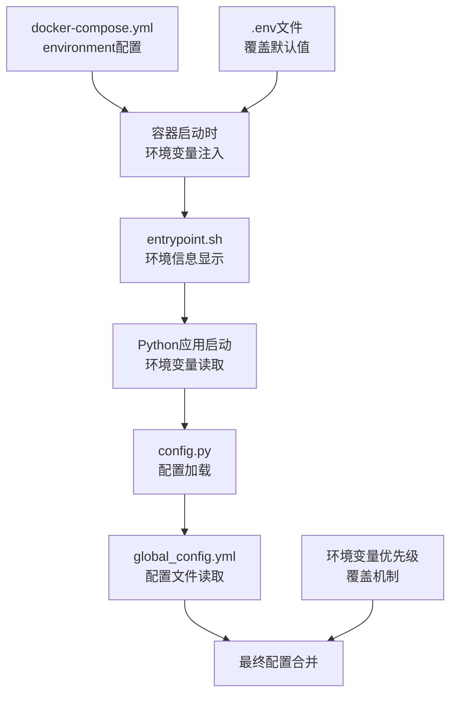
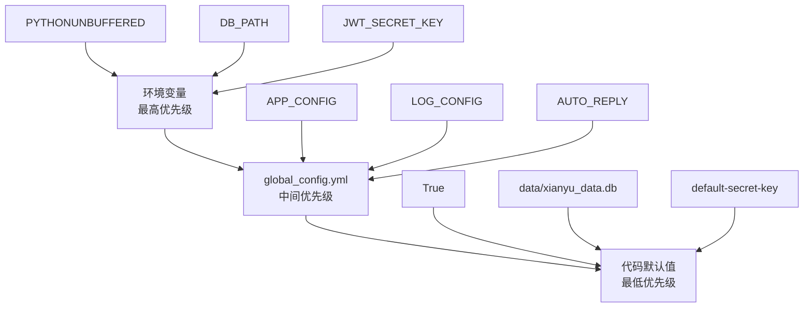
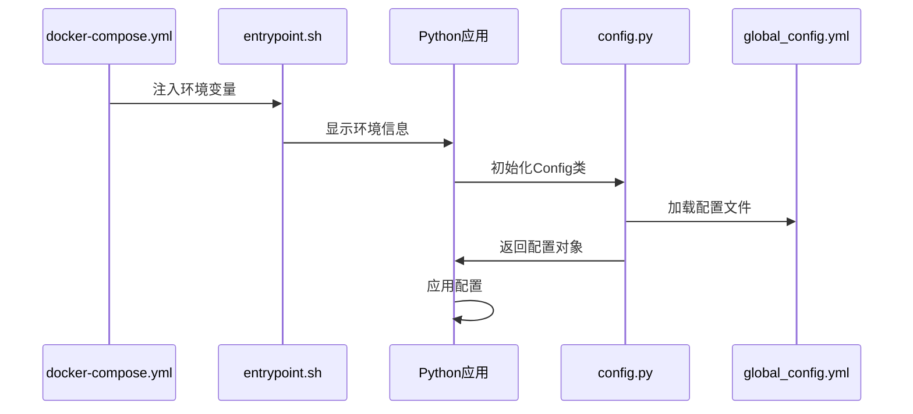
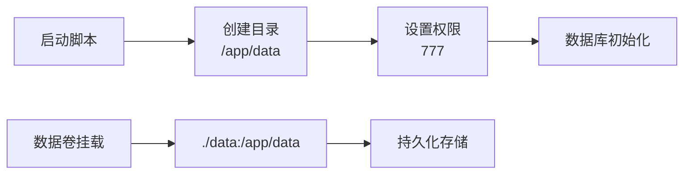
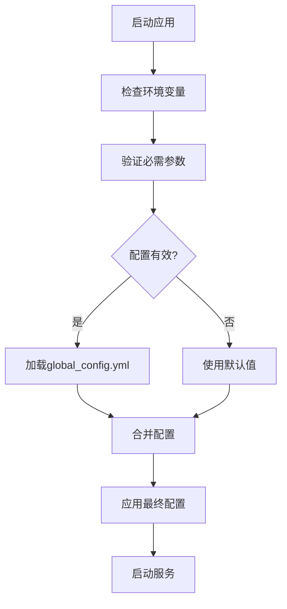

# 运行时配置

<cite>
**本文档引用的文件**
- [docker-compose.yml](file://docker-compose.yml)
- [config.py](file://config.py)
- [global_config.yml](file://global_config.yml)
- [entrypoint.sh](file://entrypoint.sh)
- [Start.py](file://Start.py)
- [db_manager.py](file://db_manager.py)
- [requirements.txt](file://requirements.txt)
</cite>

## 目录
1. [简介](#简介)
2. [环境变量注入机制](#环境变量注入机制)
3. [配置层次结构](#配置层次结构)
4. [基础运行环境配置](#基础运行环境配置)
5. [数据与日志配置](#数据与日志配置)
6. [安全认证配置](#安全认证配置)
7. [系统功能开关配置](#系统功能开关配置)
8. [性能调优配置](#性能调优配置)
9. [最佳实践](#最佳实践)
10. [故障排除](#故障排除)

## 简介

闲鱼自动回复系统采用多层次的配置管理体系，通过docker-compose.yml中的environment环境变量注入机制，结合config.py中的Config类和global_config.yml配置文件，实现了灵活而强大的运行时配置管理。本文档深入分析这50余项关键参数的动态配置方法，涵盖从基础运行环境到高级性能调优的各个方面。

## 环境变量注入机制

### Docker Compose环境变量处理

系统通过docker-compose.yml中的environment配置块实现环境变量的注入：



**图表来源**
- [docker-compose.yml](file://docker-compose.yml#L22-L60)
- [entrypoint.sh](file://entrypoint.sh#L8-L15)

### 环境变量语法规范

系统使用`${VAR_NAME:-default_value}`的语法格式，其中：
- `VAR_NAME`：环境变量名称
- `default_value`：默认值（当环境变量未设置时使用）
- `-`：表示提供默认值的分隔符

**节来源**
- [docker-compose.yml](file://docker-compose.yml#L22-L60)

## 配置层次结构

### 配置优先级体系

系统采用三层配置优先级体系：



**图表来源**
- [config.py](file://config.py#L34-L53)
- [Start.py](file://Start.py#L450-L458)

### 配置加载流程



**图表来源**
- [entrypoint.sh](file://entrypoint.sh#L8-L15)
- [config.py](file://config.py#L15-L33)

**节来源**
- [config.py](file://config.py#L15-L33)
- [Start.py](file://Start.py#L450-L458)

## 基础运行环境配置

### Python运行时优化

#### PYTHONUNBUFFERED缓冲控制

- **作用**：禁用Python输出缓冲，实现实时日志输出
- **默认值**：`1`（启用）
- **配置位置**：`docker-compose.yml`第23行
- **影响**：提高调试体验，适合容器化部署

#### PYTHONDONTWRITEBYTECODE字节码控制

- **作用**：禁止生成`.pyc`字节码文件
- **默认值**：`1`（禁用）
- **配置位置**：`docker-compose.yml`第24行
- **影响**：减少磁盘I/O，适合容器环境

#### TZ时区设置

- **作用**：设置系统时区
- **默认值**：`Asia/Shanghai`（中国标准时间）
- **配置位置**：`docker-compose.yml`第25行
- **影响**：确保日志时间和系统时间一致

### 系统资源管理

#### 内存与CPU限制

- **MEMORY_LIMIT**：内存限制（默认2048MB）
- **CPU_LIMIT**：CPU核心数（默认2.0）
- **MEMORY_RESERVATION**：内存预留（默认512MB）
- **CPU_RESERVATION**：CPU预留（默认0.5）

**节来源**
- [docker-compose.yml](file://docker-compose.yml#L23-L25)
- [docker-compose.yml](file://docker-compose.yml#L72-L77)

## 数据与日志配置

### 数据库路径配置

#### DB_PATH数据库文件位置

- **作用**：指定SQLite数据库文件路径
- **默认值**：`/app/data/xianyu_data.db`
- **配置位置**：`docker-compose.yml`第26行
- **挂载点**：`./data:/app/data:rw`（持久化存储）

#### 数据目录权限

系统自动创建必要的数据目录并设置权限：



**图表来源**
- [entrypoint.sh](file://entrypoint.sh#L20-L30)

### 日志系统配置

#### LOG_LEVEL日志级别

- **作用**：控制应用日志输出级别
- **默认值**：`INFO`
- **配置位置**：`docker-compose.yml`第27行
- **支持级别**：DEBUG、INFO、WARNING、ERROR、CRITICAL

#### SQL日志配置

- **SQL_LOG_ENABLED**：SQL语句日志开关（默认true）
- **SQL_LOG_LEVEL**：SQL日志级别（默认INFO）
- **配置位置**：`db_manager.py`第57-60行

**节来源**
- [docker-compose.yml](file://docker-compose.yml#L26-L28)
- [db_manager.py](file://db_manager.py#L57-L60)

## 安全认证配置

### JWT令牌管理

#### JWT_SECRET_KEY密钥配置

- **作用**：JWT令牌签名密钥
- **默认值**：`default-secret-key`
- **配置位置**：`docker-compose.yml`第35行
- **安全要求**：必须使用强随机字符串，建议32位以上

#### 会话超时配置

- **SESSION_TIMEOUT**：会话超时时间（秒）
- **默认值**：`3600`（1小时）
- **配置位置**：`docker-compose.yml`第36行
- **影响**：控制用户会话持续时间

#### 令牌有效期配置

- **TOKEN_EXPIRE_TIME**：令牌有效时间（秒）
- **默认值**：`86400`（24小时）
- **配置位置**：`docker-compose.yml`第42行
- **影响**：决定认证令牌的有效期限

### 多用户系统配置

#### 用户注册控制

- **MULTIUSER_ENABLED**：多用户系统开关
- **默认值**：`true`
- **配置位置**：`docker-compose.yml`第38行
- **影响**：启用/禁用多用户功能

- **USER_REGISTRATION_ENABLED**：用户注册开关
- **默认值**：`true`
- **配置位置**：`docker-compose.yml`第39行
- **影响**：允许/禁止新用户注册

- **EMAIL_VERIFICATION_ENABLED**：邮箱验证开关
- **默认值**：`true`
- **配置位置**：`docker-compose.yml`第40行
- **影响**：启用邮箱验证流程

- **CAPTCHA_ENABLED**：验证码开关
- **默认值**：`true`
- **配置位置**：`docker-compose.yml`第41行
- **影响**：启用图形验证码防护

**节来源**
- [docker-compose.yml](file://docker-compose.yml#L35-L42)

## 系统功能开关配置

### 自动回复功能

#### AUTO_REPLY_ENABLED自动回复开关

- **作用**：启用/禁用自动回复功能
- **默认值**：`true`
- **配置位置**：`docker-compose.yml`第43行
- **影响**：控制整个自动回复系统的启停

#### AUTO_DELIVERY_ENABLED自动发货

- **作用**：启用自动发货功能
- **默认值**：`true`
- **配置位置**：`docker-compose.yml`第44行
- **影响**：自动处理订单发货流程

#### AUTO_DELIVERY_TIMEOUT发货超时

- **作用**：自动发货超时时间（秒）
- **默认值**：`30`
- **配置位置**：`docker-compose.yml`第45行
- **影响**：控制发货操作的超时阈值

### API功能配置

#### API卡券超时

- **API_CARD_TIMEOUT**：API卡券请求超时（秒）
- **默认值**：`10`
- **配置位置**：`docker-compose.yml`第46行
- **影响**：控制外部API调用的响应时间

#### 批量数据锁定超时

- **BATCH_DATA_LOCK_TIMEOUT**：批量数据锁定超时（秒）
- **默认值**：`5`
- **配置位置**：`docker-compose.yml`第47行
- **影响**：控制批量操作的数据锁定时间

**节来源**
- [docker-compose.yml](file://docker-compose.yml#L43-L47)

## AI回复系统配置

### AI功能总开关

#### AI_REPLY_ENABLED

- **作用**：启用/禁用AI回复功能
- **默认值**：`false`
- **配置位置**：`docker-compose.yml`第49行
- **影响**：控制AI回复引擎的启用状态

### AI模型配置

#### 默认AI模型

- **DEFAULT_AI_MODEL**：默认AI模型名称
- **默认值**：`qwen-plus`
- **配置位置**：`docker-compose.yml`第50行
- **支持模型**：qwen-plus、qwen-turbo、qwen-max等

#### AI基础URL

- **DEFAULT_AI_BASE_URL**：AI服务基础URL
- **默认值**：`https://dashscope.aliyuncs.com/compatible-mode/v1`
- **配置位置**：`docker-compose.yml`第51行
- **影响**：指定AI服务提供商的API地址

### AI性能配置

#### 请求超时设置

- **AI_REQUEST_TIMEOUT**：AI请求超时时间（秒）
- **默认值**：`30`
- **配置位置**：`docker-compose.yml`第52行
- **影响**：控制AI服务调用的响应时间

#### 最大令牌数

- **AI_MAX_TOKENS**：AI回复最大令牌数
- **默认值**：`100`
- **配置位置**：`docker-compose.yml`第53行
- **影响**：限制AI回复内容长度

**节来源**
- [docker-compose.yml](file://docker-compose.yml#L49-L53)

## 性能调优配置

### 心跳机制配置

#### HEARTBEAT_INTERVAL心跳间隔

- **作用**：WebSocket心跳间隔（秒）
- **默认值**：`15`
- **配置位置**：`docker-compose.yml`第55行
- **影响**：控制连接保活频率

#### HEARTBEAT_TIMEOUT心跳超时

- **作用**：心跳超时时间（秒）
- **默认值**：`5`
- **配置位置**：`docker-compose.yml`第56行
- **影响**：判断连接是否断开的阈值

### 令牌管理配置

#### 令牌刷新间隔

- **TOKEN_REFRESH_INTERVAL**：令牌刷新间隔（秒）
- **默认值**：`3600`
- **配置位置**：`docker-compose.yml`第57行
- **影响**：定期刷新认证令牌的时间周期

#### 令牌重试间隔

- **TOKEN_RETRY_INTERVAL**：令牌重试间隔（秒）
- **默认值**：`300`
- **配置位置**：`docker-compose.yml`第58行
- **影响**：令牌失效后的重试时间间隔

### 消息生命周期

#### MESSAGE_EXPIRE_TIME消息过期时间

- **作用**：消息过期时间（毫秒）
- **默认值**：`300000`（5分钟）
- **配置位置**：`docker-compose.yml`第59行
- **影响**：控制消息的保留时间

### WebSocket连接配置

#### WEBSOCKET_URL连接地址

- **作用**：WebSocket服务地址
- **默认值**：`wss://wss-goofish.dingtalk.com/`
- **配置位置**：`docker-compose.yml`第54行
- **影响**：指定WebSocket服务的连接地址

**节来源**
- [docker-compose.yml](file://docker-compose.yml#L54-L59)

## 最佳实践

### 环境变量文件管理

#### 创建.env文件

在项目根目录创建`.env`文件，用于覆盖默认配置：

```bash
# 基础运行环境
PYTHONUNBUFFERED=1
PYTHONDONTWRITEBYTECODE=1
TZ=Asia/Shanghai

# 数据与日志
DB_PATH=./data/xianyu_data.db
LOG_LEVEL=INFO
SQL_LOG_ENABLED=true
SQL_LOG_LEVEL=INFO

# 安全认证
JWT_SECRET_KEY=your-strong-secret-key-here
SESSION_TIMEOUT=3600
TOKEN_EXPIRE_TIME=86400

# 系统功能
MULTIUSER_ENABLED=true
AI_REPLY_ENABLED=false
AUTO_REPLY_ENABLED=true
AUTO_DELIVERY_ENABLED=true

# 性能调优
HEARTBEAT_INTERVAL=15
HEARTBEAT_TIMEOUT=5
TOKEN_REFRESH_INTERVAL=3600
MESSAGE_EXPIRE_TIME=300000
```

#### 生产环境配置要点

1. **安全性**：
   - 使用强密码和密钥
   - 禁用不必要的功能
   - 配置适当的防火墙规则

2. **性能优化**：
   - 根据硬件资源调整内存和CPU限制
   - 优化心跳间隔和超时设置
   - 合理配置AI请求超时时间

3. **监控与维护**：
   - 启用SQL日志以便调试
   - 定期检查日志文件大小
   - 监控系统资源使用情况

### 配置验证流程



**图表来源**
- [config.py](file://config.py#L34-L53)
- [Start.py](file://Start.py#L450-L458)

### 部署检查清单

- [ ] 环境变量文件存在且格式正确
- [ ] 数据目录具有适当权限
- [ ] 数据库文件可正常访问
- [ ] 网络端口未被占用
- [ ] 依赖包已正确安装
- [ ] 时区设置符合预期
- [ ] 日志目录可写入

**节来源**
- [entrypoint.sh](file://entrypoint.sh#L20-L30)
- [Start.py](file://Start.py#L450-L458)

## 故障排除

### 常见配置问题

#### 环境变量未生效

**症状**：配置更改后应用行为未改变
**原因**：环境变量语法错误或未正确注入
**解决方案**：
1. 检查`${VAR:-default}`语法格式
2. 确认变量名拼写正确
3. 重启容器使配置生效

#### 数据库连接失败

**症状**：应用启动时报数据库错误
**原因**：DB_PATH配置错误或权限不足
**解决方案**：
1. 检查数据目录权限
2. 验证数据库文件存在性
3. 确认路径配置正确

#### JWT认证失败

**症状**：用户登录或API调用返回认证错误
**原因**：JWT_SECRET_KEY配置不一致
**解决方案**：
1. 确认密钥长度足够
2. 检查密钥是否在所有实例中一致
3. 重启应用使新密钥生效

### 性能问题诊断

#### 内存使用过高

**诊断步骤**：
1. 检查MEMORY_LIMIT设置
2. 监控实际内存使用情况
3. 优化AI模型配置
4. 调整批处理大小

#### 响应时间过长

**诊断步骤**：
1. 检查AI_REQUEST_TIMEOUT设置
2. 监控网络连接质量
3. 分析日志中的性能瓶颈
4. 优化数据库查询

### 日志分析指南

#### 启用详细日志

```yaml
environment:
  - LOG_LEVEL=DEBUG
  - SQL_LOG_ENABLED=true
  - SQL_LOG_LEVEL=DEBUG
```

#### 关键日志模式

- `[ERROR]`：严重错误，需要立即处理
- `[WARNING]`：警告信息，可能存在潜在问题
- `[INFO]`：一般信息，用于跟踪应用状态
- `[DEBUG]`：调试信息，用于问题诊断

**节来源**
- [entrypoint.sh](file://entrypoint.sh#L8-L15)
- [db_manager.py](file://db_manager.py#L57-L60)

## 结论

闲鱼自动回复系统的运行时配置体系通过多层次的配置管理，提供了灵活而强大的定制能力。理解环境变量注入机制、配置优先级体系以及各配置项的作用和影响，对于成功部署和维护系统至关重要。遵循本文档提供的最佳实践和故障排除指南，可以确保系统稳定高效地运行。

通过合理配置各项参数，可以在保证系统安全性的同时，获得最佳的性能表现和用户体验。定期审查和优化配置，根据实际使用情况进行调整，是维持系统长期稳定运行的关键。