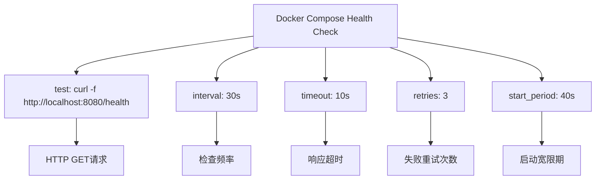
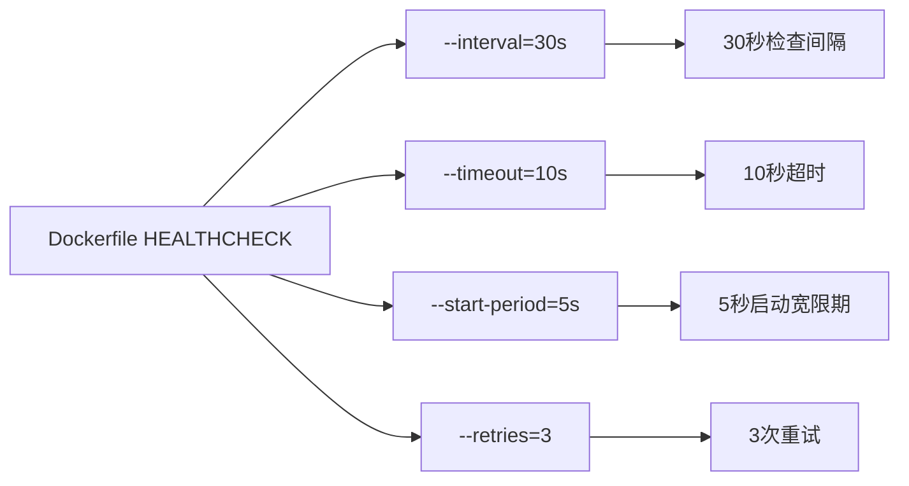
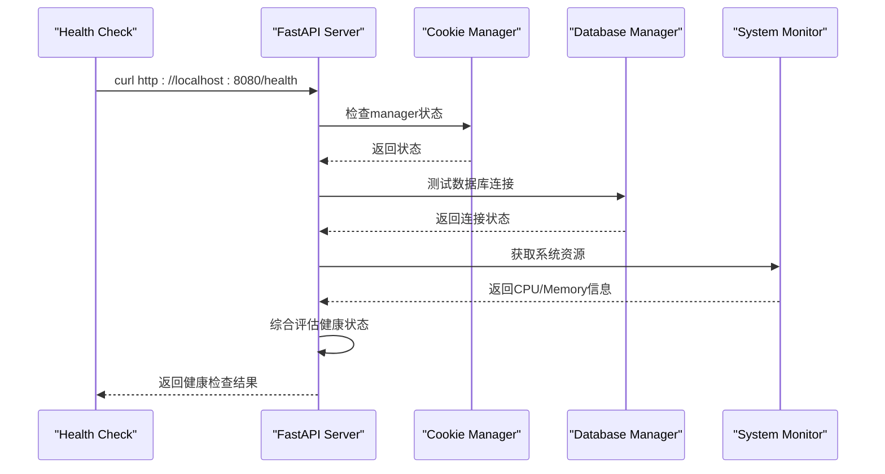
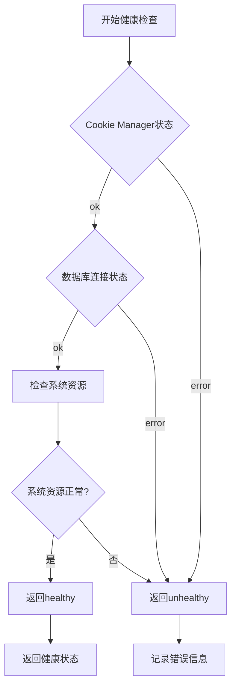
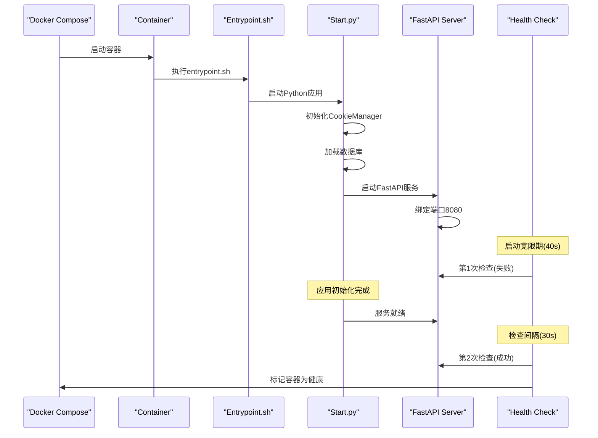
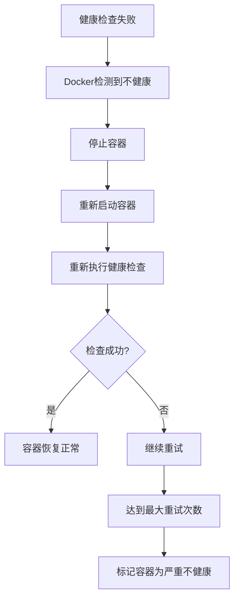
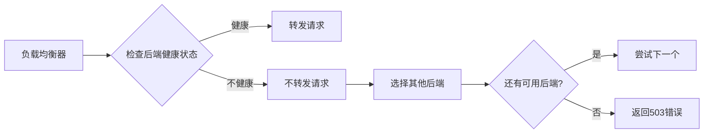
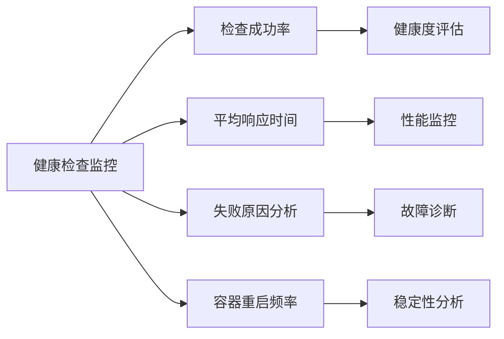
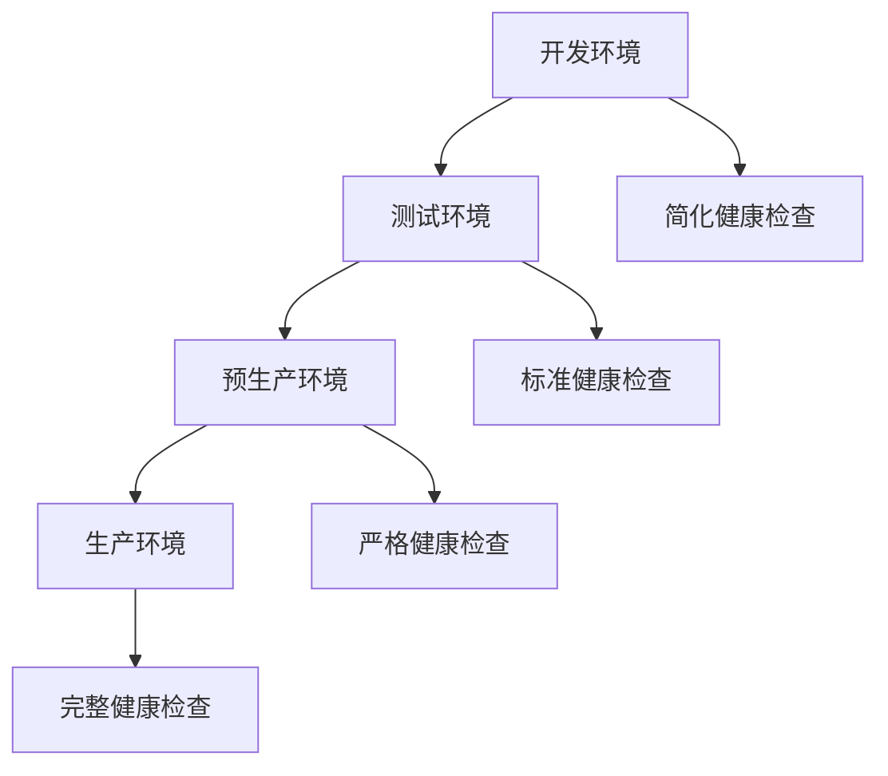

# 健康检查机制

<cite>
**本文档引用的文件**
- [docker-compose.yml](file://docker-compose.yml)
- [Dockerfile](file://Dockerfile)
- [reply_server.py](file://reply_server.py)
- [Start.py](file://Start.py)
- [entrypoint.sh](file://entrypoint.sh)
- [db_manager.py](file://db_manager.py)
</cite>

## 目录
1. [概述](#概述)
2. [健康检查配置详解](#健康检查配置详解)
3. [健康检查端点实现](#健康检查端点实现)
4. [启动过程与健康检查联动](#启动过程与健康检查联动)
5. [健康检查机制的关键作用](#健康检查机制的关键作用)
6. [故障排除指南](#故障排除指南)
7. [最佳实践建议](#最佳实践建议)

## 概述

健康检查机制是现代容器化应用的重要组成部分，它确保容器在应用完全启动并准备好处理请求后才被标记为健康状态。本文档深入解析了闲鱼自动回复系统中docker-compose.yml中healthcheck的配置参数，以及与reply_server.py中/health端点的联动机制。

该健康检查系统采用多层检测策略，通过curl命令定期检测HTTP健康接口，结合启动宽限期、重试机制和超时控制，确保容器在应用完全初始化后再被纳入负载均衡池。

## 健康检查配置详解

### docker-compose.yml中的健康检查配置



**图表来源**
- [docker-compose.yml](file://docker-compose.yml#L63-L68)

#### 参数详细说明

| 参数 | 值 | 说明 | 作用 |
|------|-----|------|------|
| test | curl -f http://localhost:8080/health | 健康检查命令 | 使用curl工具发送HTTP GET请求到健康端点 |
| interval | 30秒 | 检查间隔 | 每30秒执行一次健康检查 |
| timeout | 10秒 | 超时阈值 | 单次检查最多等待10秒 |
| retries | 3次 | 重试次数 | 连续失败3次才标记为不健康 |
| start_period | 40秒 | 启动宽限期 | 容器启动后40秒内不进行健康检查 |

**节来源**
- [docker-compose.yml](file://docker-compose.yml#L63-L68)

### Dockerfile中的健康检查配置

除了docker-compose.yml中的配置，Dockerfile中也有相应的健康检查设置：



**图表来源**
- [Dockerfile](file://Dockerfile#L132-L133)

**节来源**
- [Dockerfile](file://Dockerfile#L132-L133)

## 健康检查端点实现

### /health端点的架构设计



**图表来源**
- [reply_server.py](file://reply_server.py#L374-L418)

### 健康检查端点的核心逻辑

健康检查端点实现了多层次的状态检测：

#### 1. Cookie管理器状态检查
- 检查全局cookie_manager.manager实例是否存在
- 验证管理器是否已正确初始化

#### 2. 数据库连接状态检查
- 尝试执行简单的数据库查询（如get_all_cookies()）
- 捕获并处理数据库连接异常

#### 3. 系统资源监控
- CPU使用率监控（psutil.cpu_percent）
- 内存使用情况监控（psutil.virtual_memory）
- 可用内存空间检查

#### 4. 健康状态评估


**图表来源**
- [reply_server.py](file://reply_server.py#L374-L418)

**节来源**
- [reply_server.py](file://reply_server.py#L374-L418)

## 启动过程与健康检查联动

### 应用启动流程



**图表来源**
- [entrypoint.sh](file://entrypoint.sh#L88-L94)
- [Start.py](file://Start.py#L513-L587)

### 启动宽限期的作用机制

启动宽限期（start_period: 40s）确保容器在应用完全初始化前不会被标记为不健康：

#### 宽限期期间的行为
1. **健康检查暂停**：在40秒内不执行健康检查
2. **应用初始化**：在此期间完成数据库连接、Cookie管理器初始化等关键步骤
3. **服务就绪**：应用完全启动并准备好处理请求

#### 宽限期后的检查策略
- 从第41秒开始，按照30秒间隔进行健康检查
- 如果连续3次检查失败，容器被标记为不健康
- 不健康容器会被Docker自动重启

**节来源**
- [entrypoint.sh](file://entrypoint.sh#L88-L94)
- [Start.py](file://Start.py#L513-L587)

## 健康检查机制的关键作用

### 在Docker自动恢复中的作用



#### 自动恢复流程
1. **失败检测**：健康检查连续3次失败
2. **容器停止**：Docker自动停止不健康容器
3. **重启策略**：根据restart策略重新启动容器
4. **重新验证**：新容器启动后再次执行健康检查

### 在负载均衡场景中的关键作用

#### 负载均衡器决策机制


#### 健康检查对负载均衡的影响
1. **流量路由**：只将请求转发给健康的容器
2. **故障隔离**：快速识别并隔离不健康的实例
3. **服务质量保证**：确保用户请求始终被转发到可用的服务实例

### 故障检测与响应

#### 多层次故障检测
- **网络层**：curl命令检测HTTP服务可达性
- **应用层**：/health端点检测应用业务逻辑
- **系统层**：检查系统资源使用情况

#### 响应策略
- **快速失败**：及时发现并报告故障
- **重试机制**：避免因短暂网络波动导致误判
- **状态聚合**：综合多个维度的状态信息

## 故障排除指南

### 常见健康检查问题

#### 1. 健康检查频繁失败

**症状**：容器被频繁重启，健康检查状态不稳定

**可能原因**：
- 应用启动时间过长，超过健康检查间隔
- 数据库连接不稳定
- 系统资源不足

**解决方案**：
```yaml
# 调整健康检查参数
healthcheck:
  test: ["CMD", "curl", "-f", "http://localhost:8080/health"]
  interval: 60s      # 增加检查间隔
  timeout: 15s       # 增加超时时间
  retries: 5         # 增加重试次数
  start_period: 60s  # 增加启动宽限期
```

#### 2. 容器启动后立即被标记为不健康

**症状**：容器启动后健康检查立即失败

**诊断步骤**：
1. 检查应用是否在8080端口监听
2. 验证/health端点是否正常响应
3. 检查依赖服务（数据库、外部API）是否可用

**解决方案**：
```bash
# 检查端口监听状态
docker exec <container_id> netstat -tlnp

# 测试健康端点
docker exec <container_id> curl -f http://localhost:8080/health

# 查看应用日志
docker logs <container_id>
```

#### 3. 健康检查超时

**症状**：健康检查经常超时

**优化建议**：
- 检查系统资源使用情况
- 优化数据库查询性能
- 减少不必要的初始化操作

### 监控和调试工具

#### 健康检查监控指标


#### 调试命令集合
```bash
# 查看容器健康状态
docker inspect <container_id> --format='{{.State.Health.Status}}'

# 查看健康检查历史
docker inspect <container_id> --format='{{.State.Health.Log}}'

# 手动执行健康检查
docker exec <container_id> curl -f http://localhost:8080/health

# 查看容器日志
docker logs <container_id> --since 1h
```

## 最佳实践建议

### 健康检查配置优化

#### 1. 参数调优策略
```yaml
healthcheck:
  test: ["CMD", "curl", "-f", "http://localhost:8080/health"]
  interval: 30s              # 根据应用特性调整
  timeout: 10s               # 确保足够的时间处理复杂请求
  retries: 3                 # 平衡稳定性和响应速度
  start_period: 40s          # 确保应用完全初始化
```

#### 2. 健康检查端点设计原则
- **轻量级**：避免执行耗时的业务逻辑
- **快速响应**：确保在超时时间内完成检查
- **全面覆盖**：检查关键依赖组件状态
- **错误处理**：优雅处理各种异常情况

#### 3. 监控和告警设置
```yaml
# 建议的监控指标
monitoring:
  health_check_success_rate: ">= 95%"
  health_check_response_time: "< 5s"
  container_restart_frequency: "< 1/小时"
```

### 生产环境部署建议

#### 1. 分阶段部署策略


#### 2. 性能优化建议
- **异步检查**：避免阻塞主线程
- **缓存机制**：缓存检查结果减少重复计算
- **资源监控**：集成系统资源监控

#### 3. 安全考虑
- **访问控制**：限制健康检查端点的访问权限
- **敏感信息**：避免在健康检查响应中泄露敏感信息
- **DDoS防护**：防止健康检查成为攻击目标

### 故障恢复策略

#### 1. 自动恢复机制
```yaml
deploy:
  restart_policy:
    condition: on-failure
    delay: 5s
    max_attempts: 3
    window: 120s
```

#### 2. 人工干预流程
- **故障通知**：健康检查失败时发送告警
- **根因分析**：提供详细的故障诊断信息
- **恢复验证**：确保恢复后的服务正常运行

通过以上健康检查机制的设计和实施，闲鱼自动回复系统能够确保容器在应用完全启动并准备好处理请求后才被标记为健康状态，从而提高系统的稳定性和可靠性。这种机制在Docker自动恢复和负载均衡场景中发挥着关键作用，为用户提供高质量的服务体验。