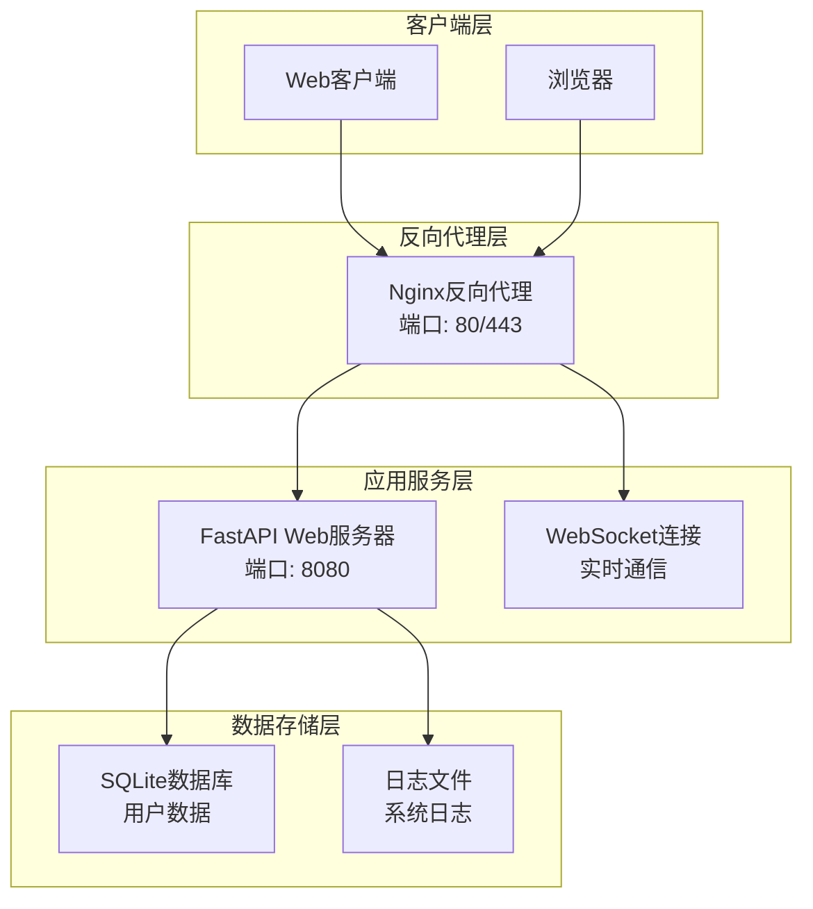
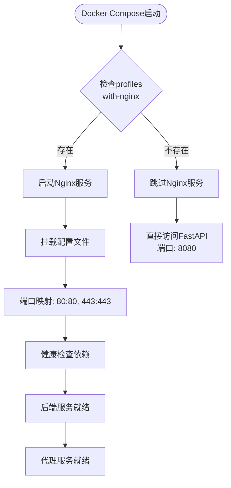
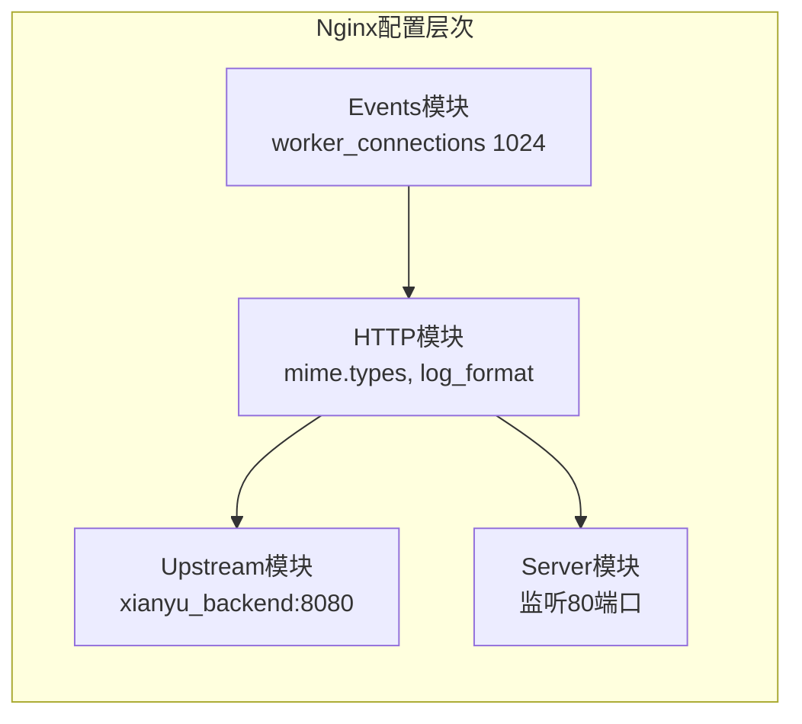
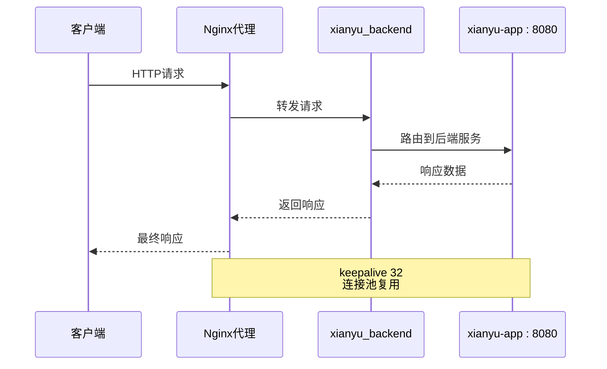
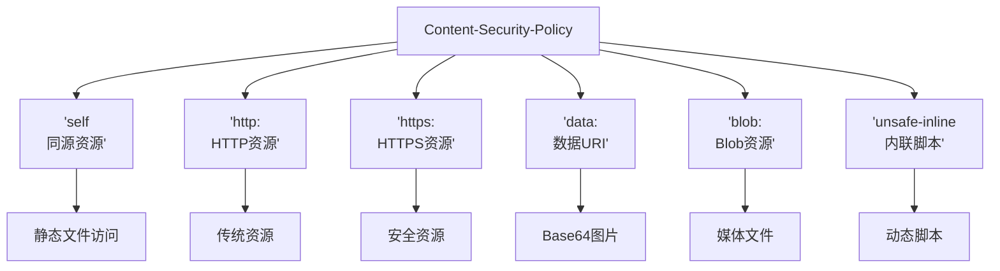
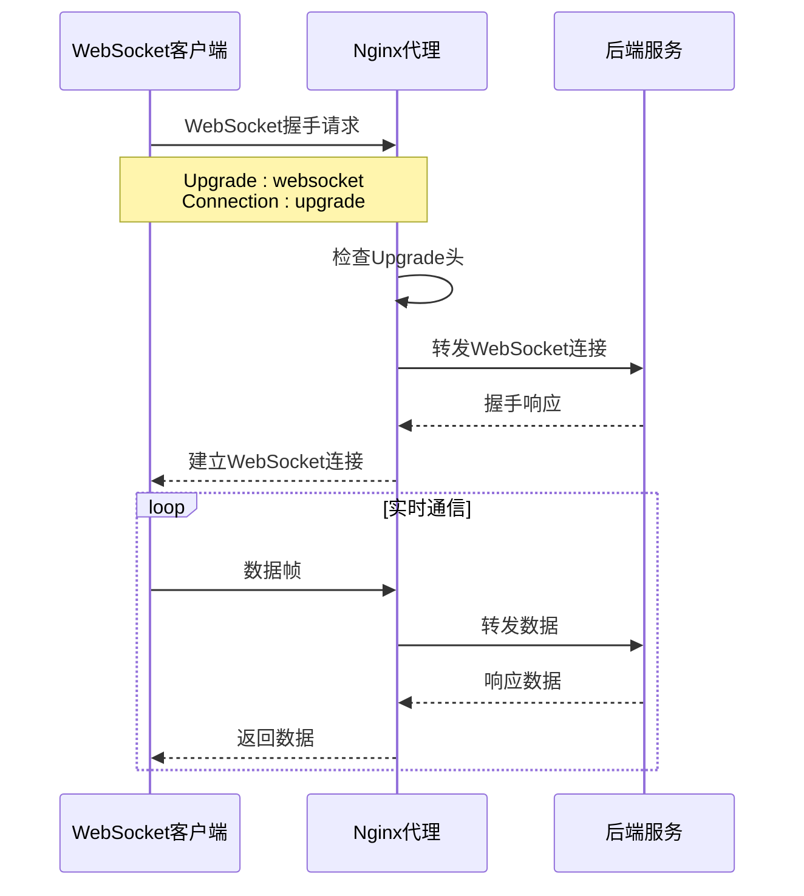
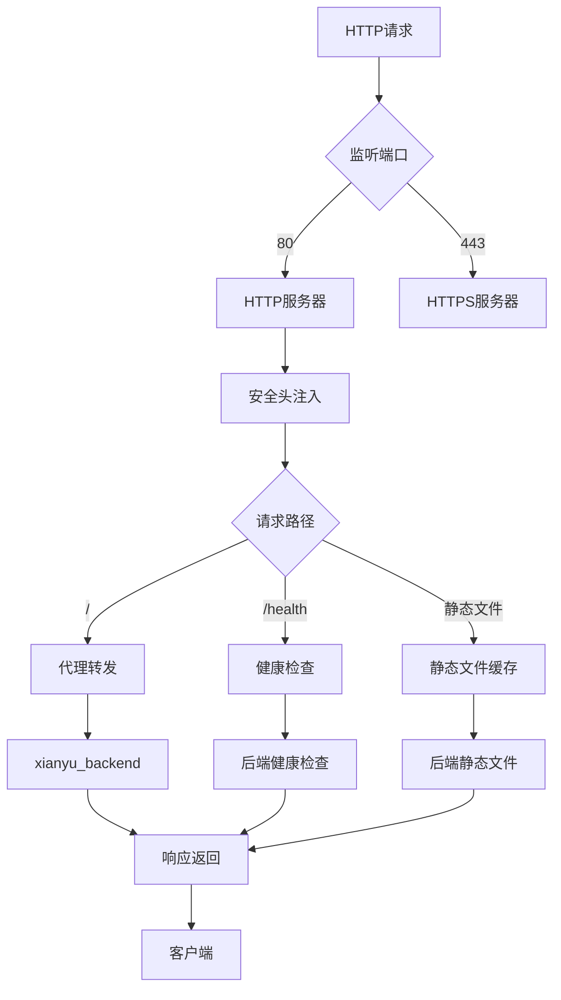
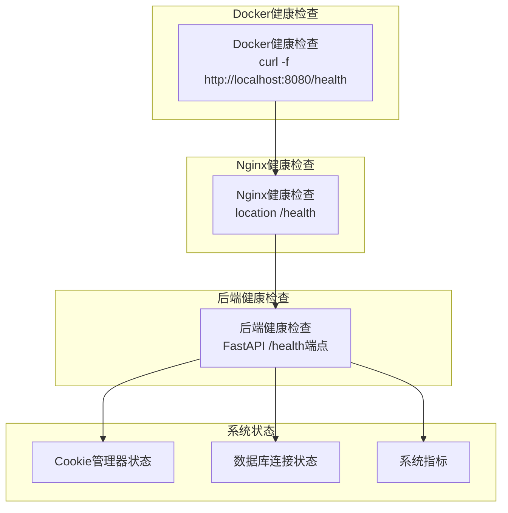
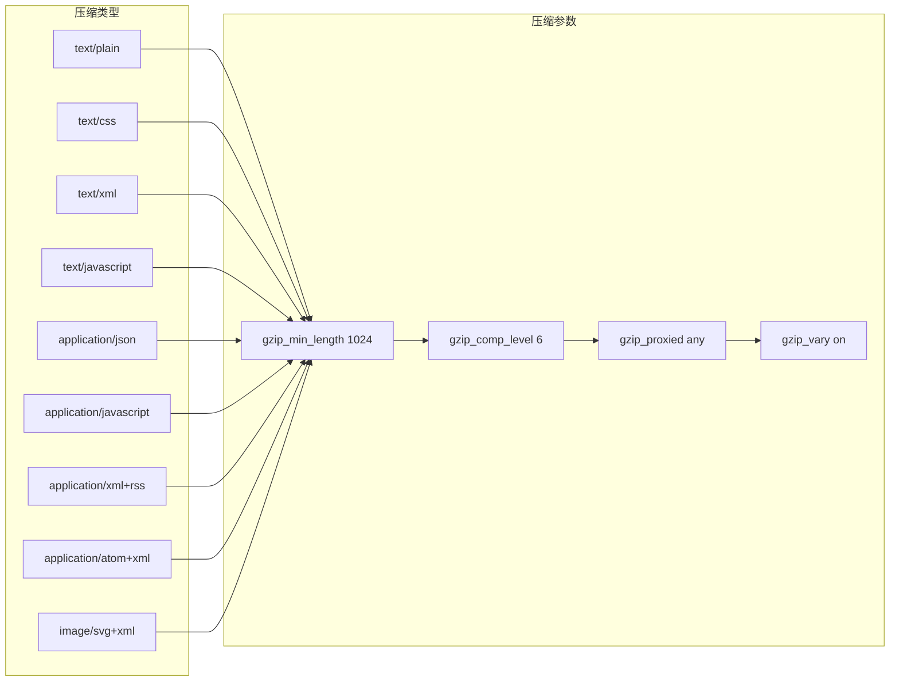

# 反向代理配置

<cite>
**本文档引用的文件**
- [docker-compose.yml](file://docker-compose.yml)
- [nginx/nginx.conf](file://nginx/nginx.conf)
- [README.md](file://README.md)
- [reply_server.py](file://reply_server.py)
- [XianyuAutoAsync.py](file://XianyuAutoAsync.py)
- [utils/ws_utils.py](file://utils/ws_utils.py)
</cite>

## 目录
1. [简介](#简介)
2. [项目架构概览](#项目架构概览)
3. [Docker Compose配置分析](#docker-compose配置分析)
4. [Nginx反向代理配置详解](#nginx反向代理配置详解)
5. [上游服务配置](#上游服务配置)
6. [安全头配置](#安全头配置)
7. [WebSocket升级支持](#websocket升级支持)
8. [SSL证书挂载](#ssl证书挂载)
9. [透明代理流程](#透明代理流程)
10. [健康检查机制](#健康检查机制)
11. [性能优化配置](#性能优化配置)
12. [故障排除指南](#故障排除指南)

## 简介

本文档详细阐述了闲鱼自动回复系统中Nginx反向代理的配置机制。该系统采用现代化的容器化架构，通过Docker Compose实现服务编排，其中Nginx作为反向代理服务器为后端FastAPI应用提供统一的入口点。

反向代理配置的核心目标是：
- 提供统一的Web访问入口
- 实现负载均衡和高可用性
- 增强系统安全性
- 支持WebSocket实时通信
- 优化静态资源访问性能

## 项目架构概览

系统采用微服务架构，主要组件包括：



**图表来源**
- [docker-compose.yml](file://docker-compose.yml#L80-L96)
- [nginx/nginx.conf](file://nginx/nginx.conf#L48-L123)

**章节来源**
- [docker-compose.yml](file://docker-compose.yml#L1-L106)
- [README.md](file://README.md#L19-L37)

## Docker Compose配置分析

### 服务编排结构

Docker Compose配置实现了条件化的Nginx服务启用机制：



**图表来源**
- [docker-compose.yml](file://docker-compose.yml#L80-L96)

### 条件启用逻辑

Nginx服务通过`profiles: with-nginx`条件启用，这种设计提供了灵活性：

- **开发环境**：可以直接访问后端服务，便于调试
- **生产环境**：启用Nginx提供统一入口和安全保护
- **混合部署**：根据需求选择是否启用反向代理

**章节来源**
- [docker-compose.yml](file://docker-compose.yml#L80-L96)

## Nginx反向代理配置详解

### 核心配置结构

Nginx配置采用模块化设计，包含以下关键部分：



**图表来源**
- [nginx/nginx.conf](file://nginx/nginx.conf#L1-L123)

### 配置文件结构分析

| 配置段 | 功能描述 | 关键参数 |
|--------|----------|----------|
| events | 工作进程连接数配置 | worker_connections 1024 |
| http | HTTP协议处理配置 | mime.types, log_format |
| upstream | 上游服务器定义 | server xianyu-app:8080 |
| server | 虚拟主机配置 | listen 80, server_name localhost |
| location | 请求路由规则 | /, /health, 静态文件 |

**章节来源**
- [nginx/nginx.conf](file://nginx/nginx.conf#L1-L123)

## 上游服务配置

### Upstream模块详解

Nginx通过upstream模块实现后端服务的负载均衡和高可用性：



**图表来源**
- [nginx/nginx.conf](file://nginx/nginx.conf#L43-L46)

### 后端服务定位

上游服务器配置指向`xianyu-app:8080`，这是Docker网络中的服务发现机制：

- **服务名称**：`xianyu-app` - Docker Compose中定义的服务名称
- **端口号**：`8080` - FastAPI应用的默认监听端口
- **网络通信**：通过Docker Bridge网络实现服务间通信

**章节来源**
- [nginx/nginx.conf](file://nginx/nginx.conf#L43-L46)

## 安全头配置

### 安全策略矩阵

Nginx配置实现了多层次的安全防护：

| 安全头 | 配置值 | 安全作用 | 影响范围 |
|--------|--------|----------|----------|
| X-Frame-Options | SAMEORIGIN | 防止点击劫持攻击 | 所有页面 |
| X-XSS-Protection | 1; mode=block | XSS攻击防护 | 浏览器层面 |
| X-Content-Type-Options | nosniff | MIME类型嗅探防护 | 静态资源 |
| Referrer-Policy | no-referrer-when-downgrade | 引用策略控制 | 导航行为 |
| Content-Security-Policy | 多源策略 | 内容安全策略 | 资源加载 |

### CSP策略详解

Content-Security-Policy配置提供了细粒度的内容安全控制：



**图表来源**
- [nginx/nginx.conf](file://nginx/nginx.conf#L58)

**章节来源**
- [nginx/nginx.conf](file://nginx/nginx.conf#L53-L59)

## WebSocket升级支持

### 升级头处理机制

Nginx配置专门针对WebSocket协议进行了优化，确保实时通信的顺畅：



**图表来源**
- [nginx/nginx.conf](file://nginx/nginx.conf#L63-L65)

### WebSocket配置参数

| 参数 | 值 | 作用 | 重要性 |
|------|-----|------|--------|
| proxy_http_version | 1.1 | 支持HTTP/1.1协议 | 必需 |
| proxy_set_header Upgrade | $http_upgrade | 传递升级头 | 必需 |
| proxy_set_header Connection | 'upgrade' | 保持连接状态 | 必需 |
| proxy_cache_bypass | $http_upgrade | 绕过缓存 | 必需 |

**章节来源**
- [nginx/nginx.conf](file://nginx/nginx.conf#L62-L70)

## SSL证书挂载

### 挂载策略分析

Nginx配置采用了安全的只读挂载策略：

```mermaid
graph LR
subgraph "本地文件系统"
LocalConfig[./nginx/nginx.conf]
LocalSSL[./nginx/ssl/]
end
subgraph "容器内部"
ContainerConfig[/etc/nginx/nginx.conf]
ContainerSSL[/etc/nginx/ssl/]
end
LocalConfig --> |ro| ContainerConfig
LocalSSL --> |ro| ContainerSSL
style LocalConfig fill:#e1f5fe
style LocalSSL fill:#e1f5fe
style ContainerConfig fill:#f3e5f5
style ContainerSSL fill:#f3e5f5
```

**图表来源**
- [docker-compose.yml](file://docker-compose.yml#L88-L89)

### 安全策略说明

- **只读挂载**：`:ro`标志确保配置文件不可被容器内程序修改
- **证书管理**：SSL证书目录包含证书和私钥文件
- **权限控制**：容器内的Nginx进程只能读取证书文件

**章节来源**
- [docker-compose.yml](file://docker-compose.yml#L88-L89)

## 透明代理流程

### HTTP请求处理流程

Nginx作为透明代理，实现了完整的请求转发机制：



**图表来源**
- [nginx/nginx.conf](file://nginx/nginx.conf#L48-L123)

### 请求头传递机制

Nginx在转发请求时保留了完整的客户端信息：

| 请求头 | 原始值 | 传递方式 | 用途 |
|--------|--------|----------|------|
| Host | $host | 直接传递 | 域名识别 |
| X-Real-IP | $remote_addr | IP地址 | 客户端真实IP |
| X-Forwarded-For | $proxy_add_x_forwarded_for | 追加列表 | 代理链跟踪 |
| X-Forwarded-Proto | $scheme | 协议标识 | HTTPS检测 |

**章节来源**
- [nginx/nginx.conf](file://nginx/nginx.conf#L66-L69)

## 健康检查机制

### 多层次健康检查

系统实现了多层次的健康检查机制：



**图表来源**
- [docker-compose.yml](file://docker-compose.yml#L63-L68)
- [reply_server.py](file://reply_server.py#L374-L418)

### 健康检查端点实现

后端健康检查端点提供了详细的系统状态信息：

- **服务状态**：Cookie管理器和数据库连接状态
- **系统指标**：CPU使用率、内存使用率
- **响应格式**：JSON格式，包含状态码和详细信息

**章节来源**
- [reply_server.py](file://reply_server.py#L374-L418)
- [docker-compose.yml](file://docker-compose.yml#L63-L68)

## 性能优化配置

### Gzip压缩配置

Nginx启用了全面的Gzip压缩优化：



**图表来源**
- [nginx/nginx.conf](file://nginx/nginx.conf#L25-L40)

### 静态文件优化

静态文件配置实现了长期缓存和性能优化：

| 文件类型 | 缓存策略 | 缓存时间 | 控制头 |
|----------|----------|----------|--------|
| JS/CSS | 长期缓存 | 1年 | Cache-Control: public, immutable |
| 图片文件 | 长期缓存 | 1年 | Cache-Control: public, immutable |
| 文档文件 | 长期缓存 | 1年 | Cache-Control: public, immutable |

**章节来源**
- [nginx/nginx.conf](file://nginx/nginx.conf#L25-L41)
- [nginx/nginx.conf](file://nginx/nginx.conf#L76-L81)

## 故障排除指南

### 常见问题诊断

#### Nginx连接问题

1. **检查服务状态**
   ```bash
   docker-compose ps
   docker-compose logs nginx
   ```

2. **验证端口监听**
   ```bash
   netstat -tlnp | grep :80
   netstat -tlnp | grep :443
   ```

3. **检查配置语法**
   ```bash
   docker exec xianyu-nginx nginx -t
   ```

#### 后端连接问题

1. **健康检查验证**
   ```bash
   curl http://localhost:8080/health
   curl http://localhost/health
   ```

2. **Docker网络连通性**
   ```bash
   docker network ls
   docker network inspect xianyu-network
   ```

#### WebSocket连接问题

1. **协议升级检查**
   - 确认Upgrade头正确传递
   - 检查Connection头设置
   - 验证HTTP/1.1协议支持

2. **防火墙和代理配置**
   - 确保WebSocket端口开放
   - 检查代理服务器配置

### 性能监控指标

| 监控项目 | 关键指标 | 正常范围 | 告警阈值 |
|----------|----------|----------|----------|
| 连接数 | worker_connections | < 1024 | > 900 |
| 响应时间 | 平均响应时间 | < 100ms | > 500ms |
| 错误率 | 5xx错误比例 | < 1% | > 5% |
| 内存使用 | 内存占用率 | < 80% | > 90% |

**章节来源**
- [nginx/nginx.conf](file://nginx/nginx.conf#L1-L3)
- [docker-compose.yml](file://docker-compose.yml#L63-L68)

## 结论

Nginx反向代理配置为闲鱼自动回复系统提供了完整的基础设施支持。通过精心设计的配置，系统实现了：

- **安全性**：多层安全头防护和CSP策略
- **性能**：Gzip压缩和静态文件缓存优化
- **可靠性**：健康检查和故障转移机制
- **可扩展性**：模块化配置和条件启用机制

这种配置不仅满足了当前的功能需求，还为未来的扩展和优化奠定了坚实的基础。通过Docker容器化部署，系统具备了良好的可移植性和可维护性，能够适应不同的部署环境和规模需求。