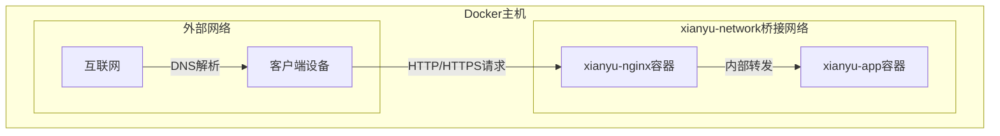
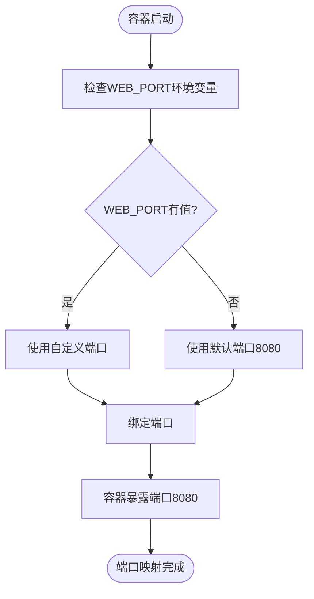
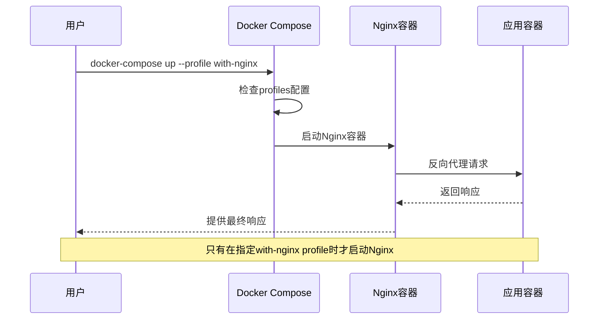
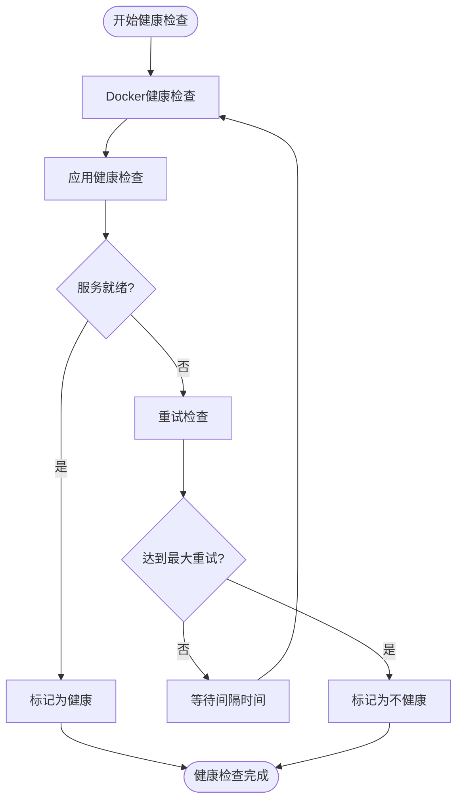
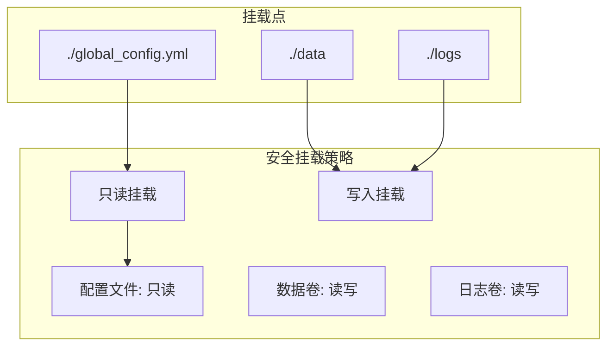
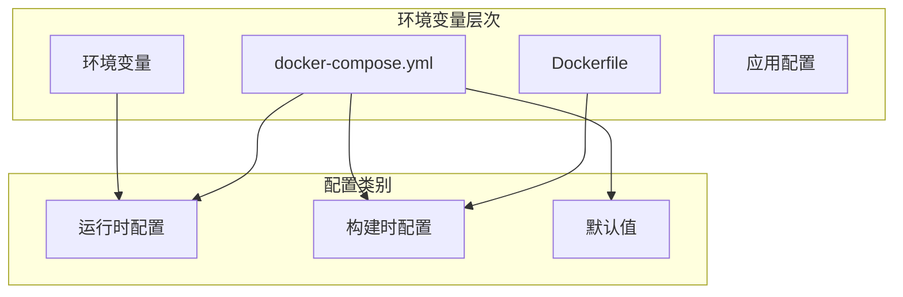
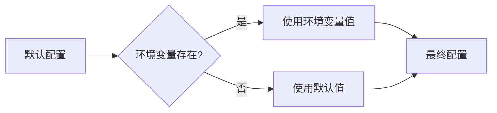
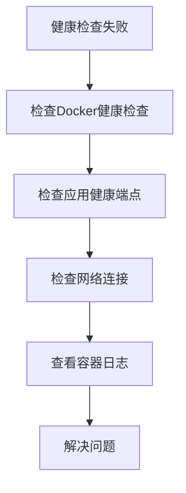

# 网络与安全配置

<cite>
**本文档引用的文件**
- [docker-compose.yml](file://docker-compose.yml)
- [docker-compose-cn.yml](file://docker-compose-cn.yml)
- [nginx/nginx.conf](file://nginx/nginx.conf)
- [Dockerfile](file://Dockerfile)
- [Dockerfile-cn](file://Dockerfile-cn)
- [entrypoint.sh](file://entrypoint.sh)
</cite>

## 目录
1. [概述](#概述)
2. [自定义桥接网络配置](#自定义桥接网络配置)
3. [端口映射机制](#端口映射机制)
4. [Nginx反向代理配置](#nginx反向代理配置)
5. [健康检查配置](#健康检查配置)
6. [网络安全最佳实践](#网络安全最佳实践)
7. [环境变量配置](#环境变量配置)
8. [资源限制与性能优化](#资源限制与性能优化)
9. [故障排除指南](#故障排除指南)
10. [总结](#总结)

## 概述

本文档全面解析了闲鱼自动回复系统的docker-compose网络与安全配置，重点涵盖了自定义桥接网络的创建与使用、灵活的端口映射机制、Nginx反向代理的可选配置、健康检查机制以及网络安全最佳实践。

该系统采用现代化的容器化架构，通过docker-compose实现了高度可配置的网络环境，支持多种部署场景，包括直接访问和反向代理访问两种模式。

## 自定义桥接网络配置

### xianyu-network自定义桥接网络

系统创建了一个名为`xianyu-network`的自定义桥接网络，这是整个容器生态系统的核心网络基础设施。



**图表来源**
- [docker-compose.yml](file://docker-compose.yml#L97-L100)
- [docker-compose-cn.yml](file://docker-compose-cn.yml#L96-L99)

### 网络配置特点

1. **隔离性**：自定义桥接网络提供了容器间的网络隔离，确保不同服务之间的通信安全
2. **连通性**：同一网络内的容器可以通过服务名称直接通信
3. **灵活性**：支持动态扩展和配置变更

**章节来源**
- [docker-compose.yml](file://docker-compose.yml#L97-L100)
- [docker-compose-cn.yml](file://docker-compose-cn.yml#L96-L99)

## 端口映射机制

### 环境变量驱动的端口绑定

系统采用了灵活的端口映射机制，通过`${WEB_PORT:-8080}`语法实现默认端口绑定：



**图表来源**
- [docker-compose.yml](file://docker-compose.yml#L11-L12)
- [docker-compose-cn.yml](file://docker-compose-cn.yml#L11-L12)

### 端口映射配置详解

| 配置项 | 值 | 说明 |
|--------|-----|------|
| 容器内部端口 | 8080 | 应用程序监听的标准端口 |
| 外部映射端口 | ${WEB_PORT:-8080} | 支持环境变量覆盖的默认8080 |
| 映射格式 | host:container | Docker标准端口映射格式 |

### 环境变量优先级

1. **用户自定义**：通过环境变量`WEB_PORT`指定特定端口
2. **默认值**：未设置时使用内置默认值8080
3. **兼容性**：支持中国版和国际版的不同配置

**章节来源**
- [docker-compose.yml](file://docker-compose.yml#L11-L12)
- [docker-compose-cn.yml](file://docker-compose-cn.yml#L11-L12)
- [entrypoint.sh](file://entrypoint.sh#L81-L86)

## Nginx反向代理配置

### Profiles机制控制Nginx启用

系统通过Docker Compose的profiles机制实现了Nginx的可选配置：



**图表来源**
- [docker-compose.yml](file://docker-compose.yml#L94-L95)
- [docker-compose-cn.yml](file://docker-compose-cn.yml#L94-L95)

### Nginx配置文件挂载

| 挂载类型 | 主机路径 | 容器路径 | 权限 |
|----------|----------|----------|------|
| 配置文件 | ./nginx/nginx.conf | /etc/nginx/nginx.conf | 只读 |
| SSL证书 | ./nginx/ssl | /etc/nginx/ssl | 只读 |

### SSL证书挂载配置

系统支持SSL证书的挂载配置，允许用户提供自定义的SSL证书：

```mermaid
graph LR
subgraph "主机文件系统"
Cert[cert.pem]
Key[key.pem]
Conf[nginx.conf]
end
subgraph "Nginx容器"
CertMount[/etc/nginx/ssl/cert.pem]
KeyMount[/etc/nginx/ssl/key.pem]
ConfMount[/etc/nginx/nginx.conf]
end
Cert --> CertMount
Key --> KeyMount
Conf --> ConfMount
```

**图表来源**
- [docker-compose.yml](file://docker-compose.yml#L87-L89)
- [docker-compose-cn.yml](file://docker-compose-cn.yml#L87-L89)

### 反向代理配置详解

Nginx配置实现了完整的反向代理功能：

1. **上游服务器配置**：指向`xianyu-app:8080`
2. **WebSocket支持**：完整的WebSocket升级支持
3. **静态文件缓存**：1年缓存策略
4. **健康检查代理**：专门的健康检查端点

**章节来源**
- [docker-compose.yml](file://docker-compose.yml#L80-L96)
- [docker-compose-cn.yml](file://docker-compose-cn.yml#L80-L96)
- [nginx/nginx.conf](file://nginx/nginx.conf#L42-L46)

## 健康检查配置

### 多层次健康检查机制

系统实现了多层次的健康检查配置，确保服务的高可用性：



**图表来源**
- [docker-compose.yml](file://docker-compose.yml#L63-L68)
- [Dockerfile](file://Dockerfile#L131-L134)

### 健康检查配置参数

| 参数 | 值 | 说明 |
|------|-----|------|
| 测试命令 | `curl -f http://localhost:8080/health` | HTTP GET请求到健康检查端点 |
| 间隔时间 | 30秒 | 每30秒执行一次健康检查 |
| 超时设置 | 10秒 | 单次检查最多等待10秒 |
| 重试次数 | 3次 | 最多重试3次 |
| 启动等待期 | 40秒 | 容器启动后等待40秒再开始检查 |

### 健康检查端点设计

健康检查端点`/health`的设计考虑了以下因素：

1. **轻量级**：快速响应，不进行复杂业务逻辑
2. **可达性**：确保网络连接正常
3. **状态一致性**：反映应用的真实运行状态

**章节来源**
- [docker-compose.yml](file://docker-compose.yml#L63-L68)
- [Dockerfile](file://Dockerfile#L131-L134)
- [nginx/nginx.conf](file://nginx/nginx.conf#L83-L87)

## 网络安全最佳实践

### 只读挂载配置

系统广泛采用只读挂载来增强安全性：



**图表来源**
- [docker-compose.yml](file://docker-compose.yml#L15-L21)
- [docker-compose.yml](file://docker-compose.yml#L87-L89)

### 挂载权限配置

| 挂载类型 | 权限设置 | 安全目的 |
|----------|----------|----------|
| 配置文件 | ro (只读) | 防止容器内修改配置 |
| 数据目录 | rw (读写) | 允许数据持久化 |
| 日志目录 | rw (读写) | 允许日志记录 |
| SSL证书 | ro (只读) | 保护证书安全 |

### 用户权限管理

系统在开发阶段使用root用户运行，但在生产环境中建议：

1. **非特权用户**：创建专用用户组和用户
2. **最小权限原则**：只授予必要的文件系统权限
3. **资源隔离**：通过用户命名空间实现进一步隔离

### 网络隔离策略

1. **自定义网络**：使用专用桥接网络隔离容器
2. **端口限制**：只暴露必要的端口
3. **防火墙规则**：配合主机防火墙限制访问

**章节来源**
- [docker-compose.yml](file://docker-compose.yml#L8-L10)
- [docker-compose.yml](file://docker-compose.yml#L15-L21)
- [docker-compose.yml](file://docker-compose.yml#L87-L89)
- [Dockerfile](file://Dockerfile#L125-L126)

## 环境变量配置

### 环境变量系统架构

系统采用了层次化的环境变量配置体系：



**图表来源**
- [docker-compose.yml](file://docker-compose.yml#L22-L59)
- [docker-compose-cn.yml](file://docker-compose-cn.yml#L22-L59)

### 核心环境变量配置

| 变量名 | 默认值 | 说明 | 安全影响 |
|--------|--------|------|----------|
| PYTHONUNBUFFERED | 1 | 禁用Python缓冲，实时输出日志 | 性能 |
| PYTHONDONTWRITEBYTECODE | 1 | 不生成.pyc文件，减少磁盘IO | 安全 |
| TZ | Asia/Shanghai | 时区设置 | 功能 |
| DB_PATH | /app/data/xianyu_data.db | 数据库文件路径 | 数据安全 |
| LOG_LEVEL | INFO | 日志级别 | 调试/生产 |
| ADMIN_USERNAME | admin | 管理员用户名 | 认证 |
| ADMIN_PASSWORD | admin123 | 管理员密码 | 认证 |
| JWT_SECRET_KEY | default-secret-key | JWT密钥 | 认证 |

### 环境变量覆盖机制

系统支持通过环境变量覆盖默认配置：



**图表来源**
- [docker-compose.yml](file://docker-compose.yml#L23-L59)

**章节来源**
- [docker-compose.yml](file://docker-compose.yml#L22-L59)
- [docker-compose-cn.yml](file://docker-compose-cn.yml#L22-L59)
- [entrypoint.sh](file://entrypoint.sh#L8-L15)

## 资源限制与性能优化

### 资源限制配置

系统实现了精细化的资源限制配置：

```mermaid
graph TB
subgraph "资源限制策略"
Memory[内存限制]
CPU[CPU限制]
Reservation[资源预留]
end
subgraph "配置参数"
MemLimit[内存上限: ${MEMORY_LIMIT:-2048}M]
CPULimit[CPU上限: '${CPU_LIMIT:-2.0}']
MemReserve[内存预留: ${MEMORY_RESERVATION:-512}M]
CPUReserve[CPU预留: '${CPU_RESERVATION:-0.5}']
end
Memory --> MemLimit
Memory --> MemReserve
CPU --> CPULimit
CPU --> CPUReserve
```

**图表来源**
- [docker-compose.yml](file://docker-compose.yml#L72-L77)
- [docker-compose-cn.yml](file://docker-compose-cn.yml#L72-L77)

### 性能优化配置

| 优化项 | 配置值 | 性能影响 |
|--------|--------|----------|
| 内存限制 | 2048MB | 防止内存泄漏导致系统崩溃 |
| CPU限制 | 2.0核 | 平衡性能与资源利用率 |
| 内存预留 | 512MB | 确保基本运行需求 |
| CPU预留 | 0.5核 | 保留系统资源 |

### 资源监控与调优

1. **动态调整**：支持通过环境变量动态调整资源配置
2. **监控指标**：结合Docker监控工具跟踪资源使用情况
3. **性能调优**：根据实际负载调整资源配置

**章节来源**
- [docker-compose.yml](file://docker-compose.yml#L70-L78)
- [docker-compose-cn.yml](file://docker-compose-cn.yml#L70-L78)

## 故障排除指南

### 常见网络问题诊断

1. **端口冲突**
   - 检查宿主机端口占用情况
   - 验证环境变量配置
   - 使用`docker ps`查看端口映射

2. **网络连接问题**
   - 验证自定义网络配置
   - 检查容器间网络连通性
   - 确认防火墙规则

3. **Nginx代理问题**
   - 检查配置文件语法
   - 验证SSL证书有效性
   - 查看Nginx错误日志

### 健康检查故障排除



**图表来源**
- [docker-compose.yml](file://docker-compose.yml#L63-L68)

### 安全配置验证

1. **权限检查**：确认只读挂载正确应用
2. **用户权限**：验证容器用户配置
3. **网络隔离**：测试容器间通信限制

**章节来源**
- [docker-compose.yml](file://docker-compose.yml#L63-L68)
- [docker-compose.yml](file://docker-compose.yml#L87-L89)

## 总结

闲鱼自动回复系统的网络与安全配置体现了现代容器化应用的最佳实践：

### 核心优势

1. **灵活性**：通过环境变量和profiles机制实现高度可配置性
2. **安全性**：采用只读挂载、用户权限控制等多重安全措施
3. **可靠性**：完善的健康检查和资源限制机制
4. **可维护性**：清晰的配置分离和模块化设计

### 最佳实践总结

1. **网络隔离**：使用自定义桥接网络确保容器间安全通信
2. **端口管理**：通过环境变量实现灵活的端口映射
3. **安全挂载**：广泛采用只读挂载保护关键配置文件
4. **健康监控**：多层次健康检查确保服务可用性
5. **资源控制**：精细化的资源限制防止资源滥用

这套配置方案不仅满足了当前的功能需求，还为未来的扩展和优化奠定了坚实的基础，是容器化应用网络与安全配置的优秀范例。