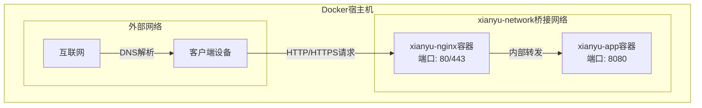
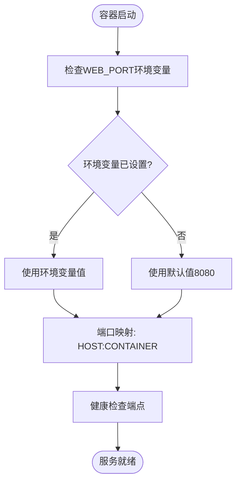
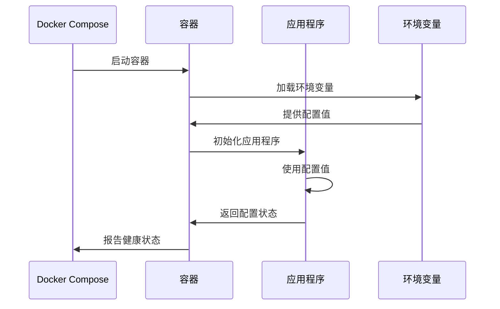
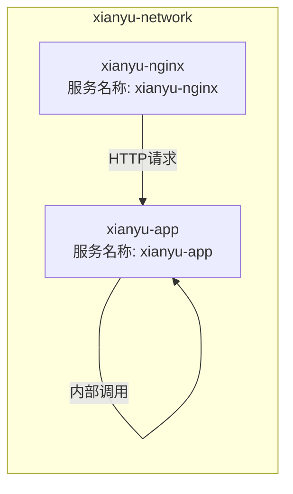
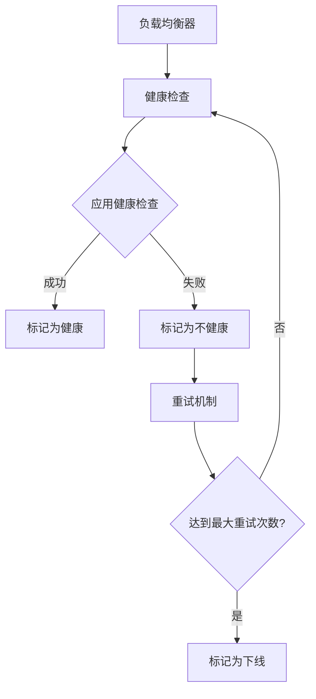
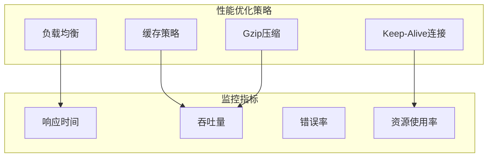
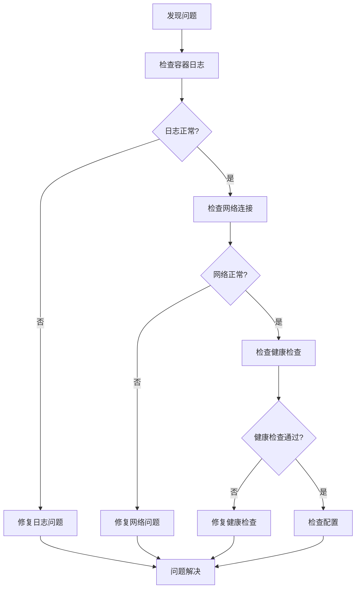

# 网络定义与端口映射

<cite>
**本文档引用的文件**
- [docker-compose.yml](file://docker-compose.yml)
- [docker-compose-cn.yml](file://docker-compose-cn.yml)
- [global_config.yml](file://global_config.yml)
- [config.py](file://config.py)
- [Dockerfile](file://Dockerfile)
- [nginx/nginx.conf](file://nginx/nginx.conf)
- [reply_server.py](file://reply_server.py)
- [entrypoint.sh](file://entrypoint.sh)
</cite>

## 目录
1. [概述](#概述)
2. [自定义桥接网络架构](#自定义桥接网络架构)
3. [端口映射机制详解](#端口映射机制详解)
4. [环境变量默认值机制](#环境变量默认值机制)
5. [容器间通信机制](#容器间通信机制)
6. [网络安全策略](#网络安全策略)
7. [部署最佳实践](#部署最佳实践)
8. [故障排除指南](#故障排除指南)
9. [总结](#总结)

## 概述

本文档深入分析了闲鱼自动回复系统中docker-compose.yml文件的网络定义与端口映射机制。该系统采用了现代化的Docker网络架构，通过自定义桥接网络实现容器间的安全通信，并提供了灵活的端口映射机制来支持不同环境下的部署需求。

系统的核心网络设计包括：
- **自定义桥接网络**：xianyu-network提供隔离的容器通信环境
- **灵活端口映射**：支持环境变量驱动的端口配置
- **健康检查机制**：内置的健康检查端点确保服务可用性
- **反向代理集成**：可选的Nginx反向代理增强安全性

## 自定义桥接网络架构

### 网络驱动配置

系统使用Docker的bridge驱动创建自定义网络，这是最常用的网络类型，适用于同一宿主机上的容器通信。



**图表来源**
- [docker-compose.yml](file://docker-compose.yml#L98-L100)
- [docker-compose-cn.yml](file://docker-compose-cn.yml#L98-L100)

### 网络隔离特性

自定义桥接网络提供了以下隔离特性：

1. **命名空间隔离**：每个容器拥有独立的网络命名空间
2. **IP地址分配**：自动分配私有IP地址范围内的地址
3. **DNS解析**：容器间可通过服务名称直接通信
4. **流量隔离**：不同网络的容器无法直接通信

**章节来源**
- [docker-compose.yml](file://docker-compose.yml#L98-L100)
- [docker-compose-cn.yml](file://docker-compose-cn.yml#L98-L100)

## 端口映射机制详解

### 环境变量驱动的端口配置

系统采用`${WEB_PORT:-8080}`这种语法实现灵活的端口映射机制，这种设计具有以下优势：



**图表来源**
- [docker-compose.yml](file://docker-compose.yml#L11-L12)
- [docker-compose-cn.yml](file://docker-compose-cn.yml#L11-L12)

### 端口映射语法分析

端口映射语法 `${HOST_PORT:-CONTAINER_PORT}` 的工作机制：

1. **优先级机制**：优先使用环境变量中设置的值
2. **回退机制**：环境变量未设置时使用默认值
3. **灵活性**：支持不同环境下的端口配置

### 多服务端口配置

系统包含多个服务的端口配置：

| 服务名称 | 容器端口 | 外部端口 | 用途 |
|---------|---------|---------|------|
| xianyu-app | 8080 | ${WEB_PORT:-8080} | 主应用服务 |
| xianyu-nginx | 80/443 | 80/443 | 反向代理服务 |

**章节来源**
- [docker-compose.yml](file://docker-compose.yml#L11-L12)
- [docker-compose.yml](file://docker-compose.yml#L84-L86)
- [docker-compose-cn.yml](file://docker-compose-cn.yml#L11-L12)
- [docker-compose-cn.yml](file://docker-compose-cn.yml#L84-L86)

## 环境变量默认值机制

### 默认值语法详解

`${VAR_NAME:-default_value}` 语法的工作原理：

1. **变量存在检查**：检查VAR_NAME是否已设置
2. **值为空检查**：即使变量存在但为空字符串也使用默认值
3. **类型兼容性**：支持字符串、数字等类型的默认值

### 关键环境变量配置

系统的关键环境变量及其默认值：

| 变量名 | 默认值 | 说明 |
|-------|--------|------|
| WEB_PORT | 8080 | Web服务端口 |
| PYTHONUNBUFFERED | 1 | 禁用Python缓冲 |
| PYTHONDONTWRITEBYTECODE | 1 | 不生成.pyc文件 |
| TZ | Asia/Shanghai | 时区设置 |
| DB_PATH | /app/data/xianyu_data.db | 数据库路径 |
| LOG_LEVEL | INFO | 日志级别 |
| MEMORY_LIMIT | 2048M | 内存限制 |
| CPU_LIMIT | 2.0 | CPU限制 |

### 动态配置机制



**图表来源**
- [docker-compose.yml](file://docker-compose.yml#L22-L58)
- [entrypoint.sh](file://entrypoint.sh#L81-L85)

**章节来源**
- [docker-compose.yml](file://docker-compose.yml#L22-L58)
- [docker-compose-cn.yml](file://docker-compose-cn.yml#L22-L58)
- [entrypoint.sh](file://entrypoint.sh#L81-L85)

## 容器间通信机制

### DNS服务发现

在xianyu-network网络中，容器可以通过服务名称进行通信：



**图表来源**
- [docker-compose.yml](file://docker-compose.yml#L92-L93)
- [nginx/nginx.conf](file://nginx/nginx.conf#L43-L46)

### 上游服务器配置

Nginx配置中的上游服务器指向：

- **服务名称**：xianyu-app
- **端口号**：8080
- **负载均衡**：支持keepalive连接池

### 通信协议支持

系统支持多种通信协议：

1. **HTTP/HTTPS**：Web服务通信
2. **WebSocket**：实时消息推送
3. **TCP**：数据库连接
4. **Unix Socket**：本地进程通信

**章节来源**
- [docker-compose.yml](file://docker-compose.yml#L92-L93)
- [docker-compose.yml](file://docker-compose.yml#L80-L96)
- [nginx/nginx.conf](file://nginx/nginx.conf#L43-L46)

## 网络安全策略

### 健康检查机制

系统实现了多层次的健康检查：



**图表来源**
- [docker-compose.yml](file://docker-compose.yml#L63-L68)
- [reply_server.py](file://reply_server.py#L374-L406)

### 安全头配置

Nginx配置中包含了多种安全头：

| 安全头 | 值 | 作用 |
|-------|-----|------|
| X-Frame-Options | SAMEORIGIN | 防止点击劫持 |
| X-XSS-Protection | 1; mode=block | XSS防护 |
| X-Content-Type-Options | nosniff | MIME类型嗅探防护 |
| Referrer-Policy | no-referrer-when-downgrade | 引用策略控制 |
| Content-Security-Policy | default-src 'self' | 内容安全策略 |

### 网络隔离策略

1. **默认拒绝原则**：未明确开放的端口不对外暴露
2. **最小权限原则**：容器只暴露必需的服务端口
3. **网络分段**：不同服务部署在不同的网络中
4. **访问控制**：通过防火墙规则限制访问

**章节来源**
- [docker-compose.yml](file://docker-compose.yml#L63-L68)
- [nginx/nginx.conf](file://nginx/nginx.conf#L53-L58)
- [reply_server.py](file://reply_server.py#L374-L406)

## 部署最佳实践

### 生产环境配置建议

1. **端口配置**
   - 使用非标准端口（如8080）避免冲突
   - 配置防火墙规则限制访问
   - 考虑使用反向代理

2. **网络配置**
   - 创建专用网络隔离不同环境
   - 使用网络标签进行服务分类
   - 配置网络策略限制通信

3. **安全配置**
   - 启用HTTPS加密传输
   - 配置SSL证书
   - 实施访问控制列表（ACL）

### 性能优化建议



**图表来源**
- [nginx/nginx.conf](file://nginx/nginx.conf#L25-L40)
- [nginx/nginx.conf](file://nginx/nginx.conf#L43-L46)

### 监控和日志

1. **健康检查监控**
   - 定期检查健康端点
   - 设置告警阈值
   - 记录健康状态变化

2. **访问日志分析**
   - 分析访问模式
   - 检测异常流量
   - 优化资源配置

3. **性能指标监控**
   - CPU使用率
   - 内存占用
   - 网络带宽

**章节来源**
- [docker-compose.yml](file://docker-compose.yml#L63-L68)
- [nginx/nginx.conf](file://nginx/nginx.conf#L10-L16)

## 故障排除指南

### 常见网络问题

1. **端口冲突**
   - **症状**：容器启动失败，提示端口已被占用
   - **解决方案**：检查端口占用情况，修改WEB_PORT环境变量

2. **网络连接失败**
   - **症状**：容器间无法通信
   - **解决方案**：检查网络配置，确认容器在同一网络中

3. **健康检查失败**
   - **症状**：容器被标记为不健康
   - **解决方案**：检查应用状态，验证健康检查端点

### 排查步骤



### 调试工具

1. **网络诊断**
   ```bash
   # 检查容器网络
   docker network inspect xianyu-network
   
   # 测试容器连通性
   docker exec -it xianyu-app ping xianyu-nginx
   ```

2. **端口检查**
   ```bash
   # 查看端口映射
   docker port xianyu-app
   
   # 检查端口监听
   netstat -tlnp | grep 8080
   ```

3. **健康检查测试**
   ```bash
   # 手动测试健康检查端点
   curl http://localhost:8080/health
   ```

**章节来源**
- [docker-compose.yml](file://docker-compose.yml#L63-L68)
- [reply_server.py](file://reply_server.py#L374-L406)

## 总结

闲鱼自动回复系统的网络架构设计体现了现代容器化应用的最佳实践：

### 核心优势

1. **灵活性**：通过环境变量实现端口和配置的动态调整
2. **安全性**：自定义桥接网络提供网络隔离和访问控制
3. **可维护性**：清晰的网络拓扑结构便于管理和故障排除
4. **扩展性**：支持水平扩展和负载均衡

### 设计亮点

- **环境变量驱动的配置**：`${WEB_PORT:-8080}`语法提供了优雅的默认值机制
- **健康检查集成**：内置的健康检查确保服务可用性
- **反向代理支持**：可选的Nginx配置增强了安全性和性能
- **容器间通信**：通过服务名称实现简单的服务发现

### 应用价值

这套网络架构不仅适用于当前的闲鱼自动回复系统，也为其他类似的容器化应用提供了参考模板。通过合理的网络设计和配置管理，可以构建出既安全又灵活的微服务架构。