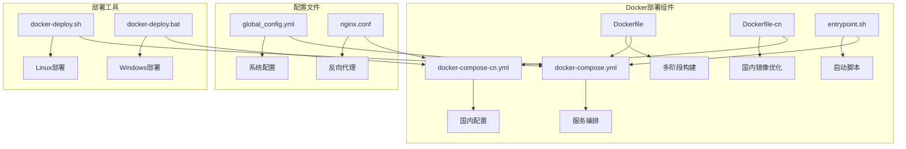
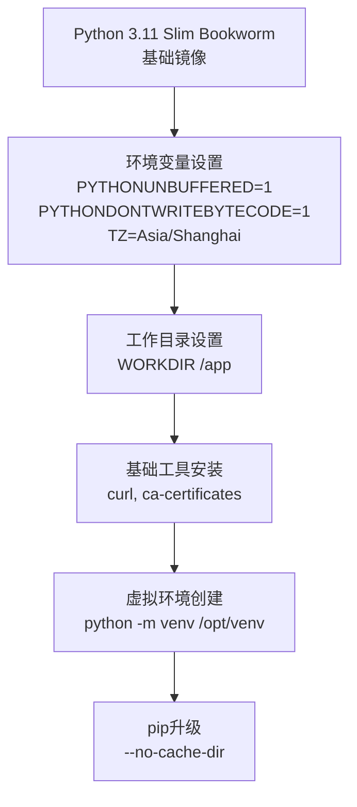
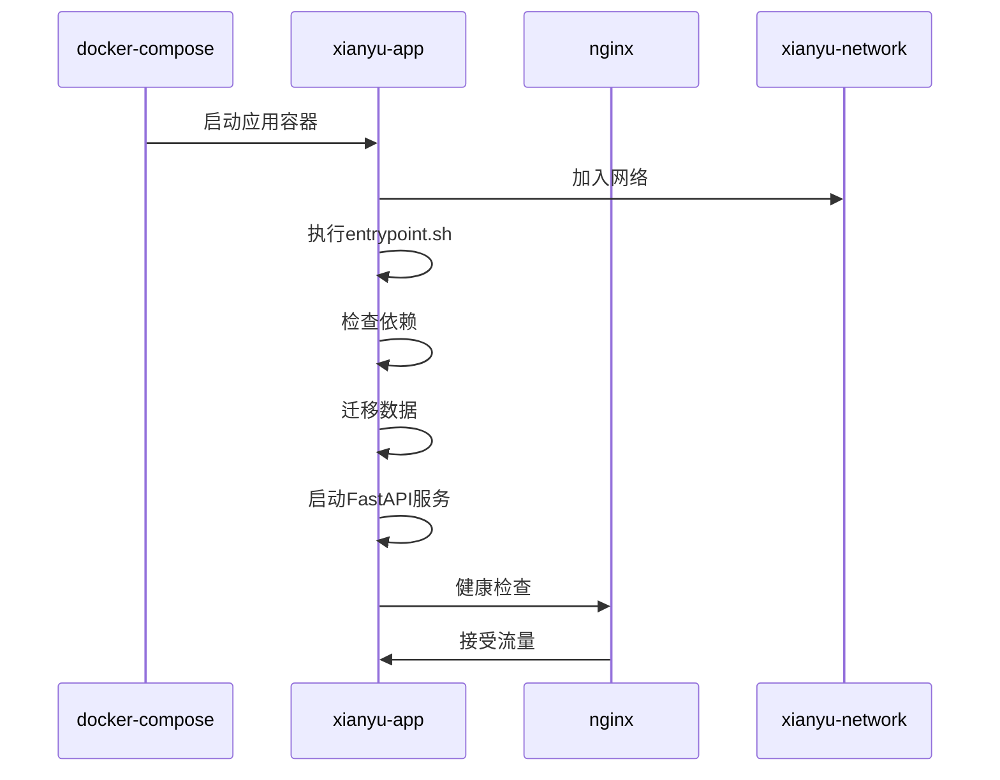
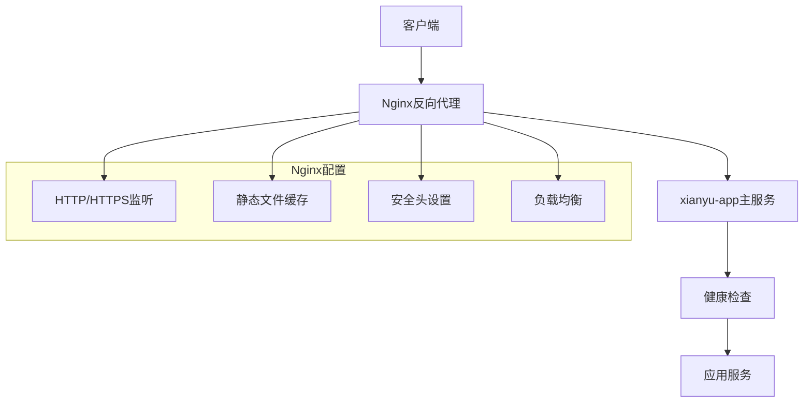
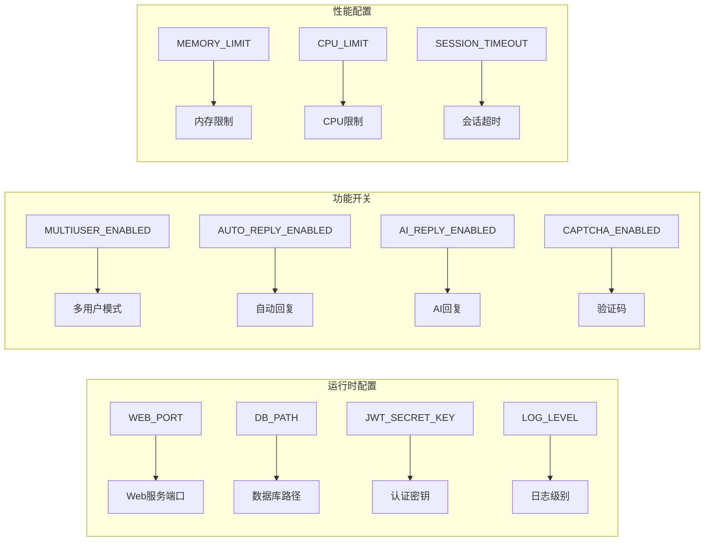
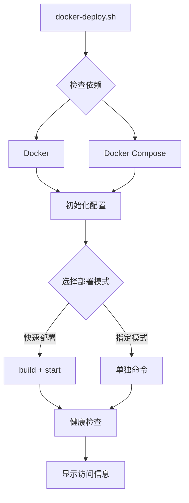
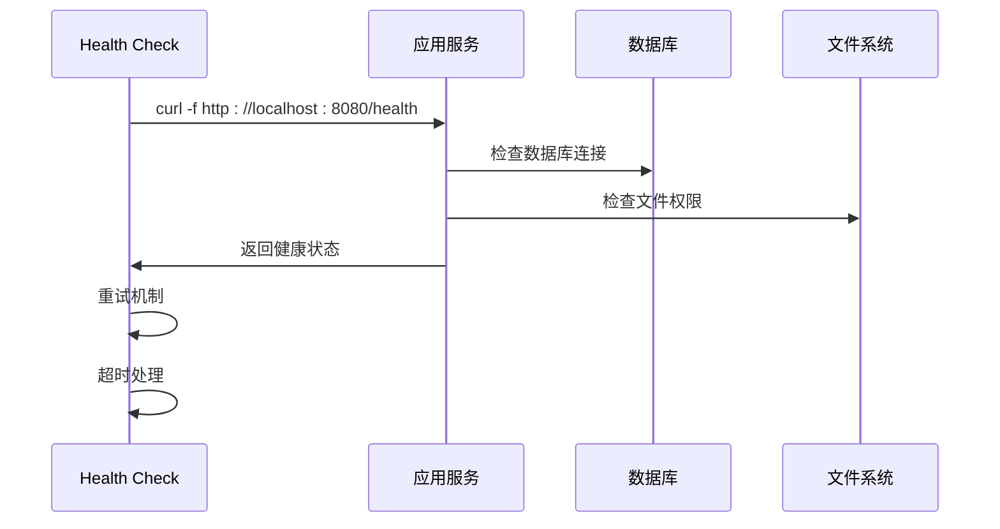
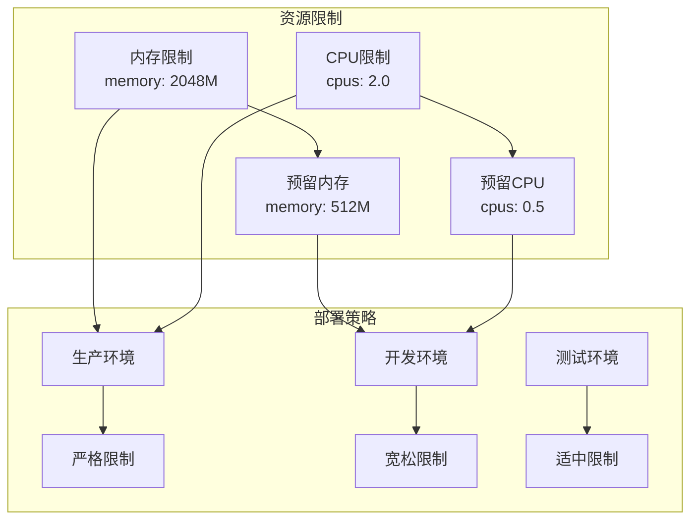
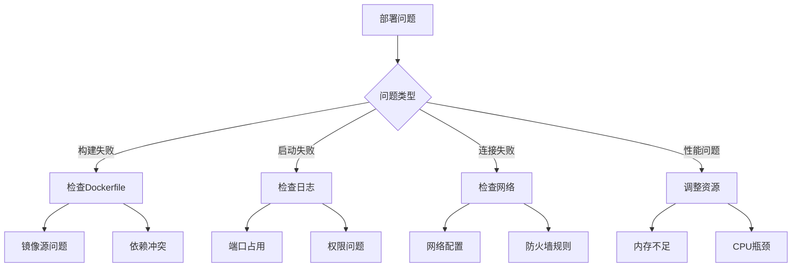

# Docker部署

<cite>
**本文档引用的文件**
- [Dockerfile](file://Dockerfile)
- [Dockerfile-cn](file://Dockerfile-cn)
- [docker-compose.yml](file://docker-compose.yml)
- [docker-compose-cn.yml](file://docker-compose-cn.yml)
- [entrypoint.sh](file://entrypoint.sh)
- [requirements.txt](file://requirements.txt)
- [docker-deploy.sh](file://docker-deploy.sh)
- [docker-deploy.bat](file://docker-deploy.bat)
- [nginx/nginx.conf](file://nginx/nginx.conf)
- [global_config.yml](file://global_config.yml)
</cite>

## 目录
1. [简介](#简介)
2. [项目结构概览](#项目结构概览)
3. [Dockerfile分析](#dockerfile分析)
4. [多阶段构建策略](#多阶段构建策略)
5. [镜像源优化对比](#镜像源优化对比)
6. [docker-compose服务编排](#dockercompose服务编排)
7. [环境变量配置](#环境变量配置)
8. [部署脚本详解](#部署脚本详解)
9. [健康检查机制](#健康检查机制)
10. [生产环境配置](#生产环境配置)
11. [故障排除指南](#故障排除指南)

## 简介

本文档详细说明了闲鱼自动回复系统的Docker部署流程，涵盖完整的容器化解决方案。该系统采用多阶段Docker构建策略，支持国内外两种镜像源优化方案，并提供了完整的服务编排配置。

## 项目结构概览

**图表来源**
- [Dockerfile](file://Dockerfile#L1-L138)
- [Dockerfile-cn](file://Dockerfile-cn#L1-L144)
- [docker-compose.yml](file://docker-compose.yml#L1-L106)

## Dockerfile分析

### 基础镜像选择

系统使用Python 3.11 Slim Bookworm作为基础镜像，提供轻量级的运行环境：

- **基础镜像特性**：最小化安装，减少攻击面
- **时区配置**：预设Asia/Shanghai时区
- **环境变量**：设置PYTHONUNBUFFERED、PYTHONDONTWRITEBYTECODE等优化参数

### 核心依赖安装

Dockerfile包含了完整的运行时依赖安装：

- **Node.js和npm**：支持前端JavaScript执行
- **图像处理库**：Pillow、OpenCV相关依赖
- **Playwright浏览器**：支持自动化操作
- **系统工具**：curl、ca-certificates等基础工具

**章节来源**
- [Dockerfile](file://Dockerfile#L1-L138)
- [Dockerfile-cn](file://Dockerfile-cn#L1-L144)

## 多阶段构建策略

### Base阶段（基础层）

**图表来源**
- [Dockerfile](file://Dockerfile#L2-L30)
- [Dockerfile-cn](file://Dockerfile-cn#L2-L42)

### Builder阶段（构建层）

Builder阶段专注于Python依赖的安装和项目文件的准备：

- **虚拟环境隔离**：使用独立的venv避免污染
- **依赖安装**：基于requirements.txt精确安装
- **项目复制**：仅复制必要的项目文件

### Runtime阶段（运行层）

Runtime阶段构建最终的运行镜像：

- **精简依赖**：仅保留运行时必需的系统库
- **权限设置**：创建必要的目录并设置权限
- **健康检查**：配置完整的健康检查机制

**章节来源**
- [Dockerfile](file://Dockerfile#L14-L138)
- [Dockerfile-cn](file://Dockerfile-cn#L22-L144)

## 镜像源优化对比

### 国际版Dockerfile（Dockerfile）

国际版本使用标准的Debian镜像源，适合海外部署：

### 国内版Dockerfile（Dockerfile-cn）

国内版本针对中国网络环境进行了优化：

**图表来源**
- [Dockerfile](file://Dockerfile#L14-L20)
- [Dockerfile-cn](file://Dockerfile-cn#L14-L26)

### 优化效果对比

| 优化项目 | 国际版 | 国内版 |
|---------|--------|--------|
| apt源 | deb.debian.org | mirrors.ustc.edu.cn |
| pip源 | PyPI官方源 | TUNA PyPI源 |
| 构建速度 | 中等 | 显著提升 |
| 网络稳定性 | 一般 | 显著改善 |
| 适用场景 | 海外部署 | 国内部署 |

**章节来源**
- [Dockerfile](file://Dockerfile#L14-L20)
- [Dockerfile-cn](file://Dockerfile-cn#L14-L26)

## docker-compose服务编排

### 主服务配置（xianyu-app）

主服务配置了完整的生产环境参数：

**图表来源**
- [docker-compose.yml](file://docker-compose.yml#L2-L106)
- [entrypoint.sh](file://entrypoint.sh#L1-L94)

### 网络配置

系统使用自定义桥接网络`xianyu-network`：

- **网络驱动**：bridge模式
- **容器间通信**：通过服务名称直接访问
- **端口映射**：8080端口映射到主机

### 卷挂载策略

| 卷类型 | 挂载路径 | 说明 |
|--------|----------|------|
| 数据卷 | ./data:/app/data | 数据库文件持久化 |
| 日志卷 | ./logs:/app/logs | 应用日志保存 |
| 配置卷 | ./global_config.yml:/app/global_config.yml | 配置文件只读挂载 |
| 备份卷 | ./backups:/app/backups | 备份文件存储 |

### 可选Nginx反向代理

系统支持可选的Nginx反向代理配置：

**图表来源**
- [docker-compose.yml](file://docker-compose.yml#L79-L96)
- [nginx/nginx.conf](file://nginx/nginx.conf#L1-L124)

**章节来源**
- [docker-compose.yml](file://docker-compose.yml#L1-L106)
- [docker-compose-cn.yml](file://docker-compose-cn.yml#L1-L106)

## 环境变量配置

### 核心环境变量

系统通过环境变量实现了灵活的配置管理：

**图表来源**
- [docker-compose.yml](file://docker-compose.yml#L22-L59)

### 动态注入机制

环境变量通过以下方式注入：

1. **docker-compose.yml**：主要配置入口
2. **.env文件**：环境特定配置
3. **默认值**：每个变量都有合理的默认值
4. **条件配置**：根据部署环境自动调整

### 关键配置项说明

| 变量名 | 默认值 | 说明 |
|--------|--------|------|
| WEB_PORT | 8080 | Web服务监听端口 |
| DB_PATH | /app/data/xianyu_data.db | SQLite数据库路径 |
| JWT_SECRET_KEY | default-secret-key | JWT签名密钥 |
| MULTIUSER_ENABLED | true | 启用多用户功能 |
| MEMORY_LIMIT | 2048M | 内存使用限制 |
| CPU_LIMIT | 2.0 | CPU使用限制 |

**章节来源**
- [docker-compose.yml](file://docker-compose.yml#L22-L59)
- [docker-compose-cn.yml](file://docker-compose-cn.yml#L22-L59)

## 部署脚本详解

### Linux部署脚本（docker-deploy.sh）

Linux版本提供了完整的部署管理功能：

**图表来源**
- [docker-deploy.sh](file://docker-deploy.sh#L1-L361)

### Windows部署脚本（docker-deploy.bat）

Windows版本提供了类似的部署功能：

- **兼容性**：完全兼容Windows CMD环境
- **彩色输出**：使用Windows兼容的输出格式
- **交互式**：支持交互式镜像源选择

### 部署命令对比

| 功能 | Linux脚本 | Windows脚本 |
|------|-----------|-------------|
| 快速部署 | `./docker-deploy.sh` | `docker-deploy.bat` |
| 构建镜像 | `./docker-deploy.sh build` | `docker-deploy.bat build` |
| 启动服务 | `./docker-deploy.sh start` | `docker-deploy.bat start` |
| 健康检查 | `./docker-deploy.sh health` | `docker-deploy.bat` |
| 状态查看 | `./docker-deploy.sh status` | `docker-deploy.bat status` |

**章节来源**
- [docker-deploy.sh](file://docker-deploy.sh#L1-L361)
- [docker-deploy.bat](file://docker-deploy.bat#L1-L229)

## 健康检查机制

### 健康检查配置

系统实现了多层次的健康检查机制：

**图表来源**
- [Dockerfile](file://Dockerfile#L131-L134)
- [docker-compose.yml](file://docker-compose.yml#L63-L68)

### 健康检查参数

| 参数 | 值 | 说明 |
|------|-----|------|
| interval | 30s | 检查间隔时间 |
| timeout | 10s | 单次检查超时 |
| start_period | 40s | 启动后等待时间 |
| retries | 3 | 最大重试次数 |

### 实现原理

健康检查通过以下步骤实现：

1. **HTTP请求**：向应用的`/health`端点发送GET请求
2. **响应验证**：检查HTTP状态码是否为200
3. **超时控制**：单次检查不超过10秒
4. **重试机制**：最多重试3次，每次间隔30秒

### 超时参数调优建议

根据不同的部署环境，建议调整以下参数：

- **开发环境**：`interval: 10s, timeout: 5s`
- **测试环境**：`interval: 20s, timeout: 8s`
- **生产环境**：`interval: 30s, timeout: 10s`

**章节来源**
- [Dockerfile](file://Dockerfile#L131-L134)
- [Dockerfile-cn](file://Dockerfile-cn#L138-L140)
- [docker-compose.yml](file://docker-compose.yml#L63-L68)

## 生产环境配置

### 资源限制配置

系统提供了完善的资源限制配置：

**图表来源**
- [docker-compose.yml](file://docker-compose.yml#L70-L77)

### 安全配置建议

1. **用户权限**：生产环境中应配置非root用户
2. **网络隔离**：使用专用网络进行容器间通信
3. **数据保护**：定期备份重要数据
4. **日志监控**：配置集中式日志收集

### 性能优化配置

| 配置项 | 开发环境 | 生产环境 |
|--------|----------|----------|
| 内存限制 | 1024M | 2048M |
| CPU限制 | 1.0 | 2.0 |
| 日志级别 | DEBUG | INFO |
| 并发连接 | 100 | 500 |

**章节来源**
- [docker-compose.yml](file://docker-compose.yml#L70-L77)
- [docker-compose-cn.yml](file://docker-compose-cn.yml#L70-L77)

## 故障排除指南

### 常见问题及解决方案

### 调试命令

| 场景 | 命令 | 说明 |
|------|------|------|
| 查看服务状态 | `docker-compose ps` | 检查容器运行状态 |
| 查看日志 | `docker-compose logs` | 查看应用日志 |
| 进入容器 | `docker exec -it xianyu-auto-reply bash` | 进入容器调试 |
| 资源使用 | `docker stats` | 查看资源使用情况 |

### 性能监控

系统支持多种监控方式：

1. **Docker内置监控**：`docker stats`命令
2. **应用内部监控**：健康检查端点
3. **系统监控**：外部监控工具集成

**章节来源**
- [docker-deploy.sh](file://docker-deploy.sh#L182-L203)
- [docker-deploy.bat](file://docker-deploy.bat#L118-L131)

## 总结

闲鱼自动回复系统的Docker部署方案提供了完整的容器化解决方案：

1. **多阶段构建**：优化构建流程，减少镜像大小
2. **双镜像源**：支持国际和国内两种部署场景
3. **服务编排**：完整的docker-compose配置
4. **健康检查**：可靠的健康监控机制
5. **部署脚本**：跨平台的自动化部署工具

该部署方案适用于各种环境，从开发测试到生产部署都能提供稳定可靠的服务保障。