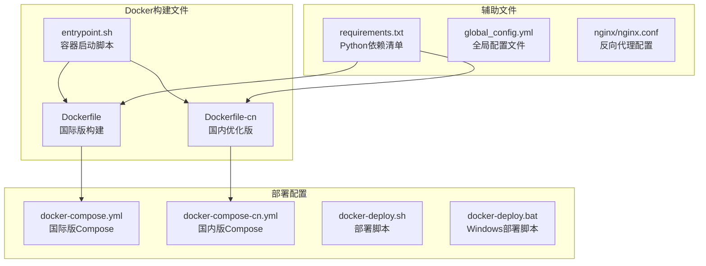
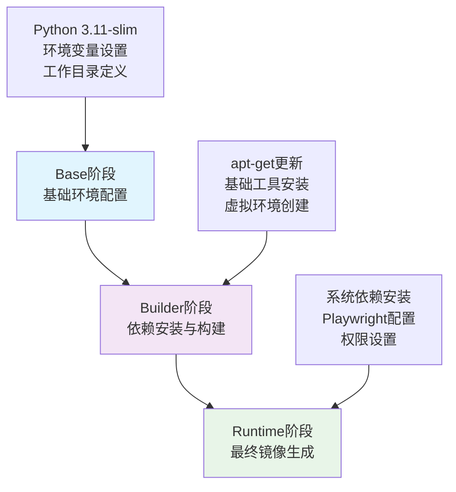
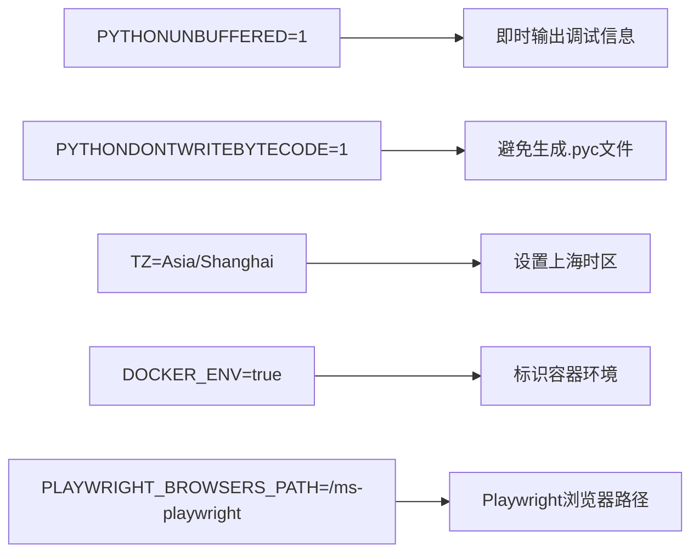
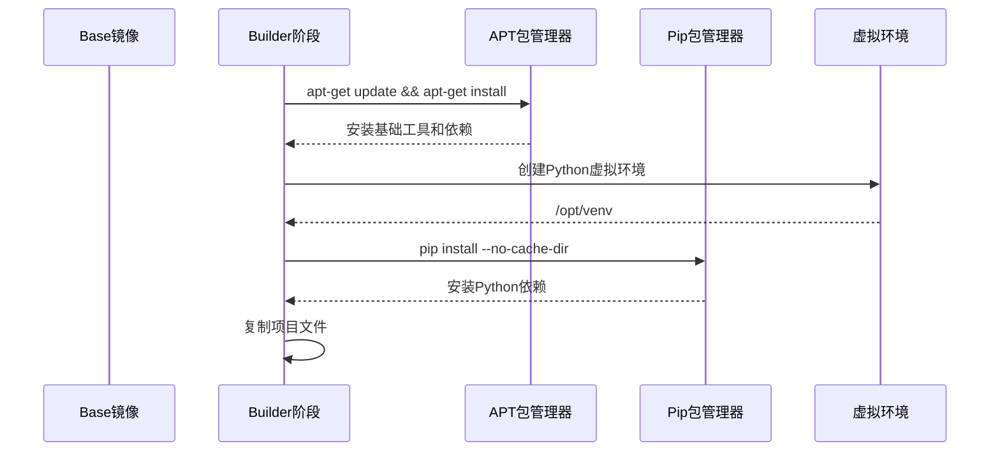
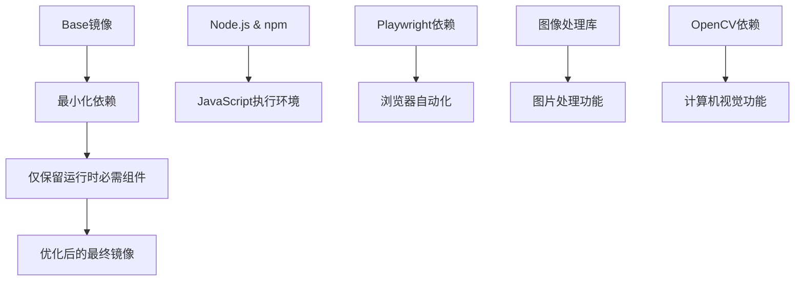
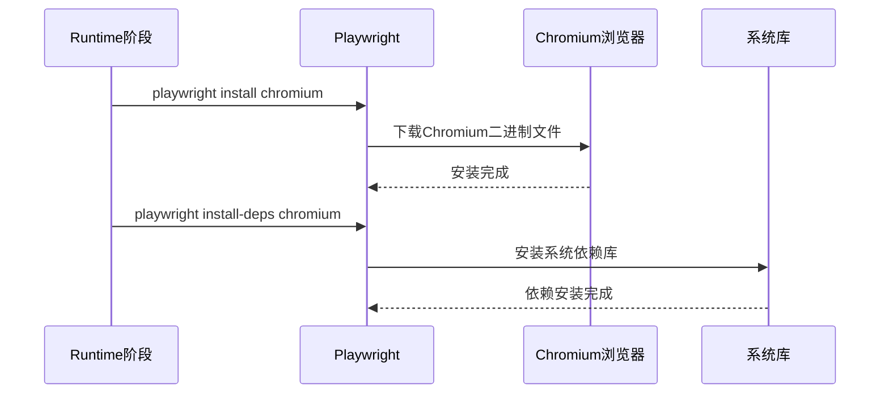
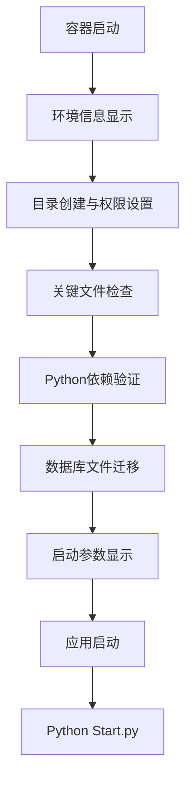

# Docker镜像构建

<cite>
**本文档引用的文件**
- [Dockerfile](file://Dockerfile)
- [Dockerfile-cn](file://Dockerfile-cn)
- [entrypoint.sh](file://entrypoint.sh)
- [requirements.txt](file://requirements.txt)
- [docker-compose.yml](file://docker-compose.yml)
- [docker-compose-cn.yml](file://docker-compose-cn.yml)
- [README.md](file://README.md)
</cite>

## 目录
1. [简介](#简介)
2. [项目结构概览](#项目结构概览)
3. [Dockerfile多阶段构建架构](#dockerfile多阶段构建架构)
4. [Base阶段详解](#base阶段详解)
5. [Builder阶段详解](#builder阶段详解)
6. [Runtime阶段详解](#runtime阶段详解)
7. [Dockerfile-CN优化分析](#dockerfile-cn优化分析)
8. [Playwright浏览器安装](#playwright浏览器安装)
9. [Entrypoint启动脚本](#entrypoint启动脚本)
10. [构建命令与优化建议](#构建命令与优化建议)
11. [总结](#总结)

## 简介

本文档详细解析了闲鱼自动回复系统的Docker镜像构建流程，该系统采用了先进的多阶段构建策略，通过精心设计的Dockerfile实现了高效的容器化部署。系统支持国际版和国内优化版两个版本，针对不同的网络环境提供了最优的构建配置。

## 项目结构概览

该项目的Docker相关文件组织结构清晰，体现了现代容器化应用的最佳实践：



**图表来源**
- [Dockerfile](file://Dockerfile#L1-L138)
- [Dockerfile-cn](file://Dockerfile-cn#L1-L144)
- [entrypoint.sh](file://entrypoint.sh#L1-L94)

## Dockerfile多阶段构建架构

系统采用了经典的三阶段构建模式，每个阶段都有明确的职责分工：



**图表来源**
- [Dockerfile](file://Dockerfile#L1-L138)

**章节来源**
- [Dockerfile](file://Dockerfile#L1-L138)
- [Dockerfile-cn](file://Dockerfile-cn#L1-L144)

## Base阶段详解

Base阶段是整个多阶段构建的基础，负责建立最小化的运行环境：

### 基础镜像选择
系统选择了`python:3.11-slim-bookworm`作为基础镜像，这一选择具有以下优势：
- **轻量化设计**：slim版本显著减少了镜像体积
- **Debian Bookworm**：基于最新的Debian稳定版本，提供长期支持
- **Python 3.11**：充分利用最新的Python语言特性

### 环境变量配置


**图表来源**
- [Dockerfile](file://Dockerfile#L5-L9)

### 工作目录定义
工作目录设置为`/app`，这是容器内的标准应用程序根目录，所有后续操作都在此目录下进行。

**章节来源**
- [Dockerfile](file://Dockerfile#L1-L13)

## Builder阶段详解

Builder阶段专注于依赖安装和环境准备，采用了多项优化策略：

### 依赖安装策略


**图表来源**
- [Dockerfile](file://Dockerfile#L15-L36)

### 缓存优化策略
- **--no-cache-dir**：避免pip缓存占用空间
- **apt-get clean**：清理APT缓存
- **rm -rf /var/lib/apt/lists/**：删除包索引文件

### 虚拟环境配置
系统创建了独立的Python虚拟环境`/opt/venv`，并通过环境变量PATH正确配置，确保应用运行时使用隔离的Python环境。

**章节来源**
- [Dockerfile](file://Dockerfile#L15-L36)

## Runtime阶段详解

Runtime阶段是最终的生产镜像构建阶段，实现了极致的镜像优化：

### 精简设计原则


**图表来源**
- [Dockerfile](file://Dockerfile#L41-L138)

### 系统依赖安装
Runtime阶段安装了丰富的系统依赖，涵盖多个功能领域：

#### 浏览器自动化依赖
- **Chromium浏览器**：核心浏览器引擎
- **X11相关库**：图形界面支持
- **GTK库**：桌面环境集成
- **音频支持**：libasound2

#### 图像处理依赖
- **libjpeg-dev, libpng-dev**：JPEG和PNG图像格式支持
- **libfreetype6-dev**：字体渲染支持
- **fonts-dejavu-core, fonts-liberation**：系统字体

#### OpenCV运行时依赖
- **libgl1**：OpenGL支持
- **libglib2.0-0**：GLib库支持

### 目录权限设置
系统创建了必要的目录并设置了适当的权限：
- `/app/logs`：日志文件目录
- `/app/data`：数据存储目录  
- `/app/backups`：备份文件目录
- `/app/static/uploads/images`：图片上传目录

**章节来源**
- [Dockerfile](file://Dockerfile#L41-L138)

## Dockerfile-CN优化分析

Dockerfile-CN是国内优化版本，针对中国用户的网络环境进行了特殊优化：

### 中科大镜像源替换


**图表来源**
- [Dockerfile-cn](file://Dockerfile-cn#L14-L20)

### pip源优化
通过设置`PIP_INDEX_URL`环境变量，将pip包安装源切换到清华大学TUNA镜像站，显著提升国内下载速度。

### 版本差异对比

| 特性 | Dockerfile | Dockerfile-cn |
|------|------------|---------------|
| APT源 | deb.debian.org | mirrors.ustc.edu.cn |
| pip源 | PyPI官方源 | https://pypi.tuna.tsinghua.edu.cn/simple |
| 版本信息 | version="2.2.0" | version="2.1.0" |
| 构建优化 | 通用优化 | 国内网络优化 |

**章节来源**
- [Dockerfile-cn](file://Dockerfile-cn#L1-L144)

## Playwright浏览器安装

系统集成了Playwright浏览器自动化框架，支持无头模式运行：

### 安装流程


**图表来源**
- [Dockerfile](file://Dockerfile#L115-L116)

### 无头模式支持
系统配置了完整的X11虚拟化环境：
- **Xvfb**：虚拟帧缓冲
- **x11vnc**：X11远程访问
- **fluxbox**：轻量级窗口管理器

**章节来源**
- [Dockerfile](file://Dockerfile#L115-L116)

## Entrypoint启动脚本

entrypoint.sh是容器启动的核心脚本，负责完整的初始化流程：

### 启动流程


**图表来源**
- [entrypoint.sh](file://entrypoint.sh#L1-L94)

### 关键功能
1. **环境验证**：检查Python版本、时区设置
2. **目录管理**：创建必要的目录结构
3. **权限配置**：设置适当的文件权限
4. **数据库迁移**：自动迁移旧版本数据文件
5. **依赖检查**：验证关键Python模块可用性

### 安全特性
- **禁用core dumps**：防止意外的core文件生成
- **权限最小化**：使用适当的文件权限
- **优雅启动**：通过exec确保信号正确传递

**章节来源**
- [entrypoint.sh](file://entrypoint.sh#L1-L94)

## 构建命令与优化建议

### 基本构建命令

#### 国际版构建
```bash
# 使用标准Dockerfile构建
docker build -f Dockerfile .

# 使用docker-compose构建
docker-compose -f docker-compose.yml build
```

#### 国内优化版构建
```bash
# 使用国内优化版Dockerfile
docker build -f Dockerfile-cn .

# 使用docker-compose-cn构建
docker-compose -f docker-compose-cn.yml build
```

### 构建参数优化

#### 缓存优化
```bash
# 启用构建缓存
docker build --cache-from xianyu-auto-reply:latest .

# 使用构建目标
docker build --target runtime .
```

#### 资源限制
```bash
# 限制构建资源
docker build --memory=2g --cpus=2 .
```

### 生产部署建议

#### Docker Compose部署
```bash
# 国际版部署
docker-compose -f docker-compose.yml up -d

# 国内版部署  
docker-compose -f docker-compose-cn.yml up -d
```

#### 环境变量配置
```bash
# 自定义配置示例
export WEB_PORT=8080
export TZ=Asia/Shanghai
export MEMORY_LIMIT=2048M
export CPU_LIMIT=2.0
```

**章节来源**
- [docker-compose.yml](file://docker-compose.yml#L1-L106)
- [docker-compose-cn.yml](file://docker-compose-cn.yml#L1-L106)

## 总结

闲鱼自动回复系统的Docker镜像构建展现了现代容器化应用的最佳实践：

### 架构优势
1. **多阶段构建**：清晰的职责分离，优化镜像体积
2. **环境隔离**：独立的Python虚拟环境，避免依赖冲突
3. **网络优化**：针对不同地区的专门优化版本
4. **自动化部署**：完整的CI/CD支持和一键部署能力

### 技术亮点
- **Playwright集成**：完整的浏览器自动化解决方案
- **多架构支持**：同时支持AMD64和ARM64架构
- **健康检查**：完善的容器健康监控
- **资源管理**：合理的内存和CPU资源配置

### 应用价值
该Docker镜像构建方案不仅适用于本项目，也为其他类似的应用提供了优秀的参考模板，展示了如何在保证功能完整性的同时实现高效的容器化部署。