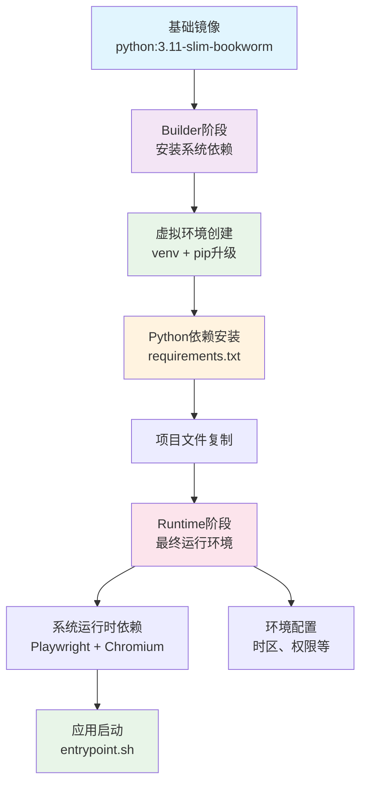
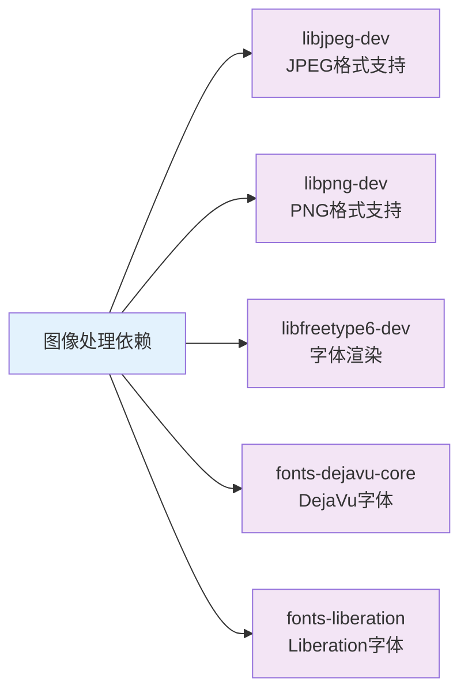
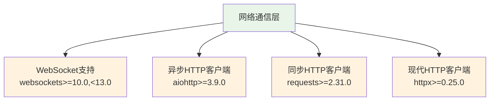
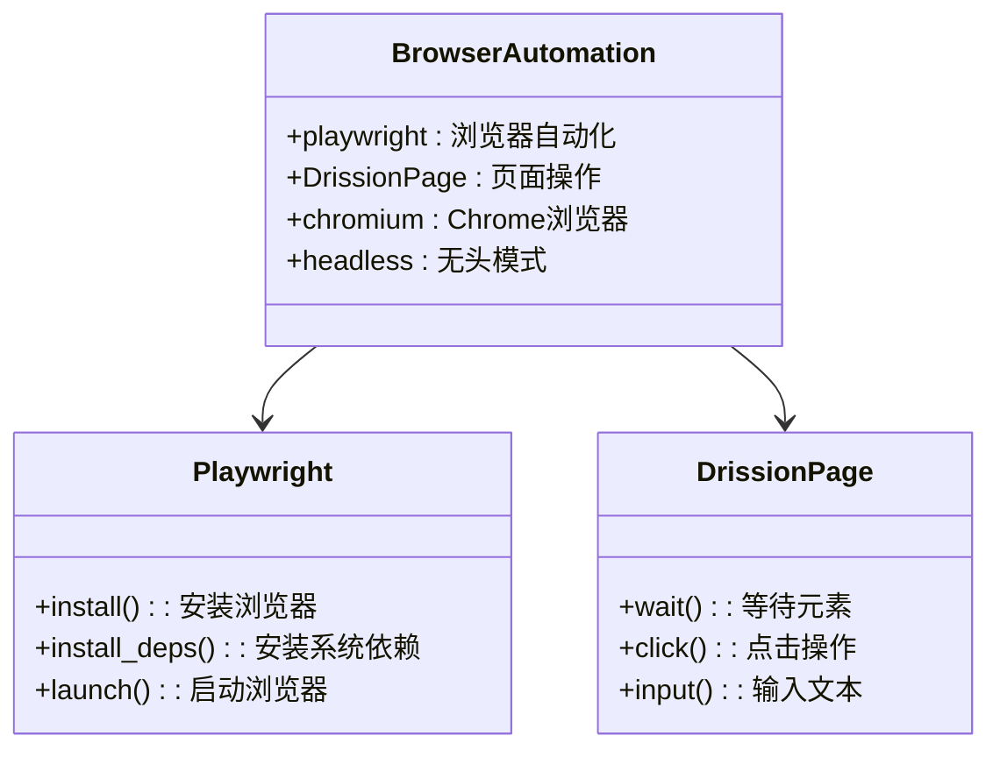
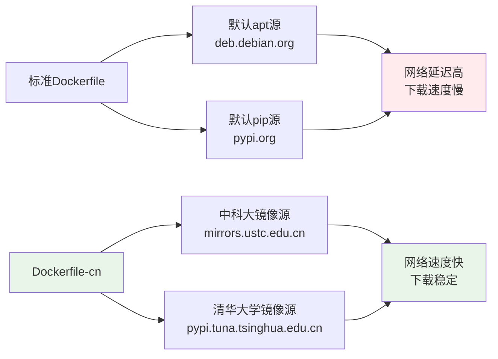
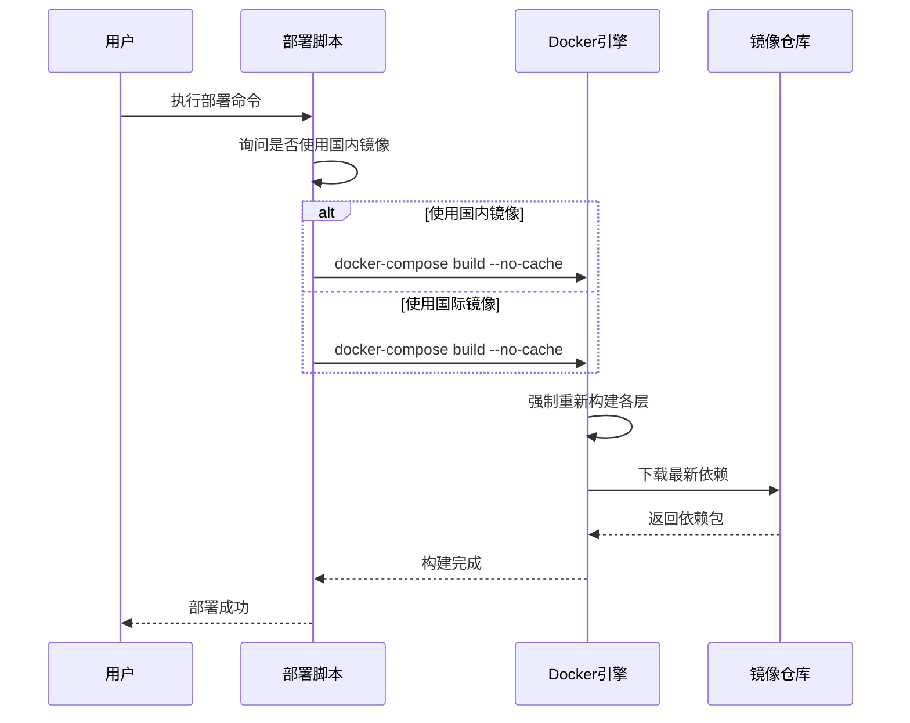
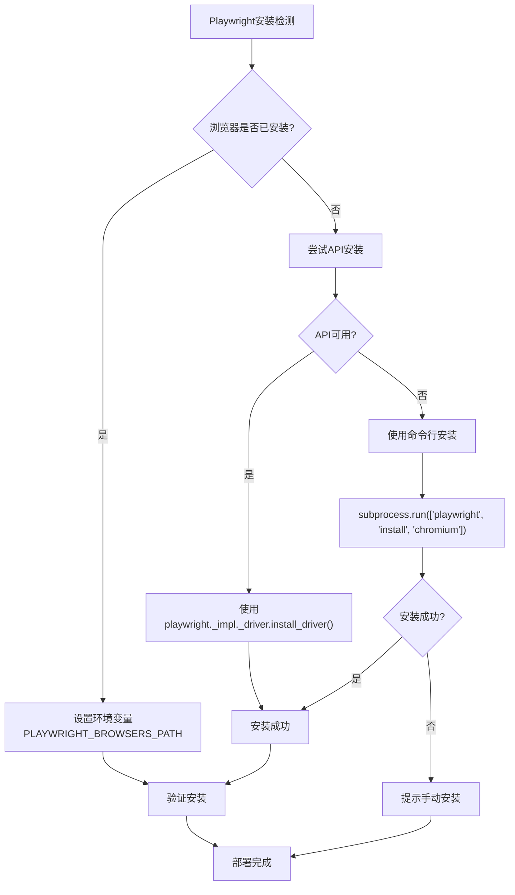
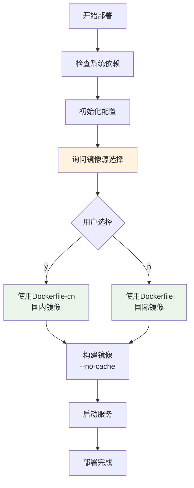
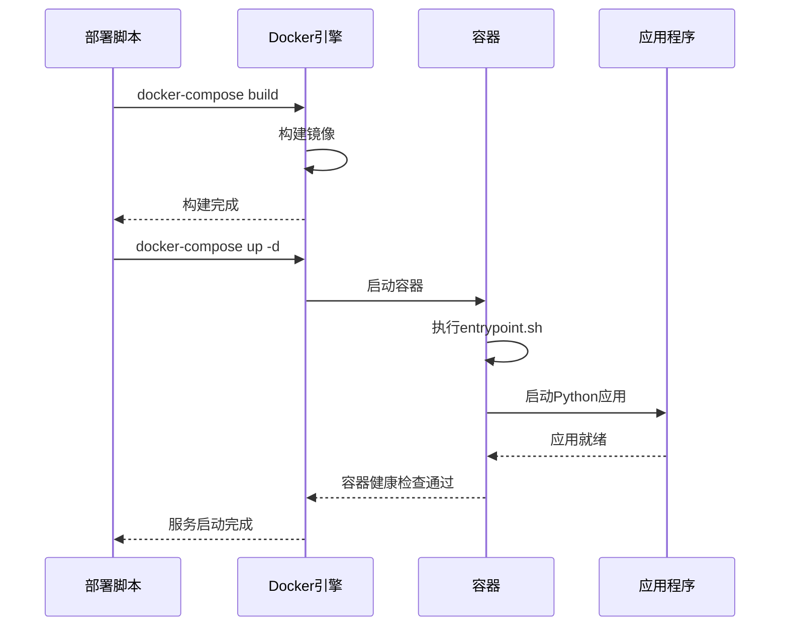
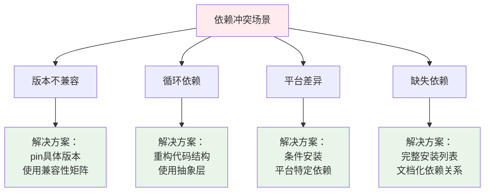

# 依赖管理与加速

<cite>
**本文档引用的文件**
- [Dockerfile](file://Dockerfile)
- [Dockerfile-cn](file://Dockerfile-cn)
- [requirements.txt](file://requirements.txt)
- [docker-deploy.sh](file://docker-deploy.sh)
- [docker-deploy.bat](file://docker-deploy.bat)
- [docker-compose.yml](file://docker-compose.yml)
- [docker-compose-cn.yml](file://docker-compose-cn.yml)
- [entrypoint.sh](file://entrypoint.sh)
</cite>

## 目录
1. [概述](#概述)
2. [Dockerfile依赖管理架构](#dockerfile依赖管理架构)
3. [系统级依赖详解](#系统级依赖详解)
4. [Python依赖组织与管理](#python依赖组织与管理)
5. [国内镜像优化策略](#国内镜像优化策略)
6. [构建流程与缓存机制](#构建流程与缓存机制)
7. [Playwright浏览器依赖管理](#playwright浏览器依赖管理)
8. [部署脚本中的依赖处理](#部署脚本中的依赖处理)
9. [依赖冲突排查与最佳实践](#依赖冲突排查与最佳实践)
10. [总结](#总结)

## 概述

该项目采用多层次的依赖管理机制，通过Docker容器化技术实现跨平台部署。整个依赖体系分为两个主要层次：系统级依赖（通过apt-get安装）和Python应用依赖（通过pip管理）。项目特别针对中国用户的网络环境进行了优化，提供了专门的国内镜像版本。

## Dockerfile依赖管理架构

### 分层构建设计

项目采用了经典的多阶段Docker构建模式，将依赖安装过程分为Builder阶段和Runtime阶段：



**图表来源**
- [Dockerfile](file://Dockerfile#L1-L138)
- [Dockerfile-cn](file://Dockerfile-cn#L1-L144)

### 环境变量配置

项目设置了多个关键环境变量来优化容器运行：

| 环境变量 | 值 | 作用 |
|---------|-----|------|
| `PYTHONUNBUFFERED=1` | 生效 | 禁用Python输出缓冲，便于实时查看日志 |
| `PYTHONDONTWRITEBYTECODE=1` | 生效 | 避免生成.pyc字节码文件，减少磁盘I/O |
| `TZ=Asia/Shanghai` | 生效 | 设置系统时区为上海 |
| `DOCKER_ENV=true` | 生效 | 标识运行在Docker环境中 |
| `PLAYWRIGHT_BROWSERS_PATH=/ms-playwright` | 生效 | 指定Playwright浏览器存储路径 |

**章节来源**
- [Dockerfile](file://Dockerfile#L4-L9)
- [Dockerfile-cn](file://Dockerfile-cn#L4-L9)

## 系统级依赖详解

### 图像处理依赖

项目需要一系列图像处理相关的系统库：



**图表来源**
- [Dockerfile](file://Dockerfile#L62-L67)

### Playwright浏览器依赖

Playwright需要大量的GTK+和X11相关库来支持无头浏览器渲染：

| 依赖类别 | 包名称 | 功能描述 |
|---------|--------|----------|
| **核心渲染** | `libnss3`, `libnspr4` | 网络安全服务支持 |
| **窗口管理** | `libatk-bridge2.0-0`, `libdrm2` | 辅助技术桥接和显示驱动 |
| **输入设备** | `libxkbcommon0`, `libxcomposite1` | 键盘布局和复合窗口 |
| **显示输出** | `libxrandr2`, `libgbm1` | 显示器和GPU内存管理 |
| **音频支持** | `libasound2` | ALSA音频系统 |
| **UI组件** | `libgtk-3-0`, `libgdk-pixbuf2.0-0` | GTK+图形界面库 |
| **光标和事件** | `libxcursor1`, `libxi6` | 光标和输入事件处理 |
| **字体渲染** | `libxft2`, `libxinerama1` | 字体和多显示器支持 |
| **辅助功能** | `libatspi2.0-0` | 应用程序支持技术协议 |

**章节来源**
- [Dockerfile](file://Dockerfile#L68-L94)

### 浏览器运行时依赖

除了Playwright的核心依赖外，还需要OpenCV运行时支持：

| 包名称 | 功能 | 必需性 |
|--------|------|--------|
| `libgl1` | OpenGL支持 | 必需 |
| `libglib2.0-0` | GLib核心库 | 必需 |

**章节来源**
- [Dockerfile](file://Dockerfile#L95-L102)

## Python依赖组织与管理

### 核心Web框架

项目使用FastAPI作为主要Web框架，配合高性能ASGI服务器：

| 依赖包 | 版本要求 | 用途 |
|--------|----------|------|
| `fastapi>=0.111.0` | 最低版本0.111.0 | Web API框架 |
| `uvicorn[standard]>=0.29.0` | 最低版本0.29.0 | ASGI服务器 |
| `pydantic>=2.7.0` | 最低版本2.7.0 | 数据验证和序列化 |

### 网络通信组件



**图表来源**
- [requirements.txt](file://requirements.txt#L14-L17)

### AI回复引擎

集成阿里云通义千问AI服务：

| 依赖包 | 版本要求 | 用途 |
|--------|----------|------|
| `openai>=1.50.0` | 最低版本1.50.0 | OpenAI兼容API客户端 |

### 浏览器自动化



**图表来源**
- [requirements.txt](file://requirements.txt#L41-L43)

### 加密与安全

| 依赖包 | 版本要求 | 用途 |
|--------|----------|------|
| `PyJWT>=2.8.0` | JSON Web Token支持 |
| `passlib[bcrypt]>=1.7.4` | 密码哈希算法 |
| `cryptography>=41.0.0` | 加密原语 |

**章节来源**
- [requirements.txt](file://requirements.txt#L46-L48)

## 国内镜像优化策略

### Dockerfile-cn优化特性

Dockerfile-cn针对中国用户网络环境进行了专门优化：



**图表来源**
- [Dockerfile-cn](file://Dockerfile-cn#L14-L20)
- [Dockerfile-cn](file://Dockerfile-cn#L25-L26)

### apt源替换策略

Dockerfile-cn通过智能检测和替换apt源：

| 检测目标 | 替换规则 | 效果 |
|---------|----------|------|
| `/etc/apt/sources.list.d/debian.sources` | `deb.debian.org` → `mirrors.ustc.edu.cn` | 多源配置替换 |
| `/etc/apt/sources.list` | `deb.debian.org` → `mirrors.ustc.edu.cn` | 主配置文件替换 |

### pip索引优化

通过设置环境变量优化Python包安装：

```bash
ENV PIP_INDEX_URL=https://pypi.tuna.tsinghua.edu.cn/simple
```

这种配置的优势：
- **速度提升**：清华大学镜像站提供更快的下载速度
- **稳定性保证**：国内CDN节点分布更广
- **网络友好**：减少DNS解析和连接超时

**章节来源**
- [Dockerfile-cn](file://Dockerfile-cn#L14-L26)

## 构建流程与缓存机制

### --no-cache参数的作用

部署脚本中大量使用`--no-cache`参数来确保依赖的纯净性：



**图表来源**
- [docker-deploy.sh](file://docker-deploy.sh#L80-L87)
- [docker-deploy.bat](file://docker-deploy.bat#L85-L92)

### 缓存清理策略

每个apt-get安装后都会执行清理命令：

```bash
apt-get clean && rm -rf /var/lib/apt/lists/* /tmp/* /var/tmp/*
```

这种策略的好处：
- **减小镜像体积**：移除临时文件和缓存
- **提高安全性**：避免敏感信息残留
- **保持一致性**：确保每次构建都是干净的

**章节来源**
- [Dockerfile](file://Dockerfile#L20-L24)
- [Dockerfile-cn](file://Dockerfile-cn#L28-L33)

## Playwright浏览器依赖管理

### 多种安装方式

项目实现了多种Playwright浏览器安装方式，确保在各种环境下都能正常工作：



**图表来源**
- [Start.py](file://Start.py#L176-L413)

### 环境变量管理

项目通过环境变量精确控制Playwright浏览器路径：

| 环境变量 | 默认值 | 作用 |
|---------|--------|------|
| `PLAYWRIGHT_BROWSERS_PATH` | `/ms-playwright` | 指定浏览器安装目录 |
| `PATH` | 包含虚拟环境路径 | 确保pip和Python命令可用 |

### 跨平台兼容性

代码实现了跨平台的浏览器查找和安装逻辑：

- **Linux系统**：检查`~/.cache/ms-playwright`
- **Windows系统**：检查`%LOCALAPPDATA%/ms-playwright`、`%APPDATA%/ms-playwright`
- **打包应用**：从临时目录提取浏览器文件

**章节来源**
- [Start.py](file://Start.py#L189-L221)
- [Start.py](file://Start.py#L238-L304)

## 部署脚本中的依赖处理

### 交互式镜像选择

部署脚本提供了智能的镜像源选择机制：



**图表来源**
- [docker-deploy.sh](file://docker-deploy.sh#L80-L87)
- [docker-deploy.bat](file://docker-deploy.bat#L85-L92)

### Docker Compose配置差异

两个docker-compose文件的主要区别在于使用的Dockerfile：

| 配置项 | docker-compose.yml | docker-compose-cn.yml |
|--------|-------------------|----------------------|
| **Dockerfile** | `Dockerfile` | `Dockerfile-cn` |
| **镜像名称** | `xianyu-auto-reply:latest` | `xianyu-auto-reply:latest` |
| **构建上下文** | 当前目录 | 当前目录 |
| **网络配置** | 标准网络 | 标准网络 |
| **卷挂载** | 标准数据卷 | 标准数据卷 |

**章节来源**
- [docker-compose.yml](file://docker-compose.yml#L2-L6)
- [docker-compose-cn.yml](file://docker-compose-cn.yml#L2-L6)

### 服务启动流程



**图表来源**
- [entrypoint.sh](file://entrypoint.sh#L1-L94)

**章节来源**
- [docker-deploy.sh](file://docker-deploy.sh#L80-L116)
- [docker-deploy.bat](file://docker-deploy.bat#L85-L131)

## 依赖冲突排查与最佳实践

### 版本锁定策略

项目在requirements.txt中明确指定了最低版本要求，这种做法的优势：

| 策略 | 优势 | 实施方法 |
|------|------|----------|
| **最小版本约束** | 确保兼容性 | `package>=1.0.0` |
| **范围版本** | 平衡稳定性和功能 | `package>=1.0.0,<2.0.0` |
| **固定版本** | 完全可重现 | `package==1.0.0` |

### 常见依赖冲突场景



### 最佳实践建议

1. **定期更新依赖**
   - 使用`pip list --outdated`检查过时包
   - 逐步更新，避免一次性升级过多依赖
   - 在测试环境中验证兼容性

2. **依赖审计**
   - 使用工具如`pip-audit`扫描安全漏洞
   - 定期审查依赖树，移除不必要的包
   - 关注依赖许可证兼容性

3. **构建缓存优化**
   - 利用Docker层缓存加速构建
   - 合理安排Dockerfile指令顺序
   - 使用`.dockerignore`文件排除不必要的文件

4. **环境隔离**
   - 为不同环境使用不同的依赖配置
   - 开发、测试、生产环境分离
   - 使用虚拟环境避免全局污染

### 依赖调试技巧

当遇到依赖问题时，可以采用以下调试方法：

| 问题类型 | 调试方法 | 工具推荐 |
|---------|----------|----------|
| **导入错误** | `python -c "import package"` | 直接测试导入 |
| **版本冲突** | `pip show package` | 查看安装详情 |
| **依赖树** | `pipdeptree` | 可视化依赖关系 |
| **冲突解决** | `pip check` | 检查依赖完整性 |

**章节来源**
- [requirements.txt](file://requirements.txt#L70-L84)

## 总结

该项目的依赖管理体系体现了现代软件工程的最佳实践：

1. **分层架构**：通过Docker多阶段构建实现清晰的依赖分离
2. **网络优化**：针对中国用户环境提供专门的镜像源优化
3. **自动化安装**：Playwright浏览器的智能安装和环境变量管理
4. **部署简化**：交互式部署脚本降低用户使用门槛
5. **质量保证**：严格的版本控制和缓存清理策略

这种多层次的依赖管理机制不仅确保了应用的稳定运行，还大大提升了开发和部署的效率。对于类似的项目，这套依赖管理方案提供了很好的参考价值。