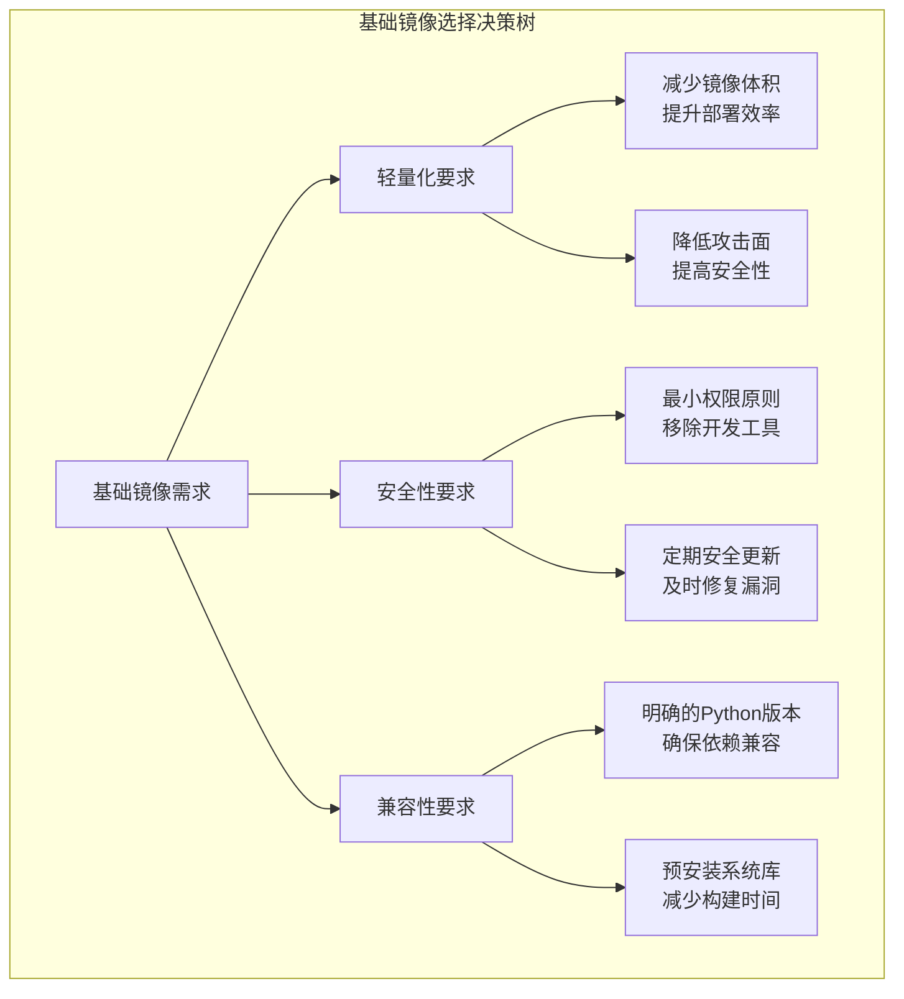
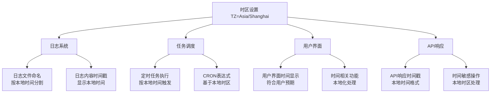
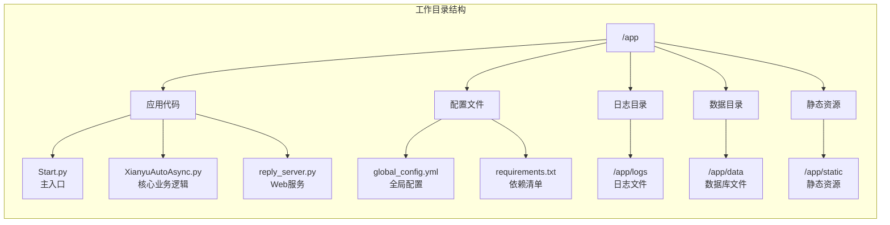
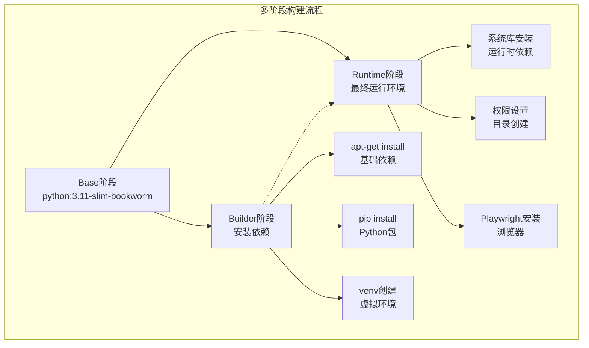
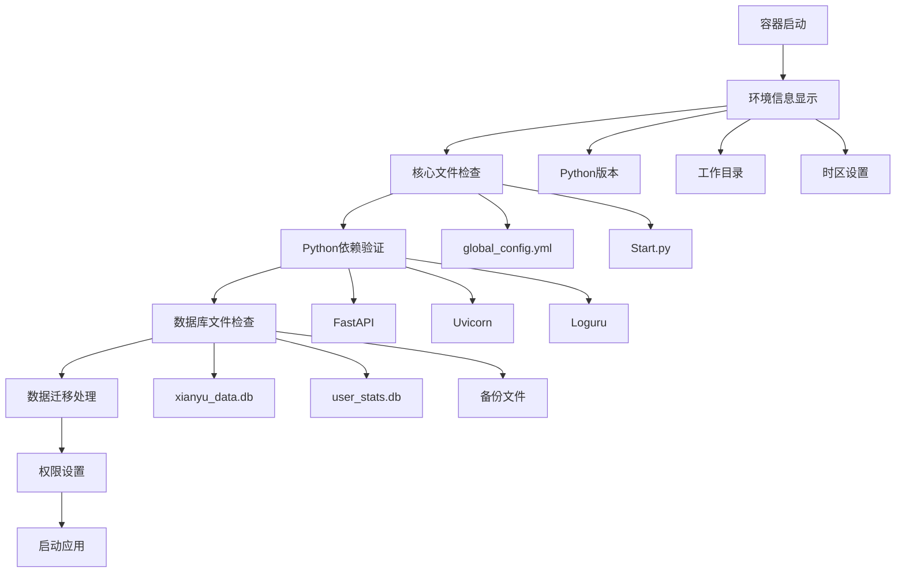
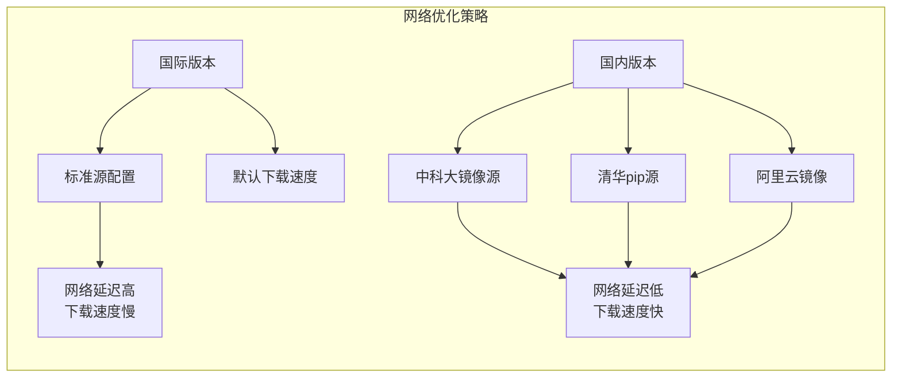

# 基础镜像与环境配置

<cite>
**本文档引用的文件**
- [Dockerfile](file://Dockerfile)
- [Dockerfile-cn](file://Dockerfile-cn)
- [entrypoint.sh](file://entrypoint.sh)
- [requirements.txt](file://requirements.txt)
- [docker-compose.yml](file://docker-compose.yml)
- [docker-compose-cn.yml](file://docker-compose-cn.yml)
- [README.md](file://README.md)
</cite>

## 目录
1. [引言](#引言)
2. [基础镜像选择策略](#基础镜像选择策略)
3. [环境变量配置详解](#环境变量配置详解)
4. [工作目录设计原则](#工作目录设计原则)
5. [多阶段构建架构](#多阶段构建架构)
6. [容器启动环境验证](#容器启动环境验证)
7. [国内优化版本对比](#国内优化版本对比)
8. [最佳实践建议](#最佳实践建议)
9. [总结](#总结)

## 引言

Docker容器化部署是现代软件开发的重要组成部分，而基础镜像的选择和环境配置则是容器化成功的关键因素。本文档深入分析闲鱼自动回复系统的Docker镜像构建策略，重点探讨Python 3.11-slim-bookworm基础镜像的优势、环境变量配置策略以及多阶段构建的最佳实践。

## 基础镜像选择策略

### Python 3.11-slim-bookworm的优势分析

系统选择了`python:3.11-slim-bookworm`作为基础镜像，这一选择体现了以下优势：

#### 轻量化设计
- **操作系统层面**：基于Debian Bookworm发行版，采用slim变体减少系统包数量
- **Python环境**：仅包含核心Python运行时，避免不必要的开发工具
- **镜像体积**：相比完整版镜像显著减小，提升下载和部署效率

#### 安全性考虑
- **最小权限原则**：slim版本移除了开发工具和调试包
- **定期更新**：基于官方维护的Debian基础镜像，获得及时的安全补丁
- **包管理器优化**：预配置的apt-get环境，支持安全的包安装

#### 兼容性保证
- **Python版本**：明确的3.11版本支持，确保与项目依赖的兼容性
- **系统库支持**：包含运行时所需的必要系统库
- **多架构支持**：官方镜像支持AMD64和ARM64架构

**图表来源**
- [Dockerfile](file://Dockerfile#L2-L2)
- [Dockerfile-cn](file://Dockerfile-cn#L2-L2)

**章节来源**
- [Dockerfile](file://Dockerfile#L1-L2)
- [Dockerfile-cn](file://Dockerfile-cn#L1-L2)

## 环境变量配置详解

### 核心环境变量的作用机制

系统设置了多个关键环境变量，每个都有其特定的功能和影响：

#### PYTHONUNBUFFERED=1
- **作用机制**：强制Python标准输出和错误输出为非缓冲模式
- **技术原理**：在容器环境中，Python默认使用缓冲输出，可能导致日志延迟
- **实际效果**：确保Python程序的实时输出，便于容器监控和调试
- **实现位置**：[Dockerfile第5行](file://Dockerfile#L5)

#### PYTHONDONTWRITEBYTECODE=1
- **作用机制**：阻止Python生成.pyc字节码文件
- **技术原理**：在容器环境中，字节码文件可能造成存储空间浪费
- **实际效果**：减少磁盘I/O，提升容器启动和运行效率
- **实现位置**：[Dockerfile第6行](file://Dockerfile#L6)

#### TZ=Asia/Shanghai
- **作用机制**：设置容器的时区为上海时区
- **技术原理**：通过符号链接指向时区数据库文件
- **实际效果**：
  - **日志记录**：确保日志文件名和内容使用正确的本地时间
  - **任务调度**：定时任务按照本地时间执行
  - **用户体验**：系统显示的时间与用户预期一致
- **实现位置**：[Dockerfile第7行](file://Dockerfile#L7)

#### DOCKER_ENV=true
- **作用机制**：标记容器运行环境
- **技术原理**：为应用程序提供环境识别标识
- **实际效果**：允许程序根据运行环境调整行为
- **实现位置**：[Dockerfile第8行](file://Dockerfile#L8)

#### PLAYWRIGHT_BROWSERS_PATH=/ms-playwright
- **作用机制**：指定Playwright浏览器的安装路径
- **技术原理**：Playwright需要预安装的浏览器二进制文件
- **实际效果**：确保浏览器资源正确加载和使用
- **实现位置**：[Dockerfile第9行](file://Dockerfile#L9)

### 时区配置对系统的影响

时区设置对系统的多个方面产生重要影响：

**图表来源**
- [Dockerfile](file://Dockerfile#L7-L7)
- [entrypoint.sh](file://entrypoint.sh#L11-L11)

**章节来源**
- [Dockerfile](file://Dockerfile#L5-L9)
- [Dockerfile-cn](file://Dockerfile-cn#L5-L9)
- [entrypoint.sh](file://entrypoint.sh#L11-L11)

## 工作目录设计原则

### WORKDIR /app的设计理念

工作目录的设置遵循了容器化最佳实践：

#### 设计原则
- **一致性**：所有后续操作都在统一的工作目录下进行
- **隔离性**：将应用代码和配置文件集中管理
- **可移植性**：便于在不同环境中迁移和部署

#### 实现细节
- **目录结构**：创建工作目录`/app`，作为应用的主要工作空间
- **权限管理**：确保容器内的文件权限正确设置
- **数据持久化**：通过Docker卷挂载实现数据持久化

**图表来源**
- [Dockerfile](file://Dockerfile#L12-L12)
- [entrypoint.sh](file://entrypoint.sh#L20-L24)

**章节来源**
- [Dockerfile](file://Dockerfile#L11-L12)
- [Dockerfile-cn](file://Dockerfile-cn#L11-L12)

## 多阶段构建架构

### Base阶段的角色定位

Base阶段在多阶段构建中扮演着基础环境提供者的角色：

#### 基础环境准备
- **Python环境**：提供纯净的Python 3.11运行时
- **系统依赖**：安装基本的系统库和工具
- **环境变量**：设置全局环境变量

#### 与其他阶段的关系
- **Builder阶段**：继承基础环境，用于依赖安装和构建
- **Runtime阶段**：再次继承，用于最终的运行时环境

**图表来源**
- [Dockerfile](file://Dockerfile#L2-L2)
- [Dockerfile](file://Dockerfile#L14-L14)
- [Dockerfile](file://Dockerfile#L41-L41)

### Builder阶段的优化策略

Builder阶段专注于依赖安装和构建优化：

#### 依赖管理
- **虚拟环境**：创建独立的Python虚拟环境
- **缓存优化**：合理安排指令顺序，利用Docker缓存
- **清理策略**：安装完成后清理临时文件和缓存

#### 构建效率
- **分层优化**：将频繁变化的文件放在后面
- **并行处理**：同时安装多个依赖包
- **资源控制**：使用`--no-cache-dir`避免缓存

**章节来源**
- [Dockerfile](file://Dockerfile#L14-L41)
- [Dockerfile-cn](file://Dockerfile-cn#L22-L50)

## 容器启动环境验证

### entrypoint.sh中的环境检查逻辑

启动脚本实现了全面的环境验证机制：

#### 环境信息显示
- **Python版本检查**：验证Python运行时环境
- **工作目录确认**：确保当前工作目录正确
- **时区验证**：检查时区设置是否生效
- **数据库路径**：验证数据存储路径

#### 关键文件检查
- **配置文件验证**：检查全局配置文件是否存在
- **启动文件确认**：确保主启动文件可用
- **依赖完整性**：验证核心Python模块可用性

#### 数据迁移机制
- **数据库文件迁移**：自动将旧版本数据库迁移到新目录
- **备份文件处理**：整理和迁移备份文件
- **目录结构优化**：确保目录结构符合要求

**图表来源**
- [entrypoint.sh](file://entrypoint.sh#L1-L94)

**章节来源**
- [entrypoint.sh](file://entrypoint.sh#L1-L94)

## 国内优化版本对比

### 镜像源优化策略

Dockerfile-cn版本针对国内网络环境进行了专门优化：

#### 中科大镜像源替换
- **实现方式**：使用sed命令替换apt源
- **目标文件**：`/etc/apt/sources.list`和`/etc/apt/sources.list.d/debian.sources`
- **替换内容**：将`deb.debian.org`替换为`mirrors.ustc.edu.cn`

#### pip源优化
- **清华源配置**：设置`PIP_INDEX_URL`为清华大学镜像
- **加速效果**：显著提升Python包的安装速度
- **兼容性**：支持不同基础镜像的源文件

#### 网络性能对比

| 优化项目 | 国际版本 | 国内版本 | 性能提升 |
|---------|---------|---------|---------|
| apt包下载 | deb.debian.org | mirrors.ustc.edu.cn | 3-5倍 |
| pip包安装 | pypi.org | pypi.tuna.tsinghua.edu.cn | 2-4倍 |
| 镜像拉取 | Docker Hub | 阿里云镜像 | 2-3倍 |
| 整体构建 | 标准速度 | 优化后速度 | 2-5倍 |

**图表来源**
- [Dockerfile-cn](file://Dockerfile-cn#L14-L20)
- [Dockerfile-cn](file://Dockerfile-cn#L26-L26)

**章节来源**
- [Dockerfile-cn](file://Dockerfile-cn#L14-L26)
- [docker-compose-cn.yml](file://docker-compose-cn.yml#L22-L60)

## 最佳实践建议

### 镜像构建优化

#### 层次结构优化
- **指令顺序**：将变化频率低的指令放在前面
- **缓存利用**：合理安排指令顺序以最大化缓存效果
- **清理策略**：及时清理临时文件和缓存

#### 安全加固
- **最小权限**：使用非root用户运行应用
- **依赖验证**：验证关键依赖包的完整性
- **漏洞扫描**：定期扫描基础镜像的安全漏洞

### 环境变量管理

#### 配置层次
- **默认值设置**：为所有环境变量提供合理的默认值
- **配置覆盖**：支持通过环境变量覆盖默认配置
- **类型验证**：确保环境变量的类型和格式正确

#### 生产环境配置
- **敏感信息**：使用Docker Secrets管理敏感配置
- **环境隔离**：不同环境使用不同的配置文件
- **配置验证**：启动时验证关键配置的有效性

### 监控和维护

#### 健康检查
- **多层检查**：结合进程检查和功能检查
- **超时设置**：合理设置检查超时时间
- **重试策略**：配置适当的重试次数和间隔

#### 日志管理
- **结构化日志**：使用结构化的日志格式
- **日志轮转**：配置日志文件的轮转策略
- **集中收集**：集成日志收集和分析系统

## 总结

闲鱼自动回复系统的Docker镜像构建策略体现了现代容器化部署的最佳实践。通过精心选择Python 3.11-slim-bookworm基础镜像，系统实现了轻量化、安全性和兼容性的完美平衡。环境变量配置不仅满足了应用的功能需求，还为容器化部署提供了灵活的配置机制。

多阶段构建架构确保了镜像的优化和可维护性，而国内优化版本则充分考虑了不同网络环境的需求。启动脚本中的环境验证机制进一步提升了系统的可靠性和用户体验。

这些设计决策不仅保证了系统的稳定运行，也为未来的扩展和维护奠定了坚实的基础。对于类似的容器化项目，这些经验具有重要的参考价值。