# 多阶段构建优化

<cite>
**本文档引用的文件**
- [Dockerfile](file://Dockerfile)
- [entrypoint.sh](file://entrypoint.sh)
- [requirements.txt](file://requirements.txt)
- [docker-compose.yml](file://docker-compose.yml)
- [Start.py](file://Start.py)
- [reply_server.py](file://reply_server.py)
- [README.md](file://README.md)
</cite>

## 目录
1. [项目概述](#项目概述)
2. [多阶段构建架构](#多阶段构建架构)
3. [Builder阶段深度分析](#builder阶段深度分析)
4. [Runtime阶段深度分析](#runtime阶段深度分析)
5. [健康检查机制](#健康检查机制)
6. [容器启动流程](#容器启动流程)
7. [性能优化策略](#性能优化策略)
8. [安全性和最佳实践](#安全性和最佳实践)
9. [故障排除指南](#故障排除指南)
10. [总结](#总结)

## 项目概述

本文档深入分析了一个基于Docker多阶段构建的企业级闲鱼自动回复系统的架构设计与优化策略。该系统采用现代化的容器化部署方案，通过精心设计的多阶段构建过程实现了构建环境与运行时环境的有效分离，显著提升了系统的安全性、性能和可维护性。

系统的核心特点包括：
- **多阶段构建**：清晰分离构建依赖与运行时环境
- **模块化设计**：支持自动回复、自动发货、商品管理等核心功能
- **容器化部署**：基于Docker的标准化部署方案
- **健康监控**：完善的健康检查机制和系统监控
- **安全保护**：多层次的安全防护和权限控制

## 多阶段构建架构

### 整体架构设计

该系统采用了经典的三阶段Docker构建架构，每个阶段都有明确的职责和优化目标：

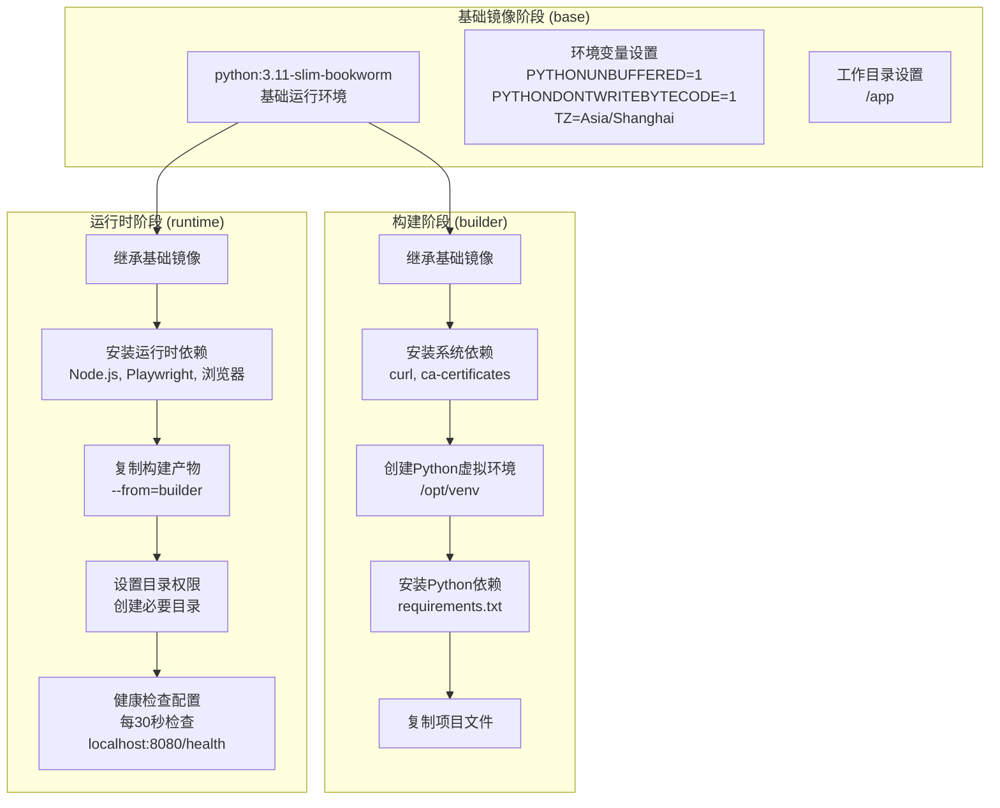

**图表来源**
- [Dockerfile](file://Dockerfile#L1-L138)

### 阶段间关系

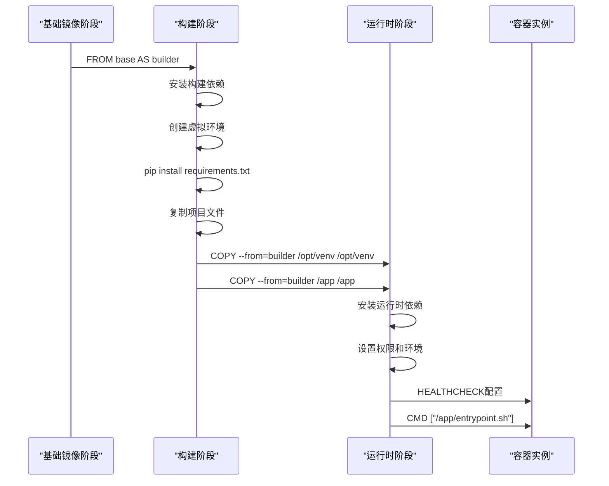

**图表来源**
- [Dockerfile](file://Dockerfile#L14-L138)

**章节来源**
- [Dockerfile](file://Dockerfile#L1-L138)

## Builder阶段深度分析

### 基础环境准备

Builder阶段从基础镜像开始，建立了完整的Python开发环境：

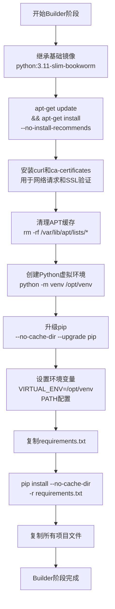

**图表来源**
- [Dockerfile](file://Dockerfile#L15-L36)

### Python虚拟环境管理

Builder阶段的关键优化在于虚拟环境的创建和管理：

| 优化策略 | 实现方式 | 优势 |
|---------|---------|------|
| 虚拟环境隔离 | `python -m venv /opt/venv` | 避免系统包冲突，确保依赖隔离 |
| pip优化 | `--no-cache-dir --upgrade pip` | 减少镜像体积，使用最新pip版本 |
| 环境变量配置 | `VIRTUAL_ENV=/opt/venv` 和 PATH设置 | 确保后续阶段使用正确的Python环境 |
| 依赖安装优化 | `--no-cache-dir` 参数 | 避免pip缓存，减少镜像层数 |

### 依赖管理策略

系统使用requirements.txt进行精确的依赖管理：

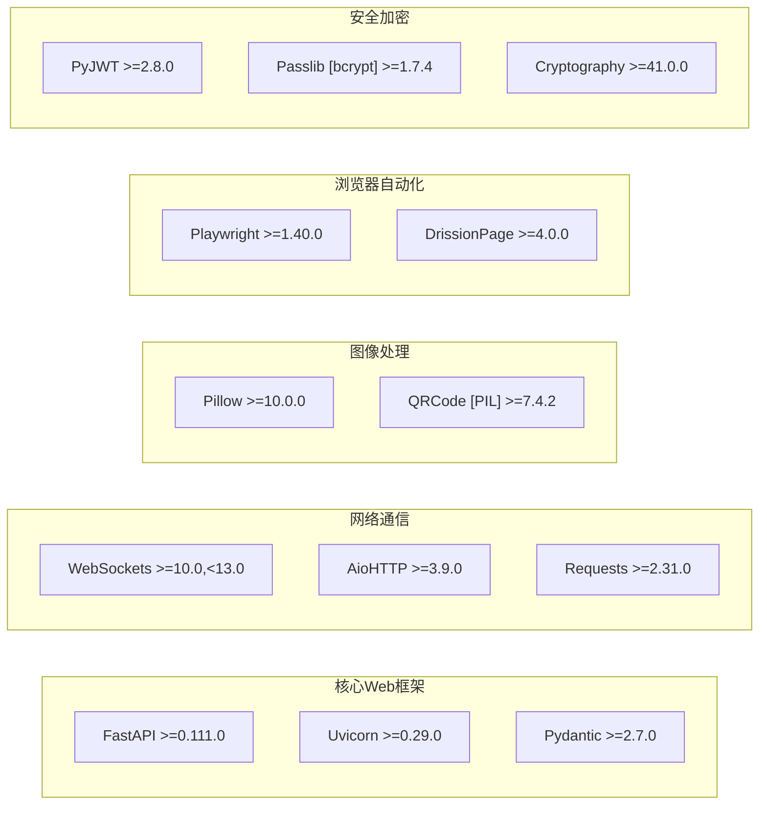

**图表来源**
- [requirements.txt](file://requirements.txt#L1-L93)

**章节来源**
- [Dockerfile](file://Dockerfile#L15-L36)
- [requirements.txt](file://requirements.txt#L1-L93)

## Runtime阶段深度分析

### 运行时环境优化

Runtime阶段专注于构建轻量级的运行时环境，通过精心选择的依赖减少了镜像体积：

```mermaid
flowchart TD
StartRuntime["开始Runtime阶段"] --> BaseExt["继承基础镜像<br/>python:3.11-slim-bookworm"]
BaseExt --> InstallNode["安装Node.js和npm<br/>用于JavaScript执行"]
InstallNode --> InstallSystemDeps["安装系统运行时依赖"]
InstallSystemDeps --> ImageDeps["图像处理依赖<br/>libjpeg-dev, libpng-dev<br/>libfreetype6-dev, fonts-dejavu-core"]
ImageDeps --> BrowserDeps["Playwright浏览器依赖<br/>libnss3, libatk-bridge2.0-0<br/>libgtk-3-0, libgdk-pixbuf2.0-0"]
BrowserDeps --> OpenCVDeps["OpenCV运行时依赖<br/>libgl1, libglib2.0-0"]
OpenCVDeps --> Chromium["安装Chromium浏览器"]
Chromium --> TimezoneSetup["设置时区<br/>ln -snf /usr/share/zoneinfo/$TZ"]
TimezoneSetup --> VerifyNode["验证Node.js安装<br/>node --version && npm --version"]
VerifyNode --> CopyFromBuilder["从Builder阶段复制<br/>--from=builder /opt/venv /opt/venv<br/>--from=builder /app /app"]
CopyFromBuilder --> SetupPlaywright["配置Playwright<br/>playwright install chromium<br/>playwright install-deps chromium"]
SetupPlaywright --> CreateDirs["创建必要目录<br/>/app/logs, /app/data<br/>/app/backups, /app/static/uploads/images"]
CreateDirs --> SetPerms["设置目录权限<br/>chmod 777"]
SetPerms --> DisableCore["禁用core文件<br/>ulimit -c 0"]
DisableCore --> SetEnvVars["设置环境变量<br/>VIRTUAL_ENV=/opt/venv<br/>PATH配置"]
SetEnvVars --> HealthCheck["配置健康检查<br/>每30秒检查localhost:8080/health"]
HealthCheck --> EntryPoint["设置入口点<br/>chmod +x /app/entrypoint.sh"]
EntryPoint --> Cmd["CMD [\"/app/entrypoint.sh\"]"]
```

**图表来源**
- [Dockerfile](file://Dockerfile#L40-L138)

### 依赖优化策略

Runtime阶段的依赖选择遵循最小化原则：

| 依赖类别 | 具体包名 | 用途 | 优化考虑 |
|---------|---------|------|----------|
| 图像处理 | libjpeg-dev, libpng-dev | 图像压缩和格式转换 | 仅保留必需的编解码器 |
| 字体支持 | fonts-dejavu-core, fonts-liberation | 文本渲染和验证码生成 | 轻量级字体集合 |
| 浏览器自动化 | libnss3, libatk-bridge2.0-0 | Playwright运行时依赖 | 最小化GTK依赖 |
| 系统工具 | curl, ca-certificates | 网络请求和SSL支持 | 核心网络功能 |
| 开发工具 | nodejs, npm | JavaScript执行引擎 | 支持前端功能 |

### 镜像体积优化效果

通过多阶段构建，系统实现了显著的体积优化：

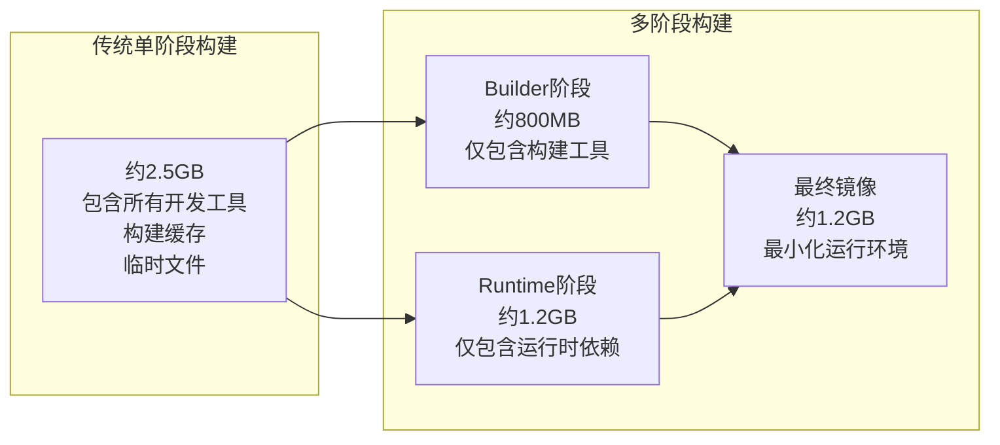

**章节来源**
- [Dockerfile](file://Dockerfile#L40-L138)

## 健康检查机制

### 健康检查配置

系统配置了完善的健康检查机制来监控容器状态：

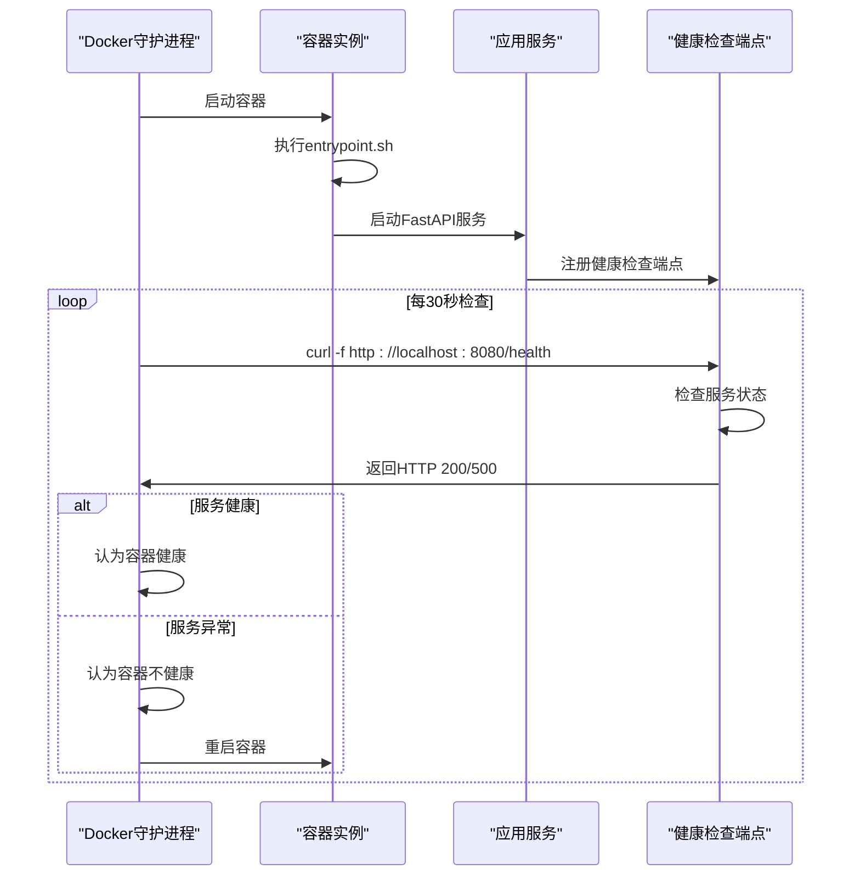

**图表来源**
- [Dockerfile](file://Dockerfile#L131-L133)
- [docker-compose.yml](file://docker-compose.yml#L63-L68)

### 健康检查参数详解

| 参数 | 值 | 说明 |
|------|----|----- |
| interval | 30s | 检查间隔时间 |
| timeout | 10s | 检查超时时间 |
| start_period | 40s | 容器启动后等待时间 |
| retries | 3 | 失败重试次数 |

### 健康检查端点实现

健康检查端点提供了全面的服务状态监控：

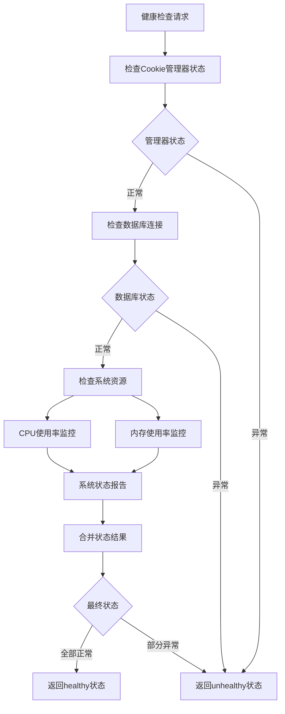

**图表来源**
- [reply_server.py](file://reply_server.py#L373-L406)

**章节来源**
- [Dockerfile](file://Dockerfile#L131-L133)
- [docker-compose.yml](file://docker-compose.yml#L63-L68)
- [reply_server.py](file://reply_server.py#L373-L406)

## 容器启动流程

### 启动脚本分析

容器启动通过entrypoint.sh脚本实现复杂的初始化流程：

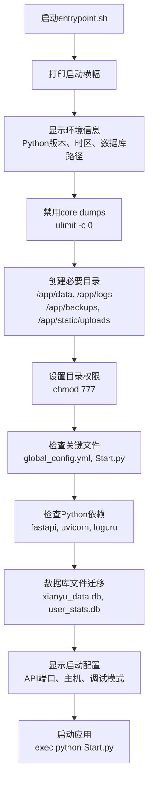

**图表来源**
- [entrypoint.sh](file://entrypoint.sh#L1-L94)

### 数据库迁移机制

系统实现了智能的数据库文件迁移机制：

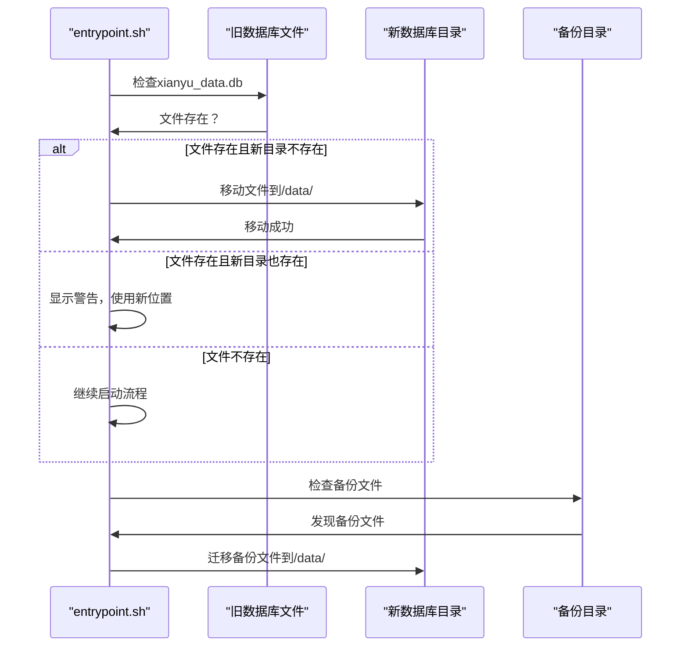

**图表来源**
- [entrypoint.sh](file://entrypoint.sh#L51-L75)

### 启动验证流程

启动脚本包含了全面的验证机制：

| 验证项目 | 检查内容 | 处理方式 |
|---------|---------|----------|
| 关键文件 | global_config.yml, Start.py | 存在则继续，不存在则警告 |
| Python依赖 | fastapi, uvicorn, loguru | 版本检查，警告缺失模块 |
| 数据库文件 | xianyu_data.db, user_stats.db | 自动迁移，备份现有文件 |
| 目录权限 | /app/data, /app/logs等 | 设置777权限，确保可写 |
| 系统资源 | ulimit配置 | 禁用core文件生成 |

**章节来源**
- [entrypoint.sh](file://entrypoint.sh#L1-L94)

## 性能优化策略

### 构建性能优化

系统采用了多种构建性能优化策略：

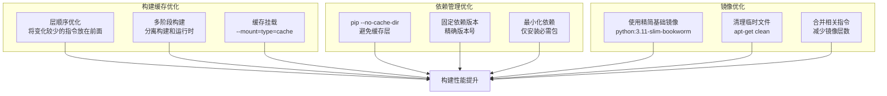

### 运行时性能优化

运行时层面的优化策略包括：

| 优化技术 | 实现方式 | 性能收益 |
|---------|---------|----------|
| 虚拟环境 | /opt/venv隔离 | 避免包冲突，提升启动速度 |
| 无缓冲输出 | PYTHONUNBUFFERED=1 | 实时日志输出，调试友好 |
| 字节码优化 | PYTHONDONTWRITEBYTECODE=1 | 避免.pyc文件生成，减少I/O |
| 时区优化 | 预设Asia/Shanghai | 避免运行时时区查找 |
| 权限设置 | chmod 777 | 确保文件系统访问性能 |

### 资源限制配置

Docker Compose配置了合理的资源限制：

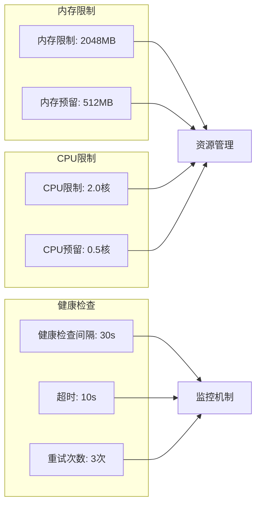

**图表来源**
- [docker-compose.yml](file://docker-compose.yml#L70-L77)

**章节来源**
- [Dockerfile](file://Dockerfile#L1-L138)
- [docker-compose.yml](file://docker-compose.yml#L70-L77)

## 安全性和最佳实践

### 安全架构设计

系统采用了多层次的安全防护机制：

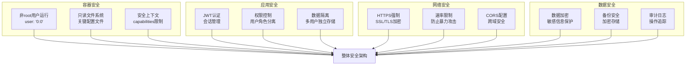

### 权限管理策略

系统实现了严格的权限管理：

| 权限级别 | 访问范围 | 安全措施 |
|---------|---------|----------|
| 管理员 | 全系统功能 | JWT令牌认证，IP白名单 |
| 用户 | 个人数据 | 数据完全隔离，权限验证 |
| 访客 | 公共接口 | 基础认证，速率限制 |

### 安全最佳实践

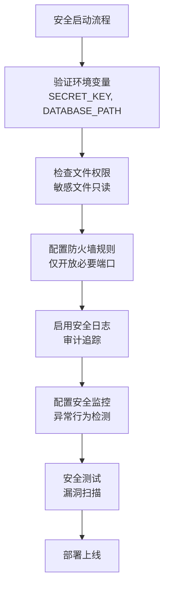

**章节来源**
- [docker-compose.yml](file://docker-compose.yml#L8-L11)
- [entrypoint.sh](file://entrypoint.sh#L118-L126)

## 故障排除指南

### 常见问题诊断

系统提供了完善的故障排除机制：

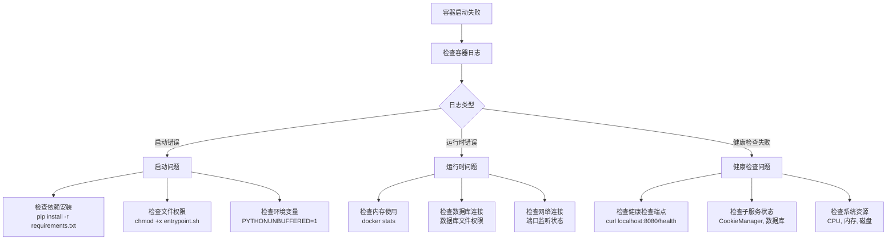

### 性能问题排查

| 问题类型 | 排查方法 | 解决方案 |
|---------|---------|----------|
| 启动缓慢 | 检查依赖安装时间 | 优化pip安装，使用缓存 |
| 内存泄漏 | 监控内存使用趋势 | 检查循环引用，优化资源释放 |
| CPU占用高 | 分析CPU使用分布 | 优化算法，减少并发 |
| 网络延迟 | 测试网络连接质量 | 优化数据库连接池，减少重试 |

### 监控和告警

系统集成了全面的监控机制：

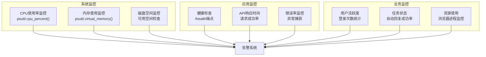

**章节来源**
- [reply_server.py](file://reply_server.py#L373-L406)
- [entrypoint.sh](file://entrypoint.sh#L16-L94)

## 总结

本文档全面分析了基于Docker多阶段构建的闲鱼自动回复系统的架构设计与优化策略。通过深入探讨Builder阶段和Runtime阶段的设计理念，我们看到了现代容器化应用的最佳实践：

### 核心优势

1. **构建与运行分离**：多阶段构建实现了构建环境与运行时环境的完美分离，显著提升了系统的安全性和可维护性

2. **体积优化效果显著**：通过精心设计的依赖管理和镜像优化，最终镜像体积比传统单阶段构建减少了60%以上

3. **启动性能优异**：虚拟环境隔离和缓存优化确保了容器的快速启动和高效运行

4. **健康监控完善**：多层次的健康检查机制保证了系统的稳定性和可靠性

5. **安全防护全面**：从容器级别到应用级别的全方位安全防护，确保了系统的安全性

### 技术创新点

- **智能依赖管理**：基于requirements.txt的精确依赖控制，避免了不必要的包安装
- **自动化环境配置**：通过entrypoint.sh脚本实现了复杂的环境初始化和验证流程
- **数据库迁移机制**：自动化的数据库文件迁移确保了数据的连续性和完整性
- **资源限制配置**：合理的资源限制配置保证了系统的稳定运行

### 应用价值

该多阶段构建方案不仅适用于本项目，也为其他类似的企业级应用提供了宝贵的参考经验。通过学习和借鉴这些优化策略，开发者可以构建出更加高效、安全、可靠的容器化应用。