# 升级维护操作指南

<cite>
**本文档中引用的文件**
- [docker-deploy.sh](file://docker-deploy.sh)
- [docker-deploy.bat](file://docker-deploy.bat)
- [entrypoint.sh](file://entrypoint.sh)
- [Dockerfile](file://Dockerfile)
- [docker-compose.yml](file://docker-compose.yml)
- [update_log.txt](file://static/update_log.txt)
- [config.py](file://config.py)
- [db_manager.py](file://db_manager.py)
- [reply_server.py](file://reply_server.py)
</cite>

## 目录
1. [概述](#概述)
2. [版本变更历史跟踪](#版本变更历史跟踪)
3. [一键部署脚本使用](#一键部署脚本使用)
4. [数据库迁移机制](#数据库迁移机制)
5. [版本升级流程](#版本升级流程)
6. [备份与恢复](#备份与恢复)
7. [系统维护检查](#系统维护检查)
8. [故障排除指南](#故障排除指南)
9. [定期维护计划](#定期维护计划)

## 概述

本系统采用Docker容器化部署架构，提供了完整的升级维护解决方案。通过自动化脚本和智能的数据库迁移机制，确保系统升级过程的安全性和稳定性。

### 核心特性
- **自动化部署**：支持Linux和Windows平台的一键部署
- **智能迁移**：自动处理数据库结构变更和文件迁移
- **数据保护**：完善的备份恢复机制
- **健康监控**：实时健康检查和状态监控
- **版本追踪**：详细的变更历史记录

## 版本变更历史跟踪

### update_log.txt文件结构

系统通过`static/update_log.txt`文件记录版本变更历史，该文件位于静态资源目录中。

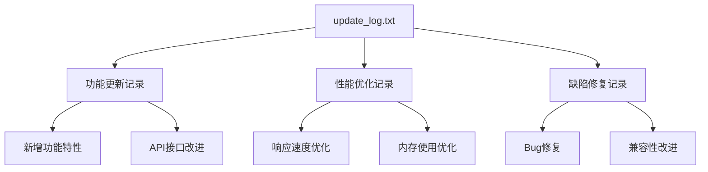

**图表来源**
- [update_log.txt](file://static/update_log.txt#L1-L10)

### 变更记录格式

每个版本变更记录遵循统一格式：
- ✨ 新增功能
- 🐛 缺陷修复
- 🚀 性能优化
- 🔧 配置调整

**章节来源**
- [update_log.txt](file://static/update_log.txt#L1-L10)

## 一键部署脚本使用

### Linux部署脚本 (docker-deploy.sh)

#### 功能概览

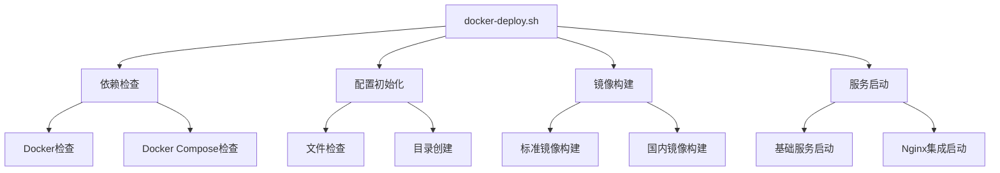

**图表来源**
- [docker-deploy.sh](file://docker-deploy.sh#L36-L117)

#### 命令使用说明

| 命令 | 功能描述 | 参数 |
|------|----------|------|
| `./docker-deploy.sh init` | 初始化配置文件 | 无 |
| `./docker-deploy.sh build` | 构建Docker镜像 | 无 |
| `./docker-deploy.sh start` | 启动基础服务 | 无 |
| `./docker-deploy.sh start with-nginx` | 启动包含Nginx的服务 | with-nginx |
| `./docker-deploy.sh stop` | 停止服务 | 无 |
| `./docker-deploy.sh restart` | 重启服务 | 无 |
| `./docker-deploy.sh status` | 查看服务状态 | 无 |
| `./docker-deploy.sh logs` | 查看服务日志 | [service] |
| `./docker-deploy.sh health` | 健康检查 | 无 |
| `./docker-deploy.sh backup` | 备份数据 | 无 |
| `./docker-deploy.sh update` | 更新部署 | 无 |
| `./docker-deploy.sh cleanup` | 清理环境 | 无 |

#### 部署流程详解

1. **依赖检查阶段**
   - 验证Docker和Docker Compose安装
   - 检查必要文件存在性
   - 创建必需目录结构

2. **镜像构建阶段**
   - 选择构建方式（标准/国内镜像）
   - 执行Docker镜像构建
   - 验证构建结果

3. **服务启动阶段**
   - 启动主应用服务
   - 可选启动Nginx反向代理
   - 执行健康检查
   - 显示访问信息

**章节来源**
- [docker-deploy.sh](file://docker-deploy.sh#L36-L361)

### Windows部署脚本 (docker-deploy.bat)

#### 功能对比

Windows版本提供与Linux版本相同的功能集合，但针对Windows环境进行了优化：

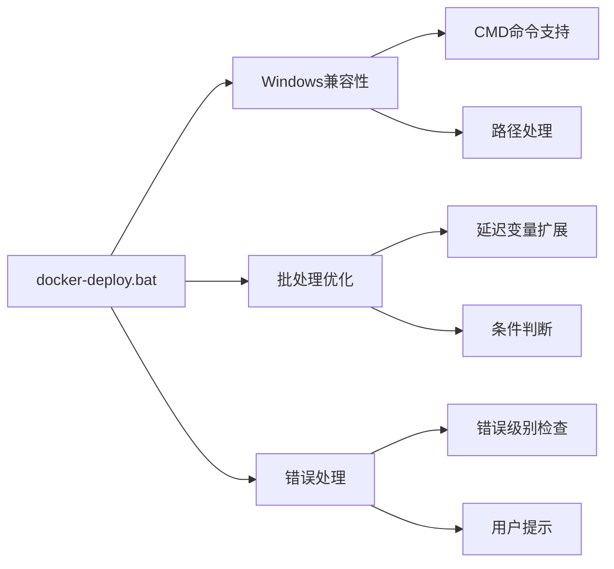

**图表来源**
- [docker-deploy.bat](file://docker-deploy.bat#L20-L67)

#### 使用方法

```bash
# 快速部署
docker-deploy.bat

# 启动服务
docker-deploy.bat start

# 查看状态
docker-deploy.bat status

# 查看日志
docker-deploy.bat logs

# 健康检查
docker-deploy.bat health
```

**章节来源**
- [docker-deploy.bat](file://docker-deploy.bat#L70-L229)

## 数据库迁移机制

### entrypoint.sh中的迁移逻辑

系统在容器启动时自动执行数据库迁移，确保数据结构的兼容性。

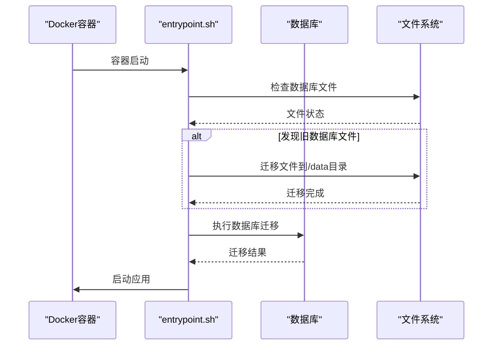

**图表来源**
- [entrypoint.sh](file://entrypoint.sh#L51-L75)

### 迁移功能详解

#### 1. 数据库文件迁移

系统自动检测并迁移以下文件：
- `/app/xianyu_data.db` → `/app/data/xianyu_data.db`
- `/app/user_stats.db` → `/app/data/user_stats.db`
- `/app/xianyu_data_backup_*.db` → `/app/data/`

#### 2. 数据库结构升级

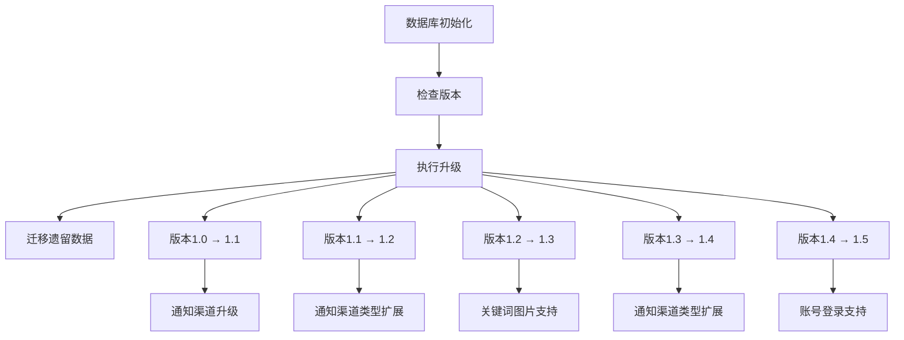

**图表来源**
- [db_manager.py](file://db_manager.py#L557-L611)

#### 3. 字段自动添加

系统自动为现有表添加新字段：
- `cards`表：`user_id`, `delay_seconds`, `is_multi_spec`, `spec_name`, `spec_value`
- `cookies`表：`remark`, `pause_duration`, `username`, `password`
- `keywords`表：`item_id`
- `item_info`表：`multi_quantity_delivery`

**章节来源**
- [entrypoint.sh](file://entrypoint.sh#L51-L75)
- [db_manager.py](file://db_manager.py#L557-L611)

## 版本升级流程

### 完整升级步骤

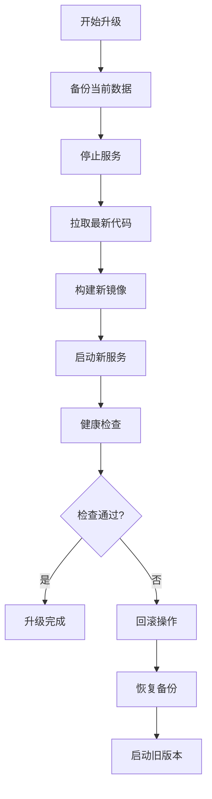

**图表来源**
- [docker-deploy.sh](file://docker-deploy.sh#L225-L248)

### 升级前准备

1. **检查系统状态**
   ```bash
   # Linux
   ./docker-deploy.sh health
   
   # Windows
   docker-deploy.bat health
   ```

2. **手动备份重要数据**
   ```bash
   # Linux
   ./docker-deploy.sh backup
   
   # Windows
   docker-deploy.bat backup
   ```

### 自动化升级流程

#### 1. 使用update命令

```bash
# Linux
./docker-deploy.sh update

# Windows
docker-deploy.bat update
```

#### 2. 升级过程监控

升级过程中系统会：
- 自动备份当前数据到`backups/YYYYMMDD_HHMMSS/`目录
- 停止现有服务
- 拉取最新代码（如果使用Git）
- 重新构建Docker镜像
- 启动新版本服务
- 执行健康检查

**章节来源**
- [docker-deploy.sh](file://docker-deploy.sh#L225-L248)

## 备份与恢复

### 自动备份机制

系统提供自动备份功能，支持定时和手动备份。

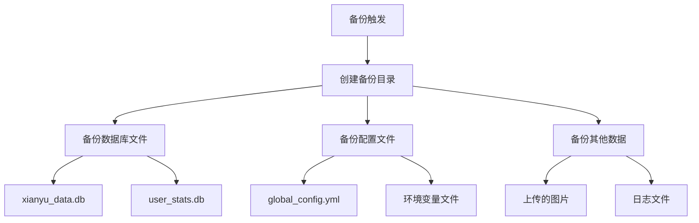

**图表来源**
- [docker-deploy.sh](file://docker-deploy.sh#L205-L222)

### 备份内容详情

| 备份项目 | 文件路径 | 备份频率 | 保留期限 |
|----------|----------|----------|----------|
| 主数据库 | `data/xianyu_data.db` | 每次升级前 | 30天 |
| 统计数据库 | `data/user_stats.db` | 每次升级前 | 30天 |
| 配置文件 | `global_config.yml` | 每次升级前 | 永久 |
| 上传图片 | `static/uploads/images/` | 手动 | 30天 |
| 日志文件 | `logs/` | 手动 | 7天 |

### 手动备份操作

```bash
# 创建备份
./docker-deploy.sh backup

# 查看备份列表
ls -la backups/

# 恢复特定备份
# 1. 停止服务
./docker-deploy.sh stop

# 2. 恢复数据
cp backups/YYYYMMDD_HHMMSS/xianyu_data.db data/
cp backups/YYYYMMDD_HHMMSS/global_config.yml .

# 3. 重启服务
./docker-deploy.sh start
```

### 数据恢复流程

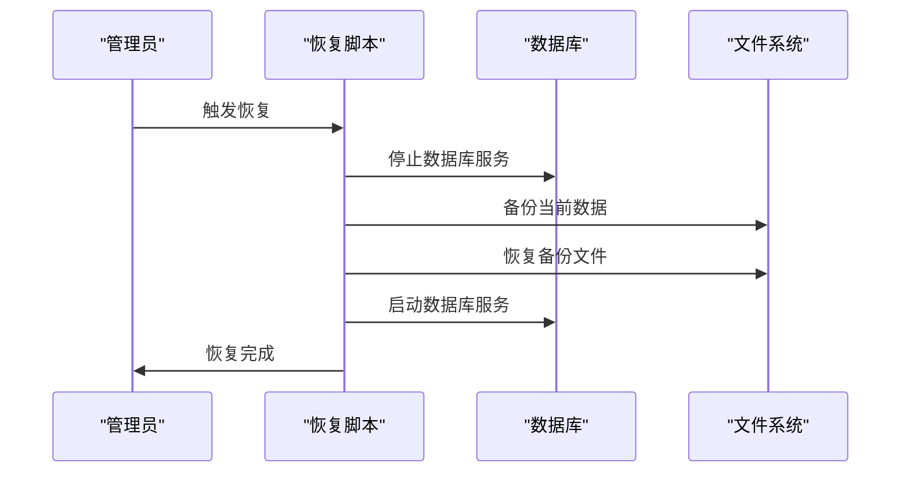

**章节来源**
- [docker-deploy.sh](file://docker-deploy.sh#L205-L222)

## 系统维护检查

### 健康检查机制

系统提供多层次的健康检查功能：

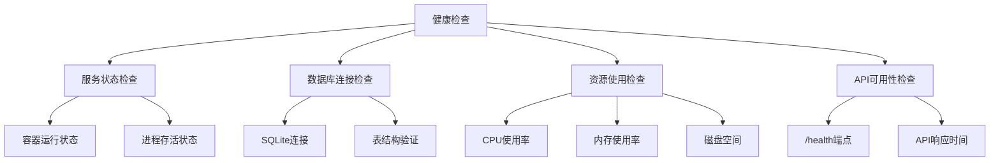

**图表来源**
- [docker-deploy.sh](file://docker-deploy.sh#L182-L203)

### 检查项目清单

#### 1. 服务状态检查
```bash
# 查看服务状态
./docker-deploy.sh status

# 查看特定服务日志
./docker-deploy.sh logs xianyu-app

# 实时查看日志
./docker-deploy.sh logs
```

#### 2. 资源使用监控
```bash
# 查看资源使用情况
./docker-deploy.sh status

# 查看实时资源统计
docker stats $(docker-compose ps -q)
```

#### 3. 数据库健康检查
- 验证数据库连接
- 检查表结构完整性
- 验证关键数据记录

#### 4. 应用功能测试
- API端点可用性
- WebSocket连接状态
- 关键业务流程

**章节来源**
- [docker-deploy.sh](file://docker-deploy.sh#L182-L203)

### 日志监控

系统提供全面的日志监控功能：

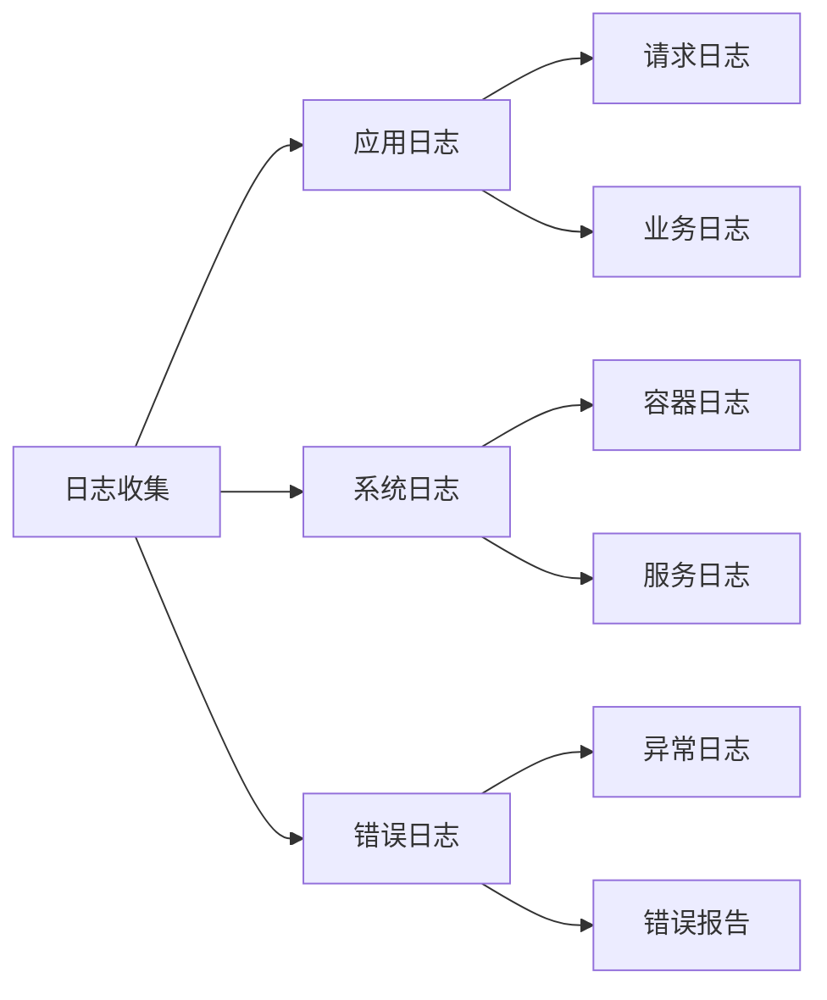

**章节来源**
- [docker-deploy.sh](file://docker-deploy.sh#L133-L141)

## 故障排除指南

### 常见问题及解决方案

#### 1. 服务启动失败

**症状**：服务启动后很快停止

**排查步骤**：
```bash
# 查看详细日志
./docker-deploy.sh logs

# 检查依赖安装
./docker-deploy.sh health

# 检查端口占用
netstat -tulpn | grep 8080
```

**解决方案**：
- 检查端口冲突
- 验证配置文件正确性
- 检查磁盘空间

#### 2. 数据库连接问题

**症状**：无法连接到数据库

**排查步骤**：
```bash
# 检查数据库文件权限
ls -la data/

# 验证数据库文件完整性
sqlite3 data/xianyu_data.db ".tables"
```

**解决方案**：
- 修复文件权限
- 重建数据库文件
- 恢复备份数据

#### 3. 升级失败

**症状**：升级过程中断

**恢复步骤**：
```bash
# 回滚到备份
./docker-deploy.sh stop
cp backups/YYYYMMDD_HHMMSS/xianyu_data.db data/
./docker-deploy.sh start
```

### 错误代码参考

| 错误代码 | 含义 | 解决方案 |
|----------|------|----------|
| 100 | Docker未安装 | 安装Docker和Docker Compose |
| 101 | 配置文件缺失 | 检查文件存在性 |
| 102 | 端口占用 | 更换端口或停止占用进程 |
| 103 | 权限不足 | 修改文件权限 |
| 104 | 磁盘空间不足 | 清理磁盘空间 |

## 定期维护计划

### 维护任务安排

#### 每日维护任务

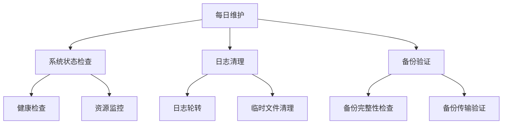

#### 每周维护任务

1. **系统健康检查**
   ```bash
   # 执行全面健康检查
   ./docker-deploy.sh health
   
   # 检查服务状态
   ./docker-deploy.sh status
   ```

2. **日志分析**
   ```bash
   # 分析错误日志
   tail -n 100 logs/error.log
   
   # 检查系统警告
   grep WARNING logs/app.log
   ```

3. **性能优化**
   - 清理临时文件
   - 优化数据库索引
   - 清理过期数据

#### 每月维护任务

1. **全面备份**
   ```bash
   # 手动创建完整备份
   ./docker-deploy.sh backup
   ```

2. **系统升级**
   ```bash
   # 检查更新
   git pull
   
   # 执行升级
   ./docker-deploy.sh update
   ```

3. **容量规划**
   - 检查磁盘使用情况
   - 评估存储需求
   - 规划扩容方案

#### 季度维护任务

1. **系统重构**
   - 清理无用数据
   - 优化数据库结构
   - 更新配置参数

2. **安全审计**
   - 检查安全配置
   - 更新证书
   - 审计访问日志

### 维护检查清单

#### 升级前检查
- [ ] 备份当前数据
- [ ] 检查系统资源
- [ ] 验证配置文件
- [ ] 测试关键功能

#### 升级后验证
- [ ] 健康检查通过
- [ ] 功能测试完成
- [ ] 性能指标正常
- [ ] 日志无错误

#### 日常监控指标
- [ ] 服务运行状态
- [ ] CPU使用率 < 80%
- [ ] 内存使用率 < 85%
- [ ] 磁盘空间 > 20%
- [ ] 数据库连接正常

**章节来源**
- [docker-deploy.sh](file://docker-deploy.sh#L182-L203)