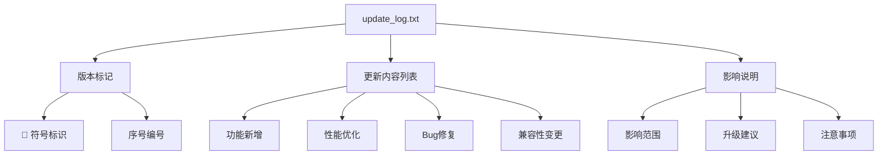
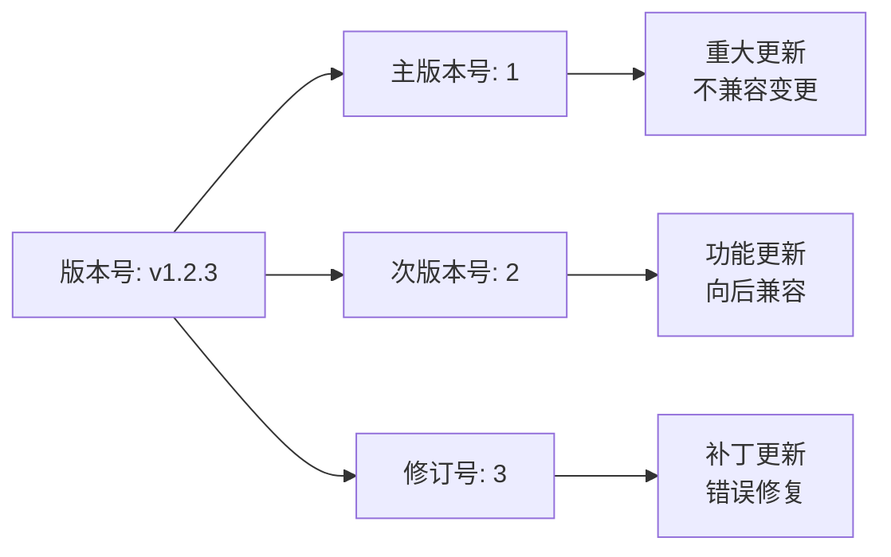
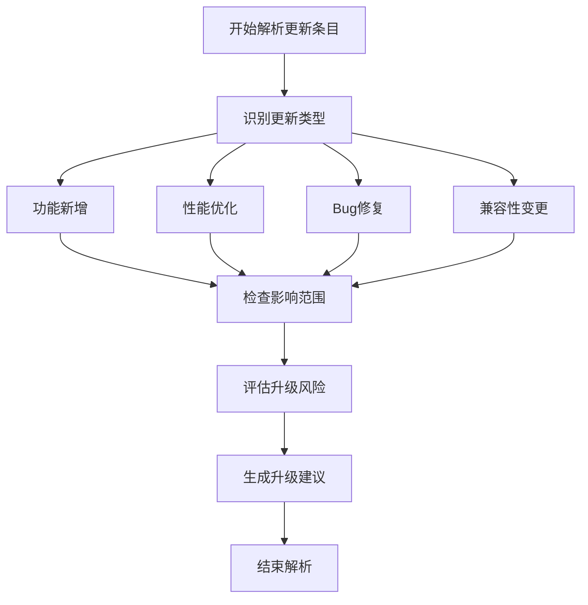
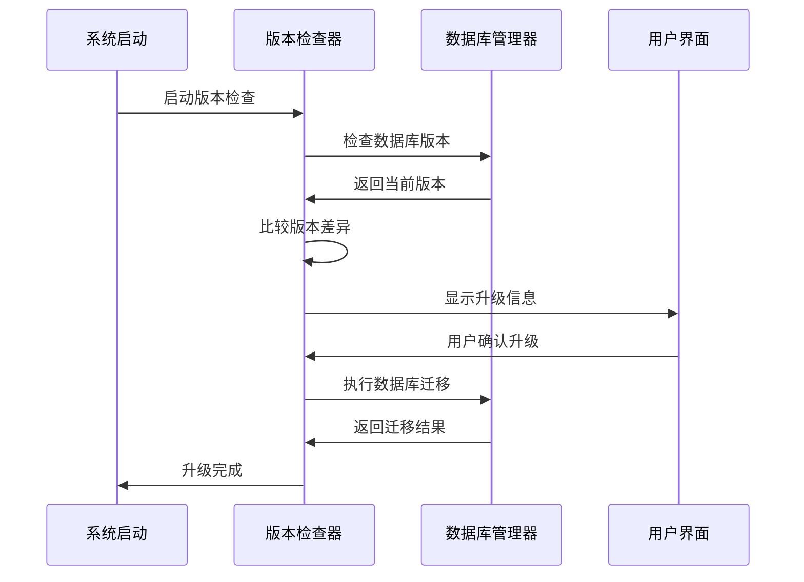
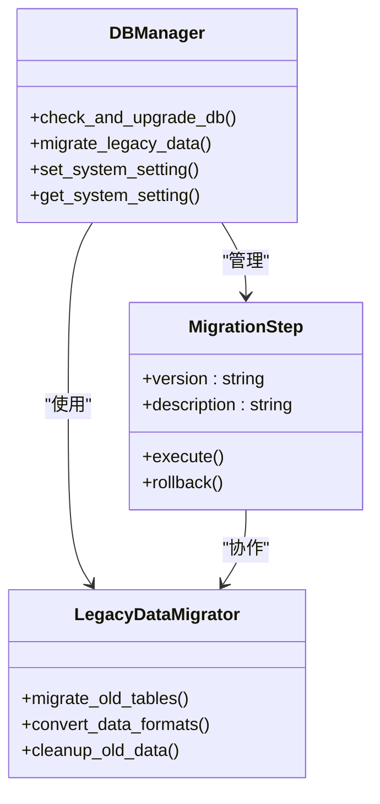
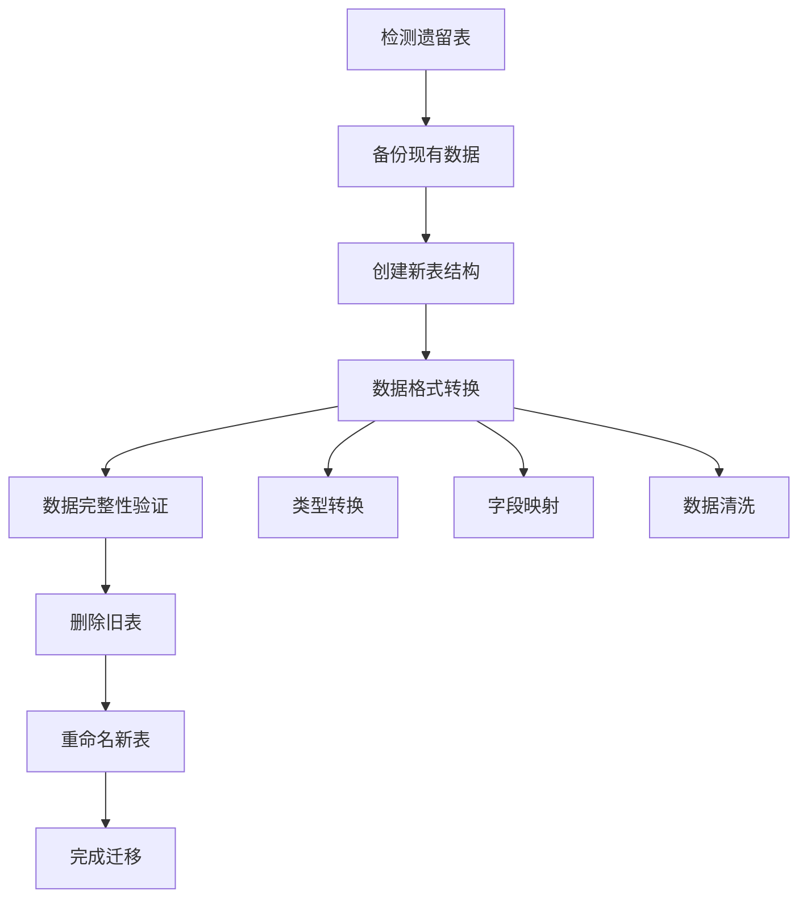

# 版本更新文档

<cite>
**本文档中引用的文件**
- [update_log.txt](file://static/update_log.txt)
- [README.md](file://README.md)
- [config.py](file://config.py)
- [Start.py](file://Start.py)
- [db_manager.py](file://db_manager.py)
- [global_config.yml](file://global_config.yml)
- [app.js](file://static/js/app.js)
</cite>

## 目录
1. [简介](#简介)
2. [版本更新文件结构](#版本更新文件结构)
3. [版本号语义规范](#版本号语义规范)
4. [更新日志解析指南](#更新日志解析指南)
5. [版本升级机制](#版本升级机制)
6. [数据库迁移系统](#数据库迁移系统)
7. [升级前准备指南](#升级前准备指南)
8. [常见问题解答](#常见问题解答)
9. [故障排除指南](#故障排除指南)
10. [最佳实践建议](#最佳实践建议)

## 简介

本系统采用基于文本文件的版本更新管理机制，通过专门的 `update_log.txt` 文件记录每次版本迭代的重要变更。该机制为用户提供清晰的系统演进历史，帮助用户了解功能新增、性能优化、缺陷修复和兼容性变更。

系统支持自动化的版本检查和升级机制，能够智能识别当前版本与最新版本之间的差异，为用户提供升级建议和风险评估。

## 版本更新文件结构

### update_log.txt 文件格式

系统使用标准化的文本格式记录版本更新信息：



**图表来源**
- [update_log.txt](file://static/update_log.txt#L1-L10)

### 文件内容示例

典型的更新日志条目包含以下要素：

1. **版本标识**：使用🎉符号和序号标记
2. **更新描述**：简洁明了的功能说明
3. **影响说明**：对用户操作的影响
4. **技术细节**：必要的技术背景信息

**章节来源**
- [update_log.txt](file://static/update_log.txt#L1-L10)

## 版本号语义规范

### 语义化版本控制

系统遵循语义化版本控制（SemVer）规范，版本号格式为：`主版本号.次版本号.修订号`



### 版本类型区分

| 版本类型 | 格式示例 | 变更特征 | 升级风险 |
|---------|---------|---------|---------|
| 主版本更新 | v2.0.0 | 重大架构变更，不兼容升级 | 高 |
| 次版本更新 | v1.3.0 | 新功能添加，向后兼容 | 中 |
| 修订版本更新 | v1.2.1 | 错误修复，性能优化 | 低 |

### 版本号演进示例

根据项目配置，系统版本信息存储在多个位置：

- **应用版本**：`APP_CONFIG.app_version: '1.0'`
- **API版本**：`APP_CONFIG.api_version: '1.0'`
- **数据库版本**：通过 `db_version` 系统设置管理

**章节来源**
- [global_config.yml](file://global_config.yml#L6-L8)
- [db_manager.py](file://db_manager.py#L561-L568)

## 更新日志解析指南

### 日志条目结构

每个更新条目遵循统一的结构模式：



### 关键更新项分析

#### WebSocket连接稳定性改进
- **影响**：提升消息传输可靠性
- **技术改进**：增强的心跳检测和自动重连机制
- **用户收益**：减少断线重连次数

#### AI回复引擎升级
- **影响**：智能回复能力显著提升
- **技术改进**：支持更多AI模型，优化上下文处理
- **用户收益**：更自然的对话体验

#### 数据库迁移优化
- **影响**：支持更大规模数据处理
- **技术改进**：改进的索引策略和查询优化
- **用户收益**：更快的数据检索速度

**章节来源**
- [README.md](file://README.md#L198-L235)
- [db_manager.py](file://db_manager.py#L557-L607)

## 版本升级机制

### 自动版本检查

系统启动时自动执行版本检查和升级流程：



**图表来源**
- [Start.py](file://Start.py#L139-L144)
- [db_manager.py](file://db_manager.py#L557-L607)

### 升级流程管理

#### 数据库版本升级
系统自动检测并执行数据库结构升级：

1. **版本检查**：读取当前数据库版本
2. **升级判断**：比较目标版本与当前版本
3. **逐步升级**：按版本顺序执行升级脚本
4. **完整性验证**：确保升级过程的完整性

#### 配置文件迁移
系统自动处理配置文件的向后兼容性：

- **自动迁移**：旧版本配置自动转换
- **兼容性检查**：验证新功能的配置需求
- **回滚机制**：升级失败时的配置恢复

**章节来源**
- [db_manager.py](file://db_manager.py#L557-L607)
- [config.py](file://config.py#L1-L126)

## 数据库迁移系统

### 迁移架构设计



**图表来源**
- [db_manager.py](file://db_manager.py#L557-L607)
- [db_manager.py](file://db_manager.py#L971-L1017)

### 迁移步骤详解

#### 版本1.0升级
- **目标**：更新管理员用户ID
- **操作**：创建默认admin用户，设置初始密码
- **影响**：确保系统管理员账户的安全性

#### 版本1.1升级  
- **目标**：扩展通知渠道支持
- **操作**：修改notification_channels表结构
- **影响**：支持更多通知方式

#### 版本1.2升级
- **目标**：增强通知渠道类型
- **操作**：扩展type字段的枚举值
- **影响**：提供更灵活的通知配置

#### 版本1.3升级
- **目标**：支持图片回复功能
- **操作**：添加image_url字段到keywords表
- **影响**：允许发送图片消息

#### 版本1.4升级
- **目标**：优化通知渠道管理
- **操作**：再次更新type字段约束
- **影响**：统一通知渠道类型定义

#### 版本1.5升级
- **目标**：增强账号管理功能
- **操作**：为cookies表添加登录字段
- **影响**：支持账号密码登录

**章节来源**
- [db_manager.py](file://db_manager.py#L564-L607)

### 遗留数据迁移

系统提供完整的遗留数据迁移机制：



**图表来源**
- [db_manager.py](file://db_manager.py#L971-L1017)

**章节来源**
- [db_manager.py](file://db_manager.py#L971-L1017)

## 升级前准备指南

### 系统状态检查

在执行升级前，建议进行以下准备工作：

#### 1. 备份当前数据
```bash
# 创建数据库备份
cp data/xianyu_data.db data/xianyu_data_backup_$(date +%Y%m%d_%H%M%S).db

# 备份配置文件
cp global_config.yml global_config_backup_$(date +%Y%m%d_%H%M%S).yml
```

#### 2. 检查系统资源
- **磁盘空间**：确保有足够的可用空间
- **内存使用**：检查系统内存占用情况
- **网络连接**：验证网络连接稳定性

#### 3. 验证当前版本
通过管理界面或API查询当前系统版本：

```javascript
// 示例：查询系统版本信息
fetch('/api/system/version')
  .then(response => response.json())
  .then(data => console.log('当前版本:', data.version));
```

### 升级风险评估

#### 高风险场景
- **主版本升级**：可能导致配置不兼容
- **数据库结构变更**：可能影响现有数据
- **API接口变更**：可能影响第三方集成

#### 中风险场景
- **功能增强**：可能需要调整配置
- **性能优化**：可能影响现有工作流
- **安全加固**：可能影响某些功能

#### 低风险场景
- **Bug修复**：通常不会影响现有功能
- **性能优化**：提升系统响应速度
- **UI改进**：改善用户体验

**章节来源**
- [Start.py](file://Start.py#L63-L138)

## 常见问题解答

### Q1: 如何查看当前系统版本？

**A**: 通过管理界面的系统信息页面查看，或者使用以下API查询：
```bash
curl http://localhost:8080/api/system/info
```

### Q2: 升级过程中遇到错误怎么办？

**A**: 系统提供自动回滚机制：
1. 检查错误日志文件
2. 系统会自动尝试回滚到上一个稳定版本
3. 如需手动回滚，可以恢复备份的数据库文件

### Q3: 升级后功能异常如何处理？

**A**: 常见解决方案：
1. **清除浏览器缓存**：刷新页面重新加载
2. **检查配置文件**：验证配置项的正确性
3. **重启服务**：停止并重新启动系统服务
4. **查看日志**：检查系统日志定位问题

### Q4: 如何回退到之前的版本？

**A**: 系统支持版本回退：
1. 停止当前版本的服务
2. 恢复备份的数据库文件
3. 替换应用程序文件
4. 重新启动服务

### Q5: 升级会影响现有数据吗？

**A**: 系统设计为向后兼容：
- 数据库结构升级会自动迁移现有数据
- 配置文件会保留用户的自定义设置
- 用户数据不会丢失

### Q6: 如何处理升级后的兼容性问题？

**A**: 兼容性问题处理流程：
1. **识别问题**：确定具体的功能异常
2. **检查日志**：查看系统错误日志
3. **配置调整**：根据新版本要求调整配置
4. **功能测试**：验证各项功能正常运行

**章节来源**
- [README.md](file://README.md#L793-L800)

## 故障排除指南

### 常见升级问题

#### 1. 数据库连接失败
**症状**：系统启动时报数据库连接错误
**解决方法**：
- 检查数据库文件权限
- 验证数据库文件完整性
- 确认数据库路径配置正确

#### 2. 配置文件损坏
**症状**：系统无法正常启动
**解决方法**：
- 恢复备份的配置文件
- 重新生成默认配置
- 检查配置文件语法

#### 3. 权限不足错误
**症状**：数据库写入或文件操作失败
**解决方法**：
- 修改文件夹权限
- 以管理员身份运行
- 检查磁盘空间

### 日志分析技巧

#### 查看升级日志
```bash
# 查看最近的升级日志
tail -f logs/upgrade_*.log

# 搜索特定升级事件
grep "升级完成" logs/upgrade_*.log
```

#### 分析错误信息
- **错误类型识别**：区分数据库、配置、权限等错误
- **时间线分析**：按时间顺序分析问题发展
- **关联性检查**：查找相关联的错误事件

**章节来源**
- [db_manager.py](file://db_manager.py#L483-L487)

## 最佳实践建议

### 升级策略

#### 1. 渐进式升级
- **测试环境验证**：在测试环境中先行升级
- **小版本逐步推进**：避免跨多个主版本升级
- **监控系统状态**：升级后持续监控系统性能

#### 2. 备份策略
- **定期备份**：建立自动化的备份机制
- **多地备份**：将备份文件存储在不同位置
- **验证备份**：定期验证备份文件的可用性

#### 3. 监控告警
- **系统健康检查**：设置关键指标监控
- **异常告警**：配置升级过程中的异常告警
- **性能基线**：建立升级前后的性能对比

### 开发团队协作

#### 1. 版本规划
- **发布时间表**：制定明确的版本发布计划
- **功能冻结**：在发布前冻结新功能开发
- **测试验证**：确保充分的测试覆盖

#### 2. 文档维护
- **变更日志**：详细记录每次变更内容
- **升级指南**：提供清晰的升级操作说明
- **FAQ维护**：及时更新常见问题解答

#### 3. 用户沟通
- **提前通知**：升级前提前通知用户
- **影响说明**：清晰说明升级的影响范围
- **支持渠道**：提供升级过程中的技术支持

### 安全考虑

#### 1. 权限管理
- **最小权限原则**：只授予必要的系统权限
- **访问控制**：严格控制升级操作的访问权限
- **审计日志**：记录所有升级相关的操作

#### 2. 数据保护
- **加密传输**：确保升级文件的安全传输
- **完整性校验**：验证升级文件的完整性
- **备份验证**：确保备份文件的有效性

#### 3. 应急预案
- **回滚计划**：制定详细的回滚操作步骤
- **故障转移**：准备备用系统方案
- **人员培训**：确保相关人员熟悉应急流程

通过遵循这些最佳实践，可以最大限度地降低升级风险，确保系统的稳定性和数据的安全性。