# Linux部署脚本使用指南

<cite>
**本文档引用的文件**
- [docker-deploy.sh](file://docker-deploy.sh)
- [entrypoint.sh](file://entrypoint.sh)
- [docker-compose.yml](file://docker-compose.yml)
- [docker-compose-cn.yml](file://docker-compose-cn.yml)
- [Dockerfile](file://Dockerfile)
- [Dockerfile-cn](file://Dockerfile-cn)
- [global_config.yml](file://global_config.yml)
- [README.md](file://README.md)
</cite>

## 目录
1. [简介](#简介)
2. [项目架构概览](#项目架构概览)
3. [部署脚本核心功能](#部署脚本核心功能)
4. [Docker Compose配置详解](#docker-compose配置详解)
5. [容器启动机制分析](#容器启动机制分析)
6. [环境变量配置](#环境变量配置)
7. [部署流程详解](#部署流程详解)
8. [常见错误处理](#常见错误处理)
9. [最佳实践建议](#最佳实践建议)
10. [故障排除指南](#故障排除指南)

## 简介

本文档详细介绍了闲鱼自动回复系统在Linux环境下的Docker部署脚本使用方法。该系统采用现代化的容器化架构，支持一键部署和自动化运维管理。部署脚本提供了完整的生命周期管理功能，包括依赖检查、配置初始化、镜像构建、服务启停、状态监控、健康检查、数据备份等核心功能。

## 项目架构概览

系统采用微服务架构设计，主要由以下核心组件构成：

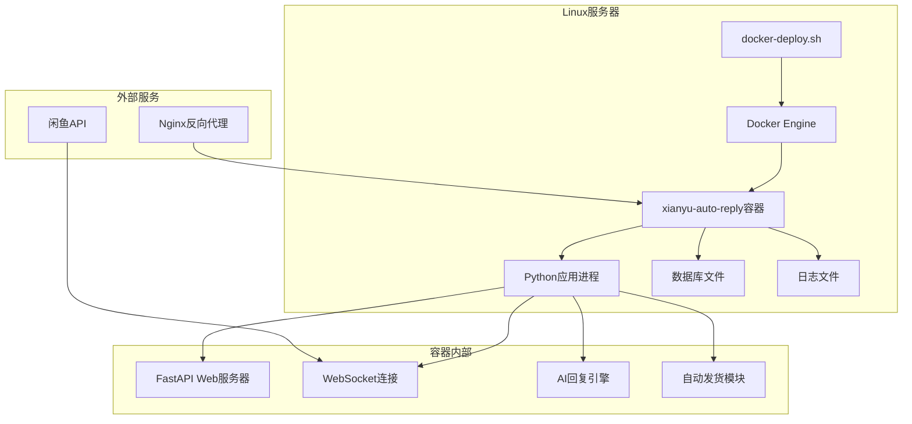

**图表来源**
- [docker-deploy.sh](file://docker-deploy.sh#L1-L50)
- [docker-compose.yml](file://docker-compose.yml#L1-L106)

**章节来源**
- [docker-deploy.sh](file://docker-deploy.sh#L1-L361)
- [docker-compose.yml](file://docker-compose.yml#L1-L106)

## 部署脚本核心功能

### 依赖检查机制

部署脚本实现了完善的依赖检查功能，确保系统环境满足运行要求：

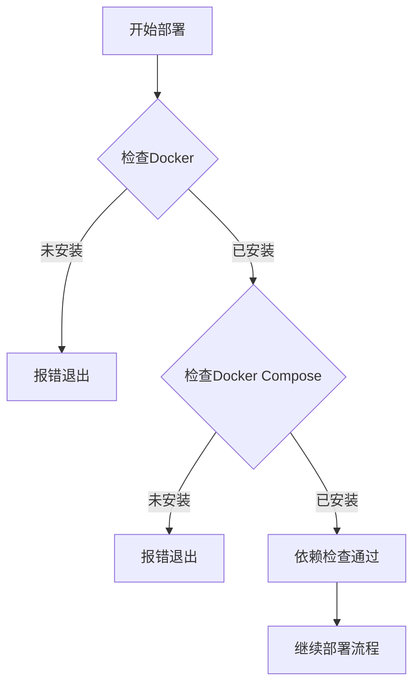

**图表来源**
- [docker-deploy.sh](file://docker-deploy.sh#L37-L51)

### 配置初始化流程

脚本自动检查和创建必要的配置文件和目录结构：

| 检查项目 | 验证内容 | 处理方式 |
|---------|---------|---------|
| entrypoint.sh | 启动脚本存在性 | 确保容器正常启动 |
| global_config.yml | 全局配置文件 | 提供系统配置基础 |
| 目录结构 | data、logs、backups目录 | 自动创建必要目录 |

### 镜像构建支持

脚本支持国内外两种镜像源，适应不同网络环境：

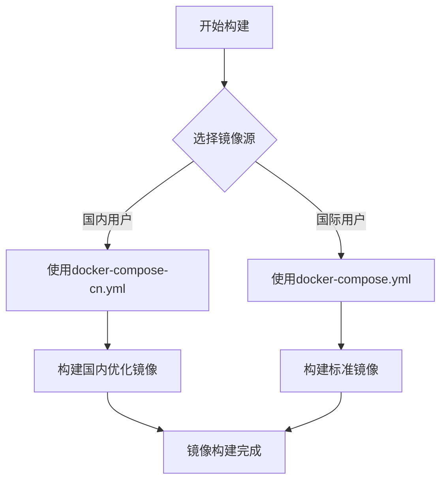

**图表来源**
- [docker-deploy.sh](file://docker-deploy.sh#L80-L89)
- [docker-compose-cn.yml](file://docker-compose-cn.yml#L1-L106)

**章节来源**
- [docker-deploy.sh](file://docker-deploy.sh#L54-L77)
- [docker-deploy.sh](file://docker-deploy.sh#L80-L89)

## Docker Compose配置详解

### 服务编排架构

系统采用多服务编排模式，支持可选的Nginx反向代理：

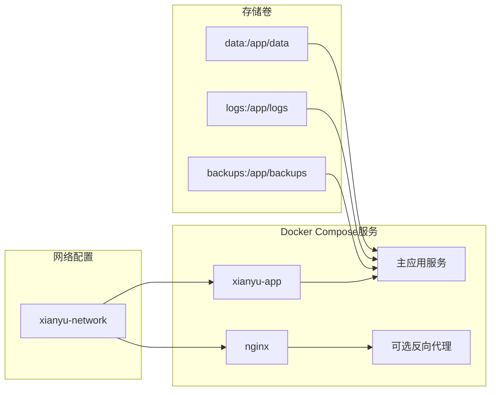

**图表来源**
- [docker-compose.yml](file://docker-compose.yml#L1-L106)

### 环境变量控制系统

系统通过丰富的环境变量实现灵活配置：

| 配置类别 | 关键变量 | 默认值 | 作用描述 |
|---------|---------|--------|---------|
| 基础配置 | WEB_PORT | 8080 | Web服务端口 |
| 数据库配置 | DB_PATH | /app/data/xianyu_data.db | 数据库文件路径 |
| 认证配置 | ADMIN_USERNAME | admin | 管理员用户名 |
| 功能开关 | AUTO_REPLY_ENABLED | true | 自动回复功能 |
| 资源限制 | MEMORY_LIMIT | 2048M | 内存限制 |

### 健康检查机制

Docker Compose集成了多层次的健康检查：

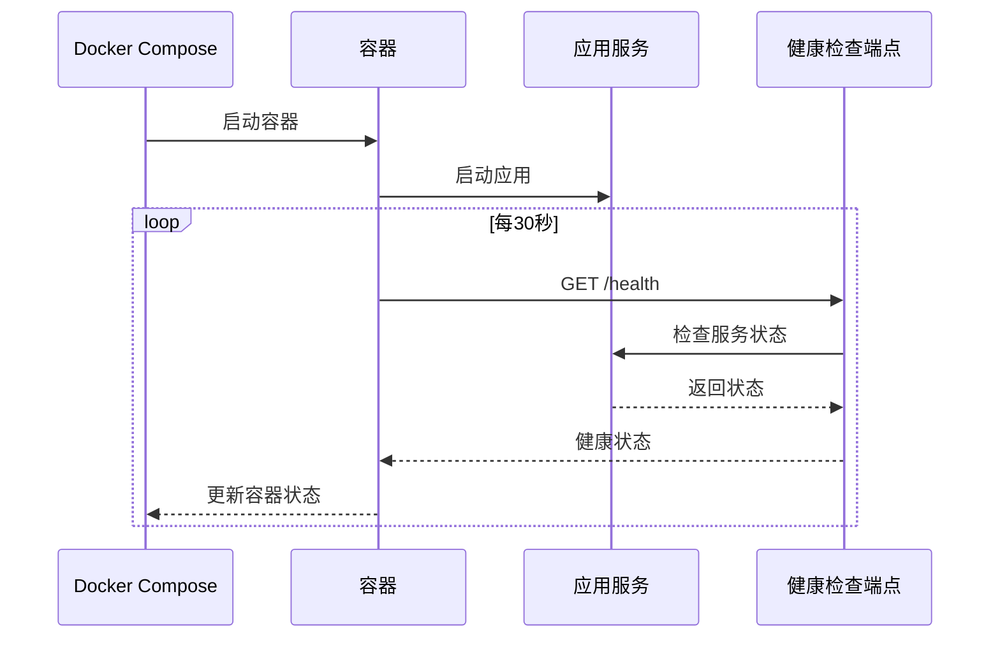

**图表来源**
- [docker-compose.yml](file://docker-compose.yml#L63-L69)

**章节来源**
- [docker-compose.yml](file://docker-compose.yml#L22-L60)
- [docker-compose.yml](file://docker-compose.yml#L63-L69)

## 容器启动机制分析

### Entrypoint脚本工作机制

容器启动时通过entrypoint.sh脚本执行一系列初始化操作：

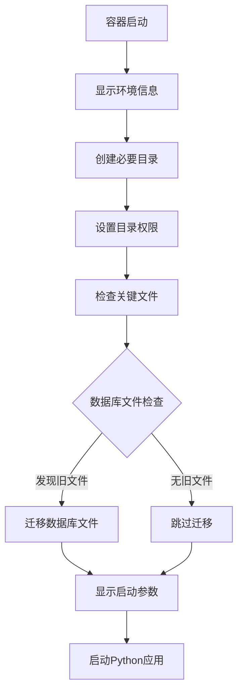

**图表来源**
- [entrypoint.sh](file://entrypoint.sh#L1-L94)

### 数据库迁移机制

系统实现了智能的数据库文件迁移功能：

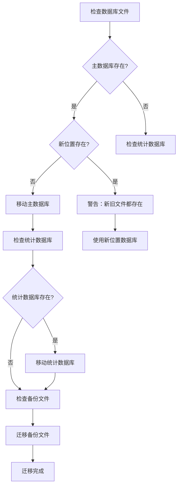

**图表来源**
- [entrypoint.sh](file://entrypoint.sh#L51-L76)

### 权限和安全设置

容器启动时自动配置安全的文件权限：

| 目录类型 | 权限设置 | 安全考虑 |
|---------|---------|---------|
| 数据目录 | 777 | 确保应用可读写 |
| 日志目录 | 777 | 支持日志写入 |
| 备份目录 | 777 | 允许备份操作 |
| 上传目录 | 777 | 支持图片上传 |

**章节来源**
- [entrypoint.sh](file://entrypoint.sh#L20-L30)
- [entrypoint.sh](file://entrypoint.sh#L51-L76)

## 环境变量配置

### 核心配置参数

系统支持通过环境变量进行深度定制：

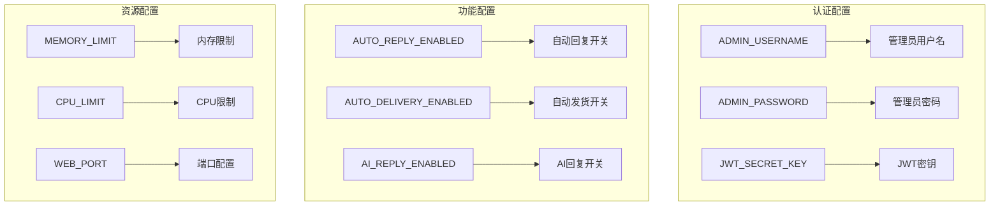

**图表来源**
- [docker-compose.yml](file://docker-compose.yml#L22-L60)

### 配置优先级

环境变量配置遵循以下优先级顺序：

1. **命令行参数** - 最高优先级
2. **环境变量** - 中等优先级
3. **Docker Compose配置** - 基础配置
4. **默认值** - 最低优先级

**章节来源**
- [docker-compose.yml](file://docker-compose.yml#L22-L60)

## 部署流程详解

### 快速部署模式

最简单的部署方式是一键启动：

```bash
# 国际用户
./docker-deploy.sh

# 或者
./docker-deploy.sh start
```

### 完整部署流程

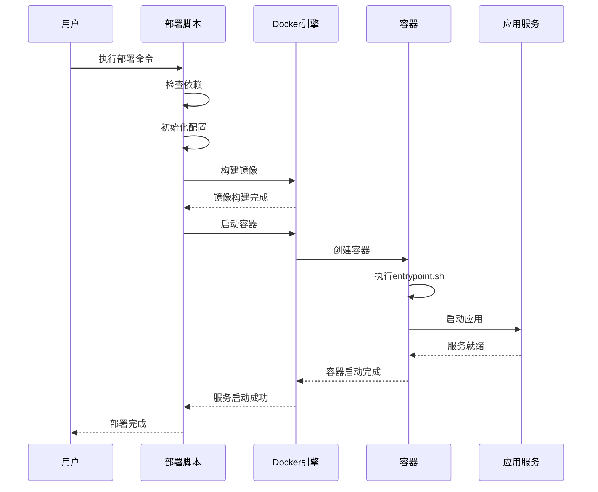

**图表来源**
- [docker-deploy.sh](file://docker-deploy.sh#L299-L361)

### 服务管理命令

部署脚本提供了完整的服务管理功能：

| 命令 | 功能描述 | 使用场景 |
|------|---------|---------|
| init | 初始化配置 | 首次部署前 |
| build | 构建镜像 | 更新代码后 |
| start | 启动服务 | 正常启动 |
| stop | 停止服务 | 维护期间 |
| restart | 重启服务 | 配置变更后 |
| status | 查看状态 | 监控检查 |
| logs | 查看日志 | 故障排查 |
| health | 健康检查 | 服务监控 |

**章节来源**
- [docker-deploy.sh](file://docker-deploy.sh#L299-L361)

## 常见错误处理

### 权限相关问题

**问题现象**：容器启动失败，提示权限错误

**解决方案**：
1. 检查Docker守护进程权限
2. 确认用户组配置：`sudo usermod -aG docker $USER`
3. 重新登录或重启Docker服务

### 端口冲突问题

**问题现象**：服务启动时提示端口被占用

**解决方案**：
```bash
# 检查端口占用
netstat -tulpn | grep 8080

# 修改端口配置
export WEB_PORT=8081
./docker-deploy.sh start
```

### 镜像拉取失败

**问题现象**：构建过程中网络连接超时

**解决方案**：
1. 使用国内镜像源：`./docker-deploy.sh build --use-cn-mirror`
2. 配置Docker镜像加速器
3. 检查网络连接和防火墙设置

### 数据库迁移失败

**问题现象**：数据库文件迁移过程中出现错误

**解决方案**：
1. 检查磁盘空间：`df -h`
2. 确认文件权限：`ls -la data/`
3. 手动迁移数据库文件

**章节来源**
- [docker-deploy.sh](file://docker-deploy.sh#L37-L51)
- [entrypoint.sh](file://entrypoint.sh#L51-L76)

## 最佳实践建议

### 系统监控

建立完善的监控体系：

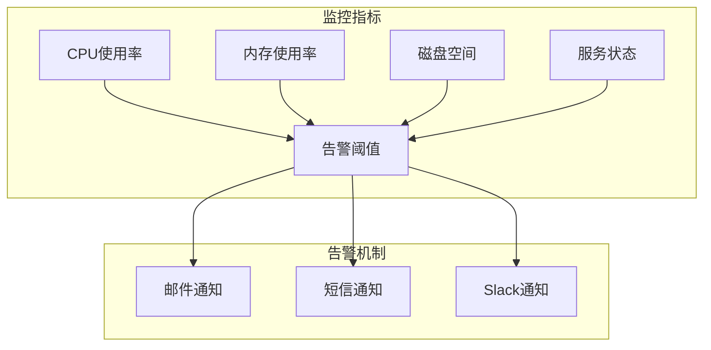

### 备份策略

制定定期备份计划：

| 备份类型 | 频率 | 保留期 | 存储位置 |
|---------|------|-------|---------|
| 数据库备份 | 每日 | 30天 | backups/目录 |
| 配置文件 | 每周 | 90天 | 备份目录 |
| 日志文件 | 实时 | 7天 | logs/目录 |

### 安全加固

实施安全防护措施：

1. **网络隔离**：使用Docker网络隔离服务
2. **权限最小化**：避免使用root用户运行应用
3. **定期更新**：及时更新系统和应用版本
4. **访问控制**：配置防火墙和访问白名单

### 性能优化

优化系统性能配置：

```bash
# 设置合理的资源限制
export MEMORY_LIMIT=4096
export CPU_LIMIT=4.0

# 配置数据库连接池
export DB_CONNECTION_POOL=10

# 启用压缩传输
export ENABLE_COMPRESSION=true
```

**章节来源**
- [docker-deploy.sh](file://docker-deploy.sh#L206-L223)
- [docker-compose.yml](file://docker-compose.yml#L70-L78)

## 故障排除指南

### 诊断工具使用

系统提供了多种诊断工具：

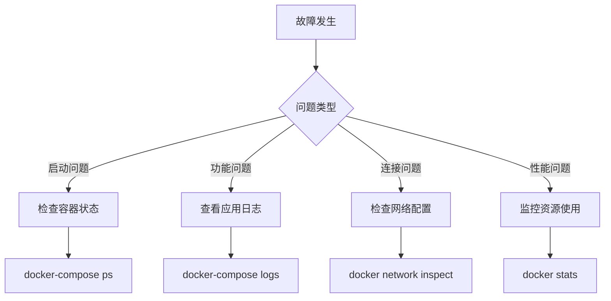

### 日志分析

系统日志提供了详细的调试信息：

| 日志级别 | 用途 | 示例 |
|---------|------|------|
| ERROR | 错误信息 | 数据库连接失败 |
| WARNING | 警告信息 | 文件权限问题 |
| INFO | 一般信息 | 服务启动完成 |
| DEBUG | 调试信息 | 详细执行流程 |

### 常见问题解决

**服务无法启动**：
1. 检查端口占用：`netstat -tulpn | grep :8080`
2. 查看容器日志：`docker-compose logs xianyu-app`
3. 检查配置文件语法：`docker-compose config`

**性能问题**：
1. 监控资源使用：`docker stats`
2. 检查数据库索引：优化查询语句
3. 调整资源限制：增加内存和CPU配额

**数据丢失**：
1. 检查备份文件：`ls -la backups/`
2. 验证数据完整性：`sqlite3 data/xianyu_data.db ".tables"`
3. 从备份恢复：`cp backups/backup.db data/xianyu_data.db`

**章节来源**
- [docker-deploy.sh](file://docker-deploy.sh#L134-L141)
- [docker-deploy.sh](file://docker-deploy.sh#L183-L203)

## 结论

闲鱼自动回复系统的Docker部署脚本提供了完整的一键部署和管理功能。通过合理配置环境变量、遵循最佳实践、建立完善的监控和备份机制，可以确保系统的稳定运行和高效维护。定期更新系统、加强安全防护、优化性能配置是保证系统长期稳定运行的关键因素。