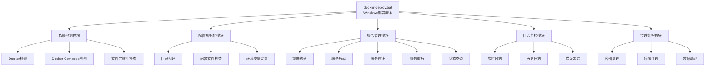
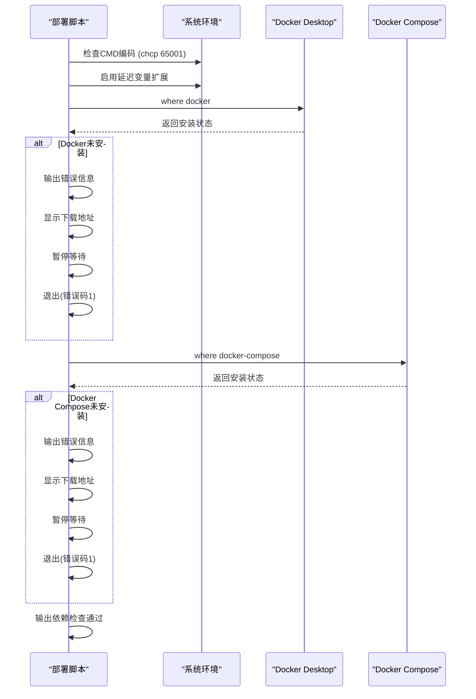
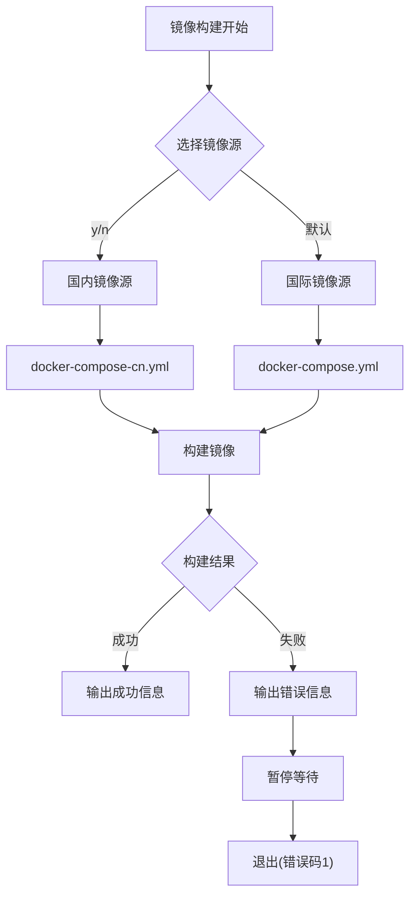
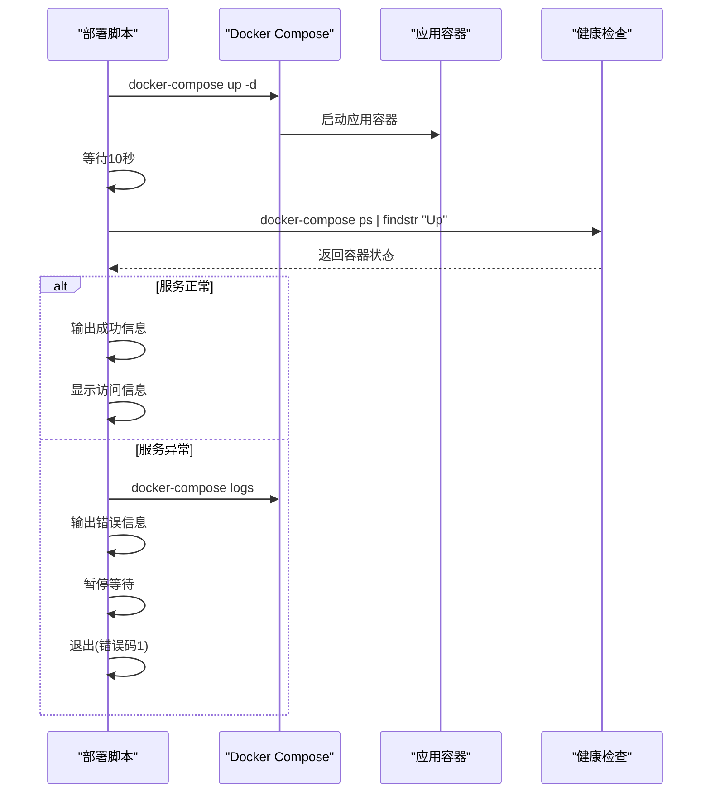
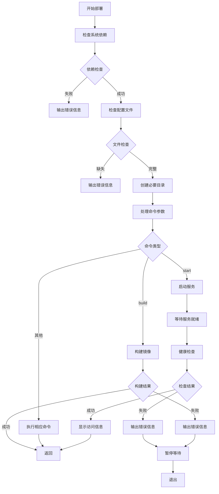

# Windows部署脚本使用指南

<cite>
**本文档引用的文件**
- [docker-deploy.bat](file://docker-deploy.bat)
- [docker-compose.yml](file://docker-compose.yml)
- [docker-compose-cn.yml](file://docker-compose-cn.yml)
- [Dockerfile](file://Dockerfile)
- [Dockerfile-cn](file://Dockerfile-cn)
- [entrypoint.sh](file://entrypoint.sh)
- [docker-deploy.sh](file://docker-deploy.sh)
- [README.md](file://README.md)
</cite>

## 目录
1. [简介](#简介)
2. [系统要求](#系统要求)
3. [脚本架构概览](#脚本架构概览)
4. [核心功能详解](#核心功能详解)
5. [Windows环境特殊处理](#windows环境特殊处理)
6. [部署流程详解](#部署流程详解)
7. [服务管理命令](#服务管理命令)
8. [故障排查指南](#故障排查指南)
9. [数据备份与恢复](#数据备份与恢复)
10. [跨平台差异对比](#跨平台差异对比)
11. [最佳实践建议](#最佳实践建议)

## 简介

Windows部署脚本（`docker-deploy.bat`）是闲鱼自动回复系统在Windows环境下的Docker部署管理工具。该脚本提供了完整的容器化部署解决方案，支持依赖检测、镜像构建、服务启动、状态监控、日志查看等全套运维功能。

### 主要特性

- **一键部署**：支持快速部署和完整部署两种模式
- **智能检测**：自动检测Docker Desktop和Docker Compose依赖
- **多镜像源**：支持国际版和国内版镜像源选择
- **目录管理**：自动创建必要的数据目录和挂载点
- **状态监控**：提供服务状态查询和健康检查功能
- **日志管理**：支持实时日志查看和历史日志管理
- **安全启动**：集成数据库迁移和权限设置机制

## 系统要求

### 硬件要求
- **CPU**：x86_64 (amd64) 或 ARM64 (aarch64) 架构
- **内存**：建议2GB以上可用内存
- **存储空间**：至少10GB可用磁盘空间
- **网络**：稳定的互联网连接（用于Docker镜像下载）

### 软件要求
- **操作系统**：Windows 10/11 或 Windows Server 2019+
- **Docker Desktop**：20.10+ 版本
- **Docker Compose**：2.0+ 版本
- **CMD/PowerShell**：支持批处理脚本执行

### 网络要求
- **阿里云镜像仓库**：`registry.cn-shanghai.aliyuncs.com`
- **Docker Hub**：`docker.io`
- **国内镜像源**：支持清华大学、中科大等国内镜像站点

## 脚本架构概览



**图表来源**
- [docker-deploy.bat](file://docker-deploy.bat#L1-L229)

## 核心功能详解

### 1. 依赖检测机制

脚本首先进行系统依赖检测，确保运行环境满足要求：



**图表来源**
- [docker-deploy.bat](file://docker-deploy.bat#L21-L38)

### 2. 配置文件验证

脚本严格验证关键配置文件的存在性和完整性：

- **entrypoint.sh**：容器启动脚本，确保Docker容器能够正常启动
- **global_config.yml**：全局配置文件，包含系统运行参数
- **Dockerfile**：镜像构建配置，支持多架构构建

### 3. 目录结构管理

自动创建必要的目录结构，确保数据持久化：

| 目录名称 | 用途 | 权限设置 |
|---------|------|----------|
| `data/` | SQLite数据库文件存储 | 读写权限 |
| `logs/` | 应用程序日志文件 | 读写权限 |
| `backups/` | 数据备份文件 | 读写权限 |
| `static/uploads/images/` | 用户上传的图片文件 | 读写权限 |

### 4. 镜像构建流程

支持两种构建模式：



**图表来源**
- [docker-deploy.bat](file://docker-deploy.bat#L86-L98)

### 5. 服务启动与健康检查

服务启动后进行健康检查，确保系统正常运行：



**图表来源**
- [docker-deploy.bat](file://docker-deploy.bat#L118-L131)

## Windows环境特殊处理

### 1. ANSI颜色支持处理

Windows CMD默认不支持ANSI颜色代码，脚本采用替代方案：

```batch
REM Windows CMD不支持ANSI颜色，使用echo代替
set "INFO_PREFIX=[INFO]"
set "SUCCESS_PREFIX=[SUCCESS]"
set "WARNING_PREFIX=[WARNING]"
set "ERROR_PREFIX=[ERROR]"
```

### 2. 命令替代实现

Windows环境下的命令替代：

| Linux命令 | Windows替代 | 功能描述 |
|-----------|-------------|----------|
| `sleep 10` | `timeout /t 10 /nobreak >nul` | 等待指定秒数 |
| `grep -q "Up"` | `findstr "Up"` | 搜索字符串 |
| `mkdir -p dir` | `if not exist "dir" mkdir dir` | 递归创建目录 |
| `chmod 777` | `无直接对应` | 权限设置（Docker处理） |

### 3. 路径分隔符处理

Windows使用反斜杠`\`作为路径分隔符，而Linux使用正斜杠`/`：

```batch
REM Windows路径分隔符处理
if not exist "data" mkdir data
if not exist "logs" mkdir logs
if not exist "backups" mkdir backups
if not exist "static\uploads\images" mkdir static\uploads\images
```

### 4. 变量作用域处理

Windows批处理脚本使用延迟变量扩展：

```batch
setlocal enabledelayedexpansion
REM 使用 !variable! 而不是 %variable%
```

## 部署流程详解

### 1. 快速部署模式

```batch
REM 快速部署模式
:quick_deploy
echo %INFO_PREFIX% 快速部署模式
goto build_and_start
```

快速部署包含以下步骤：
1. 检查系统依赖
2. 初始化配置文件
3. 构建Docker镜像
4. 启动服务容器
5. 进行健康检查

### 2. 完整部署流程



**图表来源**
- [docker-deploy.bat](file://docker-deploy.bat#L70-L229)

### 3. 镜像构建过程

镜像构建支持两种模式：

```batch
:build_image
echo %INFO_PREFIX% 构建 Docker 镜像...
set /p use_cn="是否使用国内镜像源？(y/n): "
if /i "!use_cn!"=="y" (
    docker-compose -f docker-compose-cn.yml build --no-cache
) else (
    docker-compose build --no-cache
)
```

### 4. 服务启动流程

```batch
:start_services
echo %INFO_PREFIX% 启动服务...
docker-compose up -d
if %errorlevel% neq 0 (
    echo %ERROR_PREFIX% 服务启动失败
    docker-compose logs
    pause
    exit /b 1
)
```

## 服务管理命令

### 基本命令格式

```batch
docker-deploy.bat [命令] [参数]
```

### 支持的命令列表

| 命令 | 功能描述 | 示例 |
|------|----------|------|
| `start` | 启动服务 | `docker-deploy.bat start` |
| `stop` | 停止服务 | `docker-deploy.bat stop` |
| `restart` | 重启服务 | `docker-deploy.bat restart` |
| `status` | 查看状态 | `docker-deploy.bat status` |
| `logs` | 查看日志 | `docker-deploy.bat logs` |
| `build` | 构建镜像 | `docker-deploy.bat build` |
| `cleanup` | 清理环境 | `docker-deploy.bat cleanup` |
| `help` | 显示帮助 | `docker-deploy.bat help` |

### 详细命令说明

#### 1. 启动服务 (`start`)
```batch
:start_services
echo %INFO_PREFIX% 启动服务...
docker-compose up -d
```

#### 2. 停止服务 (`stop`)
```batch
:stop_services
echo %INFO_PREFIX% 停止服务...
docker-compose down
echo %SUCCESS_PREFIX% 服务已停止
```

#### 3. 重启服务 (`restart`)
```batch
:restart_services
echo %INFO_PREFIX% 重启服务...
docker-compose restart
echo %SUCCESS_PREFIX% 服务已重启
```

#### 4. 查看状态 (`status`)
```batch
:show_status
echo %INFO_PREFIX% 服务状态:
docker-compose ps
echo.
echo %INFO_PREFIX% 资源使用:
for /f "tokens=*" %%i in ('docker-compose ps -q') do (
    docker stats --no-stream %%i
)
```

#### 5. 查看日志 (`logs`)
```batch
:show_logs
if "%2"=="" (
    docker-compose logs -f
) else (
    docker-compose logs -f %2
)
```

#### 6. 清理环境 (`cleanup`)
```batch
:cleanup
echo %WARNING_PREFIX% 这将删除所有容器、镜像和数据，确定要继续吗？
set /p confirm="请输入 y 确认: "
if /i "!confirm!"=="y" (
    echo %INFO_PREFIX% 清理环境...
    docker-compose down -v --rmi all
    rmdir /s /q data logs backups 2>nul
    echo %SUCCESS_PREFIX% 环境清理完成
) else (
    echo %INFO_PREFIX% 取消清理操作
)
```

## 故障排查指南

### 1. 常见错误及解决方案

#### (1) Docker Desktop未启动

**错误现象**：
```
[ERROR] Docker 未安装，请先安装 Docker Desktop
下载地址: https://www.docker.com/products/docker-desktop
```

**解决方案**：
1. 下载并安装Docker Desktop
2. 启动Docker Desktop应用程序
3. 确保Docker服务正常运行
4. 重新运行部署脚本

#### (2) Docker Compose未安装

**错误现象**：
```
[ERROR] Docker Compose 未安装，请先安装 Docker Compose
```

**解决方案**：
1. 检查Docker Desktop是否包含Docker Compose
2. 如果不包含，单独安装Docker Compose
3. 重启CMD窗口使更改生效

#### (3) 权限不足

**错误现象**：
```
[ERROR] 服务启动失败
```

**解决方案**：
1. 以管理员身份运行CMD
2. 检查Docker Desktop权限设置
3. 确保有足够的磁盘空间

#### (4) 端口冲突

**错误现象**：
```
[ERROR] 服务启动失败，端口8080已被占用
```

**解决方案**：
1. 修改`docker-compose.yml`中的端口映射
2. 停止占用端口的其他服务
3. 使用不同的端口号

### 2. 日志分析方法

#### (1) 查看实时日志
```batch
docker-deploy.bat logs
```

#### (2) 查看特定服务日志
```batch
docker-deploy.bat logs xianyu-app
```

#### (3) 查看错误日志
```batch
docker-deploy.bat logs | findstr "ERROR"
```

### 3. 环境诊断

#### (1) 检查Docker状态
```batch
docker info
docker version
```

#### (2) 检查容器状态
```batch
docker ps -a
docker-compose ps
```

#### (3) 检查网络连接
```batch
docker network ls
docker network inspect xianyu-network
```

## 数据备份与恢复

### 1. 自动备份机制

系统提供自动备份功能，定期备份关键数据：

```batch
:backup_data
echo %INFO_PREFIX% 备份数据...
set BACKUP_DIR=backups\%DATE:~0,4%%DATE:~5,2%%DATE:~8,2%_%TIME:~0,2%%TIME:~3,2%%TIME:~6,2%
mkdir %BACKUP_DIR%

REM 备份数据库
if exist "data\xianyu_data.db" copy "data\xianyu_data.db" "%BACKUP_DIR%\"
echo %SUCCESS_PREFIX% 数据库备份完成
```

### 2. 手动备份操作

```batch
docker-deploy.bat backup
```

### 3. 数据恢复流程

1. **停止服务**：
   ```batch
   docker-deploy.bat stop
   ```

2. **恢复数据**：
   ```batch
   REM 将备份文件复制到data目录
   copy backups\20240101_120000\xianyu_data.db data\
   ```

3. **重启服务**：
   ```batch
   docker-deploy.bat start
   ```

### 4. 备份文件结构

```
backups/
├── 20240101_120000/
│   ├── xianyu_data.db          # 主数据库文件
│   ├── user_stats.db           # 用户统计数据库
│   ├── global_config.yml       # 配置文件备份
│   └── xianyu_data_backup_*.db # 备份文件
└── 20240102_153000/
    ├── ...
```

## 跨平台差异对比

### 1. 脚本语言差异

| 特性 | Windows (bat) | Linux/macOS (sh) |
|------|---------------|------------------|
| 脚本格式 | .bat 批处理文件 | .sh Shell脚本 |
| 变量语法 | `%VAR%` | `$VAR` |
| 条件判断 | `if %errorlevel% neq 0` | `if [ $? -eq 0 ]` |
| 函数定义 | `:function_name` | `function_name()` |
| 字符串处理 | `set /p var="Prompt:"` | `read -p "Prompt:" var` |

### 2. 命令差异处理

| Linux命令 | Windows替代 | 说明 |
|-----------|-------------|------|
| `which docker` | `where docker` | 查找可执行文件 |
| `mkdir -p dir` | `if not exist "dir" mkdir dir` | 递归创建目录 |
| `sleep 10` | `timeout /t 10 /nobreak >nul` | 等待指定秒数 |
| `grep "pattern"` | `findstr "pattern"` | 搜索字符串 |
| `chmod 777 file` | 由Docker处理 | 权限设置由容器管理 |

### 3. 颜色支持差异

| 平台 | 颜色支持 | 实现方式 |
|------|----------|----------|
| Linux/macOS | ANSI颜色 | `\033[0;32m` |
| Windows | 不支持ANSI | 文本前缀标识 |

### 4. 路径处理差异

| 操作系统 | 路径分隔符 | 环境变量 | 文件权限 |
|----------|------------|----------|----------|
| Windows | `\` | `%PATH%` | 由Docker处理 |
| Linux/macOS | `/` | `$PATH` | `chmod` |

### 5. Docker Compose配置差异

虽然配置文件相同，但运行环境有差异：

```yaml
# Docker Compose配置（Windows和Linux通用）
services:
  xianyu-app:
    build:
      context: .
      dockerfile: Dockerfile
    volumes:
      - ./data:/app/data:rw          # Windows: ./data -> /app/data
      - ./logs:/app/logs:rw          # Linux: ./logs -> /app/logs
      - ./global_config.yml:/app/global_config.yml:ro
```

## 最佳实践建议

### 1. 部署前准备

#### (1) 系统环境检查
```batch
REM 检查Docker版本
docker --version
docker-compose --version

REM 检查系统资源
docker info | findstr "Memory CPUs"
```

#### (2) 网络配置
- 确保防火墙允许Docker流量
- 配置代理（如果需要）
- 测试网络连接

#### (3) 存储空间检查
```batch
REM 检查可用磁盘空间
dir /-c | findstr "Free"
```

### 2. 安全配置建议

#### (1) 修改默认凭据
```yaml
# 修改docker-compose.yml中的默认凭据
environment:
  - ADMIN_USERNAME=new_admin
  - ADMIN_PASSWORD=strong_password
  - JWT_SECRET_KEY=your_secret_key
```

#### (2) 网络安全
```yaml
# 限制外部访问
ports:
  - "127.0.0.1:8080:8080"  # 仅本地访问
```

#### (3) 数据加密
```yaml
# 使用加密卷
volumes:
  data_encrypted:
    driver: local
    driver_opts:
      type: tmpfs
      device: tmpfs
      o: size=100m,uid=1000
```

### 3. 性能优化建议

#### (1) 资源限制
```yaml
deploy:
  resources:
    limits:
      memory: 2048M
      cpus: '2.0'
    reservations:
      memory: 512M
      cpus: '0.5'
```

#### (2) 镜像优化
- 使用多阶段构建减少镜像大小
- 清理构建缓存
- 选择合适的基础镜像

#### (3) 存储优化
```yaml
volumes:
  data:
    driver: local
    driver_opts:
      type: none
      o: bind,/host/path/data
```

### 4. 监控和维护

#### (1) 定期健康检查
```batch
REM 添加定时任务检查服务状态
docker-deploy.bat status
```

#### (2) 日志轮转
```batch
REM 配置日志轮转脚本
docker logs xianyu-auto-reply --since "24h" > logs/last_24h.log
```

#### (3) 自动更新
```batch
REM 创建自动更新脚本
docker-deploy.bat stop
docker pull registry.cn-shanghai.aliyuncs.com/zhinian-software/xianyu-auto-reply:latest
docker-deploy.bat start
```

### 5. 故障预防措施

#### (1) 定期备份
```batch
REM 创建每日备份任务
docker-deploy.bat backup
```

#### (2) 监控资源使用
```batch
REM 监控容器资源使用
docker stats --no-stream
```

#### (3) 日志分析
```batch
REM 分析错误日志
docker logs xianyu-auto-reply | findstr "ERROR"
```

### 6. 生产环境部署

#### (1) 使用生产配置
```batch
REM 使用生产环境配置
docker-compose -f docker-compose-prod.yml up -d
```

#### (2) 配置SSL证书
```yaml
# 添加SSL支持
nginx:
  ports:
    - "443:443"
  volumes:
    - ./ssl:/etc/nginx/ssl:ro
```

#### (3) 配置负载均衡
```yaml
# 使用Traefik或其他负载均衡器
services:
  traefik:
    image: traefik:v2.0
    command:
      - "--api.insecure=true"
      - "--providers.docker=true"
    ports:
      - "80:80"
      - "8080:8080"
```

通过遵循这些最佳实践，可以确保闲鱼自动回复系统在Windows环境下稳定、安全、高效地运行。定期维护和监控是保证系统长期稳定运行的关键。