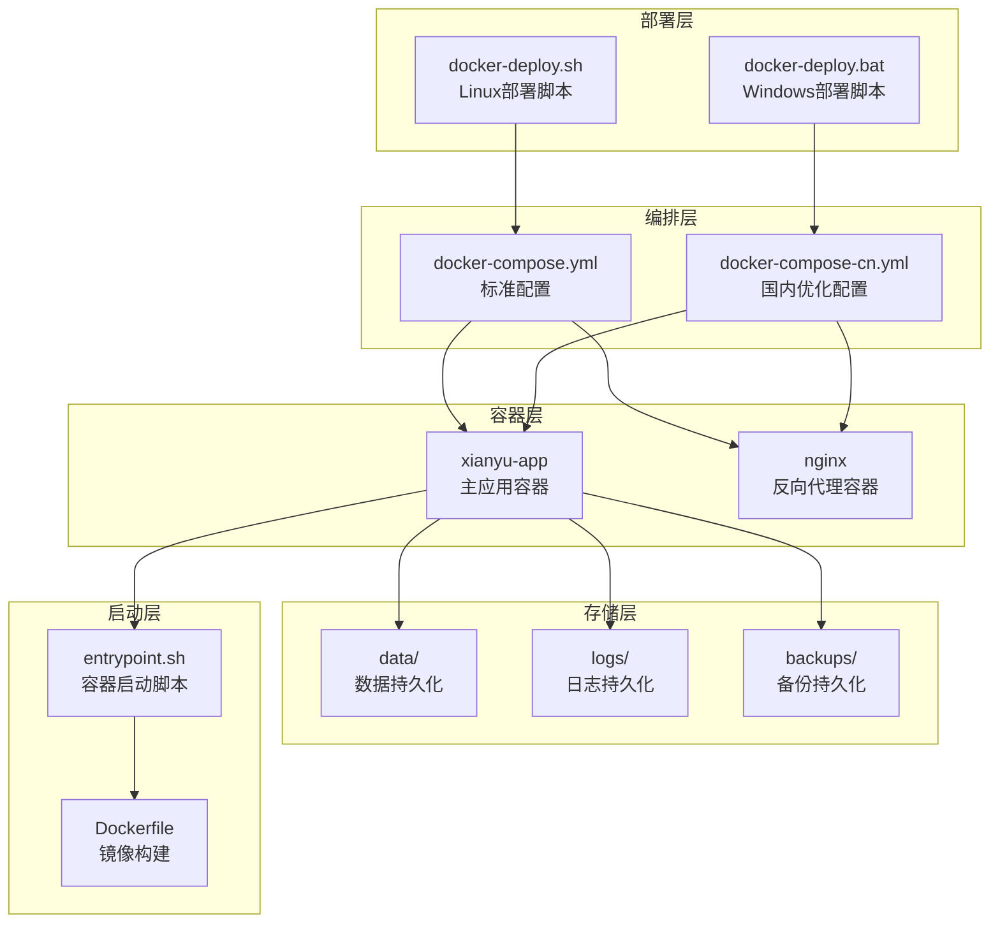
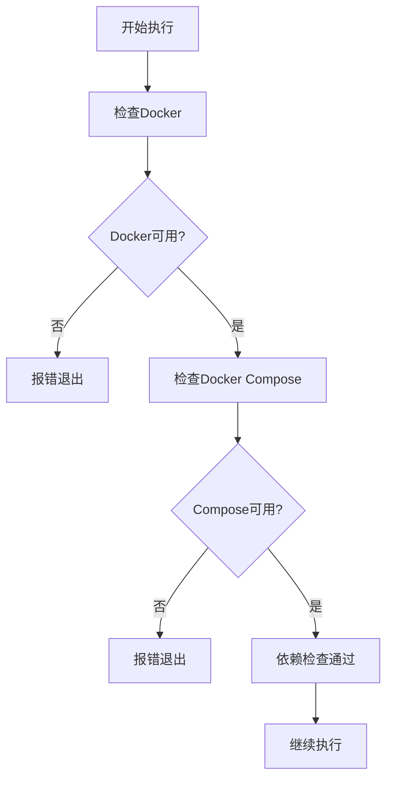
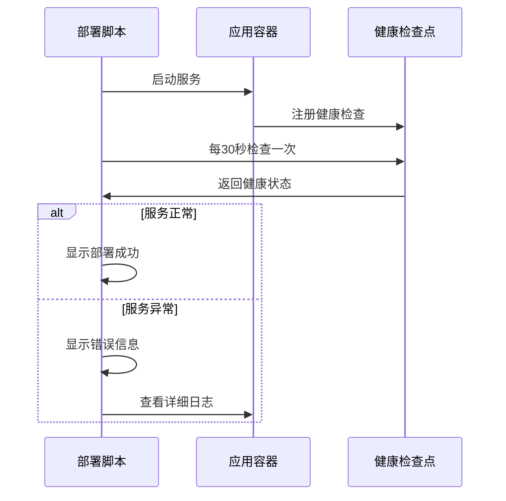
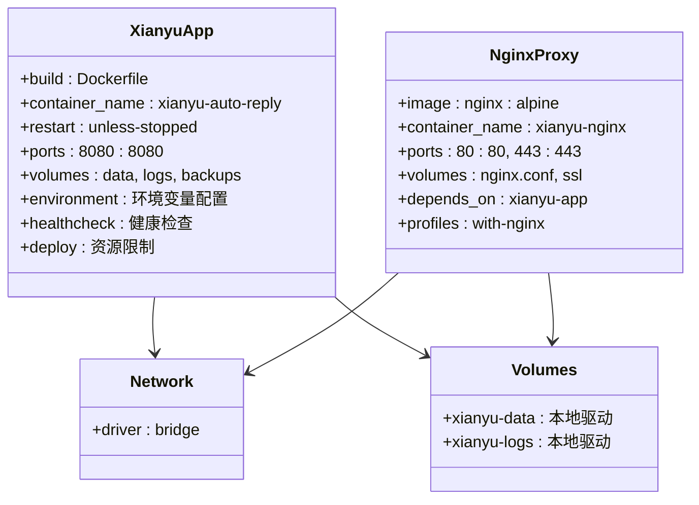
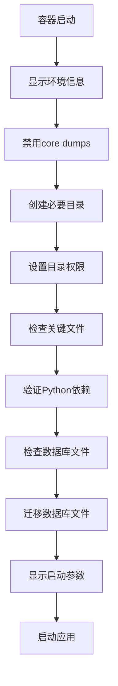
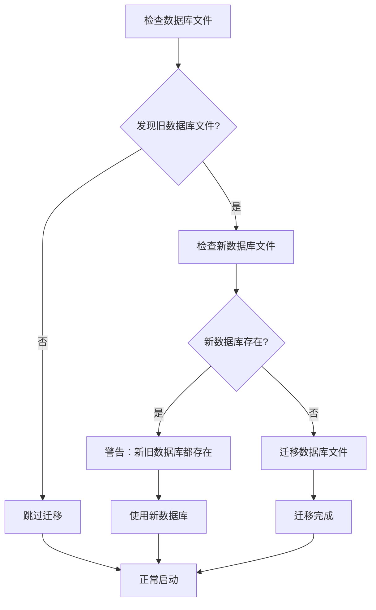
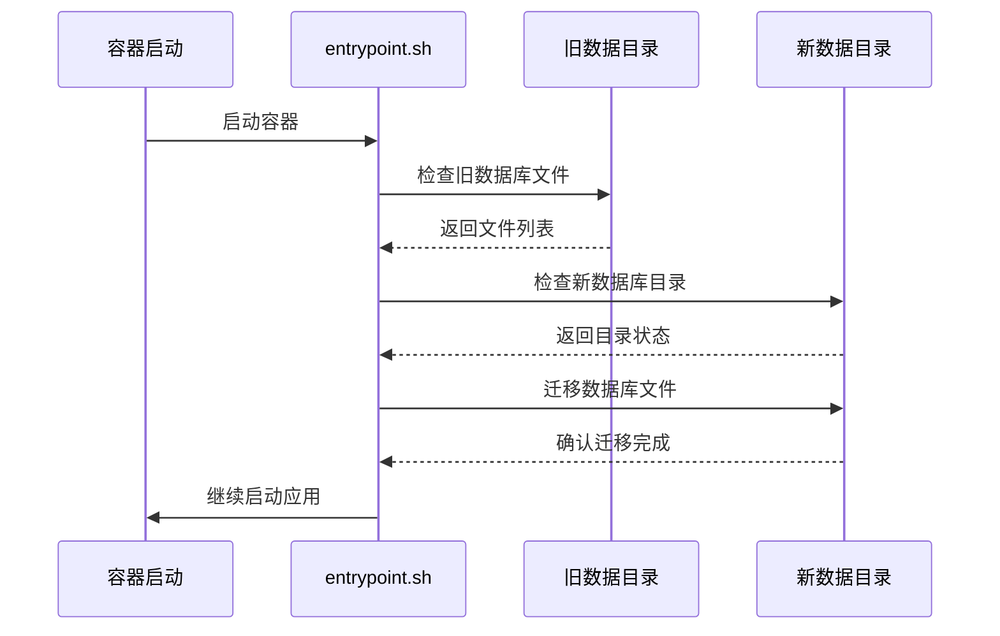
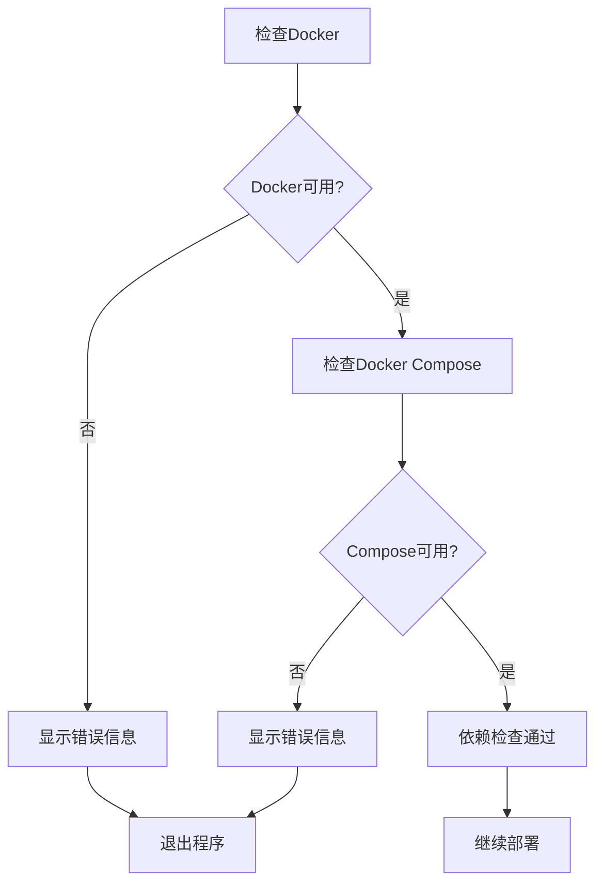

# 部署脚本使用指南

<cite>
**本文档引用的文件**
- [docker-deploy.sh](file://docker-deploy.sh)
- [docker-deploy.bat](file://docker-deploy.bat)
- [docker-compose.yml](file://docker-compose.yml)
- [docker-compose-cn.yml](file://docker-compose-cn.yml)
- [entrypoint.sh](file://entrypoint.sh)
- [Dockerfile](file://Dockerfile)
- [Dockerfile-cn](file://Dockerfile-cn)
- [global_config.yml](file://global_config.yml)
- [README.md](file://README.md)
</cite>

## 目录
1. [简介](#简介)
2. [项目架构概览](#项目架构概览)
3. [部署脚本对比](#部署脚本对比)
4. [Linux部署脚本详解](#linux部署脚本详解)
5. [Windows部署脚本详解](#windows部署脚本详解)
6. [Docker Compose配置分析](#docker-compose配置分析)
7. [Entrypoint启动脚本分析](#entrypoint启动脚本分析)
8. [数据库迁移机制](#数据库迁移机制)
9. [执行权限设置](#执行权限设置)
10. [常见错误与解决方案](#常见错误与解决方案)
11. [最佳实践建议](#最佳实践建议)
12. [故障排除指南](#故障排除指南)

## 简介

闲鱼自动回复系统提供了完整的Docker部署解决方案，包含Linux和Windows两个版本的部署脚本，以及强大的数据库迁移和数据持久化机制。本文档详细说明了自动化部署脚本的使用方法与内部机制。

该系统采用现代化的容器化架构，支持一键部署、自动数据迁移、持久化存储和健康检查等企业级功能。

## 项目架构概览



**图表来源**
- [docker-deploy.sh](file://docker-deploy.sh#L1-L361)
- [docker-deploy.bat](file://docker-deploy.bat#L1-L229)
- [docker-compose.yml](file://docker-compose.yml#L1-L106)
- [entrypoint.sh](file://entrypoint.sh#L1-L94)

## 部署脚本对比

| 特性 | docker-deploy.sh (Linux) | docker-deploy.bat (Windows) |
|------|---------------------------|----------------------------|
| **操作系统支持** | Linux/macOS | Windows |
| **颜色输出** | ANSI颜色支持 | 纯文本输出 |
| **依赖检查** | 自动检测Docker/Compose | 自动检测Docker/Compose |
| **镜像构建** | 支持国内/国际源切换 | 支持国内/国际源切换 |
| **服务管理** | 完整的服务生命周期管理 | 基础服务管理 |
| **日志查看** | 支持实时日志流 | 支持实时日志流 |
| **健康检查** | 内置健康检查功能 | 基础状态检查 |
| **备份功能** | 自动数据备份 | 基础备份功能 |

**节来源**
- [docker-deploy.sh](file://docker-deploy.sh#L37-L223)
- [docker-deploy.bat](file://docker-deploy.bat#L21-L174)

## Linux部署脚本详解

### 脚本结构与功能

docker-deploy.sh是一个功能完整的Docker部署管理脚本，提供以下核心功能：

#### 1. 依赖检查机制



**图表来源**
- [docker-deploy.sh](file://docker-deploy.sh#L37-L48)

#### 2. 配置初始化流程

脚本会检查关键文件的存在性并创建必要的目录结构：

- **关键文件检查**：验证entrypoint.sh和global_config.yml的存在
- **目录创建**：自动创建data、logs、backups、static/uploads/images目录
- **权限设置**：确保容器内具有正确的文件访问权限

#### 3. 镜像构建策略

支持两种构建方式：
- **国际版本**：使用标准Dockerfile构建
- **国内版本**：使用Dockerfile-cn构建，使用国内镜像源

#### 4. 服务编排与管理

提供完整的Docker Compose服务管理功能：

- **启动服务**：支持基础服务和包含Nginx的完整服务
- **停止服务**：优雅关闭所有容器
- **重启服务**：平滑重启应用
- **状态监控**：查看容器运行状态和资源使用情况
- **日志查看**：实时跟踪应用日志

#### 5. 健康检查机制

内置健康检查功能，确保服务正常运行：



**图表来源**
- [docker-deploy.sh](file://docker-deploy.sh#L183-L203)

**节来源**
- [docker-deploy.sh](file://docker-deploy.sh#L37-L361)

## Windows部署脚本详解

### 脚本特色功能

docker-deploy.bat针对Windows环境进行了优化，具有以下特点：

#### 1. 环境适配

- **字符编码**：设置UTF-8编码确保中文显示正常
- **延迟变量**：启用延迟环境变量扩展
- **错误处理**：完善的错误捕获和用户提示

#### 2. 命令行参数处理

支持多种部署模式：
- **快速部署**：直接启动服务
- **指定命令**：支持start、stop、restart、status等命令
- **帮助信息**：提供详细的使用说明

#### 3. Windows兼容性

- **路径处理**：正确处理Windows文件路径分隔符
- **权限管理**：适应Windows文件权限模型
- **进程管理**：使用Windows命令实现容器管理

#### 4. 用户体验优化

- **进度提示**：清晰的执行状态提示
- **错误反馈**：详细的错误信息和解决建议
- **交互式操作**：支持用户确认和输入

**节来源**
- [docker-deploy.bat](file://docker-deploy.bat#L1-L229)

## Docker Compose配置分析

### 标准配置 vs 国内优化配置

两个配置文件的主要区别在于镜像源的选择：

#### 标准配置 (docker-compose.yml)
- 使用官方Docker Hub镜像
- 适合国际用户和海外服务器
- 默认端口：8080
- 支持可选的Nginx反向代理

#### 国内优化配置 (docker-compose-cn.yml)
- 使用阿里云镜像源
- 适合国内用户和服务器
- 默认端口：8080
- 支持可选的Nginx反向代理

### 核心服务配置



**图表来源**
- [docker-compose.yml](file://docker-compose.yml#L2-L106)
- [docker-compose-cn.yml](file://docker-compose-cn.yml#L2-L106)

### 环境变量配置

系统支持丰富的环境变量配置：

| 配置项 | 默认值 | 说明 |
|--------|--------|------|
| WEB_PORT | 8080 | Web服务端口 |
| DB_PATH | /app/data/xianyu_data.db | 数据库文件路径 |
| LOG_LEVEL | INFO | 日志级别 |
| ADMIN_USERNAME | admin | 管理员用户名 |
| ADMIN_PASSWORD | admin123 | 管理员密码 |
| MEMORY_LIMIT | 2048M | 内存限制 |
| CPU_LIMIT | 2.0 | CPU限制 |

**节来源**
- [docker-compose.yml](file://docker-compose.yml#L22-L60)
- [docker-compose-cn.yml](file://docker-compose-cn.yml#L22-L60)

## Entrypoint启动脚本分析

### 启动流程详解

entrypoint.sh是Docker容器的入口脚本，负责容器启动前的所有准备工作：



**图表来源**
- [entrypoint.sh](file://entrypoint.sh#L1-L94)

### 数据库迁移机制

脚本实现了智能的数据库迁移功能：

#### 1. 旧版文件检测



**图表来源**
- [entrypoint.sh](file://entrypoint.sh#L51-L75)

#### 2. 迁移策略

- **主数据库迁移**：将xianyu_data.db从根目录迁移到data目录
- **统计数据库迁移**：迁移user_stats.db文件
- **备份文件迁移**：自动迁移所有备份文件
- **冲突处理**：当新旧数据库都存在时，使用新数据库并警告用户

### 权限管理

脚本确保容器内具有正确的文件访问权限：

- **目录权限**：设置777权限确保容器内应用可以读写
- **文件权限**：确保关键文件具有适当的访问权限
- **安全考虑**：虽然设置宽松权限简化部署，但建议在生产环境中调整权限设置

**节来源**
- [entrypoint.sh](file://entrypoint.sh#L1-L94)

## 数据库迁移机制

### 迁移触发条件

数据库迁移会在以下情况下触发：

1. **首次部署**：容器首次启动时检测到旧版数据库文件
2. **版本升级**：从旧版本升级到新版本时
3. **目录结构调整**：系统重构导致数据目录变更

### 迁移过程



**图表来源**
- [entrypoint.sh](file://entrypoint.sh#L51-L75)

### 数据完整性保障

- **原子操作**：迁移过程中确保数据一致性
- **备份机制**：迁移前自动备份原始文件
- **回滚支持**：出现问题时可以回滚到原始状态
- **冲突解决**：当新旧数据库都存在时，提供明确的处理策略

**节来源**
- [entrypoint.sh](file://entrypoint.sh#L51-L75)

## 执行权限设置

### Linux系统权限配置

对于Linux用户，需要为部署脚本设置执行权限：

```bash
# 设置执行权限
chmod +x docker-deploy.sh

# 或者使用更严格的权限
chmod 755 docker-deploy.sh
```

### Windows系统权限配置

Windows系统通常不需要额外设置执行权限，但需要注意：

- **PowerShell执行策略**：可能需要调整执行策略允许脚本运行
- **管理员权限**：某些操作可能需要管理员权限
- **防火墙设置**：确保Docker端口8080开放

### 权限检查机制

两个部署脚本都包含了依赖检查功能：



**图表来源**
- [docker-deploy.sh](file://docker-deploy.sh#L37-L48)
- [docker-deploy.bat](file://docker-deploy.bat#L21-L36)

**节来源**
- [docker-deploy.sh](file://docker-deploy.sh#L37-L48)
- [docker-deploy.bat](file://docker-deploy.bat#L21-L36)

## 常见错误与解决方案

### 镜像拉取失败

#### 症状
- Docker Compose构建过程中出现网络错误
- 镜像下载速度极慢或失败

#### 解决方案

**Linux用户：**
```bash
# 使用国内镜像源
./docker-deploy.sh build --use-cn

# 或者直接使用国内配置文件
docker-compose -f docker-compose-cn.yml build --no-cache
```

**Windows用户：**
```cmd
# 使用国内镜像源
docker-deploy.bat build --use-cn
```

### 端口冲突

#### 症状
- 服务启动时提示端口已被占用
- 访问应用时出现连接错误

#### 解决方案

**临时解决方案：**
```bash
# 查找占用端口的进程
lsof -i :8080  # Linux/MacOS
netstat -ano | findstr :8080  # Windows

# 终止占用进程或更改端口
export WEB_PORT=8081
./docker-deploy.sh start
```

**永久解决方案：**
修改docker-compose.yml中的端口映射：
```yaml
ports:
  - "8081:8080"  # 将8080改为其他可用端口
```

### 权限问题

#### 症状
- 容器启动后无法访问数据文件
- 日志显示权限拒绝错误

#### 解决方案

**Linux系统：**
```bash
# 检查目录权限
ls -la data/ logs/ backups/

# 修复权限
sudo chown -R $USER:$USER data logs backups
sudo chmod -R 755 data logs backups
```

**Windows系统：**
```cmd
# 检查文件属性
dir data\ logs\ backups\

# 修复权限
icacls data /grant Users:F
icacls logs /grant Users:F
icacls backups /grant Users:F
```

### 内存不足

#### 症状
- 容器频繁被OOM killer终止
- 应用响应缓慢或崩溃

#### 解决方案

**临时调整：**
```bash
# 增加内存限制
export MEMORY_LIMIT=4096
./docker-deploy.sh start
```

**永久配置：**
编辑docker-compose.yml：
```yaml
deploy:
  resources:
    limits:
      memory: 4G
    reservations:
      memory: 1G
```

### 数据库锁定

#### 症状
- 应用启动时提示数据库锁定
- 数据库操作超时

#### 解决方案

**强制解锁：**
```bash
# 停止服务
./docker-deploy.sh stop

# 删除锁定文件
rm -f data/*.lock

# 重启服务
./docker-deploy.sh start
```

**预防措施：**
```bash
# 定期清理锁定文件
find data/ -name "*.lock" -delete
```

**节来源**
- [docker-deploy.sh](file://docker-deploy.sh#L37-L48)
- [docker-deploy.bat](file://docker-deploy.bat#L21-L36)

## 最佳实践建议

### 部署前准备

#### 1. 系统要求检查
- **Docker版本**：确保Docker 20.10+和Docker Compose 2.0+
- **硬件要求**：至少2GB内存，10GB可用存储空间
- **网络连接**：稳定的互联网连接用于镜像下载

#### 2. 环境变量配置
创建.env文件配置环境变量：
```bash
# 基础配置
WEB_PORT=8080
TZ=Asia/Shanghai

# 数据库配置
DB_PATH=/app/data/xianyu_data.db

# 管理员配置
ADMIN_USERNAME=admin
ADMIN_PASSWORD=your-strong-password
JWT_SECRET_KEY=your-secret-key

# 功能开关
AUTO_REPLY_ENABLED=true
AUTO_DELIVERY_ENABLED=true
AI_REPLY_ENABLED=false

# 日志配置
LOG_LEVEL=INFO
SQL_LOG_ENABLED=true

# 资源限制
MEMORY_LIMIT=2048
CPU_LIMIT=2.0
```

#### 3. 存储规划
- **数据目录**：预留足够的存储空间用于数据和日志
- **备份策略**：定期备份重要数据文件
- **监控空间**：设置磁盘空间监控告警

### 生产环境部署

#### 1. 安全配置
```bash
# 修改默认管理员密码
export ADMIN_PASSWORD=your-complex-password

# 设置更强的JWT密钥
export JWT_SECRET_KEY=$(openssl rand -hex 32)

# 启用HTTPS（需要配置Nginx）
docker-compose -f docker-compose.yml -f docker-compose-ssl.yml up -d
```

#### 2. 监控配置
```bash
# 启用健康检查
docker-compose exec xianyu-app curl -f http://localhost:8080/health

# 监控资源使用
docker stats $(docker-compose ps -q)
```

#### 3. 备份策略
```bash
# 创建定时备份脚本
#!/bin/bash
BACKUP_DIR="/backup/xianyu-auto-reply/$(date +%Y%m%d_%H%M%S)"
mkdir -p $BACKUP_DIR

# 备份数据
docker-compose stop
cp -r data/ $BACKUP_DIR/
cp -r logs/ $BACKUP_DIR/
cp global_config.yml $BACKUP_DIR/
docker-compose start

# 清理旧备份（保留30天）
find /backup/xianyu-auto-reply/ -type d -mtime +30 -exec rm -rf {} \;
```

### 维护最佳实践

#### 1. 定期更新
```bash
# 检查更新
./docker-deploy.sh update

# 或手动更新
./docker-deploy.sh stop
docker pull registry.cn-shanghai.aliyuncs.com/zhinian-software/xianyu-auto-reply:latest
./docker-deploy.sh start
```

#### 2. 性能优化
```bash
# 优化数据库
docker-compose exec xianyu-app sqlite3 /app/data/xianyu_data.db "VACUUM;"
docker-compose exec xianyu-app sqlite3 /app/data/xianyu_data.db "PRAGMA optimize;"

# 清理临时文件
docker-compose exec xianyu-app find /app/data/ -name "*.tmp" -delete
```

#### 3. 日志管理
```bash
# 旋转日志
docker-compose exec xianyu-app logrotate /app/logrotate.conf

# 清理旧日志
find logs/ -name "*.log" -mtime +7 -delete
```

## 故障排除指南

### 常见诊断步骤

#### 1. 检查容器状态
```bash
# 查看容器运行状态
./docker-deploy.sh status

# 或使用Docker命令
docker-compose ps
docker ps -a
```

#### 2. 查看详细日志
```bash
# 查看实时日志
./docker-deploy.sh logs

# 查看特定服务日志
./docker-deploy.sh logs xianyu-app

# 查看最近100行日志
docker-compose logs --tail=100 xianyu-app
```

#### 3. 检查网络连接
```bash
# 测试容器间通信
docker-compose exec xianyu-app ping xianyu-app

# 检查端口监听
docker-compose exec xianyu-app netstat -tlnp
```

### 深度故障排查

#### 1. 容器内部诊断
```bash
# 进入容器调试
docker-compose exec xianyu-app bash

# 检查文件系统
df -h
ls -la /app/data/
cat /proc/meminfo
cat /proc/cpuinfo
```

#### 2. 网络问题排查
```bash
# 检查DNS解析
docker-compose exec xianyu-app nslookup localhost

# 测试外部连接
docker-compose exec xianyu-app curl -I https://www.goofish.com
```

#### 3. 数据库问题排查
```bash
# 检查数据库文件
docker-compose exec xianyu-app sqlite3 /app/data/xianyu_data.db ".tables"

# 检查数据库完整性
docker-compose exec xianyu-app sqlite3 /app/data/xianyu_data.db "PRAGMA integrity_check;"

# 分析数据库性能
docker-compose exec xianyu-app sqlite3 /app/data/xianyu_data.db "EXPLAIN QUERY PLAN SELECT * FROM messages WHERE user_id = 1;"
```

### 性能问题诊断

#### 1. 资源使用分析
```bash
# 监控资源使用
docker stats --no-stream $(docker-compose ps -q)

# 检查内存泄漏
docker-compose exec xianyu-app cat /proc/meminfo | head -10
```

#### 2. 数据库性能优化
```bash
# 分析慢查询
docker-compose exec xianyu-app sqlite3 /app/data/xianyu_data.db "EXPLAIN QUERY PLAN SELECT * FROM messages ORDER BY created_at DESC LIMIT 10;"

# 优化索引
docker-compose exec xianyu-app sqlite3 /app/data/xianyu_data.db "CREATE INDEX IF NOT EXISTS idx_messages_user_id ON messages(user_id);"
```

### 恢复操作指南

#### 1. 服务恢复
```bash
# 重启服务
./docker-deploy.sh restart

# 如果重启无效
./docker-deploy.sh stop
./docker-deploy.sh start
```

#### 2. 数据恢复
```bash
# 从备份恢复
./docker-deploy.sh stop
cp -r backups/latest/data/* data/
cp -r backups/latest/logs/* logs/
./docker-deploy.sh start
```

#### 3. 完全重置
```bash
# 清理环境（谨慎使用）
./docker-deploy.sh cleanup

# 重新部署
./docker-deploy.sh init
./docker-deploy.sh start
```

**节来源**
- [docker-deploy.sh](file://docker-deploy.sh#L118-L141)
- [docker-deploy.bat](file://docker-deploy.bat#L115-L131)

## 结论

闲鱼自动回复系统的部署脚本提供了完整的一键部署解决方案，通过Linux和Windows两个版本的部署脚本，满足不同操作系统的部署需求。系统采用Docker容器化架构，结合智能的数据库迁移机制和持久化存储策略，确保了部署的简便性和数据的安全性。

通过本文档的详细说明，用户可以：

1. **掌握部署脚本的使用方法**：了解Linux和Windows部署脚本的功能差异和使用技巧
2. **理解内部工作机制**：深入了解Docker Compose编排、Entrypoint启动脚本和数据库迁移机制
3. **解决常见问题**：获得针对各种错误场景的解决方案和最佳实践建议
4. **进行有效维护**：建立完善的监控、备份和故障排除体系

建议用户在生产环境中部署时，根据实际需求调整配置参数，建立完善的监控和备份策略，并定期进行系统维护和更新，以确保系统的稳定运行和数据安全。