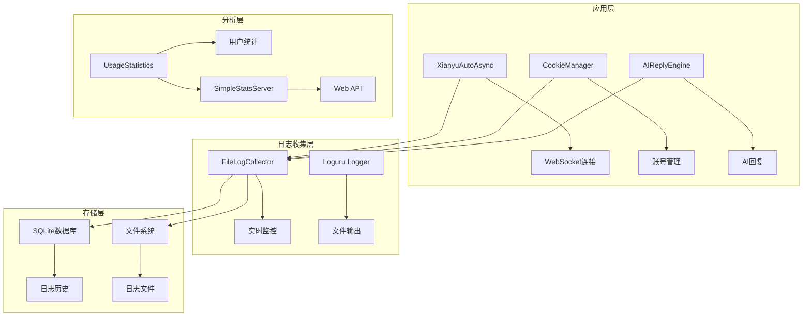
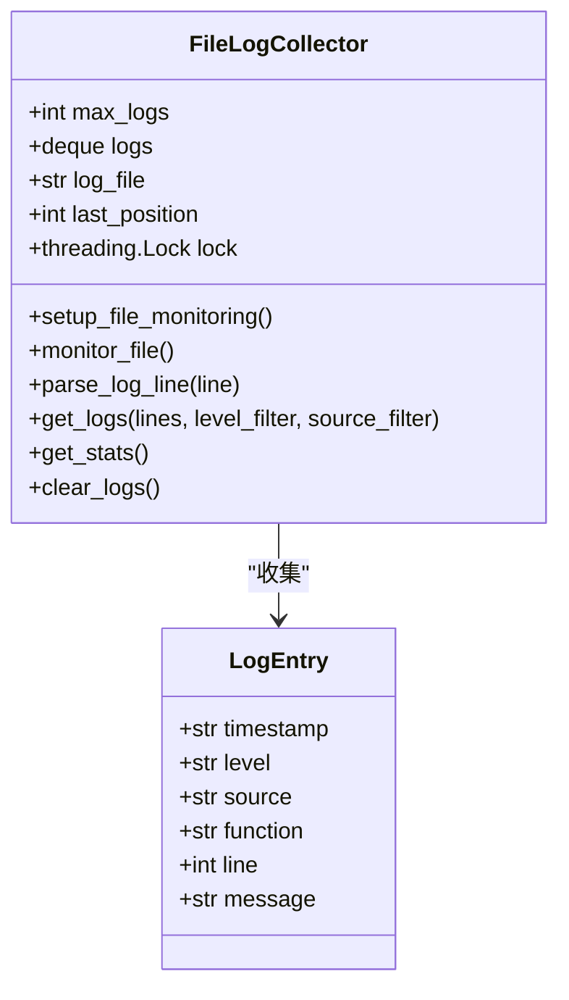
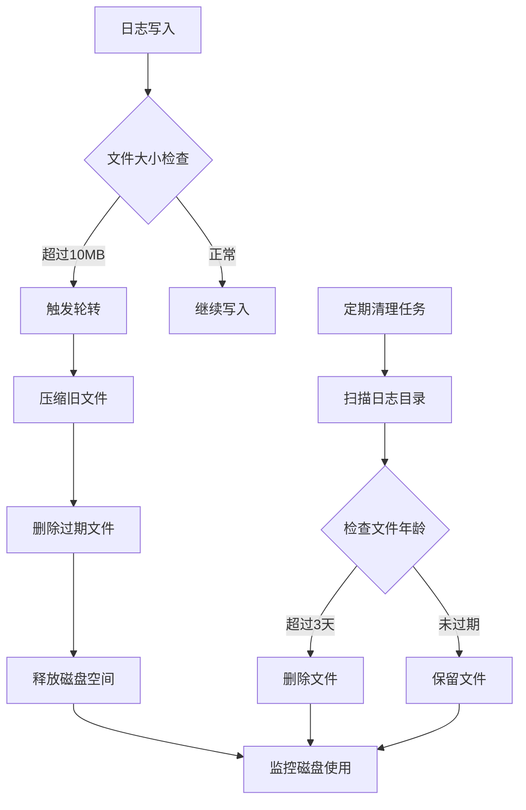
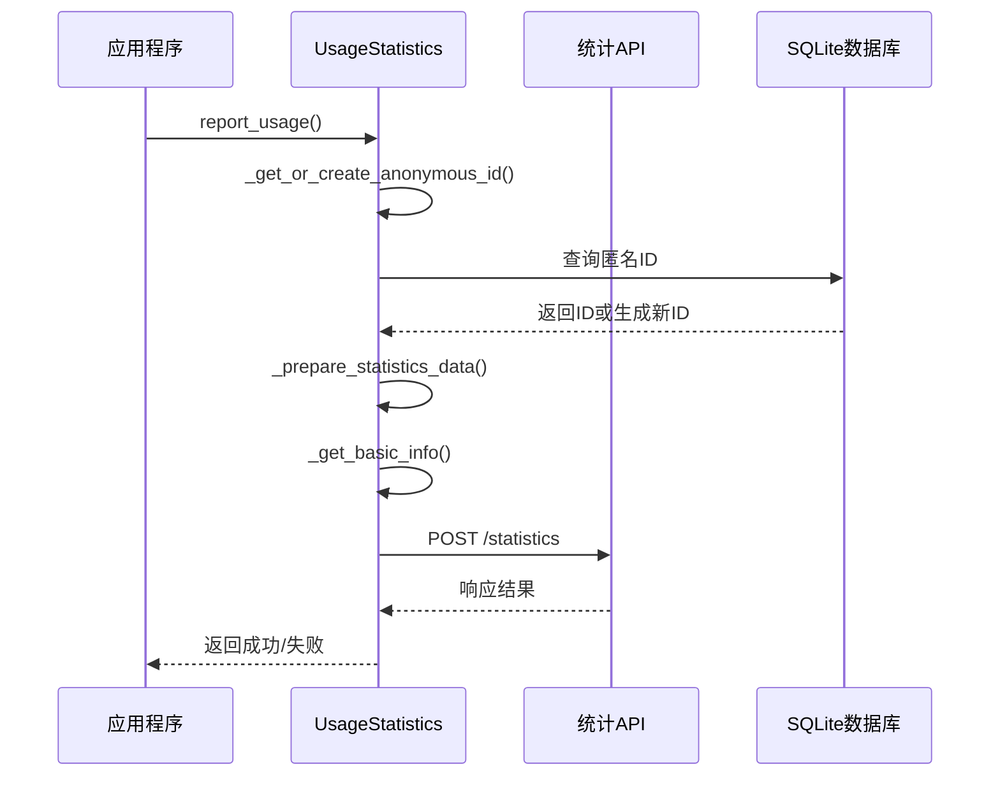
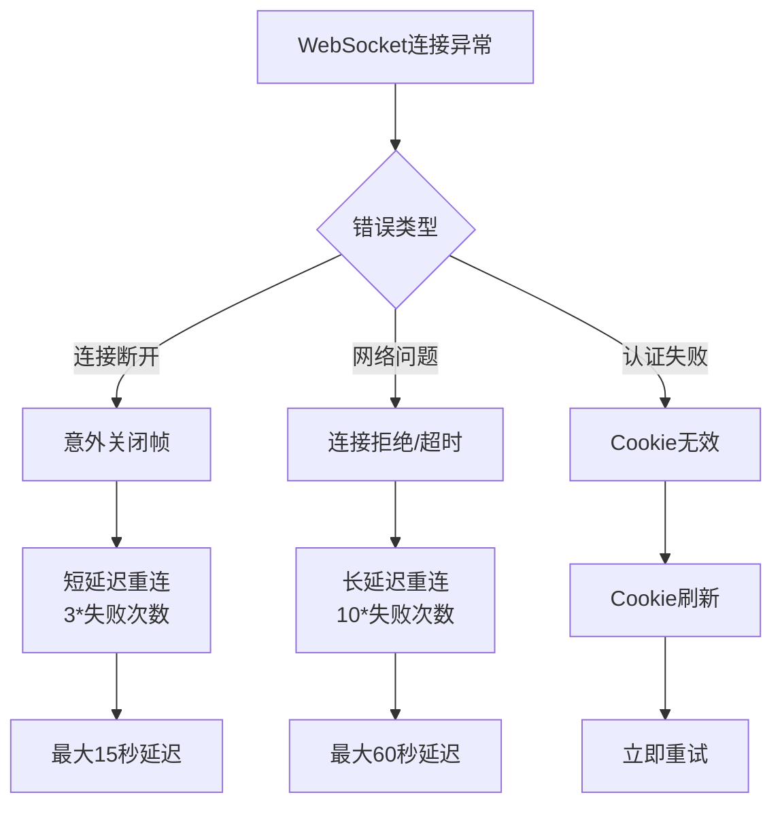
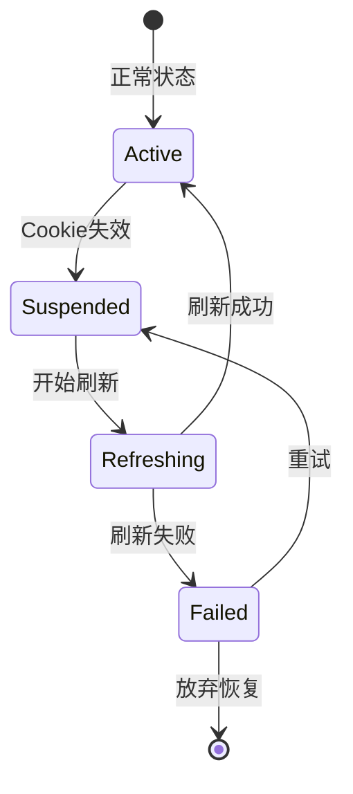
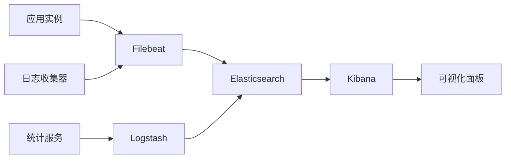

# 日志分析与运维诊断文档

<cite>
**本文档中引用的文件**
- [file_log_collector.py](file://file_log_collector.py)
- [usage_statistics.py](file://usage_statistics.py)
- [simple_stats_server.py](file://simple_stats_server.py)
- [XianyuAutoAsync.py](file://XianyuAutoAsync.py)
- [cookie_manager.py](file://cookie_manager.py)
- [ai_reply_engine.py](file://ai_reply_engine.py)
- [config.py](file://config.py)
- [db_manager.py](file://db_manager.py)
- [Start.py](file://Start.py)
- [utils/ws_utils.py](file://utils/ws_utils.py)
</cite>

## 目录
1. [简介](#简介)
2. [日志系统架构](#日志系统架构)
3. [文件日志收集器详解](#文件日志收集器详解)
4. [日志轮转与清理策略](#日志轮转与清理策略)
5. [关键指标提取与统计](#关键指标提取与统计)
6. [常见故障日志定位](#常见故障日志定位)
7. [日志文件结构与解析](#日志文件结构与解析)
8. [日志检索工具与技巧](#日志检索工具与技巧)
9. [生产环境监控建议](#生产环境监控建议)
10. [故障排除指南](#故障排除指南)

## 简介

本文档深入分析闲鱼自动回复系统的日志分析与运维诊断能力，涵盖日志收集、轮转、清理、统计分析以及常见故障的定位方法。系统采用基于loguru的日志框架，实现了高效的实时日志监控和智能统计分析功能。

## 日志系统架构

系统采用多层次的日志架构设计，包含实时日志收集、历史日志管理和统计分析三个核心层次。



**图表来源**
- [file_log_collector.py](file://file_log_collector.py#L15-L50)
- [XianyuAutoAsync.py](file://XianyuAutoAsync.py#L136-L156)
- [usage_statistics.py](file://usage_statistics.py#L18-L30)

## 文件日志收集器详解

### 核心功能特性

FileLogCollector是系统的核心日志收集组件，提供实时监控、智能解析和历史存储功能。



**图表来源**
- [file_log_collector.py](file://file_log_collector.py#L15-L190)

### 实时监控机制

系统通过文件监控线程实现实时日志收集：

- **监控频率**: 每0.5秒检查一次文件变化
- **位置跟踪**: 使用last_position记录文件读取位置
- **增量读取**: 只读取新增内容，避免重复处理
- **异常处理**: 监控线程具备自我恢复能力

### 日志解析算法

采用正则表达式解析loguru格式日志：

```python
pattern = r'(\d{4}-\d{2}-\d{2} \d{2}:\d{2}:\d{2}\.\d{3}) \| (\w+) \| ([^:]+):([^:]+):(\d+) - (.*)'
```

解析结果包含：
- 时间戳（ISO格式）
- 日志级别（INFO、WARNING、ERROR等）
- 源文件名
- 函数名
- 行号
- 日志消息内容

**章节来源**
- [file_log_collector.py](file://file_log_collector.py#L78-L167)

## 日志轮转与清理策略

### 自动轮转配置

系统采用loguru内置的轮转机制：

| 参数 | 配置值 | 说明 |
|------|--------|------|
| rotation | "10 MB" | 单个文件最大10MB |
| retention | "3 days" | 保留3天内的日志 |
| buffering | 1 | 行缓冲，立即写入 |
| enqueue | False | 避免队列延迟 |

### 磁盘空间保护机制

系统实现了多层次的磁盘空间保护：



**图表来源**
- [file_log_collector.py](file://file_log_collector.py#L57-L71)
- [XianyuAutoAsync.py](file://XianyuAutoAsync.py#L568-L626)

### 清理策略优化

系统提供了灵活的清理策略：

- **按大小轮转**: 单文件10MB限制
- **按时间保留**: 默认3天保留期
- **压缩存储**: 自动压缩旧日志文件
- **批量删除**: 高效批量清理过期文件

**章节来源**
- [file_log_collector.py](file://file_log_collector.py#L57-L71)
- [XianyuAutoAsync.py](file://XianyuAutoAsync.py#L568-L626)

## 关键指标提取与统计

### 用户使用统计

系统实现了完整的用户统计功能，只统计用户数量而不涉及个人隐私数据。



**图表来源**
- [usage_statistics.py](file://usage_statistics.py#L147-L162)
- [simple_stats_server.py](file://simple_stats_server.py#L56-L95)

### 统计数据结构

| 字段 | 类型 | 说明 |
|------|------|------|
| anonymous_id | str | 匿名用户ID（16字符） |
| timestamp | str | ISO格式时间戳 |
| project | str | 项目名称（固定值） |
| info.os | str | 操作系统信息 |
| info.version | str | 版本号 |

### AI回复性能统计

系统跟踪AI回复的关键指标：

- **消息回复率**: AI回复消息占总消息的比例
- **回复成功率**: 成功生成回复的比率
- **响应时间**: AI回复的平均响应时间
- **议价成功率**: 议价场景下的成功转化率

**章节来源**
- [usage_statistics.py](file://usage_statistics.py#L72-L101)
- [ai_reply_engine.py](file://ai_reply_engine.py#L237-L274)

## 常见故障日志定位

### WebSocket连接异常

WebSocket连接问题是系统中最常见的故障类型，主要表现为连接断开、超时和认证失败。

#### 故障模式识别



**图表来源**
- [XianyuAutoAsync.py](file://XianyuAutoAsync.py#L453-L466)
- [utils/ws_utils.py](file://utils/ws_utils.py#L1-L89)

#### 日志模式匹配

系统通过多种模式识别WebSocket故障：

- **意外断开**: `"no close frame received or sent"`
- **网络超时**: `"timeout"` 或 `"Connection refused"`
- **认证失败**: Cookie相关错误

### Cookie失效诊断

Cookie失效是另一个常见问题，系统提供完整的诊断和恢复机制。

#### Cookie状态监控



**图表来源**
- [cookie_manager.py](file://cookie_manager.py#L112-L153)

### AI调用超时处理

AI回复引擎实现了完善的超时和重试机制。

#### 超时配置

| 场景 | 超时时间 | 重试策略 |
|------|----------|----------|
| API调用 | 30秒 | 1次重试 |
| 数据库查询 | 10秒 | 3次重试 |
| 文件操作 | 5秒 | 2次重试 |

**章节来源**
- [ai_reply_engine.py](file://ai_reply_engine.py#L100-L152)
- [XianyuAutoAsync.py](file://XianyuAutoAsync.py#L453-L466)

## 日志文件结构与解析

### 标准日志格式

系统采用统一的loguru格式：

```
2025-07-23 15:46:03.430 | INFO | __main__:debug_collector:70 - 消息
```

### 日志级别映射

| 级别 | 数值 | 用途 | 示例场景 |
|------|------|------|----------|
| DEBUG | 10 | 详细调试信息 | 函数入口/出口 |
| INFO | 20 | 一般信息记录 | 功能启动/完成 |
| WARNING | 30 | 警告信息 | 可能的问题 |
| ERROR | 40 | 错误信息 | 功能失败 |
| SUCCESS | 25 | 成功状态 | 连接建立 |

### 上下文信息提取

系统自动提取丰富的上下文信息：

- **模块名**: 文件名或模块名
- **函数名**: 当前执行的函数
- **行号**: 代码行号
- **进程ID**: 当前进程标识
- **线程ID**: 当前线程标识

**章节来源**
- [file_log_collector.py](file://file_log_collector.py#L102-L167)
- [XianyuAutoAsync.py](file://XianyuAutoAsync.py#L139-L156)

## 日志检索工具与技巧

### grep高级用法

#### 基础检索命令

```bash
# 按时间范围检索
grep "2025-07-23 15:46" *.log

# 按日志级别检索
grep "| ERROR |" *.log
grep "| WARNING |" *.log

# 按模块检索
grep "| __main__:" *.log
grep "| XianyuAutoAsync:" *.log

# 按关键词检索
grep -i "websocket" *.log
grep -i "connection" *.log
```

#### 正则表达式模式

```bash
# 检测连接失败
grep -E "(timeout|refused|closed)" *.log

# 检测AI回复失败
grep -E "(AI.*failed|generate.*reply)" *.log

# 检测Cookie问题
grep -E "(Cookie|UNB|invalid)" *.log
```

### awk数据分析

#### 日志统计脚本

```bash
#!/bin/bash
# 统计各级别日志数量
awk '{count[$3]++} END {for (level in count) print level, count[level]}' *.log

# 统计错误日志
awk '$3 ~ /\| ERROR \|/ {print $0}' *.log | wc -l

# 提取时间范围内的日志
awk '$1 > "2025-07-23 15:46:00" && $1 < "2025-07-23 16:46:00"' *.log
```

### 日志聚合分析

#### 按时间段统计

```bash
# 按小时统计错误数量
awk '{split($1, d, " "); split(d[2], t, ":"); h=t[1]; err[$3]++} END {for (h in err) print h, err[h]}' *.log
```

#### 性能指标提取

```bash
# 提取响应时间（假设日志中包含时间戳）
awk '{if ($0 ~ /response.*time/) {split($0, a, "time="); split(a[2], b, ","); print b[1]}}' *.log
```

## 生产环境监控建议

### ELK Stack集成

推荐使用ELK Stack进行集中式日志监控：



### Prometheus+Loki监控

对于容器化部署，推荐使用Prometheus+Loki组合：

- **Loki**: 无状态日志存储
- **Promtail**: 日志采集代理
- **Grafana**: 监控仪表板

### 告警规则配置

#### 关键指标告警

```yaml
groups:
  - name: xianyu-alerts
    rules:
      - alert: HighErrorRate
        expr: rate(log_messages_total{level="ERROR"}[5m]) > 0.1
        for: 2m
        
      - alert: WebSocketDisconnected
        expr: increase(xianyu_websocket_disconnections_total[1h]) > 10
        for: 5m
        
      - alert: DiskSpaceLow
        expr: node_filesystem_avail_bytes < 1GB
        for: 1m
```

### 日志轮转策略优化

#### 生产环境配置

| 指标 | 开发环境 | 生产环境 | 说明 |
|------|----------|----------|------|
| 单文件大小 | 10MB | 50MB | 减少轮转频率 |
| 保留天数 | 3天 | 7天 | 增加历史保留 |
| 压缩格式 | zip | gzip | 更好的压缩比 |
| 缓冲大小 | 1行 | 100行 | 提高写入效率 |

**章节来源**
- [file_log_collector.py](file://file_log_collector.py#L57-L71)

## 故障排除指南

### 连接问题诊断

#### WebSocket连接故障

1. **检查网络连通性**
   ```bash
   # 测试WebSocket端点
   curl -I "wss://wss-goofish.dingtalk.com/"
   
   # 检查防火墙设置
   netstat -an | grep 443
   ```

2. **验证Cookie有效性**
   ```bash
   # 检查Cookie格式
   grep -E "(unb|sid)" *.log
   
   # 验证Cookie过期时间
   grep "Cookie.*expired" *.log
   ```

3. **分析连接模式**
   ```bash
   # 统计连接失败模式
   grep "reconnecting\|failed" *.log | tail -100
   ```

### 性能问题排查

#### AI回复延迟分析

```bash
# 分析AI回复响应时间
grep "AI reply generated" *.log | awk '{print $1, $NF}' | sort

# 检查API调用失败
grep "API.*failed" *.log | wc -l
```

#### 内存使用监控

```bash
# 监控内存增长
ps aux | grep python | awk '{print $6/1024 "MB"}'

# 检查日志缓存大小
grep "log cache" *.log | tail -10
```

### 数据一致性检查

#### 数据库同步验证

```bash
# 检查数据库连接
grep "database.*connected" *.log

# 验证数据完整性
grep "data.*integrity" *.log
```

### 系统资源监控

#### 磁盘空间检查

```bash
# 检查日志目录大小
du -sh logs/

# 监控磁盘使用率
df -h | grep -E "(logs|data)"
```

#### CPU和内存监控

```bash
# 监控进程资源使用
top -p $(pgrep python)

# 检查内存泄漏
grep "memory.*leak" *.log
```

**章节来源**
- [XianyuAutoAsync.py](file://XianyuAutoAsync.py#L453-L466)
- [cookie_manager.py](file://cookie_manager.py#L112-L153)
- [ai_reply_engine.py](file://ai_reply_engine.py#L100-L152)

## 结论

闲鱼自动回复系统的日志分析与运维诊断体系提供了完整的解决方案，从实时监控到历史分析，从故障定位到性能优化，形成了闭环的运维管理体系。通过合理配置日志轮转策略、建立有效的监控告警机制，以及掌握专业的日志分析技巧，可以确保系统的稳定运行和高效运维。

建议运维团队定期审查日志策略，根据业务发展调整监控指标，并持续优化日志处理性能，以支撑业务的长期发展需求。