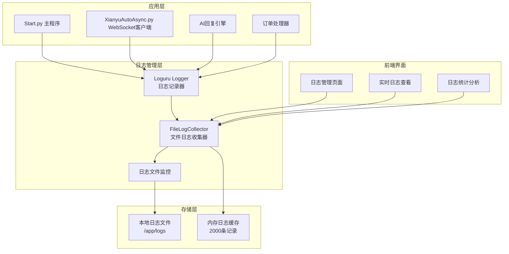
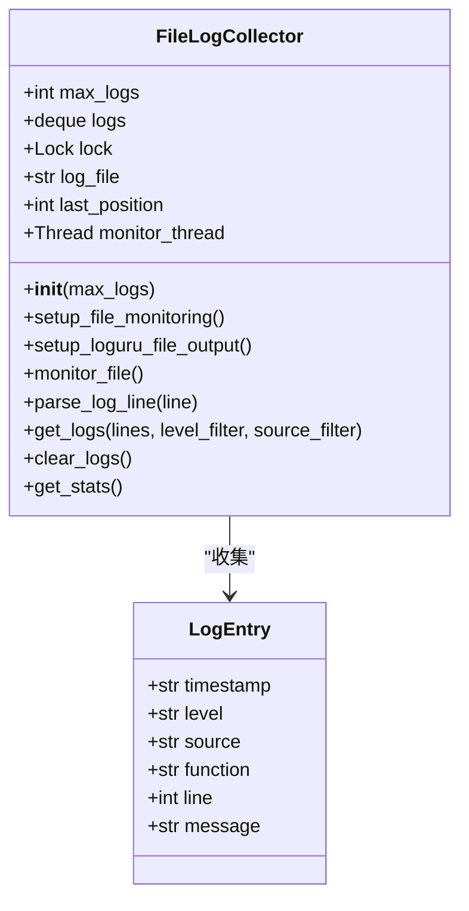
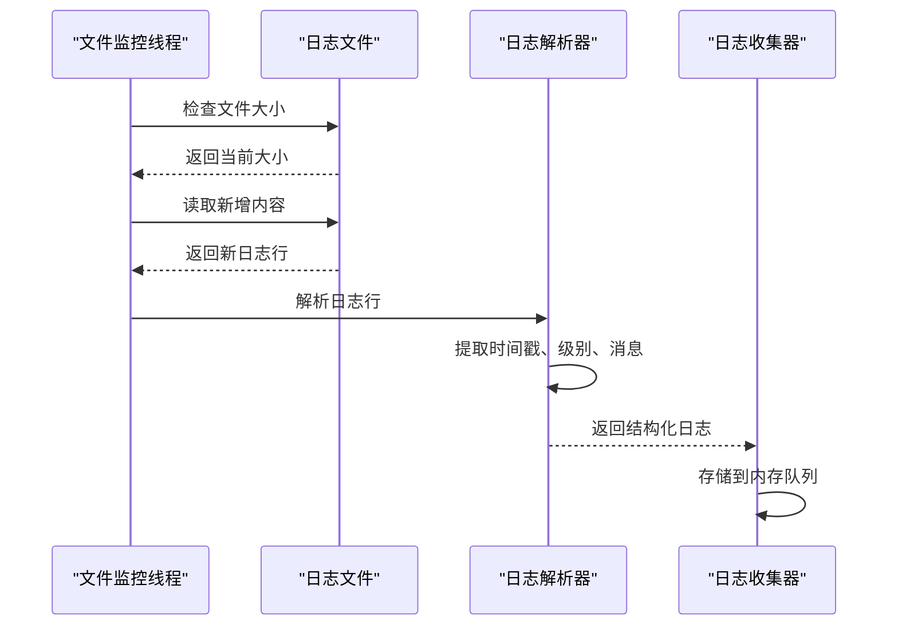
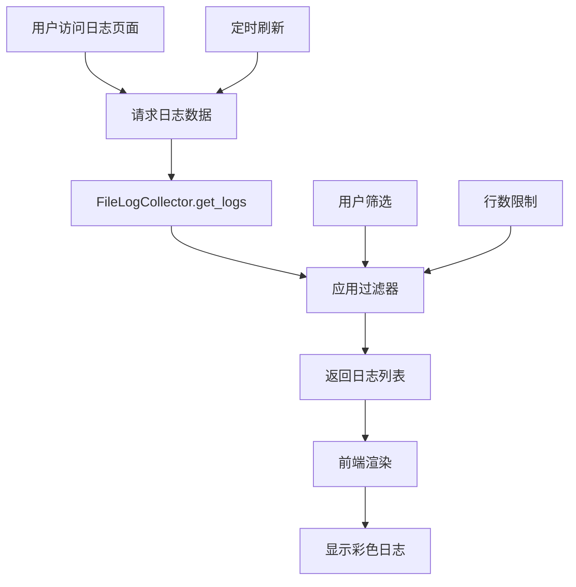
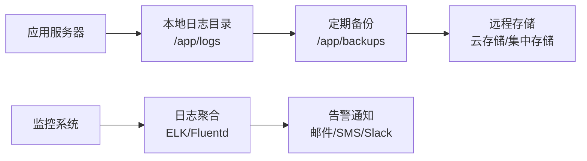

# 日志管理

<cite>
**本文档中引用的文件**
- [entrypoint.sh](file://entrypoint.sh)
- [file_log_collector.py](file://file_log_collector.py)
- [config.py](file://config.py)
- [global_config.yml](file://global_config.yml)
- [Start.py](file://Start.py)
- [XianyuAutoAsync.py](file://XianyuAutoAsync.py)
- [ai_reply_engine.py](file://ai_reply_engine.py)
- [order_status_handler.py](file://order_status_handler.py)
- [utils/xianyu_slider_stealth.py](file://utils/xianyu_slider_stealth.py)
- [static/css/logs.css](file://static/css/logs.css)
- [static/js/app.js](file://static/js/app.js)
</cite>

## 目录
1. [简介](#简介)
2. [系统架构概览](#系统架构概览)
3. [日志存储结构](#日志存储结构)
4. [日志收集器详解](#日志收集器详解)
5. [日志级别与配置](#日志级别与配置)
6. [日志监控与分析](#日志监控与分析)
7. [常见问题诊断](#常见问题诊断)
8. [生产环境部署指南](#生产环境部署指南)
9. [故障排除](#故障排除)
10. [最佳实践](#最佳实践)

## 简介

闲鱼自动回复系统采用了一套完整的日志管理体系，通过多层次的日志收集、存储和分析机制，为系统的稳定运行和问题诊断提供了强有力的支持。本系统主要使用loguru库进行日志记录，并实现了专门的日志收集器来统一管理和监控所有日志输出。

## 系统架构概览



**图表来源**
- [Start.py](file://Start.py#L517-L519)
- [file_log_collector.py](file://file_log_collector.py#L15-L29)

## 日志存储结构

### 目录权限设置

系统通过entrypoint.sh脚本设置了严格的目录权限，确保日志文件的可写性：

```bash
# 创建必要的目录
mkdir -p /app/data /app/logs /app/backups /app/static/uploads/images
mkdir -p /app/trajectory_history

# 设置目录权限
chmod 777 /app/data /app/logs /app/backups /app/static/uploads /app/static/uploads/images
chmod 777 /app/trajectory_history 2>/dev/null || true
```

**节来源**
- [entrypoint.sh](file://entrypoint.sh#L20-L30)

### 日志文件位置

系统支持多种日志文件位置，按照优先级顺序查找：

| 优先级 | 文件路径 | 描述 |
|--------|----------|------|
| 1 | `xianyu.log` | 主要应用日志 |
| 2 | `app.log` | 应用程序日志 |
| 3 | `system.log` | 系统级日志 |
| 4 | `logs/xianyu.log` | 分类存放的日志 |
| 5 | `logs/app.log` | 分类存放的应用日志 |

**节来源**
- [file_log_collector.py](file://file_log_collector.py#L33-L45)

## 日志收集器详解

### FileLogCollector核心功能

FileLogCollector是系统的核心日志收集组件，负责实时监控和收集所有日志输出：



**图表来源**
- [file_log_collector.py](file://file_log_collector.py#L15-L21)

### 日志轮转策略

系统采用loguru的内置轮转机制：

| 参数 | 配置值 | 说明 |
|------|--------|------|
| 轮转大小 | 10 MB | 单个日志文件最大10MB |
| 保留期限 | 3天 | 自动清理超过3天的日志 |
| 缓冲模式 | 行缓冲 | 实时写入，延迟最小 |
| 队列模式 | 关闭 | 避免日志积压 |

**节来源**
- [file_log_collector.py](file://file_log_collector.py#L63-L71)

### 文件监控机制



**图表来源**
- [file_log_collector.py](file://file_log_collector.py#L78-L98)

**节来源**
- [file_log_collector.py](file://file_log_collector.py#L78-L98)

## 日志级别与配置

### 支持的日志级别

系统使用标准的日志级别，每个级别都有其特定的用途和调试价值：

| 级别 | 颜色标识 | 使用场景 | 调试价值 |
|------|----------|----------|----------|
| DEBUG | 蓝色 | 详细的调试信息 | 高，用于开发阶段 |
| INFO | 绿色 | 一般信息记录 | 中，用于正常运行状态 |
| WARNING | 黄色 | 警告信息 | 中，表示潜在问题 |
| ERROR | 红色 | 错误信息 | 高，表示功能异常 |
| CRITICAL | 红色加粗 | 严重错误 | 最高，系统级问题 |

**节来源**
- [static/css/logs.css](file://static/css/logs.css#L24-L43)

### LOG_LEVEL环境变量

系统支持通过环境变量动态调整日志输出粒度：

```bash
# 设置日志级别（INFO、DEBUG、WARNING、ERROR）
export LOG_LEVEL=INFO
```

**节来源**
- [entrypoint.sh](file://entrypoint.sh#L14)

### 全局配置中的日志设置

在global_config.yml中可以配置更详细的日志参数：

| 配置项 | 默认值 | 说明 |
|--------|--------|------|
| LOG_CONFIG.level | INFO | 日志级别 |
| LOG_CONFIG.rotation | 1 day | 日志轮转周期 |
| LOG_CONFIG.retention | 7 days | 日志保留时间 |
| LOG_CONFIG.format | 详细格式 | 日志输出格式 |

**节来源**
- [global_config.yml](file://global_config.yml#L49-L56)

## 日志监控与分析

### 实时日志查看

系统提供了Web界面的实时日志监控功能：



**图表来源**
- [static/js/app.js](file://static/js/app.js#L6707-L6731)

### 日志统计分析

FileLogCollector提供了丰富的统计功能：

| 统计指标 | 描述 | 用途 |
|----------|------|------|
| 总日志数 | 当前内存中存储的日志总数 | 监控系统负载 |
| 级别分布 | 各级别日志的数量占比 | 分析问题类型 |
| 来源分布 | 不同模块产生的日志比例 | 定位问题模块 |
| 最大容量 | 内存队列的最大容量 | 预防内存溢出 |

**节来源**
- [file_log_collector.py](file://file_log_collector.py#L168-L190)

### 前端日志展示

日志页面提供了直观的可视化界面：

- **颜色编码**：不同级别的日志使用不同的颜色标识
- **时间戳显示**：精确到毫秒的时间信息
- **实时刷新**：每秒自动更新日志内容
- **过滤功能**：支持按级别和来源过滤日志

**节来源**
- [static/css/logs.css](file://static/css/logs.css#L1-L80)
- [static/js/app.js](file://static/js/app.js#L6707-L6731)

## 常见问题诊断

### WebSocket连接失败

WebSocket连接问题是系统中最常见的故障之一，日志中会包含以下特征：

**错误模式识别：**
```
ERROR: 【账号ID】WebSocket连接异常 (1/3)
ERROR: 【账号ID】异常类型: ConnectionRefusedError
ERROR: 【账号ID】异常信息: [Errno 61] Connection refused
```

**诊断步骤：**
1. 检查网络连接状态
2. 验证WebSocket服务器地址
3. 查看防火墙设置
4. 检查账号Cookie有效性

**节来源**
- [XianyuAutoAsync.py](file://XianyuAutoAsync.py#L7750-L7753)

### Cookie失效问题

Cookie失效会导致多个功能模块出现问题：

**日志特征：**
```
ERROR: 【账号ID】Cookie验证失败
WARNING: 【账号ID】Token刷新未执行或已重启（正常）
INFO: 【账号ID】正在获取Cookie详细信息
```

**解决方案：**
1. 检查Cookie的有效期
2. 验证账号登录状态
3. 更新Cookie值
4. 重新初始化WebSocket连接

**节来源**
- [Start.py](file://Start.py#L539-L542)

### AI调用超时

AI回复功能的超时问题通常表现为：

**日志模式：**
```
ERROR: 【账号ID】AI回复请求超时
INFO: 【账号ID】最近6秒内的消息: [消息内容]
WARNING: 【账号ID】检测到有更新的消息，跳过当前消息
```

**排查方法：**
1. 检查AI服务可用性
2. 调整超时设置
3. 优化消息处理逻辑
4. 监控网络延迟

**节来源**
- [ai_reply_engine.py](file://ai_reply_engine.py#L318-L326)

### 滑块验证失败

滑块验证相关的日志可以帮助诊断自动化问题：

**关键日志：**
```
INFO: 【用户ID】实例已注册，当前并发: 3/3
WARNING: 【用户ID】滑块验证等待槽位超时
ERROR: 【用户ID】记录滑块验证日志失败
```

**节来源**
- [utils/xianyu_slider_stealth.py](file://utils/xianyu_slider_stealth.py#L271-L277)

## 生产环境部署指南

### 日志存储规划

为了确保生产环境的稳定运行，建议采用以下存储策略：



### 日志聚合方案

推荐使用以下工具进行日志聚合：

| 工具 | 优势 | 适用场景 |
|------|------|----------|
| ELK Stack | 功能强大，可扩展性好 | 大规模生产环境 |
| Fluentd | 轻量级，性能优秀 | 中小型部署 |
| Loki | 成本低，查询快 | 云原生环境 |
| Graylog | 易用性强，社区活跃 | 快速部署 |

### 告警规则设置

建议设置以下关键告警规则：

| 告警条件 | 触发阈值 | 响应时间 | 通知方式 |
|----------|----------|----------|----------|
| ERROR级别日志频率 | 1分钟内>10条 | 5分钟 | 邮件+短信 |
| WARNING级别日志频率 | 5分钟内>20条 | 10分钟 | 邮件+Slack |
| WebSocket连接失败 | 连续失败>3次 | 1分钟 | 立即通知 |
| AI调用超时 | 超时率>5% | 10分钟 | 邮件+短信 |

### 存储周期管理

制定合理的日志存储周期策略：

| 日志类型 | 保留期限 | 归档策略 | 清理规则 |
|----------|----------|----------|----------|
| 应用日志 | 30天 | 压缩存储 | 按日期归档 |
| 错误日志 | 90天 | 优先保留 | 重要错误永久保存 |
| 性能日志 | 7天 | 实时分析 | 快速清理 |
| 安全日志 | 1年 | 加密存储 | 法规要求 |

## 故障排除

### 日志收集器故障

当FileLogCollector出现问题时，可以通过以下步骤排查：

**检查步骤：**
1. 验证日志文件是否存在
2. 检查文件权限设置
3. 确认监控线程是否正常运行
4. 查看内存队列状态

**常见问题及解决：**
- **文件不存在**：检查日志文件路径配置
- **权限不足**：确认chmod 777设置生效
- **内存溢出**：调整max_logs参数
- **监控线程挂起**：重启应用进程

**节来源**
- [file_log_collector.py](file://file_log_collector.py#L30-L56)

### 日志格式解析错误

当遇到日志格式解析失败时：

**错误处理机制：**
```python
# 解析失败时的降级处理
log_entry = {
    "timestamp": datetime.now().isoformat(),
    "level": "INFO",
    "source": "system",
    "function": "unknown",
    "line": 0,
    "message": line
}
```

**节来源**
- [file_log_collector.py](file://file_log_collector.py#L135-L146)

### 性能问题诊断

当系统性能受到影响时，可以通过日志分析定位问题：

**性能指标监控：**
- 日志写入延迟
- 内存使用率
- CPU占用率
- 磁盘I/O频率

**优化建议：**
1. 调整日志级别为INFO或WARNING
2. 减少DEBUG级别日志输出
3. 优化日志轮转策略
4. 增加监控频率

## 最佳实践

### 开发阶段

1. **启用详细日志**：在开发环境中使用DEBUG级别
2. **实时监控**：使用前端界面实时查看日志
3. **错误追踪**：重点关注ERROR和CRITICAL级别
4. **性能分析**：记录关键操作的执行时间

### 测试阶段

1. **日志覆盖率**：确保关键业务流程都有日志记录
2. **异常模拟**：测试各种异常情况的日志输出
3. **压力测试**：验证高并发下的日志性能
4. **回归测试**：确保日志格式的一致性

### 生产环境

1. **分级管理**：根据环境设置合适的日志级别
2. **资源监控**：定期检查日志文件大小和磁盘空间
3. **备份策略**：建立完善的日志备份和归档机制
4. **安全防护**：防止敏感信息泄露到日志中

### 日志维护

1. **定期清理**：按照预定策略清理过期日志
2. **格式标准化**：保持日志格式的一致性
3. **版本控制**：对日志配置文件进行版本管理
4. **文档更新**：及时更新日志相关的文档

通过这套完整的日志管理体系，系统能够提供全面的问题诊断能力，帮助运维人员快速定位和解决问题，确保系统的稳定运行。