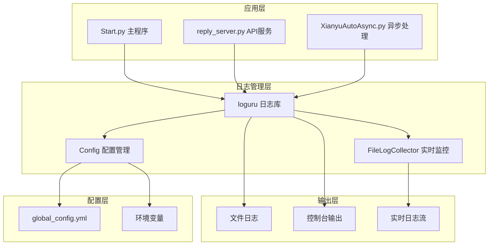
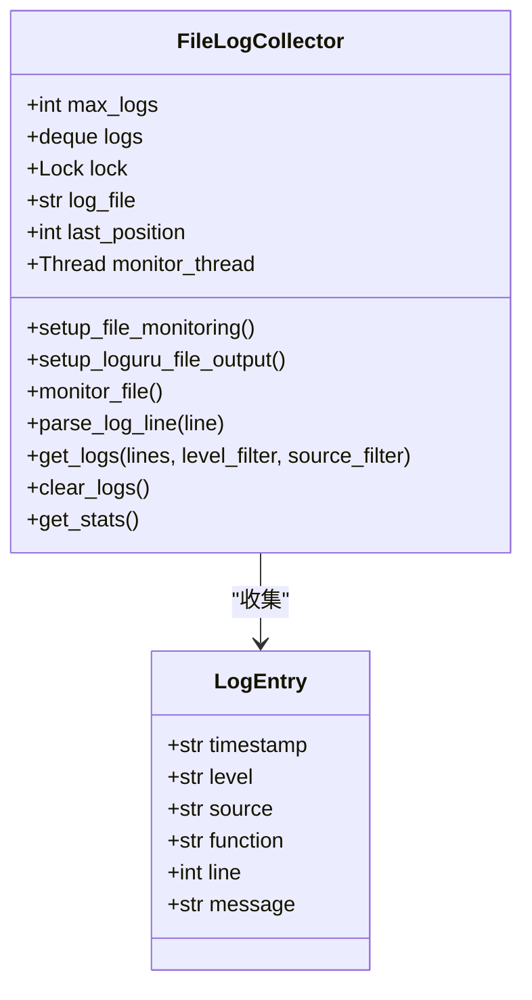
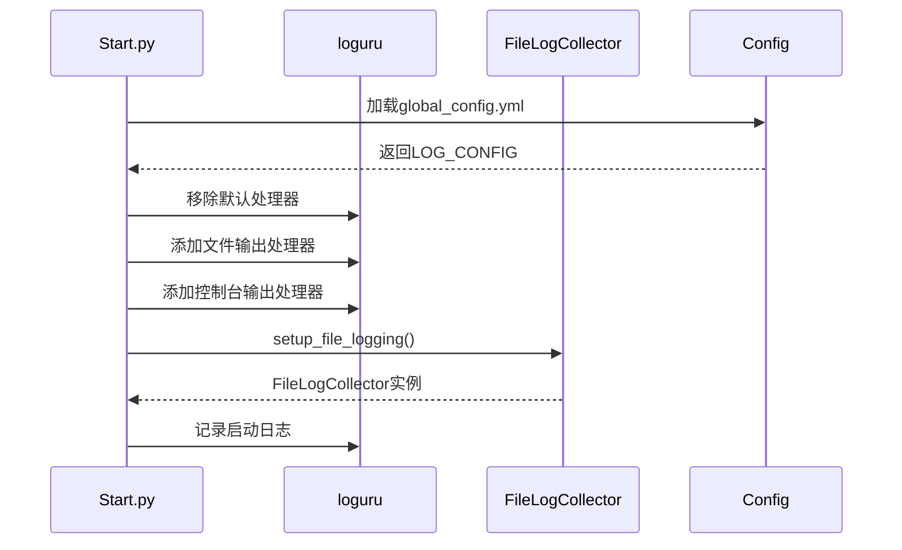
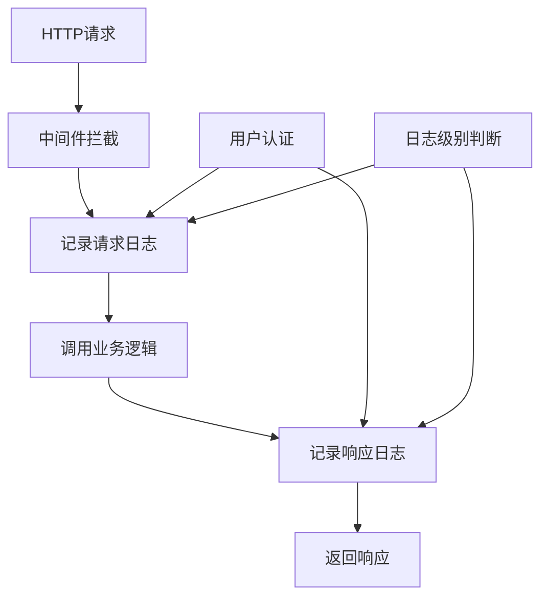
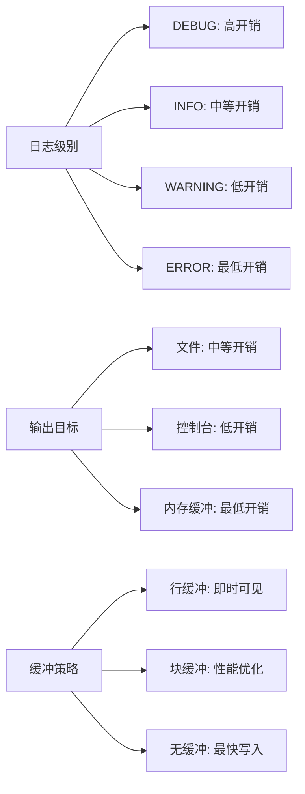
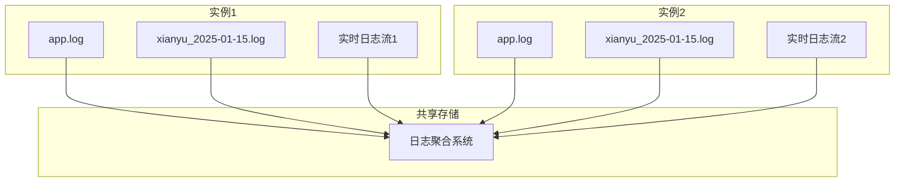

# 日志配置

<cite>
**本文档中引用的文件**
- [entrypoint.sh](file://entrypoint.sh)
- [config.py](file://config.py)
- [Start.py](file://Start.py)
- [reply_server.py](file://reply_server.py)
- [file_log_collector.py](file://file_log_collector.py)
- [global_config.yml](file://global_config.yml)
- [XianyuAutoAsync.py](file://XianyuAutoAsync.py)
- [db_manager.py](file://db_manager.py)
</cite>

## 目录
1. [简介](#简介)
2. [系统架构概览](#系统架构概览)
3. [日志配置初始化](#日志配置初始化)
4. [核心日志组件](#核心日志组件)
5. [日志级别与性能影响](#日志级别与性能影响)
6. [环境变量配置](#环境变量配置)
7. [自定义日志格式](#自定义日志格式)
8. [多实例部署建议](#多实例部署建议)
9. [故障排除指南](#故障排除指南)
10. [最佳实践](#最佳实践)

## 简介

闲鱼自动回复系统采用基于loguru库的现代化日志框架，提供了灵活且高性能的日志记录解决方案。系统支持多种日志输出目标、动态日志级别调整、实时日志监控等功能，能够满足生产环境和开发调试的不同需求。

## 系统架构概览

系统日志架构采用分层设计，包含以下核心组件：



**图表来源**
- [Start.py](file://Start.py#L427-L429)
- [reply_server.py](file://reply_server.py#L29-L30)
- [XianyuAutoAsync.py](file://XianyuAutoAsync.py#L8-L9)

## 日志配置初始化

### entrypoint.sh 中的日志目录初始化

系统启动时，entrypoint.sh脚本负责初始化日志相关的基础设施：

```mermaid
flowchart TD
A[启动entrypoint.sh] --> B[创建必要目录]
B --> C[/app/logs]
B --> D[/app/data]
B --> E[/app/backups]
B --> F[/app/static/uploads]
C --> G[设置权限 chmod 777]
D --> G
E --> G
F --> G
G --> H[检查关键文件]
H --> I[验证 Start.py 存在]
H --> J[验证 global_config.yml 存在]
I --> K[启动应用]
J --> K
```

**图表来源**
- [entrypoint.sh](file://entrypoint.sh#L20-L30)

**章节来源**
- [entrypoint.sh](file://entrypoint.sh#L20-L30)

### config.py 中的日志配置加载

系统通过Config类加载全局配置，其中包含日志相关配置项：

| 配置项 | 类型 | 默认值 | 描述 |
|--------|------|--------|------|
| LOG_CONFIG.level | String | INFO | 日志级别(DEBUG/INFO/WARNING/ERROR) |
| LOG_CONFIG.format | String | 格式化模板 | 日志输出格式模板 |
| LOG_CONFIG.rotation | String | 1 day | 日志轮转周期 |
| LOG_CONFIG.retention | String | 7 days | 日志保留时间 |
| LOG_CONFIG.compression | String | zip | 日志压缩格式 |

**章节来源**
- [config.py](file://config.py#L117-L118)
- [global_config.yml](file://global_config.yml#L49-L55)

## 核心日志组件

### FileLogCollector 实时日志收集器

FileLogCollector是系统的核心日志监控组件，提供实时日志收集和分析功能：



**图表来源**
- [file_log_collector.py](file://file_log_collector.py#L15-L241)

**章节来源**
- [file_log_collector.py](file://file_log_collector.py#L15-L241)

### Start.py 中的日志集成

主程序Start.py集成了多个日志配置阶段：



**图表来源**
- [Start.py](file://Start.py#L427-L429)
- [Start.py](file://Start.py#L517-L518)

**章节来源**
- [Start.py](file://Start.py#L517-L518)

### reply_server.py 中的API日志配置

API服务器reply_server.py实现了请求级别的日志记录：



**图表来源**
- [reply_server.py](file://reply_server.py#L330-L357)

**章节来源**
- [reply_server.py](file://reply_server.py#L330-L357)

### XianyuAutoAsync.py 中的异步日志配置

异步处理模块XianyuAutoAsync.py针对高并发场景优化了日志配置：

| 配置项 | 值 | 性能影响 |
|--------|-----|----------|
| rotation | 1 day | 避免大文件，便于管理 |
| retention | 7 days | 平衡存储空间和历史查询 |
| compression | zip | 减少磁盘占用 |
| level | DEBUG/INFO | 动态调整，生产环境建议INFO |
| enqueue | True | 异步写入，提高性能 |

**章节来源**
- [XianyuAutoAsync.py](file://XianyuAutoAsync.py#L141-L156)

## 日志级别与性能影响

### 日志级别详解

系统支持四种标准日志级别，每种级别都有明确的用途和性能特征：

| 级别 | 数值 | 用途 | 性能影响 | 推荐场景 |
|------|------|------|----------|----------|
| DEBUG | 10 | 详细调试信息 | 最高开销 | 开发调试 |
| INFO | 20 | 一般信息记录 | 中等开销 | 生产监控 |
| WARNING | 30 | 警告信息 | 较低开销 | 异常提醒 |
| ERROR | 40 | 错误信息 | 最低开销 | 故障追踪 |

### 性能优化策略



**章节来源**
- [global_config.yml](file://global_config.yml#L53)

## 环境变量配置

### 动态日志级别调整

系统支持通过环境变量动态调整日志级别：

| 环境变量 | 默认值 | 可选值 | 影响范围 |
|----------|--------|--------|----------|
| LOG_LEVEL | INFO | DEBUG/INFO/WARNING/ERROR | 全局日志级别 |
| SQL_LOG_LEVEL | INFO | DEBUG/INFO/WARNING/ERROR | SQL语句日志级别 |
| SQL_LOG_ENABLED | true | true/false | SQL日志开关 |

### 实时日志级别调整示例

```bash
# 设置为调试级别（最详细）
export LOG_LEVEL=DEBUG

# 设置为信息级别（推荐生产环境）
export LOG_LEVEL=INFO

# 设置为警告级别（仅关注重要信息）
export LOG_LEVEL=WARNING

# 设置为错误级别（最小日志量）
export LOG_LEVEL=ERROR
```

**章节来源**
- [db_manager.py](file://db_manager.py#L55-L61)

## 自定义日志格式

### 格式化模板配置

系统提供了灵活的日志格式化选项：

```mermaid
graph TD
A[日志格式模板] --> B[时间戳 {time}]
A --> C[日志级别 {level}]
A --> D[模块名称 {name}]
A --> E[函数名 {function}]
A --> F[行号 {line}]
A --> G[消息内容 {message}]
H[颜色支持] --> I[<green>绿色</green>]
H --> J[<level>级别颜色</level>]
H --> K[<cyan>青色</cyan>]
L[输出示例] --> M[2025-01-15 10:30:45.123 | INFO | __main__:main:45 - 系统启动成功]
L --> N[2025-01-15 10:30:45.123 | ERROR | XianyuAutoAsync:handle_message:123 - 消息处理失败]
```

**图表来源**
- [global_config.yml](file://global_config.yml#L51-L52)

### 自定义格式示例

以下是几种常用的自定义格式配置：

| 场景 | 格式模板 | 说明 |
|------|----------|------|
| 开发调试 | `{time:YYYY-MM-DD HH:mm:ss.SSS} | {level: <8} | {name}.{function}:{line} - {message}` | 包含完整上下文信息 |
| 生产监控 | `{time:YYYY-MM-DD HH:mm:ss} | {level} | {message}` | 简洁明了 |
| 错误追踪 | `{time:YYYY-MM-DD HH:mm:ss} | {level} | {name} - {message}` | 专注错误信息 |

**章节来源**
- [global_config.yml](file://global_config.yml#L51-L52)

## 多实例部署建议

### 日志隔离策略

在多实例部署环境中，建议采用以下日志隔离策略：



### 部署配置建议

| 配置项 | 实例1 | 实例2 | 说明 |
|--------|-------|-------|------|
| 日志文件名 | app_instance1.log | app_instance2.log | 区分不同实例 |
| 日志轮转 | daily | daily | 避免文件冲突 |
| 实时日志端口 | 8081 | 8082 | 独立的监控端口 |
| 日志级别 | INFO | WARN | 根据实例角色调整 |

### Docker容器日志配置

对于Docker部署，建议使用以下配置：

```yaml
version: '3.8'
services:
  app1:
    image: xianyu-auto-reply:latest
    environment:
      - LOG_LEVEL=INFO
      - INSTANCE_ID=1
    volumes:
      - ./logs/instance1:/app/logs
    logging:
      driver: "json-file"
      options:
        max-size: "10m"
        max-file: "3"
```

## 故障排除指南

### 常见日志问题及解决方案

| 问题 | 症状 | 解决方案 |
|------|------|----------|
| 日志文件过大 | 磁盘空间不足 | 调整rotation和retention配置 |
| 日志丢失 | 查询不到历史日志 | 检查compression设置和文件权限 |
| 性能下降 | 系统响应缓慢 | 降低日志级别或使用异步写入 |
| 权限错误 | 无法写入日志文件 | 检查目录权限设置 |

### 日志诊断命令

```bash
# 检查日志文件权限
ls -la /app/logs/

# 查看日志文件大小
du -sh /app/logs/*

# 检查磁盘空间
df -h

# 实时查看日志
tail -f /app/logs/xianyu_*.log

# 检查日志配置
cat global_config.yml | grep LOG_CONFIG
```

**章节来源**
- [entrypoint.sh](file://entrypoint.sh#L27-L29)

## 最佳实践

### 开发环境配置

```yaml
# global_config.yml (开发环境)
LOG_CONFIG:
  level: DEBUG
  format: '<green>{time:YYYY-MM-DD HH:mm:ss.SSS}</green> | <level>{level: <8}</level> | <cyan>{name}</cyan>.<cyan>{function}</cyan>:<cyan>{line}</cyan> - <level>{message}</level>'
  rotation: 10 MB
  retention: 1 day
  compression: zip
```

### 生产环境配置

```yaml
# global_config.yml (生产环境)
LOG_CONFIG:
  level: INFO
  format: '{time:YYYY-MM-DD HH:mm:ss} | {level} | {message}'
  rotation: 1 day
  retention: 7 days
  compression: zip
```

### 监控和告警配置

建议设置以下监控指标：

| 监控指标 | 阈值 | 告警级别 |
|----------|------|----------|
| 错误日志频率 | >10/min | WARNING |
| 日志文件大小 | >1GB | CRITICAL |
| 磁盘空间使用率 | >80% | WARNING |
| 日志写入延迟 | >1s | ERROR |

### 性能优化建议

1. **合理设置日志级别**：生产环境使用INFO或WARNING级别
2. **优化轮转策略**：根据存储容量调整rotation和retention
3. **使用异步写入**：启用enqueue选项提高性能
4. **定期清理日志**：设置合理的retention时间
5. **监控日志系统**：建立日志系统的健康检查机制

通过以上配置和最佳实践，系统能够提供高效、可靠、可扩展的日志解决方案，满足不同环境和场景的需求。