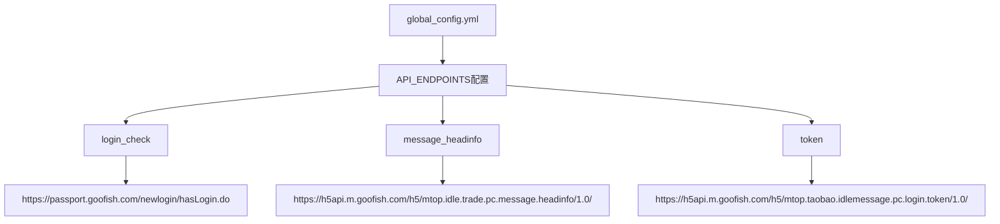
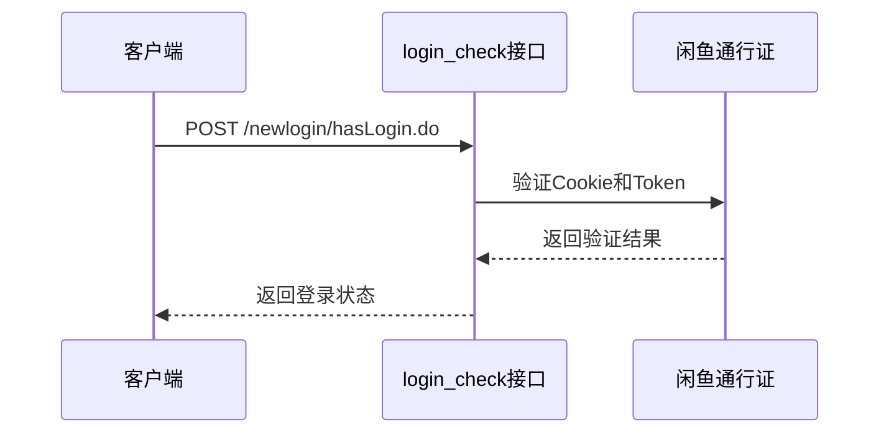
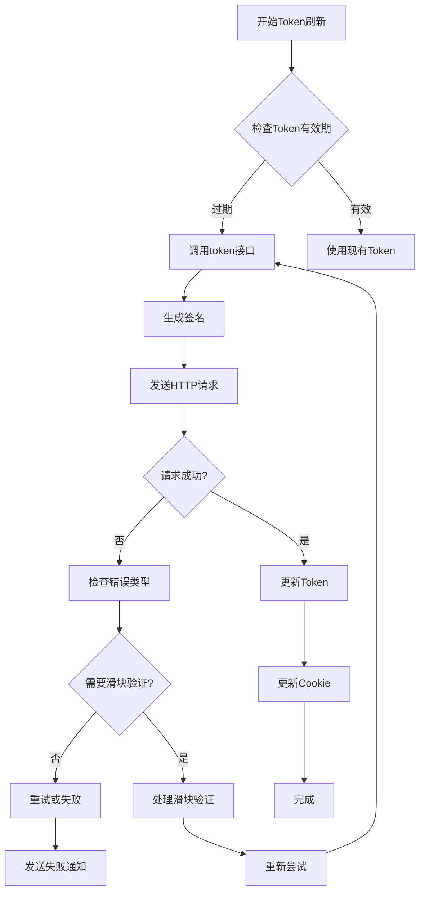
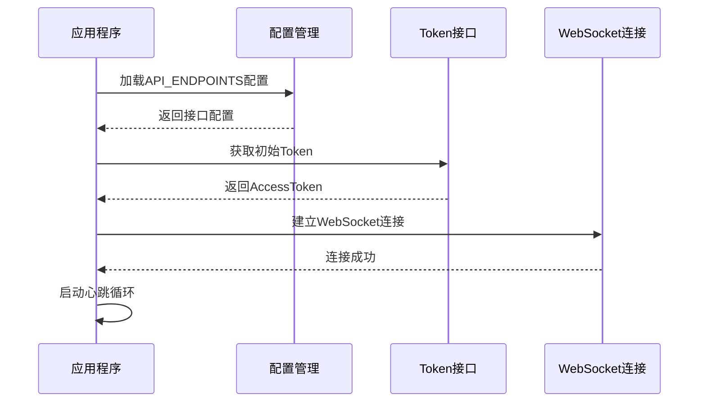
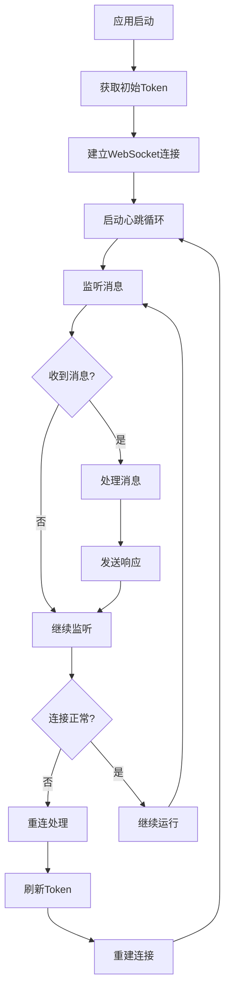
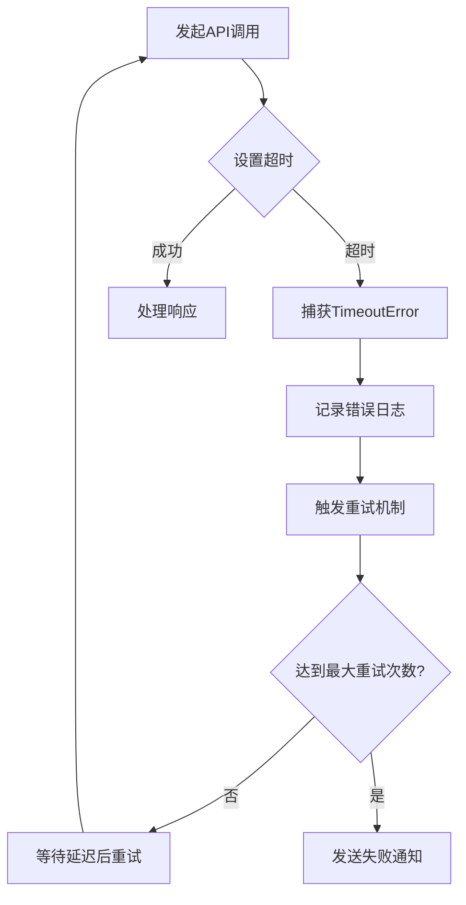
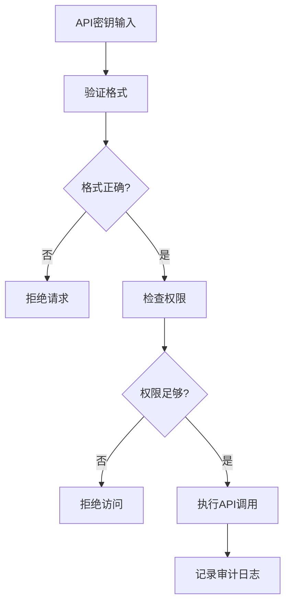
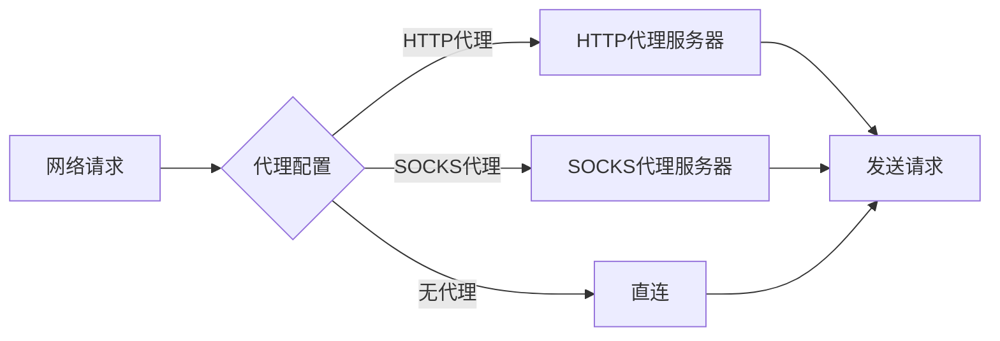
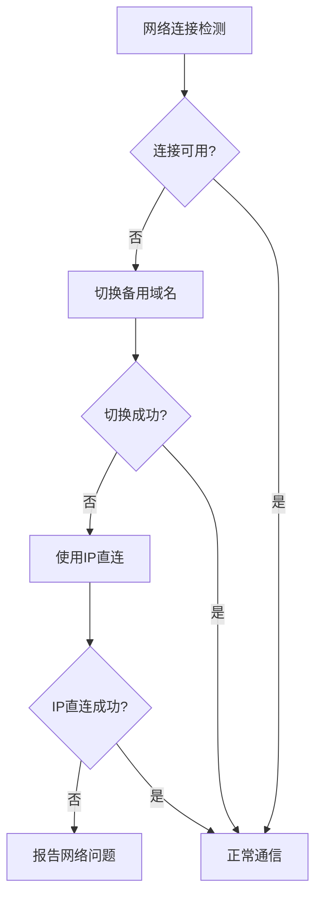

# API端点配置

<cite>
**本文档中引用的文件**
- [global_config.yml](file://global_config.yml)
- [XianyuAutoAsync.py](file://XianyuAutoAsync.py)
- [config.py](file://config.py)
- [utils/refresh_util.py](file://utils/refresh_util.py)
- [reply_server.py](file://reply_server.py)
- [utils/ws_utils.py](file://utils/ws_utils.py)
- [static/xianyu_js_version_2.js](file://static/xianyu_js_version_2.js)
</cite>

## 目录
1. [简介](#简介)
2. [API端点配置结构](#api端点配置结构)
3. [核心接口详解](#核心接口详解)
4. [接口调用流程](#接口调用流程)
5. [错误处理与重试机制](#错误处理与重试机制)
6. [安全防护措施](#安全防护措施)
7. [网络环境适配](#网络环境适配)
8. [代码实现示例](#代码实现示例)
9. [故障排除指南](#故障排除指南)
10. [总结](#总结)

## 简介

闲鱼自动回复系统的核心功能依赖于三个关键的API端点配置，这些端点负责维护用户身份认证、会话状态和消息交互。本文档深入解析global_config.yml中API_ENDPOINTS配置项的完整结构与功能，详细说明各个接口的作用机制和集成方式。

## API端点配置结构

### 配置文件位置与结构



**图表来源**
- [global_config.yml](file://global_config.yml#L1-L4)

### 配置项详细说明

| 配置项 | 接口地址 | 功能描述 | HTTP方法 |
|--------|----------|----------|----------|
| login_check | https://passport.goofish.com/newlogin/hasLogin.do | 验证用户登录状态，检查Cookie有效性 | POST |
| message_headinfo | https://h5api.m.goofish.com/h5/mtop.idle.trade.pc.message.headinfo/1.0/ | 获取消息头信息，维持会话上下文 | POST |
| token | https://h5api.m.goofish.com/h5/mtop.taobao.idlemessage.pc.login.token/1.0/ | 获取和刷新用户身份令牌 | POST |

**章节来源**
- [global_config.yml](file://global_config.yml#L2-L4)

## 核心接口详解

### login_check接口

#### 接口用途
login_check接口专门用于验证用户的登录状态，确保Cookie的有效性和会话的持续性。

#### HTTP请求方法与参数
- **方法**: POST
- **请求参数**: 包含用户标识、设备信息、CSRF令牌等认证信息
- **请求头**: 包含Referer、Origin、User-Agent等标准HTTP头部

#### 响应数据结构
```json
{
  "content": {
    "success": true,
    "data": {
      "userInfo": {
        "userId": "2219383264998",
        "nickName": "用户昵称"
      }
    }
  },
  "ret": ["SUCCESS::调用成功"]
}
```

#### 工作原理


**图表来源**
- [utils/refresh_util.py](file://utils/refresh_util.py#L1781-L1827)

### message_headinfo接口

#### 接口用途
message_headinfo接口负责获取消息头信息，这是维持WebSocket连接和消息传递的关键组件。

#### HTTP请求方法与参数
- **方法**: POST
- **请求参数**: 包含API版本、应用密钥、设备ID等
- **请求体**: JSON格式的业务数据

#### 响应数据结构
```json
{
  "data": {
    "unreadCount": 5,
    "lastMessageTime": 1754570160000,
    "sessionTypes": "1,19"
  },
  "ret": ["SUCCESS::调用成功"]
}
```

#### 工作原理
该接口主要用于：
1. 获取未读消息数量
2. 维护会话状态信息
3. 提供消息同步的基础数据

### token接口

#### 接口用途
token接口是整个系统的核心认证组件，负责获取和刷新用户的身份令牌。

#### HTTP请求方法与参数
- **方法**: POST
- **请求参数**: 包含时间戳、签名、API版本等
- **请求体**: 包含应用密钥和设备ID的JSON数据

#### 响应数据结构
```json
{
  "data": {
    "accessToken": "eyJhbGciOiJIUzI1NiJ9...",
    "expireTime": 1754573760000,
    "refreshToken": "refresh_token_value"
  },
  "ret": ["SUCCESS::调用成功"]
}
```

#### 工作原理


**图表来源**
- [XianyuAutoAsync.py](file://XianyuAutoAsync.py#L1285-L1630)

**章节来源**
- [utils/refresh_util.py](file://utils/refresh_util.py#L1833-L1906)

## 接口调用流程

### 初始化流程



**图表来源**
- [XianyuAutoAsync.py](file://XianyuAutoAsync.py#L5144-L5160)

### 正常运行流程



**图表来源**
- [XianyuAutoAsync.py](file://XianyuAutoAsync.py#L5198-L5255)

**章节来源**
- [XianyuAutoAsync.py](file://XianyuAutoAsync.py#L5144-L5255)

## 错误处理与重试机制

### 重试策略

系统实现了智能的重试机制，根据不同类型的错误采用不同的重试策略：

| 错误类型 | 重试延迟 | 最大重试次数 | 处理方式 |
|----------|----------|--------------|----------|
| WebSocket断开 | 3-15秒 | 3次 | 快速重连 |
| 网络连接失败 | 10-60秒 | 5次 | 指数退避 |
| Token刷新失败 | 600秒 | 3次 | 通知管理员 |
| 滑块验证 | 30秒 | 3次 | 人工干预 |

### 超时处理机制



**图表来源**
- [XianyuAutoAsync.py](file://XianyuAutoAsync.py#L453-L466)

### 错误码映射方案

| 错误码 | 含义 | 处理策略 |
|--------|------|----------|
| FAIL_SYS_USER_VALIDATE | 用户验证失败 | 触发重新登录 |
| SESSION_EXPIRED | 会话过期 | 刷新Token |
| NETWORK_ERROR | 网络错误 | 重试连接 |
| AUTH_FAILED | 认证失败 | 检查Cookie有效性 |

**章节来源**
- [XianyuAutoAsync.py](file://XianyuAutoAsync.py#L1589-L1629)

## 安全防护措施

### API密钥保护

1. **密钥存储**: 使用环境变量或加密配置文件存储敏感信息
2. **访问控制**: 实现API密钥验证机制
3. **传输加密**: 使用HTTPS协议保护数据传输

### 防止API密钥泄露



**图表来源**
- [reply_server.py](file://reply_server.py#L963-L1001)

### 安全最佳实践

1. **定期轮换密钥**: 设置定期的密钥更新机制
2. **限制访问频率**: 实现速率限制防止滥用
3. **监控异常行为**: 检测异常的API调用模式
4. **加密存储**: 敏感数据采用加密存储

**章节来源**
- [reply_server.py](file://reply_server.py#L963-L1001)

## 网络环境适配

### 代理配置

系统支持多种代理配置方式：



### DNS污染处理

1. **备用域名**: 配置多个备用域名
2. **IP直连**: 使用IP地址直接访问
3. **CDN加速**: 利用CDN服务绕过DNS污染

### 网络环境检测



## 代码实现示例

### Token刷新实现

以下是XianyuAutoAsync.py中token刷新的核心实现：

```python
# Token刷新方法的核心逻辑
async def refresh_token(self, captcha_retry_count: int = 0):
    """刷新用户身份令牌"""
    # 检查是否需要刷新Token
    if not self.current_token or (time.time() - self.last_token_refresh_time) >= self.token_refresh_interval:
        # 构建请求参数
        params = {
            'jsv': '2.7.2',
            'appKey': '34839810',
            't': str(int(time.time()) * 1000),
            'sign': '',
            'v': '1.0',
            'type': 'originaljson',
            'api': 'mtop.taobao.idlemessage.pc.login.token',
            'sessionOption': 'AutoLoginOnly'
        }
        
        # 生成签名
        token = self.session.cookies.get('_m_h5_tk', '').split('_')[0]
        sign = generate_sign(params['t'], token, data_val)
        params['sign'] = sign
        
        # 发送请求
        response = await self.session.post(api_url, params=params, data=data)
        res_json = response.json()
        
        # 处理响应
        if any('SUCCESS::调用成功' in ret for ret in ret_value):
            new_token = res_json['data']['accessToken']
            self.current_token = new_token
            self.last_token_refresh_time = time.time()
            return new_token
```

**章节来源**
- [XianyuAutoAsync.py](file://XianyuAutoAsync.py#L1285-L1630)

### WebSocket连接管理

```python
# WebSocket连接状态管理
class ConnectionState(Enum):
    DISCONNECTED = "disconnected"
    CONNECTING = "connecting"
    CONNECTED = "connected"
    RECONNECTING = "reconnecting"
    FAILED = "failed"
    CLOSED = "closed"

async def heartbeat_loop(self, ws):
    """心跳循环"""
    consecutive_failures = 0
    max_failures = 3
    
    while True:
        try:
            await self.send_heartbeat(ws)
            consecutive_failures = 0
            await self._interruptible_sleep(self.heartbeat_interval)
        except Exception as e:
            consecutive_failures += 1
            if consecutive_failures >= max_failures:
                logger.error(f"心跳连续失败{max_failures}次，停止心跳循环")
                break
```

**章节来源**
- [XianyuAutoAsync.py](file://XianyuAutoAsync.py#L5198-L5255)

### 登录状态检查

```python
# 登录状态检查实现
def hasLogin(self, retry_count=0):
    """调用hasLogin.do接口进行登录状态检查"""
    url = 'https://passport.goofish.com/newlogin/silentHasLogin.do'
    params = {
        'documentReferer': "https%3A%2F%2Fwww.goofish.com%2F",
        'appEntrance': 'xianyu_sdkSilent',
        'appName': 'xianyu',
        'fromSite': '0',
        'ltl': 'true'
    }
    
    data = {
        'hid': self.session.cookies.get('unb', ''),
        'ltl': 'true',
        'appName': 'xianyu',
        'appEntrance': 'web',
        '_csrf_token': self.session.cookies.get('XSRF-TOKEN', ''),
        'umidToken': '',
        'hsiz': self.session.cookies.get('cookie2', ''),
        'mainPage': 'false',
        'isMobile': 'false',
        'lang': 'zh_CN',
        'returnUrl': '',
        'fromSite': '77',
        'isIframe': 'true',
        'documentReferer': 'https://www.goofish.com/',
        'defaultView': 'hasLogin',
        'umidTag': 'SERVER',
        'deviceId': self.session.cookies.get('cna', '')
    }
    
    response = self.session.post(url, params=params, data=data)
    res_json = response.json()
    return res_json.get('content', {}).get('success')
```

**章节来源**
- [utils/refresh_util.py](file://utils/refresh_util.py#L1781-L1827)

## 故障排除指南

### 常见问题及解决方案

#### 1. Token刷新失败
**症状**: 系统频繁提示Token刷新失败
**原因**: Cookie过期或网络问题
**解决方案**:
- 检查Cookie有效性
- 验证网络连接
- 重新登录获取新Cookie

#### 2. WebSocket连接中断
**症状**: 消息接收异常或连接频繁断开
**原因**: 网络不稳定或服务器端主动断开
**解决方案**:
- 实现自动重连机制
- 增加重连间隔时间
- 检查防火墙设置

#### 3. API调用超时
**症状**: 接口响应缓慢或超时
**原因**: 网络延迟或服务器负载过高
**解决方案**:
- 增加超时时间设置
- 使用备用域名
- 实现请求队列管理

### 调试工具和技巧

1. **日志分析**: 启用详细日志记录
2. **网络抓包**: 使用Wireshark分析网络流量
3. **状态监控**: 实时监控系统状态指标

**章节来源**
- [XianyuAutoAsync.py](file://XianyuAutoAsync.py#L453-L466)

## 总结

闲鱼自动回复系统的API端点配置构成了整个系统的核心基础设施。通过login_check、message_headinfo和token三个关键接口的协同工作，系统能够实现稳定的身份认证、会话管理和消息交互功能。

### 关键特性

1. **模块化设计**: 每个接口职责明确，便于维护和扩展
2. **健壮的错误处理**: 完善的重试机制和错误恢复策略
3. **安全防护**: 多层次的安全措施保护系统免受攻击
4. **网络适应性**: 支持多种网络环境和配置需求

### 最佳实践建议

1. **定期监控**: 建立完善的监控体系
2. **备份策略**: 实现配置和数据的定期备份
3. **性能优化**: 持续优化接口响应时间和资源消耗
4. **安全更新**: 及时更新安全补丁和配置

通过深入理解和正确配置这些API端点，开发者可以构建出稳定、高效且安全的闲鱼自动回复系统，为用户提供优质的自动化服务体验。