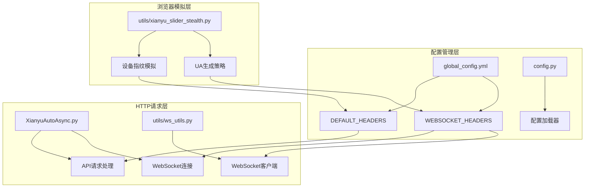
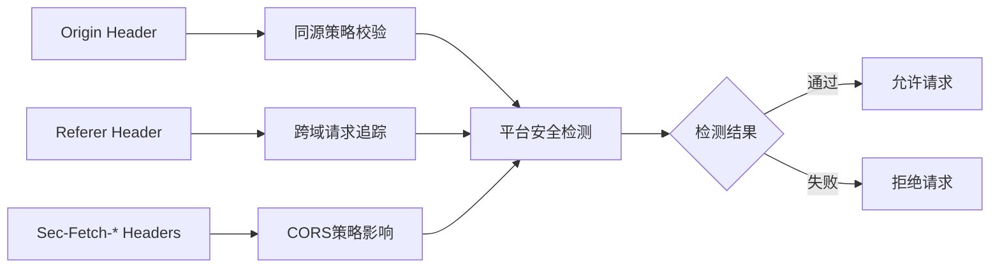
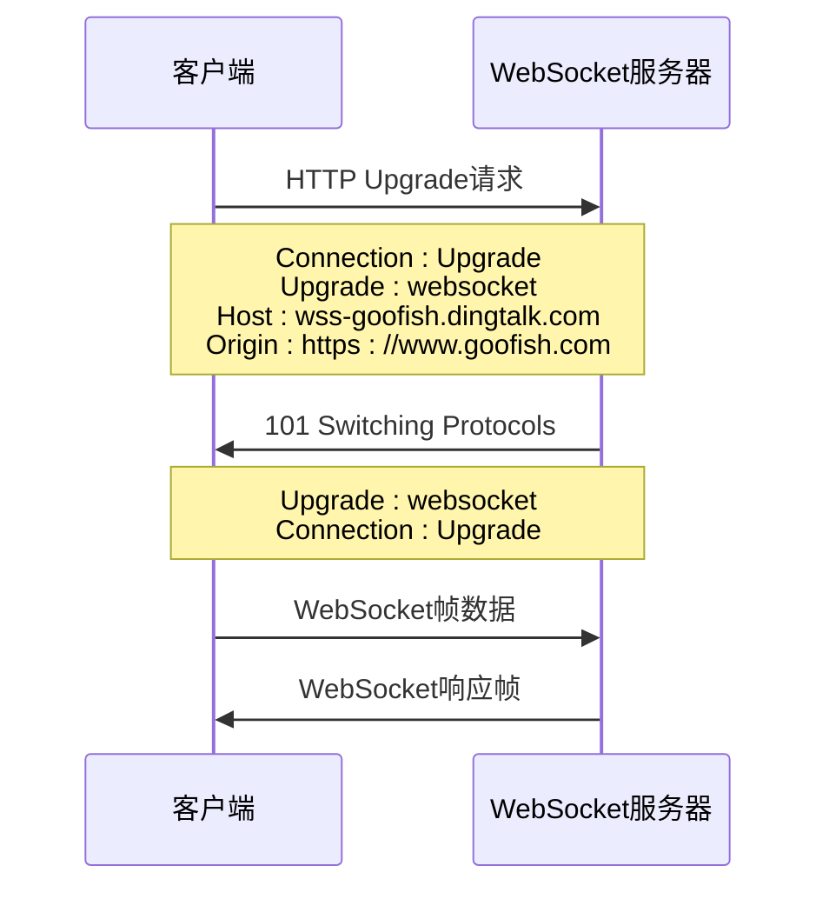
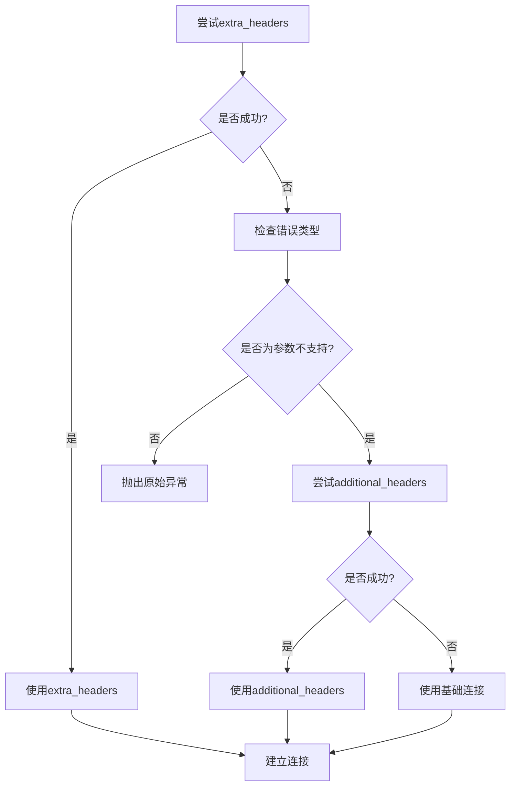
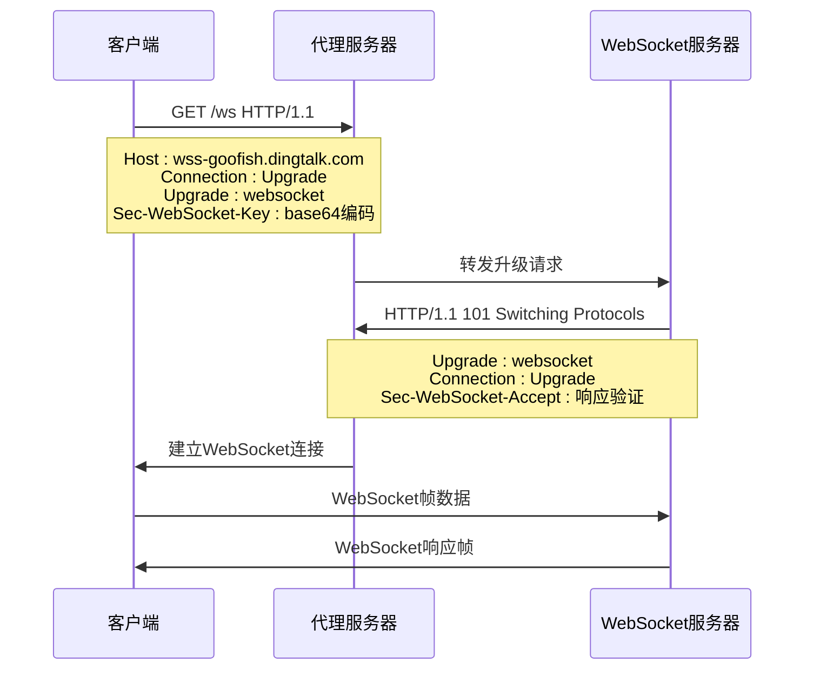
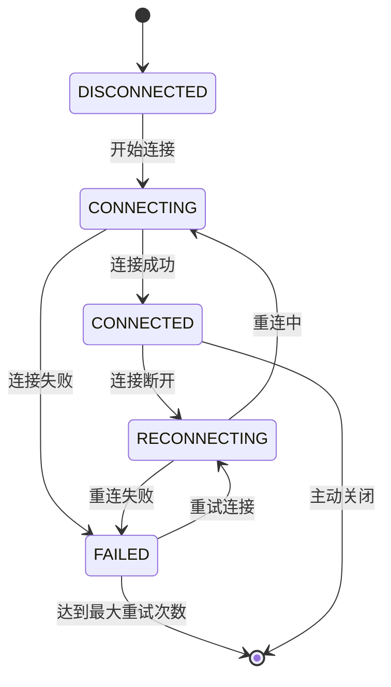
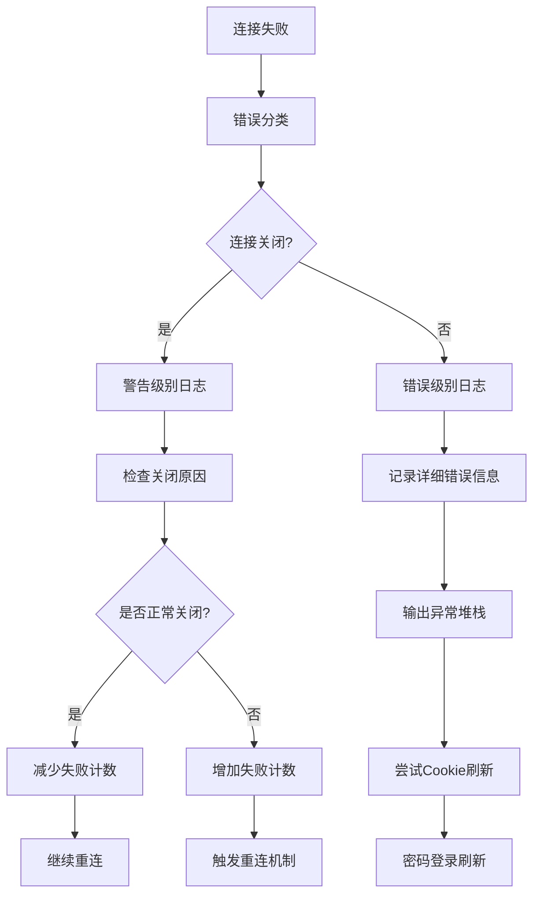

# HTTP头部配置

<cite>
**本文档中引用的文件**
- [global_config.yml](file://global_config.yml)
- [config.py](file://config.py)
- [XianyuAutoAsync.py](file://XianyuAutoAsync.py)
- [utils/ws_utils.py](file://utils/ws_utils.py)
- [utils/xianyu_slider_stealth.py](file://utils/xianyu_slider_stealth.py)
</cite>

## 目录
1. [简介](#简介)
2. [项目结构概览](#项目结构概览)
3. [DEFAULT_HEADERS配置详解](#default_headers配置详解)
4. [WEBSOCKET_HEADERS配置详解](#websocket_headers配置详解)
5. [HTTP头部协议兼容性分析](#http头部协议兼容性分析)
6. [浏览器环境模拟策略](#浏览器环境模拟策略)
7. [WebSocket握手协议实现](#websocket握手协议实现)
8. [动态适配与版本兼容](#动态适配与版本兼容)
9. [日志分析与故障排除](#日志分析与故障排除)
10. [最佳实践建议](#最佳实践建议)

## 简介

本文档深入分析闲鱼自动回复系统中HTTP头部的配置策略和实现机制。该系统通过精心设计的HTTP头部配置，实现了对闲鱼平台设备指纹检测的有效规避，同时确保WebSocket连接的稳定性和协议兼容性。

系统采用双层头部配置架构：
- **DEFAULT_HEADERS**：用于常规HTTP API请求
- **WEBSOCKET_HEADERS**：专门针对WebSocket连接握手

这种分离式设计使得系统能够在不同场景下灵活应用最适合的头部配置，同时保持对平台检测机制的适应性。

## 项目结构概览



**图表来源**
- [global_config.yml](file://global_config.yml#L31-L76)
- [config.py](file://config.py#L104-L105)
- [XianyuAutoAsync.py](file://XianyuAutoAsync.py#L6800-L7640)

## DEFAULT_HEADERS配置详解

### 基础头部配置

DEFAULT_HEADERS是系统用于常规HTTP API请求的基础头部配置，其设计遵循现代浏览器的标准规范：

| 头部名称 | 配置值 | 协议兼容性 | 安全校验作用 |
|---------|--------|-----------|-------------|
| `accept` | `application/json` | HTTP/1.1+ | 明确声明JSON响应格式支持 |
| `accept-language` | `zh-CN,zh;q=0.9` | HTTP/1.1+ | 指定首选语言为简体中文 |
| `cache-control` | `no-cache` | HTTP/1.1+ | 强制绕过缓存，获取最新数据 |
| `pragma` | `no-cache` | HTTP/1.0+ | 向后兼容HTTP/1.0缓存控制 |

### 安全校验头部



**图表来源**
- [global_config.yml](file://global_config.yml#L34-L38)

### 浏览器环境模拟

DEFAULT_HEADERS中的浏览器环境模拟主要体现在以下几个方面：

1. **User-Agent标准化**：使用标准的Chrome浏览器标识
2. **浏览器兼容性声明**：通过`sec-ch-ua`系列头部模拟真实浏览器
3. **平台信息声明**：明确声明运行平台为Windows系统

**章节来源**
- [global_config.yml](file://global_config.yml#L39-L46)

## WEBSOCKET_HEADERS配置详解

### WebSocket专用头部

WEBSOCKET_HEADERS针对WebSocket连接握手进行了专门优化：

| 头部名称 | 配置值 | 握手协议意义 | 协议兼容性 |
|---------|--------|-------------|-----------|
| `Accept-Encoding` | `gzip, deflate, br, zstd` | 声明支持多种压缩算法 | HTTP/1.1+ |
| `Accept-Language` | `zh-CN,zh;q=0.9` | 指定WebSocket通信语言偏好 | HTTP/1.1+ |
| `Cache-Control` | `no-cache` | WebSocket连接不使用缓存 | HTTP/1.1+ |
| `Connection` | `Upgrade` | 请求协议升级为WebSocket | HTTP/1.1+ |
| `Host` | `wss-goofish.dingtalk.com` | 指定WebSocket服务器主机 | HTTP/1.1+ |
| `Origin` | `https://www.goofish.com` | 声明WebSocket来源站点 | HTTP/1.1+ |

### 握手协议关键字段



**图表来源**
- [global_config.yml](file://global_config.yml#L67-L76)
- [XianyuAutoAsync.py](file://XianyuAutoAsync.py#L6714-L6768)

**章节来源**
- [global_config.yml](file://global_config.yml#L67-L76)

## HTTP头部协议兼容性分析

### 多版本兼容策略

系统实现了智能的头部参数兼容性检测机制：



**图表来源**
- [XianyuAutoAsync.py](file://XianyuAutoAsync.py#L6714-L6768)

### CORS策略影响

SEC-FETCH系列头部对CORS（跨域资源共享）策略有重要影响：

| SEC-FETCH头部 | 值 | CORS影响 | 安全作用 |
|--------------|----|----------|---------|
| `sec-fetch-dest` | `empty` | 表示请求资源类型为空 | 隐藏请求目的 |
| `sec-fetch-mode` | `cors` | 明确声明CORS模式 | 符合跨域规范 |
| `sec-fetch-site` | `same-site` | 声明同站请求 | 避免跨站检测 |
| `sec-fetch-user` | `?1` | 用户发起的请求 | 模拟真实用户行为 |

**章节来源**
- [global_config.yml](file://global_config.yml#L42-L44)

## 浏览器环境模拟策略

### 设备指纹检测规避

系统通过多层次的浏览器环境模拟来规避设备指纹检测：

```mermaid
graph TB
subgraph "User-Agent层"
A[Mozilla/5.0] --> B[Windows NT 10.0]
B --> C[Win64; x64]
C --> D[AppleWebKit/537.36]
end
subgraph "浏览器标识层"
E[sec-ch-ua] --> F["Not(A:Brand";v="99"]
F --> G["Google Chrome";v="133"]
G --> H["Chromium";v="133"]
end
subgraph "平台信息层"
I[sec-ch-ua-platform] --> J["Windows"]
K[sec-ch-ua-mobile] --> L["?0"]
end
A --> M[指纹生成]
E --> M
I --> M
K --> M
```

**图表来源**
- [global_config.yml](file://global_config.yml#L39-L41)
- [utils/xianyu_slider_stealth.py](file://utils/xianyu_slider_stealth.py#L736-L741)

### 动态UA生成策略

系统实现了智能的User-Agent动态生成机制：

1. **版本多样性**：维护多个Chrome版本的UA列表
2. **平台随机化**：Windows/MacOS平台随机选择
3. **架构适配**：支持x64和ARM架构标识
4. **浏览器变体**：包含Chrome、Chromium、Edge等变体

**章节来源**
- [utils/xianyu_slider_stealth.py](file://utils/xianyu_slider_stealth.py#L736-L741)

## WebSocket握手协议实现

### 连接建立流程

WebSocket连接建立遵循标准的HTTP升级协议：



**图表来源**
- [XianyuAutoAsync.py](file://XianyuAutoAsync.py#L6714-L6768)
- [utils/ws_utils.py](file://utils/ws_utils.py#L16-L30)

### 错误处理与重连机制

系统实现了完善的WebSocket连接错误处理和自动重连机制：



**图表来源**
- [XianyuAutoAsync.py](file://XianyuAutoAsync.py#L29-L36)

**章节来源**
- [XianyuAutoAsync.py](file://XianyuAutoAsync.py#L6714-L6768)

## 动态适配与版本兼容

### 库版本检测机制

系统实现了智能的websockets库版本检测和适配：

```python
# 版本检测逻辑（伪代码）
websockets_version = getattr(websockets, '__version__', '未知')
logger.warning(f"websockets库版本: {websockets_version}")

try:
    # 尝试使用最新的extra_headers参数
    return websockets.connect(url, extra_headers=headers)
except Exception as e:
    error_msg = str(e)
    if "extra_headers" in error_msg:
        # 回退到additional_headers
        return websockets.connect(url, additional_headers=headers)
    else:
        # 使用基础连接
        return websockets.connect(url)
```

### 动态头部调整

系统能够根据不同的平台和环境动态调整头部配置：

1. **平台感知**：根据操作系统自动调整平台标识
2. **浏览器检测**：根据可用的浏览器特性调整头部
3. **网络环境适配**：根据网络状况调整压缩和编码选项

**章节来源**
- [XianyuAutoAsync.py](file://XianyuAutoAsync.py#L6714-L6768)

## 日志分析与故障排除

### 连接失败诊断

系统提供了详细的日志记录和错误诊断机制：



**图表来源**
- [XianyuAutoAsync.py](file://XianyuAutoAsync.py#L7729-L7794)

### 常见头部问题诊断

| 问题类型 | 日志特征 | 可能原因 | 解决方案 |
|---------|---------|---------|---------|
| 认证失败 | `401 Unauthorized` | Cookie过期或无效 | 刷新Cookie |
| CORS错误 | `CORS policy` | Origin或Referer不匹配 | 检查头部配置 |
| 握手失败 | `101 Switching Protocols`失败 | Connection头部错误 | 验证WebSocket头部 |
| 编码问题 | `Unsupported encoding` | Accept-Encoding不支持 | 调整压缩算法 |

### 日志分析工具

系统提供了完整的日志分析框架：

```python
# 日志级别映射
ERROR_LEVELS = {
    'ConnectionClosedError': 'WARNING',
    'ConnectionRefusedError': 'ERROR',
    'TimeoutError': 'ERROR',
    'InvalidHeader': 'ERROR'
}

# 连接状态跟踪
def log_connection_state(old_state, new_state, reason):
    level = 'ERROR' if new_state == 'FAILED' else 'INFO'
    logger.log(level, f"连接状态变更: {old_state} -> {new_state} ({reason})")
```

**章节来源**
- [XianyuAutoAsync.py](file://XianyuAutoAsync.py#L195-L215)
- [XianyuAutoAsync.py](file://XianyuAutoAsync.py#L7729-L7794)

## 最佳实践建议

### 头部配置优化

1. **版本兼容性**：始终测试多个websockets库版本的兼容性
2. **动态调整**：根据平台特性动态调整头部配置
3. **错误处理**：实现完善的错误捕获和降级机制
4. **日志记录**：详细记录头部配置和连接状态

### 性能优化建议

1. **头部缓存**：对于静态头部配置，考虑使用缓存机制
2. **连接复用**：合理管理WebSocket连接生命周期
3. **超时设置**：设置合适的连接和读取超时时间
4. **重试策略**：实现指数退避的重试机制

### 安全考虑

1. **头部验证**：在生产环境中验证头部配置的正确性
2. **敏感信息**：避免在日志中记录敏感的认证头部
3. **频率限制**：遵守平台的请求频率限制
4. **监控告警**：建立连接失败的监控和告警机制

### 维护建议

1. **定期更新**：定期检查和更新浏览器版本标识
2. **版本跟踪**：记录头部配置的版本变更历史
3. **回归测试**：建立头部配置的回归测试机制
4. **文档维护**：保持头部配置文档的及时更新

通过以上全面的HTTP头部配置策略，系统能够在复杂的网络环境中稳定运行，有效规避平台的设备指纹检测，确保WebSocket连接的可靠性和性能。