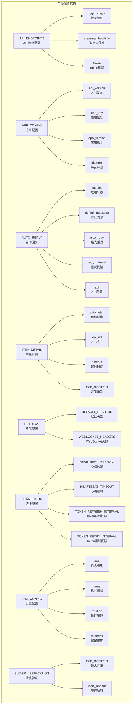
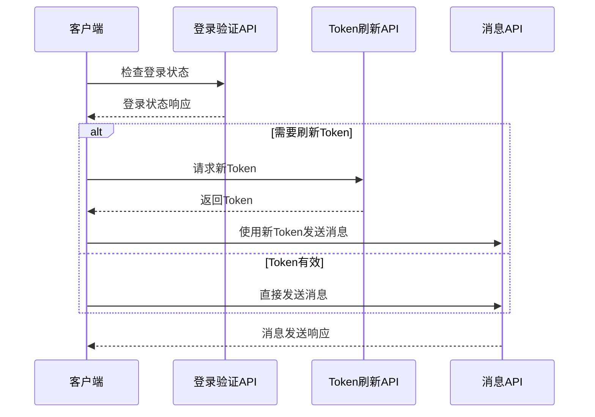
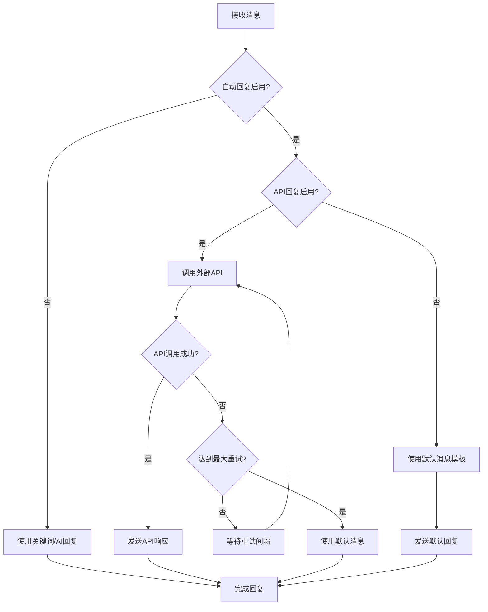
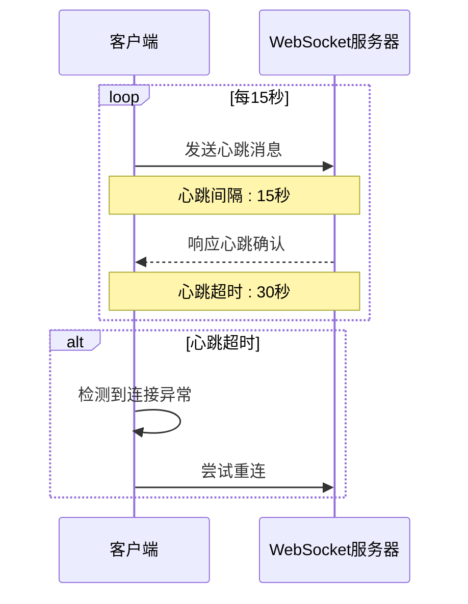
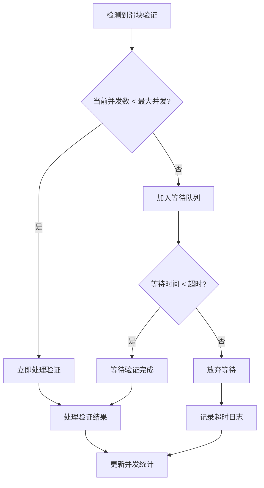

# 全局配置文件详解

<cite>
**本文档中引用的文件**
- [global_config.yml](file://global_config.yml)
- [config.py](file://config.py)
- [XianyuAutoAsync.py](file://XianyuAutoAsync.py)
- [ai_reply_engine.py](file://ai_reply_engine.py)
- [utils/xianyu_utils.py](file://utils/xianyu_utils.py)
- [utils/ws_utils.py](file://utils/ws_utils.py)
- [db_manager.py](file://db_manager.py)
- [docker-compose.yml](file://docker-compose.yml)
- [docker-compose-cn.yml](file://docker-compose-cn.yml)
</cite>

## 目录
1. [简介](#简介)
2. [配置文件结构概览](#配置文件结构概览)
3. [API端点配置详解](#api端点配置详解)
4. [应用配置参数](#应用配置参数)
5. [自动回复模块配置](#自动回复模块配置)
6. [商品详情获取配置](#商品详情获取配置)
7. [HTTP头部信息配置](#http头部信息配置)
8. [WebSocket连接配置](#websocket连接配置)
9. [心跳机制配置](#心跳机制配置)
10. [日志配置详解](#日志配置详解)
11. [滑块验证配置](#滑块验证配置)
12. [配置项修改建议](#配置项修改建议)
13. [最佳实践指南](#最佳实践指南)
14. [故障排查指南](#故障排查指南)

## 简介

全局配置文件`global_config.yml`是闲鱼自动回复系统的核心配置中心，包含了系统运行所需的所有关键参数。该配置文件采用YAML格式，提供了灵活且易于维护的配置管理机制，支持API端点、应用参数、自动回复、日志记录等多个方面的精细化控制。

## 配置文件结构概览



**图表来源**
- [global_config.yml](file://global_config.yml#L1-L77)

**章节来源**
- [global_config.yml](file://global_config.yml#L1-L77)

## API端点配置详解

### 登录验证接口

**配置项**: `API_ENDPOINTS.login_check`

- **用途**: 验证用户登录状态
- **URL**: `https://passport.goofish.com/newlogin/hasLogin.do`
- **调用机制**: 
  - 系统启动时自动检查登录状态
  - 定期验证用户认证有效性
  - 登录失效时触发重新登录流程

### 消息头信息获取接口

**配置项**: `API_ENDPOINTS.message_headinfo`

- **用途**: 获取消息系统所需的头部信息
- **URL**: `https://h5api.m.goofish.com/h5/mtop.idle.trade.pc.message.headinfo/1.0/`
- **调用机制**:
  - 用于构建消息发送所需的认证头部
  - 包含用户身份验证和权限信息
  - 支持实时消息交互

### Token刷新接口

**配置项**: `API_ENDPOINTS.token`

- **用途**: 刷新访问令牌
- **URL**: `https://h5api.m.goofish.com/h5/mtop.taobao.idlemessage.pc.login.token/1.0/`
- **调用机制**:
  - 定期自动刷新Token以维持会话
  - 支持多种刷新策略和重试机制
  - 确保API调用的持续有效性



**图表来源**
- [XianyuAutoAsync.py](file://XianyuAutoAsync.py#L661-L667)
- [config.py](file://config.py#L104-L104)

**章节来源**
- [global_config.yml](file://global_config.yml#L2-L4)
- [XianyuAutoAsync.py](file://XianyuAutoAsync.py#L661-L667)

## 应用配置参数

### API版本控制

**配置项**: `APP_CONFIG.api_version`

- **值**: `'1.0'`
- **作用**: 标识API接口版本，确保向后兼容性
- **影响**: 影响所有API调用的版本协商机制

### 应用密钥管理

**配置项**: `APP_CONFIG.app_key`

- **值**: `'444e9908a51d1cb236a27862abc769c9'`
- **作用**: 应用级身份验证密钥
- **安全性**: 该密钥用于API调用的身份验证和签名生成

### 应用版本标识

**配置项**: `APP_CONFIG.app_version`

- **值**: `'1.0'`
- **作用**: 应用版本标识，用于兼容性检查
- **升级**: 版本号变更时触发兼容性检查

### 平台参数配置

**配置项**: `APP_CONFIG.platform`

- **值**: `'web'`
- **作用**: 标识运行平台，影响API行为和界面适配
- **选项**: `web`, `mobile`, `desktop`等

**章节来源**
- [global_config.yml](file://global_config.yml#L5-L9)
- [config.py](file://config.py#L107-L107)

## 自动回复模块配置

### 启用策略配置

**配置项**: `AUTO_REPLY.enabled`

- **默认值**: `true`
- **作用**: 控制自动回复功能的整体开关
- **影响**: 关闭时系统将使用关键词回复或AI回复

### 默认回复消息模板

**配置项**: `AUTO_REPLY.default_message`

- **模板**: `"亲爱的\"{send_user_name}\" 老板你好！所有宝贝都可以拍，秒发货的哈~不满意的话可以直接申请退款哈~"`
- **特点**:
  - 支持动态变量替换（`{send_user_name}`）
  - 友好的客服语气
  - 包含促销信息和售后服务承诺

### 重试机制配置

**配置项**: `AUTO_REPLY.max_retry` 和 `AUTO_REPLY.retry_interval`

- **最大重试次数**: `3`次
- **重试间隔**: `5`秒
- **策略**: 指数退避算法，避免频繁重试

### API回复配置

**配置项**: `AUTO_REPLY.api`

- **启用状态**: `false`（禁用）
- **绑定地址**: `0.0.0.0`（监听所有网络接口）
- **端口**: `8080`
- **超时**: `10`秒
- **URL**: `http://localhost:8080/xianyu/reply`



**图表来源**
- [global_config.yml](file://global_config.yml#L10-L20)
- [ai_reply_engine.py](file://ai_reply_engine.py#L283-L420)

**章节来源**
- [global_config.yml](file://global_config.yml#L10-L20)
- [ai_reply_engine.py](file://ai_reply_engine.py#L283-L420)

## 商品详情获取配置

### 自动获取功能

**配置项**: `ITEM_DETAIL.auto_fetch.enabled`

- **默认值**: `true`
- **作用**: 启用自动获取商品详情功能
- **场景**: 用户购买商品时自动获取详细信息

### 外部API集成

**配置项**: `ITEM_DETAIL.auto_fetch.api_url`

- **URL**: `https://selfapi.zhinianboke.com/api/getItemDetail`
- **用途**: 调用第三方API获取商品详细信息
- **集成**: 支持外部商品数据源的集成

### 超时控制

**配置项**: `ITEM_DETAIL.auto_fetch.timeout`

- **值**: `30`秒
- **作用**: 单次API调用的最大等待时间
- **策略**: 避免长时间等待影响用户体验

### 并发限制

**配置项**: `ITEM_DETAIL.auto_fetch.max_concurrent`

- **值**: `3`
- **作用**: 最大并发请求数
- **目的**: 防止过多并发请求导致API限流

**章节来源**
- [global_config.yml](file://global_config.yml#L21-L27)
- [XianyuAutoAsync.py](file://XianyuAutoAsync.py#L171-L175)

## HTTP头部信息配置

### 默认头部信息

#### Accept类型配置
- **Accept**: `application/json`
- **作用**: 指示客户端期望JSON格式的响应

#### 语言偏好设置
- **Accept-Language**: `zh-CN,zh;q=0.9`
- **作用**: 优先使用简体中文响应

#### 缓存控制
- **Cache-Control**: `no-cache`
- **Pragma**: `no-cache`
- **作用**: 强制不使用缓存，确保获取最新数据

#### 安全头部
- **Origin**: `https://www.goofish.com`
- **Referer**: `https://www.goofish.com/`
- **作用**: 提供安全的跨域请求环境

#### 用户代理伪装
- **User-Agent**: `Mozilla/5.0 (Windows NT 10.0; Win64; x64) AppleWebKit/537.36 (KHTML, like Gecko) Chrome/133.0.0.0 Safari/537.36`
- **作用**: 模拟真实浏览器行为，避免被识别为爬虫

### WebSocket头部信息

#### 连接升级
- **Connection**: `Upgrade`
- **作用**: 请求升级到WebSocket协议

#### 主机信息
- **Host**: `wss-gooffish.dingtalk.com`
- **作用**: 指定WebSocket服务器主机

#### 加载优化
- **Accept-Encoding**: `gzip, deflate, br, zstd`
- **作用**: 支持多种压缩格式，提高传输效率

**章节来源**
- [global_config.yml](file://global_config.yml#L31-L76)
- [config.py](file://config.py#L105-L106)

## WebSocket连接配置

### 连接URL配置

**配置项**: `WEBSOCKET_URL`

- **值**: `wss://wss-goofish.dingtalk.com/`
- **协议**: WebSocket Secure (WSS)
- **作用**: 实时消息推送的核心连接地址

### 连接头部配置

WebSocket连接使用专门的头部信息，确保与闲鱼平台的协议兼容性：

- **Accept-Encoding**: 支持多种压缩格式
- **Accept-Language**: 语言偏好设置
- **Cache-Control**: 缓存控制
- **Connection**: 连接升级标识
- **Host**: 服务器主机名
- **Origin**: 来源网站标识
- **Pragma**: HTTP/1.0缓存控制
- **User-Agent**: 浏览器标识

**章节来源**
- [global_config.yml](file://global_config.yml#L76-L77)
- [utils/ws_utils.py](file://utils/ws_utils.py#L1-L89)

## 心跳机制配置

### 心跳间隔配置

**配置项**: `HEARTBEAT_INTERVAL`

- **值**: `15`秒
- **作用**: WebSocket连接保活的心跳发送间隔
- **目的**: 防止连接因超时而被断开

### 心跳超时配置

**配置项**: `HEARTBEAT_TIMEOUT`

- **值**: `30`秒
- **作用**: 等待心跳响应的最大时间
- **阈值**: 超过该时间未收到响应则认为连接异常



**图表来源**
- [XianyuAutoAsync.py](file://XianyuAutoAsync.py#L653-L659)
- [config.py](file://config.py#L95-L96)

**章节来源**
- [global_config.yml](file://global_config.yml#L47-L48)
- [XianyuAutoAsync.py](file://XianyuAutoAsync.py#L653-L659)

## 日志配置详解

### 日志级别配置

**配置项**: `LOG_CONFIG.level`

- **值**: `INFO`
- **级别**: 信息级别日志
- **输出内容**: 包含重要操作和状态信息

### 日志格式配置

**配置项**: `LOG_CONFIG.format`

- **模板**: `<green>{time:YYYY-MM-DD HH:mm:ss.SSS}</green> | <level>{level: <8}</level> | <cyan>{name}</cyan>:<cyan>{function}</cyan>:<cyan>{line}</cyan> - <level>{message}</level>`
- **特点**:
  - 时间戳格式化
  - 彩色输出增强可读性
  - 包含模块、函数和行号信息

### 日志轮转策略

**配置项**: `LOG_CONFIG.rotation`

- **值**: `1 day`
- **策略**: 按天轮转日志文件
- **目的**: 避免单个日志文件过大

### 日志保留周期

**配置项**: `LOG_CONFIG.retention`

- **值**: `7 days`
- **策略**: 保留最近7天的日志
- **清理**: 自动删除超过保留期的日志文件

### 压缩配置

**配置项**: `LOG_CONFIG.compression`

- **值**: `zip`
- **作用**: 日志文件压缩存储
- **优势**: 节省磁盘空间

**章节来源**
- [global_config.yml](file://global_config.yml#L49-L56)
- [XianyuAutoAsync.py](file://XianyuAutoAsync.py#L136-L150)

## 滑块验证配置

### 并发控制配置

**配置项**: `SLIDER_VERIFICATION.max_concurrent`

- **值**: `3`
- **作用**: 最大并发滑块验证数量
- **目的**: 防止单个账号触发过多验证

### 等待超时配置

**配置项**: `SLIDER_VERIFICATION.wait_timeout`

- **值**: `60`秒
- **作用**: 滑块验证等待队列的最大等待时间
- **策略**: 避免无限期等待



**图表来源**
- [global_config.yml](file://global_config.yml#L63-L66)
- [db_manager.py](file://db_manager.py#L4829-L4841)

**章节来源**
- [global_config.yml](file://global_config.yml#L63-L66)
- [db_manager.py](file://db_manager.py#L4829-L4841)

## 配置项修改建议

### 敏感参数保护

1. **应用密钥保护**
   - 定期轮换`APP_CONFIG.app_key`
   - 使用环境变量存储敏感配置
   - 避免将配置文件提交到版本控制系统

2. **API端点安全**
   - 验证所有API端点的HTTPS证书
   - 实施API调用频率限制
   - 监控异常的API调用模式

### 性能调优建议

1. **连接参数优化**
   ```yaml
   # 生产环境推荐配置
   HEARTBEAT_INTERVAL: 15
   HEARTBEAT_TIMEOUT: 30
   TOKEN_REFRESH_INTERVAL: 72000  # 20小时
   TOKEN_RETRY_INTERVAL: 7200     # 2小时
   MESSAGE_EXPIRE_TIME: 300000    # 5分钟
   ```

2. **并发控制调整**
   ```yaml
   # 高负载环境配置
   ITEM_DETAIL:
     auto_fetch:
       max_concurrent: 5
       timeout: 20
   SLIDER_VERIFICATION:
     max_concurrent: 5
     wait_timeout: 30
   ```

3. **日志配置优化**
   ```yaml
   # 生产环境日志配置
   LOG_CONFIG:
     level: WARNING
     rotation: 1 hour
     retention: 24 hours
   ```

### Docker环境配置

对于Docker部署，建议使用环境变量覆盖配置：

```yaml
# docker-compose.yml中的环境变量映射
environment:
  - HEARTBEAT_INTERVAL=${HEARTBEAT_INTERVAL:-15}
  - TOKEN_REFRESH_INTERVAL=${TOKEN_REFRESH_INTERVAL:-72000}
  - MESSAGE_EXPIRE_TIME=${MESSAGE_EXPIRE_TIME:-300000}
```

**章节来源**
- [docker-compose.yml](file://docker-compose.yml#L36-L59)
- [docker-compose-cn.yml](file://docker-compose-cn.yml#L36-L59)

## 最佳实践指南

### 配置管理最佳实践

1. **版本控制**
   - 使用Git管理配置文件变更
   - 为不同环境创建独立配置分支
   - 实施配置变更审批流程

2. **环境隔离**
   - 开发、测试、生产环境使用不同配置
   - 敏感信息使用环境变量
   - 定期审查配置安全性

3. **监控告警**
   - 监控配置变更频率
   - 设置配置异常告警
   - 建立配置回滚机制

### 系统稳定性保障

1. **优雅降级**
   - API端点不可用时的备用方案
   - 自动回复功能的降级处理
   - 滑块验证失败的应对策略

2. **资源管理**
   - 合理设置并发限制
   - 监控内存使用情况
   - 实施垃圾回收策略

3. **故障恢复**
   - 连接断开时的自动重连
   - Token刷新失败的重试机制
   - 日志文件的自动清理

## 故障排查指南

### 常见问题诊断

1. **WebSocket连接问题**
   - 检查`WEBSOCKET_URL`配置
   - 验证网络连接和防火墙设置
   - 查看心跳机制配置是否合理

2. **API调用失败**
   - 验证`API_ENDPOINTS`配置的URL有效性
   - 检查请求头部信息是否正确
   - 确认Token刷新机制是否正常工作

3. **滑块验证异常**
   - 检查`SLIDER_VERIFICATION`配置
   - 验证并发控制设置
   - 查看相关日志记录

### 性能问题排查

1. **响应速度慢**
   - 调整超时配置
   - 优化并发参数
   - 检查网络延迟

2. **内存泄漏**
   - 监控缓存清理机制
   - 检查锁的使用情况
   - 审查对象生命周期管理

3. **CPU占用过高**
   - 调整并发控制参数
   - 优化算法实现
   - 减少不必要的计算

### 日志分析技巧

1. **关键日志模式**
   ```
   # 连接状态日志
   .*连接状态.*→.*
   
   # 错误日志
   .*ERROR.*|.*WARNING.*
   
   # 性能指标
   .*耗时.*|.*内存.*|.*并发.*
   ```

2. **故障定位步骤**
   - 查找错误时间点附近的日志
   - 分析错误链路和依赖关系
   - 结合系统监控数据进行综合判断

**章节来源**
- [XianyuAutoAsync.py](file://XianyuAutoAsync.py#L467-L942)
- [XianyuAutoAsync.py](file://XianyuAutoAsync.py#L1507-L1587)