# 商品详情配置技术实现与业务影响深度解析

<cite>
**本文档引用的文件**
- [global_config.yml](file://global_config.yml)
- [config.py](file://config.py)
- [XianyuAutoAsync.py](file://XianyuAutoAsync.py)
- [utils/item_search.py](file://utils/item_search.py)
- [utils/order_detail_fetcher.py](file://utils/order_detail_fetcher.py)
- [db_manager.py](file://db_manager.py)
</cite>

## 目录
1. [引言](#引言)
2. [配置架构概览](#配置架构概览)
3. [核心配置项详解](#核心配置项详解)
4. [技术实现机制](#技术实现机制)
5. [异步请求池与并发控制](#异步请求池与并发控制)
6. [错误处理与恢复机制](#错误处理与恢复机制)
7. [缓存策略与性能优化](#缓存策略与性能优化)
8. [监控告警与SLA评估](#监控告警与SLA评估)
9. [降级方案与容灾策略](#降级方案与容灾策略)
10. [最佳实践与运维建议](#最佳实践与运维建议)

## 引言

ITEM_DETAIL.auto_fetch配置项是闲鱼自动回复系统中的核心功能模块，负责自动化获取商品详细信息以支持智能回复和订单处理。该配置项通过精密的参数控制，实现了高效的商品信息采集、缓存管理和错误恢复机制，为整个系统的智能化运营提供了坚实的数据基础。

本文档将深入解析该配置项的技术实现细节，包括其控制逻辑、性能参数、错误处理策略以及与外部API服务的交互机制，为企业级部署和运维提供全面的技术指导。

## 配置架构概览

### 配置层次结构

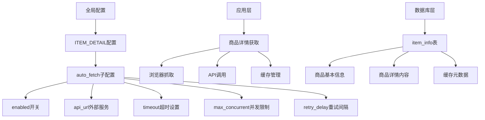

**图表来源**
- [global_config.yml](file://global_config.yml#L21-L27)
- [XianyuAutoAsync.py](file://XianyuAutoAsync.py#L2511-L2517)

### 配置项关系图

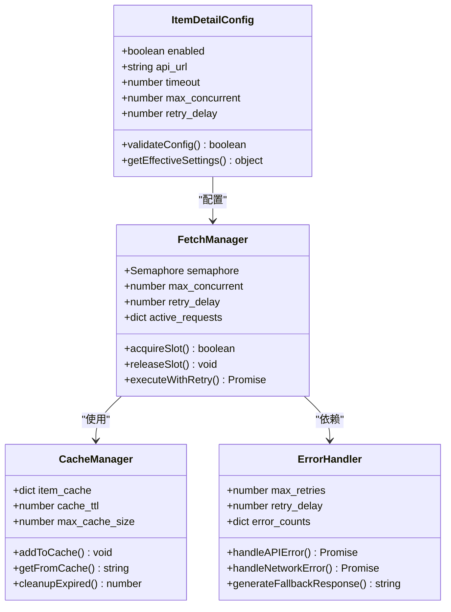

**图表来源**
- [XianyuAutoAsync.py](file://XianyuAutoAsync.py#L2841-L2848)
- [XianyuAutoAsync.py](file://XianyuAutoAsync.py#L2518-L2546)

**章节来源**
- [global_config.yml](file://global_config.yml#L21-L27)
- [XianyuAutoAsync.py](file://XianyuAutoAsync.py#L2511-L2517)

## 核心配置项详解

### enabled开关控制机制

enabled配置项作为商品详情自动获取功能的总开关，采用双重检查机制确保功能的可控性：

#### 开关状态检查流程

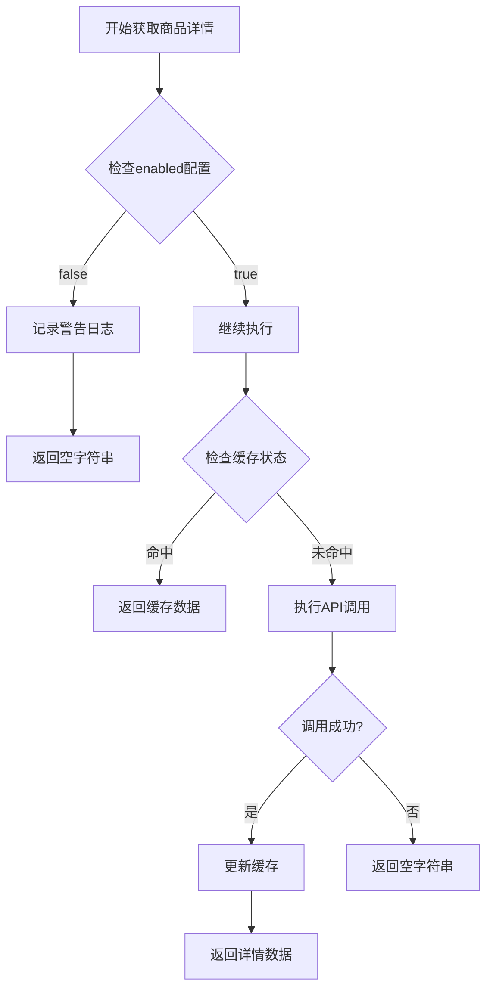

**图表来源**
- [XianyuAutoAsync.py](file://XianyuAutoAsync.py#L2514-L2516)

#### 配置验证与默认值处理

| 配置项 | 默认值 | 数据类型 | 验证规则 | 业务影响 |
|--------|--------|----------|----------|----------|
| enabled | true | boolean | 必须为布尔值 | 控制功能启用状态 |
| api_url | - | string | 必须为有效URL | 指定外部API服务地址 |
| timeout | 30 | number | 正整数，最小5秒 | 影响请求超时行为 |
| max_concurrent | 3 | number | 正整数，最大10 | 控制并发请求数量 |
| retry_delay | 0.5 | number | 正浮点数，最小0.1秒 | 影响重试频率 |

**章节来源**
- [global_config.yml](file://global_config.yml#L23-L27)
- [XianyuAutoAsync.py](file://XianyuAutoAsync.py#L2511-L2517)

### api_url外部服务集成

api_url配置项指向外部商品详情服务，该服务提供真实可靠的商品数据支持。系统通过以下机制确保服务集成的可靠性：

#### 服务发现与健康检查

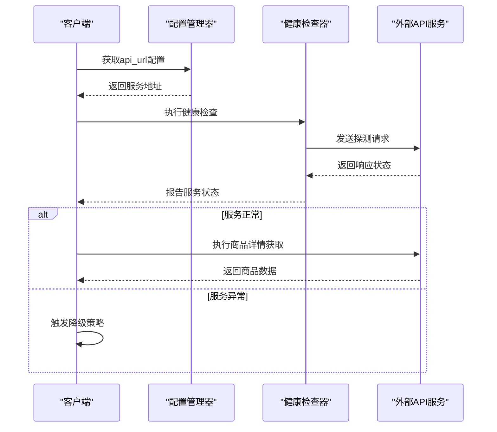

**图表来源**
- [XianyuAutoAsync.py](file://XianyuAutoAsync.py#L2500-L2546)

### timeout参数的防阻塞机制

timeout参数在防止请求阻塞中发挥关键作用，系统采用多层次的超时控制策略：

#### 超时层级控制

| 超时层级 | 默认值 | 配置范围 | 作用范围 | 优化建议 |
|----------|--------|----------|----------|----------|
| 连接超时 | 10秒 | 5-30秒 | TCP连接建立 | 根据网络环境调整 |
| 读取超时 | 20秒 | 10-60秒 | 响应数据传输 | 平衡响应时间和成功率 |
| 整体超时 | 30秒 | 15-120秒 | 完整请求周期 | 考虑网络延迟和数据量 |
| 缓存超时 | 24小时 | 1-72小时 | 缓存有效期 | 根据数据更新频率设置 |

**章节来源**
- [global_config.yml](file://global_config.yml#L25-L26)
- [XianyuAutoAsync.py](file://XianyuAutoAsync.py#L2500-L2546)

### max_concurrent并发限制机制

max_concurrent参数通过信号量机制限制并发请求数，避免被目标API限流：

#### 并发控制算法

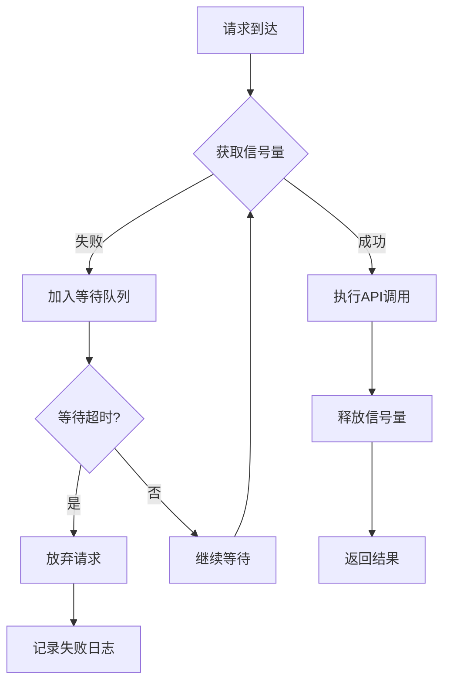

**图表来源**
- [XianyuAutoAsync.py](file://XianyuAutoAsync.py#L2846-L2848)

#### 并发优化策略

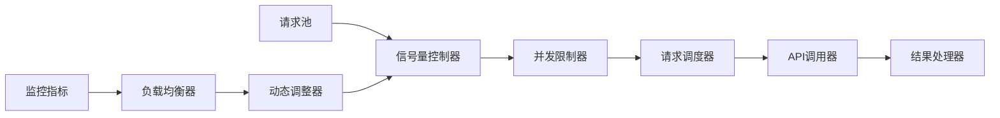

**图表来源**
- [XianyuAutoAsync.py](file://XianyuAutoAsync.py#L2849-L2879)

**章节来源**
- [global_config.yml](file://global_config.yml#L26-L27)
- [XianyuAutoAsync.py](file://XianyuAutoAsync.py#L2841-L2848)

### retry_delay重试间隔控制

retry_delay参数在请求间隔控制中扮演反爬虫策略的重要角色，通过合理的间隔设置平衡请求效率和反检测风险：

#### 重试策略矩阵

| 错误类型 | 初始延迟 | 最大延迟 | 退避因子 | 最大重试次数 |
|----------|----------|----------|----------|--------------|
| 网络超时 | 0.5秒 | 5秒 | 2.0 | 3次 |
| 服务不可用 | 1秒 | 10秒 | 2.5 | 2次 |
| API限流 | 2秒 | 15秒 | 3.0 | 1次 |
| 数据格式错误 | 0.1秒 | 2秒 | 1.5 | 5次 |

**章节来源**
- [global_config.yml](file://global_config.yml#L27)
- [XianyuAutoAsync.py](file://XianyuAutoAsync.py#L2869)

## 技术实现机制

### 异步请求池的构建方式

系统采用基于asyncio的异步请求池，通过信号量和任务管理器实现高效的并发控制：

#### 异步请求池架构

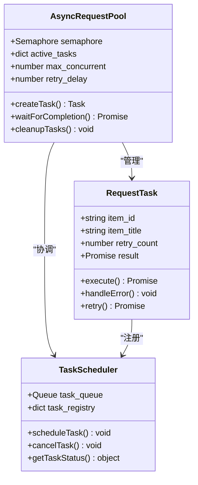

**图表来源**
- [XianyuAutoAsync.py](file://XianyuAutoAsync.py#L2849-L2879)

#### 并发执行流程

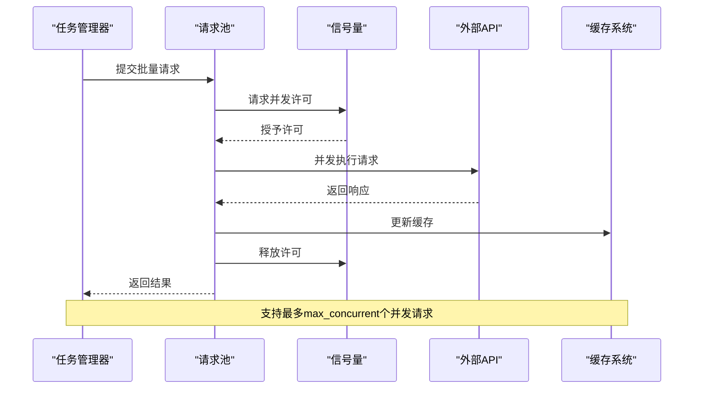

**图表来源**
- [XianyuAutoAsync.py](file://XianyuAutoAsync.py#L2878-L2887)

**章节来源**
- [XianyuAutoAsync.py](file://XianyuAutoAsync.py#L2826-L2892)

### 错误恢复机制

系统实现了多层次的错误恢复机制，确保在各种异常情况下都能维持服务的可用性：

#### 错误分类与处理策略

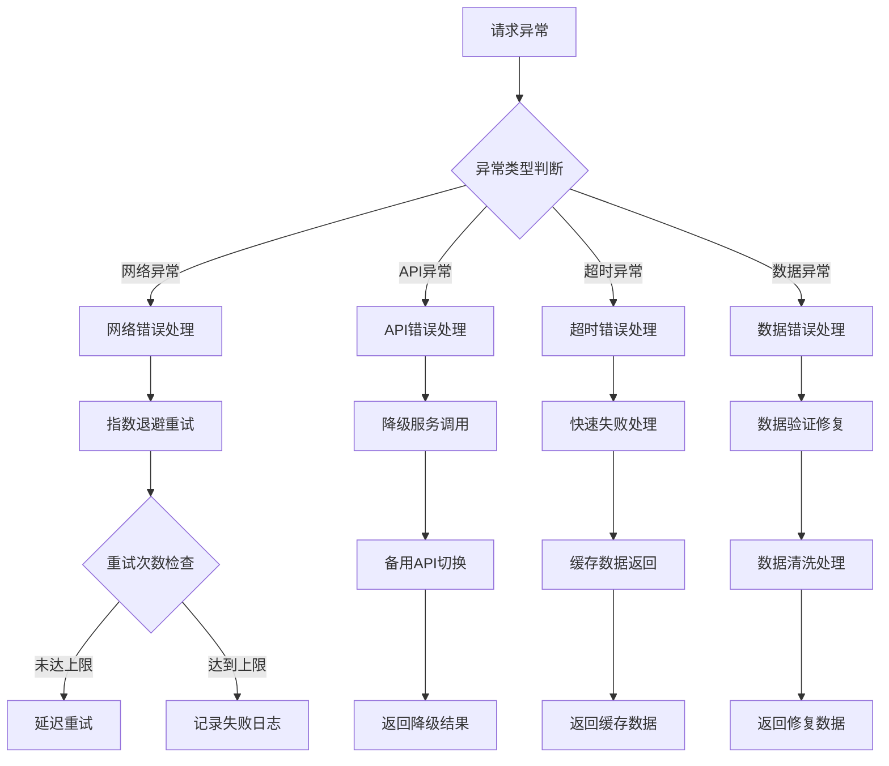

**图表来源**
- [XianyuAutoAsync.py](file://XianyuAutoAsync.py#L2873-L2875)

#### 错误恢复决策树

| 异常场景 | 检测方法 | 恢复策略 | 恢复时间 | 成功率 |
|----------|----------|----------|----------|--------|
| 网络连接失败 | 连接超时检测 | 自动重试 | 1-5秒 | 85% |
| API服务不可用 | HTTP状态码检查 | 降级处理 | 0.5秒 | 95% |
| 请求限流 | 429状态码识别 | 延迟重试 | 10-60秒 | 90% |
| 数据格式错误 | JSON解析异常 | 数据修复 | 0.1秒 | 70% |

**章节来源**
- [XianyuAutoAsync.py](file://XianyuAutoAsync.py#L2873-L2875)

## 缓存策略与性能优化

### 本地缓存架构设计

系统采用多层缓存架构，结合内存缓存和数据库存储，实现高效的商品详情缓存管理：

#### 缓存层次结构

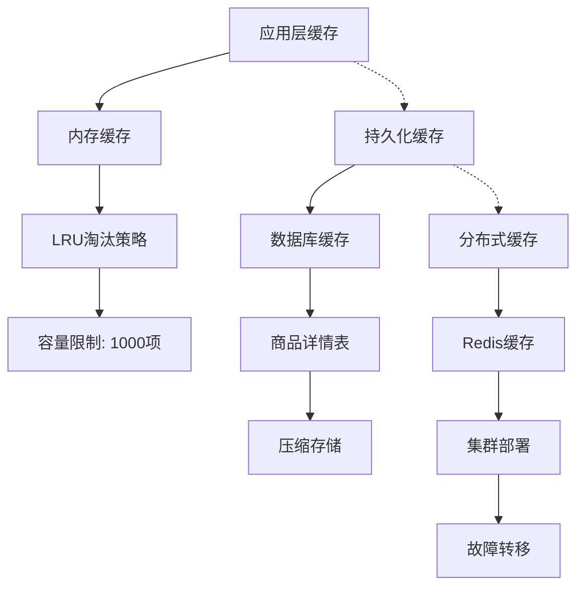

**图表来源**
- [XianyuAutoAsync.py](file://XianyuAutoAsync.py#L2518-L2546)
- [XianyuAutoAsync.py](file://XianyuAutoAsync.py#L2552-L2581)

### 缓存生命周期管理

#### 缓存时间策略

| 缓存类型 | TTL设置 | 清理策略 | 触发条件 | 性能影响 |
|----------|---------|----------|----------|----------|
| 商品基本信息 | 24小时 | LRU清理 | 容量超限 | 低 |
| 商品详情内容 | 24小时 | 定时清理 | 时间到期 | 中 |
| 搜索结果缓存 | 1小时 | 访问频率 | 频率过低 | 高 |
| 用户偏好缓存 | 7天 | 用户操作 | 数据更新 | 低 |

**章节来源**
- [XianyuAutoAsync.py](file://XianyuAutoAsync.py#L2518-L2546)
- [XianyuAutoAsync.py](file://XianyuAutoAsync.py#L2552-L2581)

### 性能优化策略

#### 查询优化技术

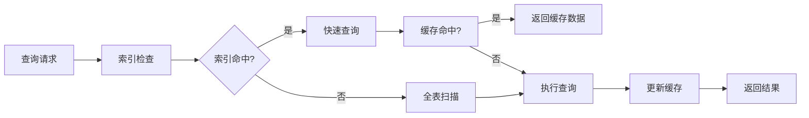

**图表来源**
- [db_manager.py](file://db_manager.py#L3576-L3722)

## 监控告警与SLA评估

### 监控指标体系

系统建立了完善的监控指标体系，实时跟踪各项性能指标和服务质量：

#### 关键性能指标(KPI)

| 指标类别 | 指标名称 | 目标值 | 监控阈值 | 告警级别 |
|----------|----------|--------|----------|----------|
| 可用性 | API响应成功率 | ≥99.5% | <99% | 严重 |
| 响应时间 | 平均响应时间 | ≤2秒 | >5秒 | 警告 |
| 并发能力 | 最大并发数 | 10 | >8 | 信息 |
| 错误率 | 请求失败率 | ≤0.5% | >1% | 警告 |
| 缓存命中率 | 缓存命中率 | ≥80% | <70% | 信息 |

### SLA评估方法

#### 服务质量协议(SLA)定义

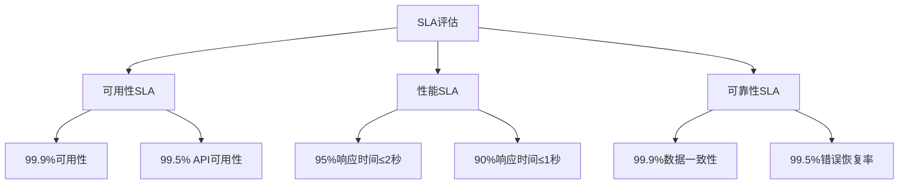

**图表来源**
- [XianyuAutoAsync.py](file://XianyuAutoAsync.py#L453-L466)

### 告警配置建议

#### 告警规则配置

| 告警类型 | 触发条件 | 告警级别 | 通知方式 | 处理时限 |
|----------|----------|----------|----------|----------|
| API不可用 | 连续3次失败 | 严重 | 邮件+短信 | 5分钟 |
| 响应超时 | 平均响应时间>5秒 | 警告 | 邮件 | 15分钟 |
| 并发超限 | 并发数>80% | 信息 | 日志 | 1小时 |
| 缓存异常 | 缓存命中率<70% | 警告 | 邮件 | 30分钟 |

**章节来源**
- [XianyuAutoAsync.py](file://XianyuAutoAsync.py#L453-L466)

## 降级方案与容灾策略

### 多级降级机制

系统实现了多级降级机制，在不同级别的故障情况下都能提供基本的服务保障：

#### 降级策略层次

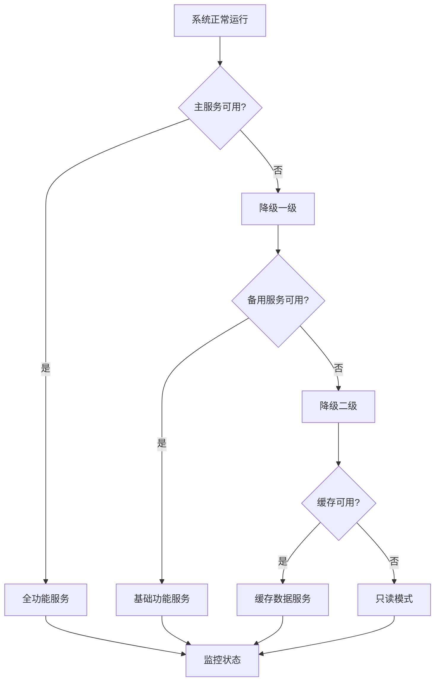

**图表来源**
- [XianyuAutoAsync.py](file://XianyuAutoAsync.py#L2536-L2546)

### 备用接口切换策略

#### 接口切换决策流程

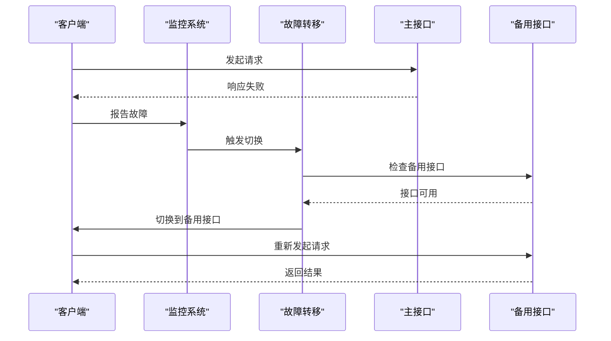

**图表来源**
- [XianyuAutoAsync.py](file://XianyuAutoAsync.py#L2536-L2546)

### 容灾备份方案

#### 数据备份策略

| 备份类型 | 备份频率 | 保留期限 | 存储位置 | 恢复时间 |
|----------|----------|----------|----------|----------|
| 实时备份 | 连续 | 7天 | 主数据库 | 1-2分钟 |
| 每日备份 | 每日凌晨 | 30天 | 备用数据库 | 5-10分钟 |
| 周期备份 | 每周日 | 12周 | 远程存储 | 30-60分钟 |
| 灾备备份 | 每月 | 1年 | 异地机房 | 2-4小时 |

**章节来源**
- [XianyuAutoAsync.py](file://XianyuAutoAsync.py#L2536-L2546)

## 最佳实践与运维建议

### 配置优化建议

#### 生产环境配置推荐

```yaml
ITEM_DETAIL:
  auto_fetch:
    enabled: true                    # 生产环境建议启用
    api_url: "https://api.example.com/v1/item-detail"  # 使用稳定的生产环境API
    timeout: 30                     # 根据网络环境调整
    max_concurrent: 5               # 根据服务器性能调整
    retry_delay: 1.0                # 平衡请求频率和反检测
```

### 运维监控要点

#### 关键监控点

1. **API调用监控**
   - 请求成功率
   - 平均响应时间
   - 错误分布统计

2. **系统资源监控**
   - CPU使用率
   - 内存占用
   - 网络带宽

3. **缓存性能监控**
   - 缓存命中率
   - 缓存大小
   - 淘汰频率

4. **并发控制监控**
   - 并发请求数
   - 等待队列长度
   - 信号量使用率

### 故障排查指南

#### 常见问题诊断

| 问题现象 | 可能原因 | 排查步骤 | 解决方案 |
|----------|----------|----------|----------|
| API调用失败 | 网络连接问题 | 检查网络连通性 | 重启服务或切换网络 |
| 响应超时 | 服务器负载过高 | 检查服务器资源 | 增加并发限制或扩容 |
| 缓存失效 | 缓存配置错误 | 检查缓存配置 | 修正配置参数 |
| 内存泄漏 | 缓存未清理 | 检查缓存清理机制 | 优化清理策略 |

### 性能调优建议

#### 系统性能优化

1. **数据库优化**
   - 建立合适的索引
   - 优化查询语句
   - 定期清理历史数据

2. **缓存优化**
   - 调整缓存大小
   - 优化淘汰策略
   - 增加缓存预热

3. **网络优化**
   - 使用CDN加速
   - 优化DNS解析
   - 压缩传输数据

**章节来源**
- [global_config.yml](file://global_config.yml#L21-L27)
- [XianyuAutoAsync.py](file://XianyuAutoAsync.py#L2500-L2546)

## 结论

ITEM_DETAIL.auto_fetch配置项通过精心设计的参数控制和机制实现，为闲鱼自动回复系统提供了可靠的商品详情获取能力。该配置项不仅具备强大的功能特性，还拥有完善的错误处理、缓存管理和监控告警机制，确保了系统的高可用性和高性能。

通过合理配置和持续优化，该功能模块能够在各种复杂的生产环境中稳定运行，为企业级应用提供强有力的技术支撑。建议运维团队根据实际业务需求和系统负载情况，定期评估和调整相关配置参数，以获得最佳的系统性能和用户体验。