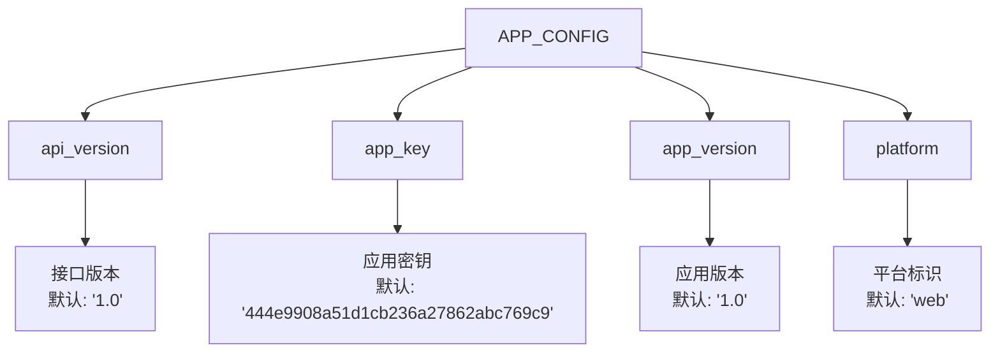
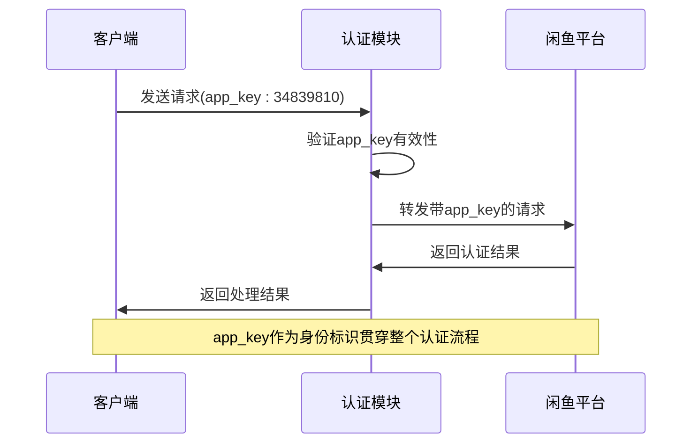
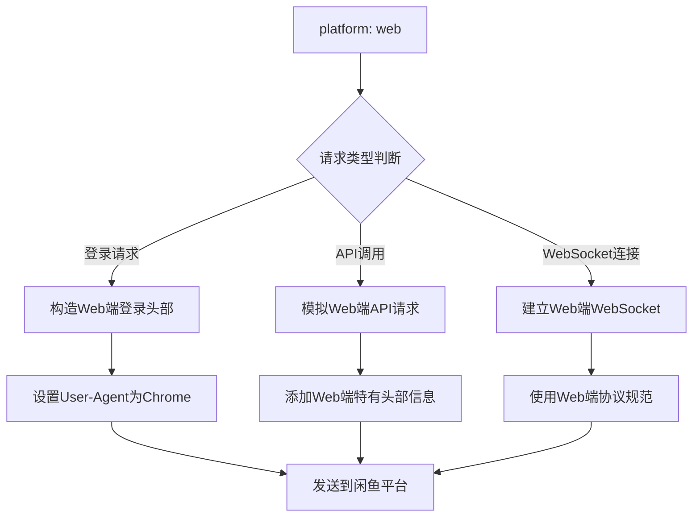
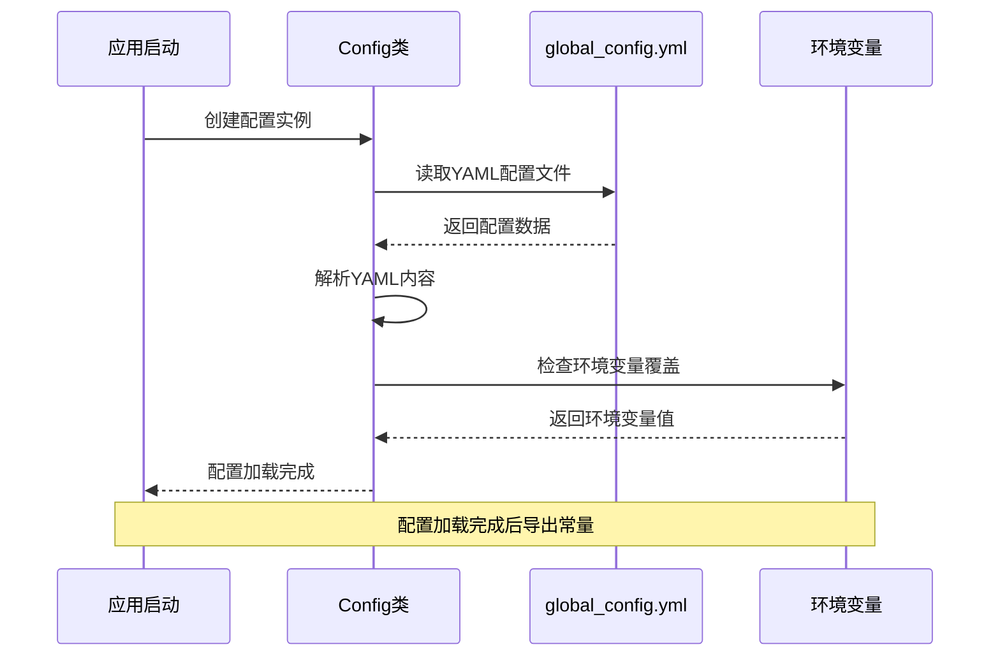
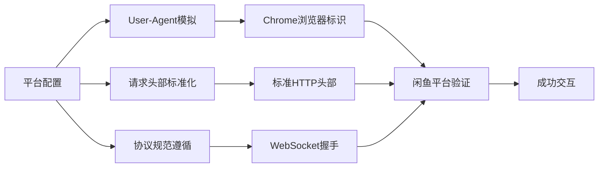
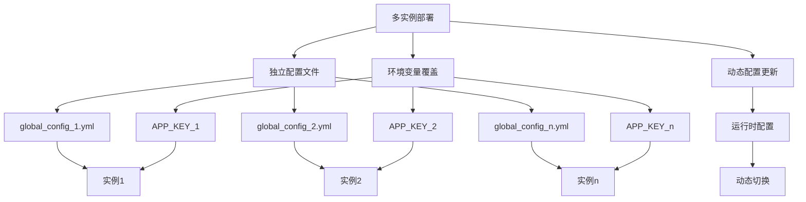
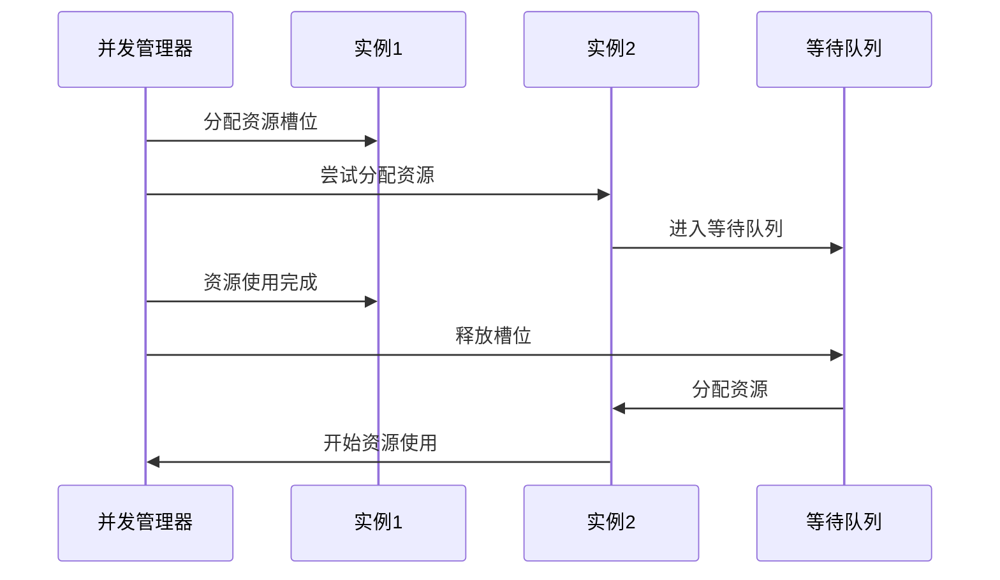
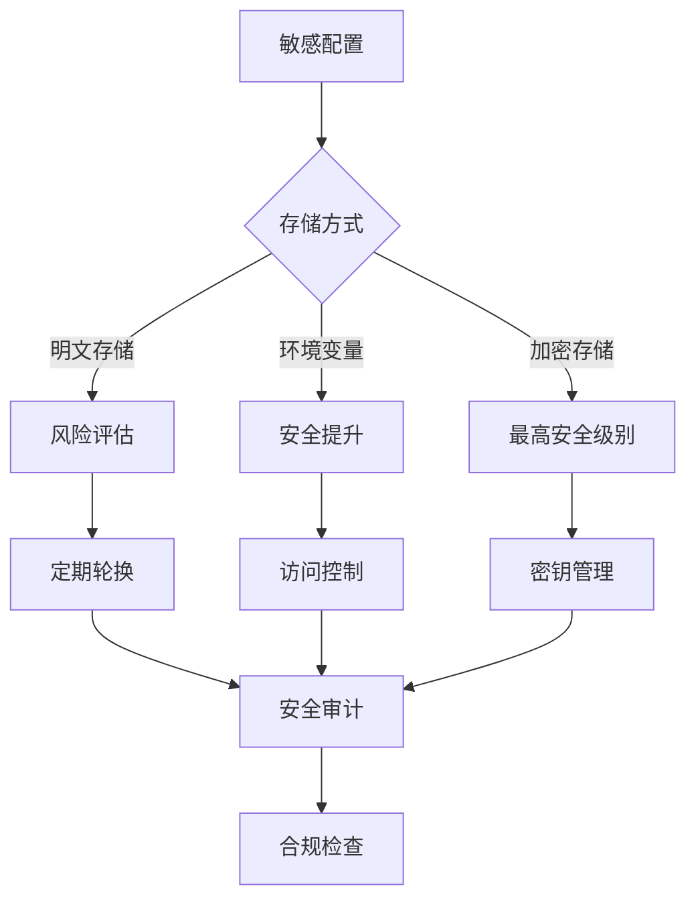
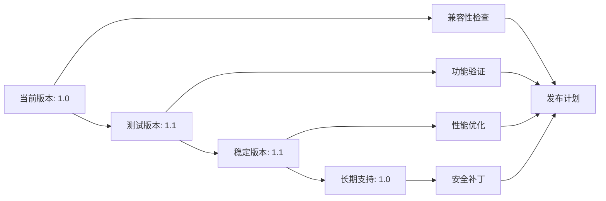

# 应用配置

<cite>
**本文档引用的文件**
- [global_config.yml](file://global_config.yml)
- [config.py](file://config.py)
- [XianyuAutoAsync.py](file://XianyuAutoAsync.py)
- [utils/qr_login.py](file://utils/qr_login.py)
- [secure_confirm_decrypted.py](file://secure_confirm_decrypted.py)
- [docker-compose.yml](file://docker-compose.yml)
- [docker-compose-cn.yml](file://docker-compose-cn.yml)
- [Start.py](file://Start.py)
</cite>

## 目录
1. [简介](#简介)
2. [APP_CONFIG配置结构](#app_config配置结构)
3. [核心配置参数详解](#核心配置参数详解)
4. [配置加载机制](#配置加载机制)
5. [平台适配与请求头构造](#平台适配与请求头构造)
6. [多实例部署最佳实践](#多实例部署最佳实践)
7. [安全配置与加密存储](#安全配置与加密存储)
8. [版本兼容性管理](#版本兼容性管理)
9. [故障排除指南](#故障排除指南)
10. [总结](#总结)

## 简介

本文档全面解析了闲鱼自动回复系统中`global_config.yml`文件中`APP_CONFIG`部分的配置参数及其对系统运行的影响。该配置是系统与闲鱼平台通信的核心基础，包含了应用身份认证、接口版本管理和平台行为模拟等关键要素。

系统采用YAML格式的配置文件设计，通过Python的`config.py`模块实现配置的统一管理和动态加载。这种设计使得配置项具有良好的可维护性和扩展性，同时支持运行时动态调整。

## APP_CONFIG配置结构

`APP_CONFIG`部分在全局配置文件中占据重要地位，其结构如下：



**图表来源**
- [global_config.yml](file://global_config.yml#L5-L9)

**章节来源**
- [global_config.yml](file://global_config.yml#L5-L9)

## 核心配置参数详解

### app_key - 应用唯一标识

`app_key`是系统与闲鱼平台通信的关键认证标识，具有以下特性：

#### 身份认证作用
- **唯一性保证**：每个应用实例都必须拥有唯一的`app_key`来标识自身身份
- **安全验证**：闲鱼平台通过`app_key`验证请求来源的合法性
- **访问控制**：不同`app_key`对应不同的访问权限和资源范围

#### 实际应用场景
在多个文件中可以看到`app_key`的实际使用：



**图表来源**
- [utils/qr_login.py](file://utils/qr_login.py#L107)
- [secure_confirm_decrypted.py](file://secure_confirm_decrypted.py#L104)

#### 配置示例
```yaml
APP_CONFIG:
  app_key: 444e9908a51d1cb236a27862abc769c9
```

**章节来源**
- [global_config.yml](file://global_config.yml#L7)
- [utils/qr_login.py](file://utils/qr_login.py#L107)
- [secure_confirm_decrypted.py](file://secure_confirm_decrypted.py#L104)

### api_version - 接口版本管理

`api_version`参数控制着系统使用的闲鱼API版本，对兼容性至关重要：

#### 版本兼容性意义
- **向后兼容**：确保新版本系统能够与旧版平台正常交互
- **功能适配**：根据平台支持的功能版本调整请求参数
- **稳定性保障**：避免因平台API变更导致的功能失效

#### 版本演进策略
系统采用保守的版本策略，使用稳定的`1.0`版本以确保长期兼容性。

#### 配置示例
```yaml
APP_CONFIG:
  api_version: '1.0'
```

**章节来源**
- [global_config.yml](file://global_config.yml#L6)

### app_version - 应用版本标识

`app_version`反映客户端应用的版本信息，在平台监控和统计中发挥作用：

#### 平台监控功能
- **版本追踪**：记录各实例的应用版本分布情况
- **性能分析**：基于版本信息进行性能对比分析
- **问题定位**：快速识别特定版本的问题和bug

#### 统计价值
该参数主要用于平台侧的统计数据收集，帮助开发者了解用户群体的版本分布。

#### 配置示例
```yaml
APP_CONFIG:
  app_version: '1.0'
```

**章节来源**
- [global_config.yml](file://global_config.yml#L8)

### platform - 平台行为模拟

`platform`参数决定了系统在与闲鱼平台交互时的行为模式和请求特征：

#### 平台适配机制


**图表来源**
- [XianyuAutoAsync.py](file://XianyuAutoAsync.py#L5165-L5174)

#### 行为特征
当`platform`设置为`web`时，系统会：
- 使用Web浏览器的User-Agent字符串
- 添加Web端特有的请求头部信息
- 模拟Web端的交互流程和协议规范

#### 配置示例
```yaml
APP_CONFIG:
  platform: web
```

**章节来源**
- [global_config.yml](file://global_config.yml#L9)
- [XianyuAutoAsync.py](file://XianyuAutoAsync.py#L5165-L5174)

## 配置加载机制

系统采用单例模式的配置管理架构，通过`config.py`实现配置的统一加载和管理：

### 加载流程



**图表来源**
- [config.py](file://config.py#L15-L32)

### 配置导出机制

系统在`config.py`中导出了多个常用的配置项，便于在整个应用中使用：

| 配置项 | 类型 | 默认值 | 用途 |
|--------|------|--------|------|
| APP_CONFIG | dict | {} | 应用配置容器 |
| API_ENDPOINTS | dict | {} | API端点配置 |
| DEFAULT_HEADERS | dict | {} | 默认请求头部 |
| WEBSOCKET_HEADERS | dict | {} | WebSocket头部 |

**章节来源**
- [config.py](file://config.py#L15-L32)
- [config.py](file://config.py#L91-L125)

### 动态配置更新

配置系统支持运行时动态更新配置项：

```python
# 动态设置配置项
config.set('APP_CONFIG.app_key', 'new_app_key_value')

# 获取配置项（支持嵌套键）
app_key = config.get('APP_CONFIG.app_key', 'default_value')
```

**章节来源**
- [config.py](file://config.py#L55-L77)

## 平台适配与请求头构造

### 请求头标准化

系统通过`DEFAULT_HEADERS`和`WEBSOCKET_HEADERS`两个配置组来标准化请求头：

#### Web请求头部
```yaml
DEFAULT_HEADERS:
  accept: application/json
  accept-language: zh-CN,zh;q=0.9
  cache-control: no-cache
  origin: https://www.goofish.com
  pragma: no-cache
  priority: u=1, i
  referer: https://www.goofish.com/
  sec-ch-ua: '"Not(A:Brand";v="99", "Google Chrome";v="133", "Chromium";v="133"'
  sec-ch-ua-mobile: ?0
  sec-ch-ua-platform: '"Windows"'
  sec-fetch-dest: empty
  sec-fetch-mode: cors
  sec-fetch-site: same-site
  user-agent: Mozilla/5.0 (Windows NT 10.0; Win64; x64) AppleWebKit/537.36 (KHTML, like Gecko) Chrome/133.0.0.0 Safari/537.36
```

#### WebSocket头部
```yaml
WEBSOCKET_HEADERS:
  Accept-Encoding: gzip, deflate, br, zstd
  Accept-Language: zh-CN,zh;q=0.9
  Cache-Control: no-cache
  Connection: Upgrade
  Host: wss-goofish.dingtalk.com
  Origin: https://www.goofish.com
  Pragma: no-cache
  User-Agent: Mozilla/5.0 (Windows NT 10.0; Win64; x64) AppleWebKit/537.36 (KHTML, like Gecko) Chrome/133.0.0.0 Safari/537.36
```

### 平台行为模拟

系统通过多种方式模拟真实用户的Web端行为：



**图表来源**
- [global_config.yml](file://global_config.yml#L31-L46)
- [global_config.yml](file://global_config.yml#L66-L76)

**章节来源**
- [global_config.yml](file://global_config.yml#L31-L76)

## 多实例部署最佳实践

### 应用标识隔离

在多实例部署场景下，确保每个实例都有独立的配置是至关重要的：

#### 配置隔离策略


#### 实例管理建议
1. **配置文件分离**：为每个实例创建独立的配置文件
2. **环境变量区分**：使用不同的环境变量前缀
3. **数据库隔离**：确保每个实例使用独立的数据存储
4. **监控指标**：为每个实例设置独立的监控指标

### 并发控制与资源管理

系统内置了并发控制机制来管理多个实例的资源使用：



**图表来源**
- [utils/xianyu_slider_stealth.py](file://utils/xianyu_slider_stealth.py#L64-L143)

**章节来源**
- [utils/xianyu_slider_stealth.py](file://utils/xianyu_slider_stealth.py#L64-L143)

## 安全配置与加密存储

### 敏感信息保护

#### app_key等敏感信息的安全处理



#### 环境变量替代方案

推荐使用环境变量来替代配置文件中的敏感信息：

```yaml
# 推荐的配置方式
APP_CONFIG:
  app_key: ${APP_KEY}
  api_version: ${API_VERSION:-1.0}
  app_version: ${APP_VERSION:-1.0}
  platform: ${PLATFORM:-web}
```

#### Docker环境配置示例

```yaml
# docker-compose.yml
environment:
  - APP_KEY=${APP_KEY}
  - API_VERSION=${API_VERSION:-1.0}
  - APP_VERSION=${APP_VERSION:-1.0}
  - PLATFORM=${PLATFORM:-web}
```

### 加密存储建议

对于生产环境，建议采用以下加密存储方案：

1. **密钥管理系统**：使用专业的密钥管理服务
2. **配置加密**：对敏感配置进行加密存储
3. **访问审计**：记录所有配置访问行为
4. **定期轮换**：建立密钥轮换机制

**章节来源**
- [docker-compose.yml](file://docker-compose.yml#L22-L59)
- [docker-compose-cn.yml](file://docker-compose-cn.yml#L22-L59)

## 版本兼容性管理

### API版本升级策略

系统采用渐进式版本升级策略，确保向后兼容性：



### 兼容性处理策略

#### 向后兼容性保证
- **API降级**：新版本自动降级到兼容的API版本
- **功能检测**：运行时检测平台功能支持情况
- **优雅降级**：功能不可用时提供替代方案

#### 版本迁移指南
1. **渐进式升级**：逐步升级各个组件版本
2. **功能测试**：充分测试新版本功能
3. **回滚准备**：准备好快速回滚方案
4. **用户通知**：及时通知用户版本变更

**章节来源**
- [global_config.yml](file://global_config.yml#L6)

## 故障排除指南

### 常见配置问题

#### app_key无效问题
**症状**：认证失败，返回401或403错误
**解决方案**：
1. 检查`app_key`格式是否正确
2. 验证`app_key`是否在有效期内
3. 确认`app_key`是否有足够的权限

#### 平台适配问题
**症状**：请求被拒绝或返回意外结果
**解决方案**：
1. 检查`platform`配置是否正确
2. 验证请求头部是否符合Web端规范
3. 确认User-Agent是否为真实浏览器标识

#### 版本兼容性问题
**症状**：API调用失败或功能异常
**解决方案**：
1. 检查`api_version`和`app_version`配置
2. 验证平台支持的API版本范围
3. 查看平台文档确认版本兼容性

### 调试技巧

#### 日志分析
系统提供了详细的调试日志，可以通过以下方式启用：

```python
# 启用详细日志
import logging
logging.basicConfig(level=logging.DEBUG)

# 或者通过配置文件
LOG_CONFIG:
  level: DEBUG
```

#### 配置验证
```python
# 验证配置完整性
from config import config
app_config = config.get('APP_CONFIG', {})
required_keys = ['app_key', 'api_version', 'app_version', 'platform']

missing_keys = [key for key in required_keys if key not in app_config]
if missing_keys:
    print(f"缺少必要配置项: {missing_keys}")
```

**章节来源**
- [config.py](file://config.py#L34-L53)

## 总结

闲鱼自动回复系统的`APP_CONFIG`配置是整个系统运行的基础，它不仅负责应用的身份认证，还影响着与闲鱼平台的交互方式和兼容性表现。通过合理配置`app_key`、`api_version`、`app_version`和`platform`参数，可以构建出符合闲鱼Web端协议要求的客户端环境。

在实际部署中，建议采用环境变量替代敏感信息存储，实施严格的访问控制，并建立完善的监控和告警机制。对于多实例部署场景，要特别注意配置隔离和资源管理，确保系统的稳定性和安全性。

随着平台API的不断演进，系统需要持续关注版本兼容性问题，建立完善的测试和升级机制，以保证系统的长期稳定运行。