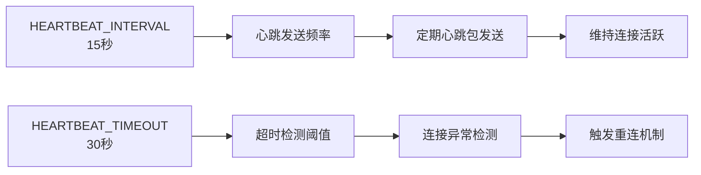
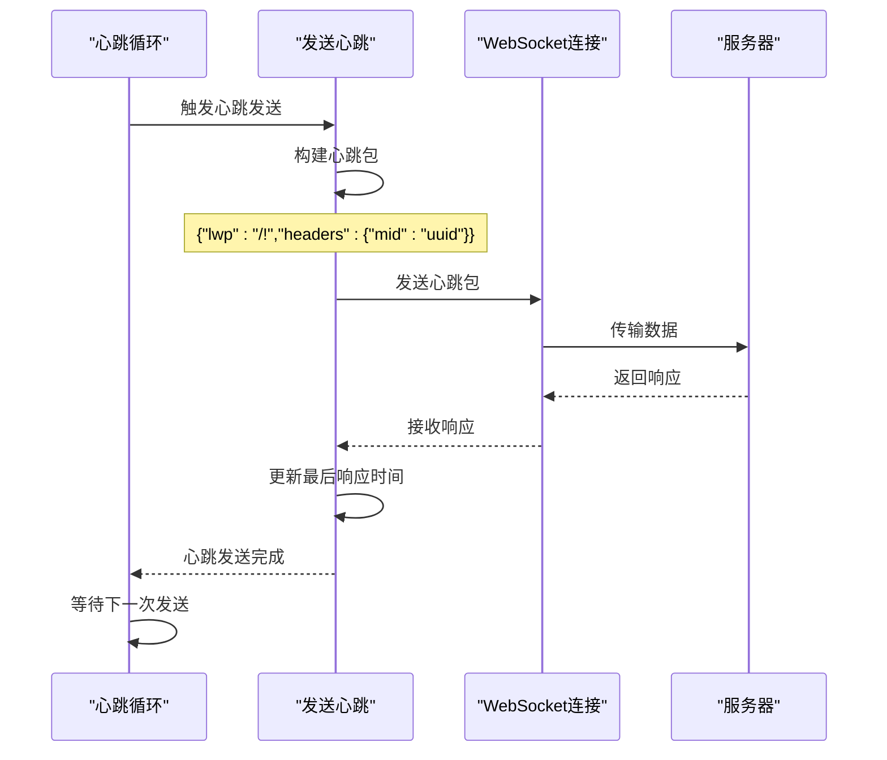
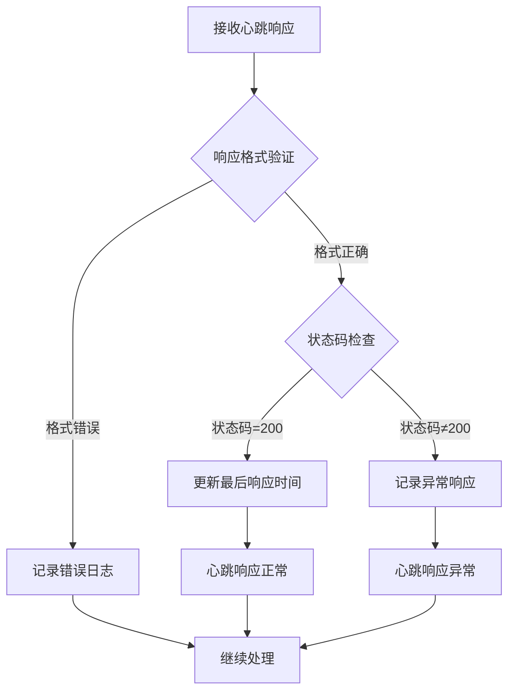
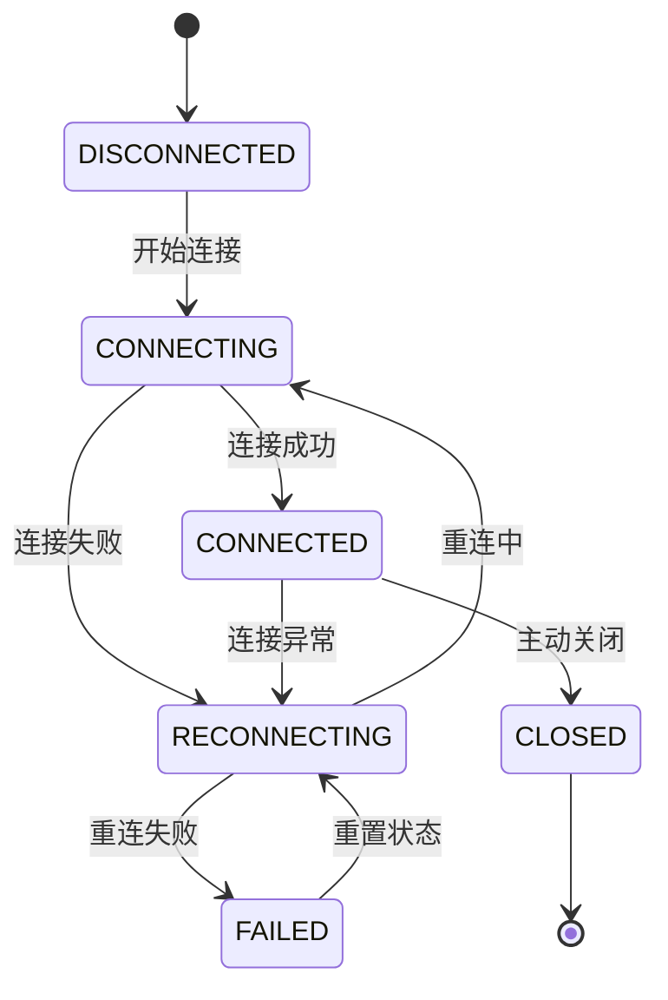
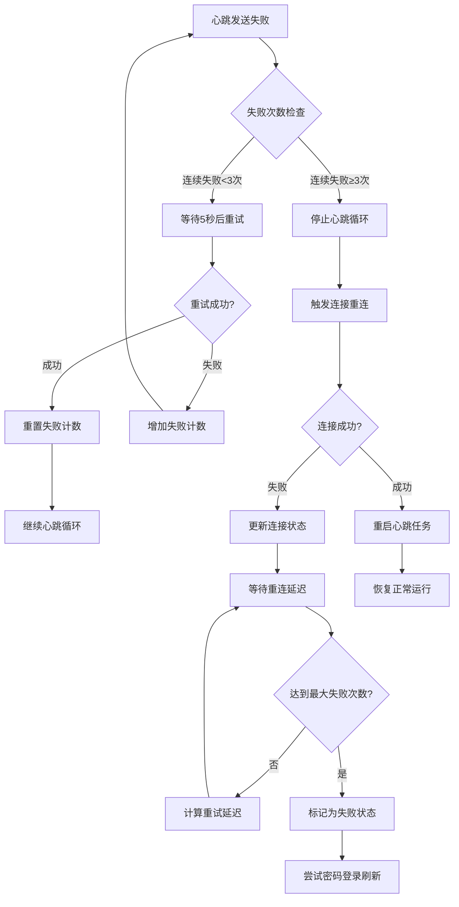
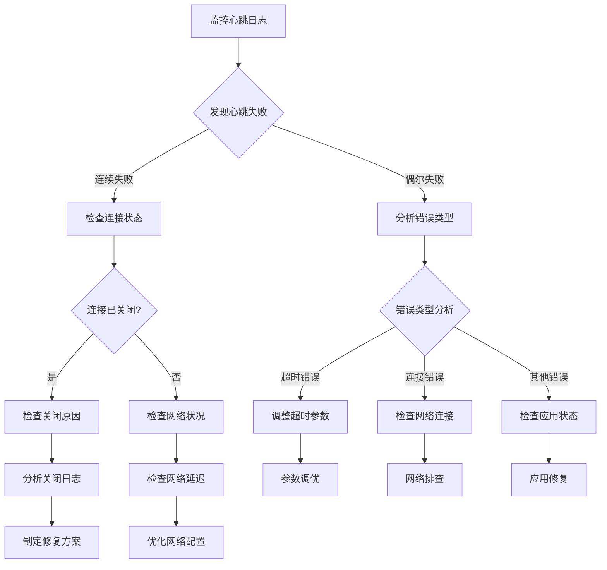

# 心跳机制配置

<cite>
**本文档中引用的文件**
- [XianyuAutoAsync.py](file://XianyuAutoAsync.py)
- [config.py](file://config.py)
- [utils/ws_utils.py](file://utils/ws_utils.py)
- [global_config.yml](file://global_config.yml)
</cite>

## 目录
1. [概述](#概述)
2. [心跳机制核心配置](#心跳机制核心配置)
3. [心跳发送机制](#心跳发送机制)
4. [心跳响应处理](#心跳响应处理)
5. [连接监控与重连机制](#连接监控与重连机制)
6. [心跳失败后的自动重连逻辑](#心跳失败后的自动重连逻辑)
7. [高延迟网络环境优化](#高延迟网络环境优化)
8. [日志监控与故障诊断](#日志监控与故障诊断)
9. [最佳实践建议](#最佳实践建议)

## 概述

WebSocket长连接保活机制是闲鱼自动回复系统维持稳定通信的关键组件。该系统通过HEARTBEAT_INTERVAL和HEARTBEAT_TIMEOUT两个核心参数协同工作，确保WebSocket连接在各种网络环境下都能保持活跃状态，防止因网络波动或服务器端连接清理导致的消息中断。

心跳机制的核心价值在于：
- **连接保活**：定期发送心跳包维持WebSocket连接活跃状态
- **异常检测**：通过心跳响应判断连接健康状况
- **自动恢复**：在连接异常时实现自动重连
- **性能优化**：减少不必要的连接重建开销

## 心跳机制核心配置

### 配置参数详解

系统采用双参数配置模型，通过精确的参数设计实现高效的连接保活：



**图表来源**
- [config.py](file://config.py#L94-L95)
- [global_config.yml](file://global_config.yml#L47-L48)

#### HEARTBEAT_INTERVAL (15秒)

- **作用**：定义心跳包发送的时间间隔
- **技术原理**：基于WebSocket协议的ping/pong机制
- **实现位置**：[XianyuAutoAsync.py](file://XianyuAutoAsync.py#L653-L654)
- **配置来源**：[global_config.yml](file://global_config.yml#L47)

#### HEARTBEAT_TIMEOUT (30秒)

- **作用**：定义心跳响应超时阈值
- **技术原理**：检测心跳响应是否在规定时间内到达
- **实现位置**：[XianyuAutoAsync.py](file://XianyuAutoAsync.py#L654)
- **配置来源**：[global_config.yml](file://global_config.yml#L48)

**章节来源**
- [config.py](file://config.py#L94-L95)
- [global_config.yml](file://global_config.yml#L47-L48)

## 心跳发送机制

### 心跳包结构与发送流程

系统采用标准化的心跳包格式，确保服务器能够正确识别和处理心跳请求：



**图表来源**
- [XianyuAutoAsync.py](file://XianyuAutoAsync.py#L5198-L5214)

#### 心跳包构建

心跳包采用简洁的数据结构，包含必要的标识信息：

- **lwp字段**：固定值"/!"，标识心跳包类型
- **headers.mid**：唯一消息ID，用于响应匹配
- **超时保护**：发送操作设置2秒超时，避免阻塞

#### 发送策略

- **连接状态检查**：发送前验证WebSocket连接状态
- **异常处理**：捕获发送过程中的各种异常
- **状态更新**：成功发送后更新最后发送时间

**章节来源**
- [XianyuAutoAsync.py](file://XianyuAutoAsync.py#L5198-L5214)

## 心跳响应处理

### 响应验证机制

系统通过严格的响应验证确保心跳机制的有效性：



**图表来源**
- [XianyuAutoAsync.py](file://XianyuAutoAsync.py#L5272-L5281)

#### 响应处理逻辑

- **状态码验证**：检查响应状态码是否为200
- **时间戳更新**：成功响应时更新`last_heartbeat_response`
- **异常捕获**：处理响应解析过程中的各种异常
- **日志记录**：记录心跳响应的正常或异常状态

**章节来源**
- [XianyuAutoAsync.py](file://XianyuAutoAsync.py#L5272-L5281)

## 连接监控与重连机制

### 连接状态管理

系统实现了完整的连接生命周期管理，包括状态监控和自动重连：



**图表来源**
- [XianyuAutoAsync.py](file://XianyuAutoAsync.py#L29-L36)

#### 连接状态转换

- **DISCONNECTED**：初始状态，未建立连接
- **CONNECTING**：正在建立连接
- **CONNECTED**：连接正常，可以发送和接收消息
- **RECONNECTING**：连接异常，正在进行重连
- **FAILED**：重连失败，需要人工干预
- **CLOSED**：主动关闭连接

**章节来源**
- [XianyuAutoAsync.py](file://XianyuAutoAsync.py#L29-L36)

## 心跳失败后的自动重连逻辑

### 重连策略与算法

系统实现了智能的重连策略，根据不同的失败类型采用相应的重连策略：



**图表来源**
- [XianyuAutoAsync.py](file://XianyuAutoAsync.py#L5221-L5268)
- [XianyuAutoAsync.py](file://XianyuAutoAsync.py#L453-L465)

#### 重连延迟计算

系统根据错误类型和失败次数动态计算重连延迟：

- **WebSocket意外断开**：短延迟策略，最多15秒
- **网络连接问题**：长延迟策略，最多60秒  
- **其他未知错误**：中等延迟策略，最多30秒

#### 重连限制机制

- **最大失败次数**：连续失败3次后停止心跳循环
- **连接失败计数**：累计连接失败次数，最多5次
- **状态重置**：成功重连后重置所有失败计数

**章节来源**
- [XianyuAutoAsync.py](file://XianyuAutoAsync.py#L5221-L5268)
- [XianyuAutoAsync.py](file://XianyuAutoAsync.py#L453-L465)

## 高延迟网络环境优化

### 参数调优建议

针对高延迟网络环境，建议调整以下参数以提高连接稳定性：

#### 调整策略表

| 场景类型 | HEARTBEAT_INTERVAL | HEARTBEAT_TIMEOUT | 重试策略 |
|---------|-------------------|------------------|----------|
| 高延迟网络 | 30秒 | 60秒 | 增加重试次数 |
| 不稳定网络 | 20秒 | 45秒 | 启用指数退避 |
| 移动网络 | 45秒 | 90秒 | 增加超时容忍度 |
| 企业网络 | 15秒 | 30秒 | 保持默认配置 |

#### 优化配置示例

```yaml
# 高延迟网络优化配置
HEARTBEAT_INTERVAL: 30
HEARTBEAT_TIMEOUT: 60
MAX_HEARTBEAT_FAILURES: 5
RETRY_DELAY_BASE: 5
RETRY_DELAY_MAX: 30
```

### 网络适应性机制

系统内置了多种网络适应性机制：

- **可中断睡眠**：使用[`_interruptible_sleep`](file://XianyuAutoAsync.py#L217-L235)实现可中断的等待
- **连接状态检查**：定期检查WebSocket连接状态
- **异常类型识别**：区分不同类型的连接异常

**章节来源**
- [XianyuAutoAsync.py](file://XianyuAutoAsync.py#L217-L235)

## 日志监控与故障诊断

### 心跳相关日志模式

系统提供了丰富的日志信息用于监控和故障诊断：

#### 关键日志模式

| 日志级别 | 日志内容 | 触发条件 |
|---------|---------|----------|
| WARNING | "心跳包已发送" | 心跳发送成功 |
| ERROR | "心跳发送失败" | 心跳发送异常 |
| WARNING | "心跳响应正常" | 心跳响应成功 |
| ERROR | "心跳响应异常" | 心跳响应失败 |
| ERROR | "心跳连续失败" | 连续心跳失败3次 |
| WARNING | "WebSocket连接已关闭" | 连接正常关闭 |
| ERROR | "WebSocket连接异常" | 连接异常 |

#### 故障诊断流程



**图表来源**
- [XianyuAutoAsync.py](file://XianyuAutoAsync.py#L195-L215)
- [XianyuAutoAsync.py](file://XianyuAutoAsync.py#L7729-L7775)

### 监控指标

关键监控指标包括：

- **心跳成功率**：成功发送的心跳包占总发送量的比例
- **响应延迟**：心跳响应的平均延迟时间
- **连接稳定性**：连续成功的心跳次数
- **重连频率**：连接异常导致的重连次数

**章节来源**
- [XianyuAutoAsync.py](file://XianyuAutoAsync.py#L195-L215)
- [XianyuAutoAsync.py](file://XianyuAutoAsync.py#L7729-L7775)

## 最佳实践建议

### 配置优化建议

1. **参数设置原则**
   - HEARTBEAT_INTERVAL应小于HEARTBEAT_TIMEOUT的一半
   - 根据网络质量适当调整参数
   - 考虑服务器端的连接超时设置

2. **监控策略**
   - 实施实时心跳监控
   - 设置告警阈值
   - 定期分析心跳日志

3. **故障预防**
   - 实施连接健康检查
   - 建立自动重连机制
   - 准备人工干预预案

### 性能优化要点

- **资源管理**：合理控制心跳任务的资源消耗
- **异常处理**：完善的心跳异常处理机制
- **状态同步**：保持客户端与服务器状态一致

### 运维建议

- **定期检查**：监控心跳机制的运行状态
- **日志分析**：定期分析心跳相关日志
- **参数调优**：根据实际运行情况调整参数
- **应急预案**：制定心跳失败的应急处理方案

通过以上配置和优化措施，系统能够在各种网络环境下保持稳定的WebSocket连接，确保消息通信的可靠性和及时性。