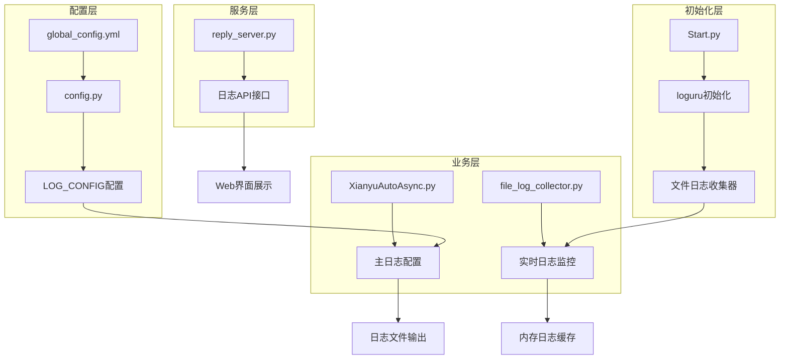
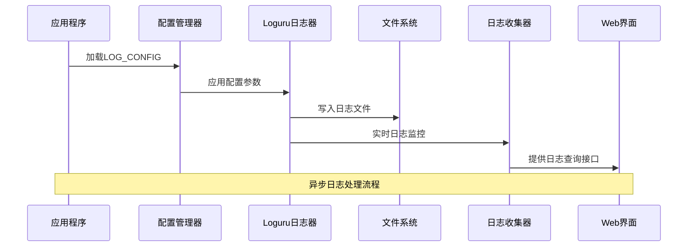
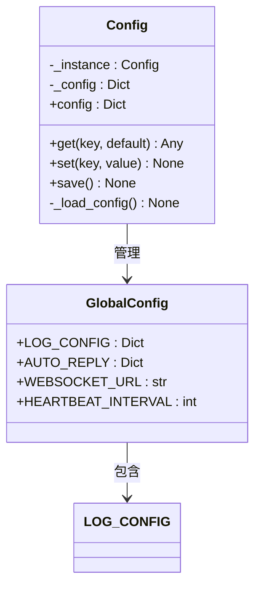
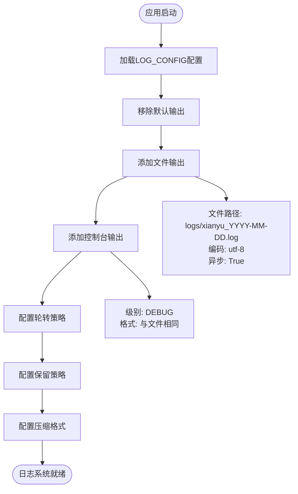
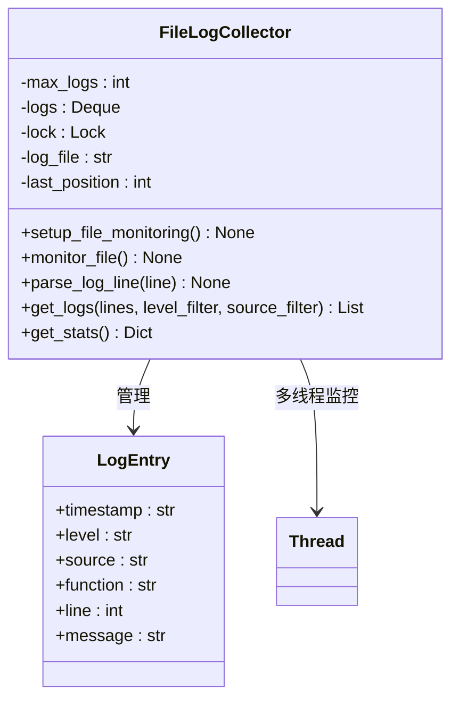
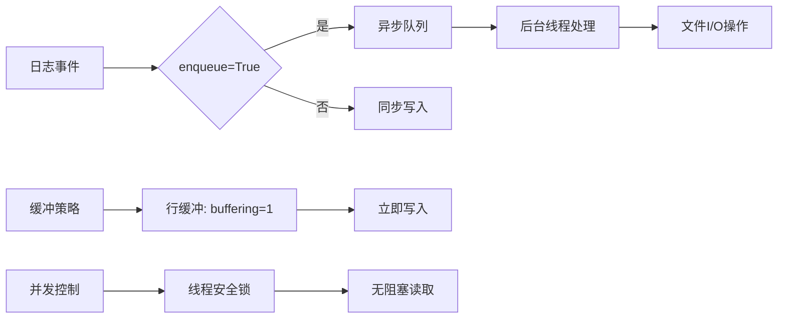
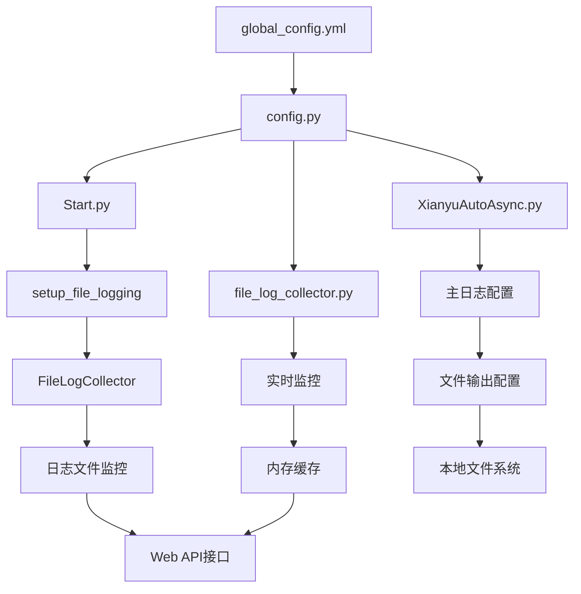
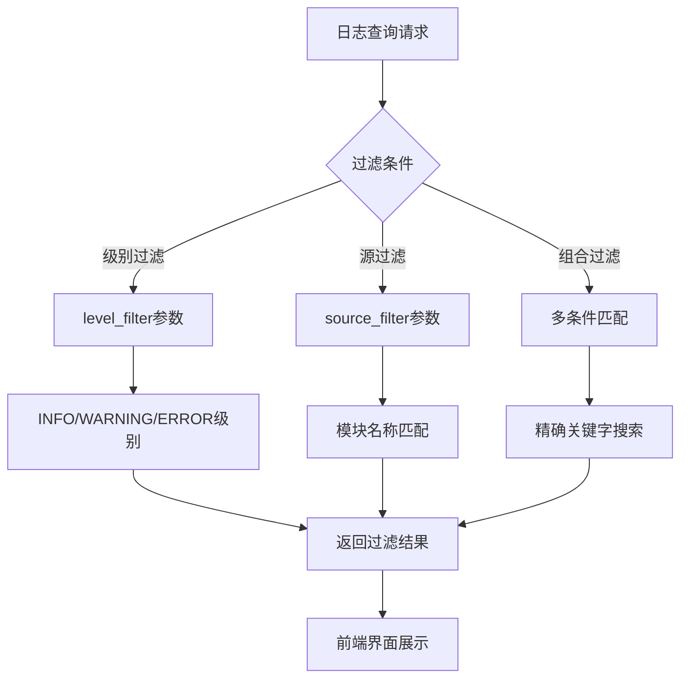

# 日志配置

<cite>
**本文档引用的文件**
- [Start.py](file://Start.py)
- [global_config.yml](file://global_config.yml)
- [config.py](file://config.py)
- [file_log_collector.py](file://file_log_collector.py)
- [XianyuAutoAsync.py](file://XianyuAutoAsync.py)
- [reply_server.py](file://reply_server.py)
</cite>

## 目录
1. [简介](#简介)
2. [项目结构概览](#项目结构概览)
3. [核心日志组件](#核心日志组件)
4. [架构概览](#架构概览)
5. [详细组件分析](#详细组件分析)
6. [依赖关系分析](#依赖关系分析)
7. [性能考虑](#性能考虑)
8. [故障排查指南](#故障排查指南)
9. [结论](#结论)

## 简介

本文档全面解析了Xianyu自动回复系统中的日志配置体系，重点说明了LOG_CONFIG中各项日志策略的配置含义与运维价值。该系统采用loguru作为主要日志框架，实现了灵活的日志轮转、存储管理和实时监控功能。

## 项目结构概览

该项目采用模块化设计，日志相关的核心文件分布在以下位置：



**图表来源**
- [Start.py](file://Start.py#L427-L442)
- [config.py](file://config.py#L117-L118)
- [XianyuAutoAsync.py](file://XianyuAutoAsync.py#L136-L156)

**章节来源**
- [Start.py](file://Start.py#L1-L602)
- [global_config.yml](file://global_config.yml#L1-L77)
- [config.py](file://config.py#L1-L126)

## 核心日志组件

### LOG_CONFIG配置结构

系统中的日志配置主要通过global_config.yml文件定义，包含以下核心参数：

| 配置项 | 类型 | 默认值 | 说明 |
|--------|------|--------|------|
| format | string | 时间格式化字符串 | 控制日志消息的显示格式 |
| level | string | INFO | 设置日志输出级别 |
| rotation | string | 1 day | 日志文件轮转周期 |
| retention | string | 7 days | 日志文件保留期限 |
| compression | string | zip | 压缩格式 |

### format字符串解析

format配置项定义了日志消息的渲染规则，其语法结构如下：

```
<green>{time:YYYY-MM-DD HH:mm:ss.SSS}</green> | <level>{level: <8}</level> | <cyan>{name}</cyan>:<cyan>{function}</cyan>:<cyan>{line}</cyan> - <level>{message}</level>
```

各部分含义：
- `{time:YYYY-MM-DD HH:mm:ss.SSS}`：精确到毫秒的时间戳
- `{level: <8}`：左对齐的8字符宽度日志级别
- `{name}`：模块名称
- `{function}`：函数名称
- `{line}`：代码行号
- `{message}`：实际日志内容

**章节来源**
- [global_config.yml](file://global_config.yml#L49-L56)

## 架构概览

系统采用分层架构设计，实现了日志配置的统一管理和多渠道输出：



**图表来源**
- [Start.py](file://Start.py#L517-L518)
- [file_log_collector.py](file://file_log_collector.py#L56-L71)
- [reply_server.py](file://reply_server.py#L4853-L4889)

## 详细组件分析

### 配置管理系统

配置管理通过Config类实现，提供了统一的配置加载和访问接口：



**图表来源**
- [config.py](file://config.py#L5-L126)

### 主日志配置系统

XianyuAutoAsync.py中的日志配置实现了多目标输出：



**图表来源**
- [XianyuAutoAsync.py](file://XianyuAutoAsync.py#L136-L156)

### 文件日志收集器

FileLogCollector提供了实时日志监控和Web界面展示功能：



**图表来源**
- [file_log_collector.py](file://file_log_collector.py#L15-L240)

**章节来源**
- [XianyuAutoAsync.py](file://XianyuAutoAsync.py#L136-L156)
- [file_log_collector.py](file://file_log_collector.py#L15-L240)

### 日志轮转与存储管理

系统实现了多层次的日志管理策略：

| 策略类型 | 配置值 | 效果说明 |
|----------|--------|----------|
| rotation | 1 day | 每天创建新的日志文件 |
| retention | 7 days | 保留最近7天的日志文件 |
| compression | zip | 使用ZIP格式压缩旧日志 |
| size_limit | 10 MB | 单文件最大10MB（file_log_collector） |

### 异步写入配置

为了提高性能，系统采用了多种异步优化策略：



**图表来源**
- [XianyuAutoAsync.py](file://XianyuAutoAsync.py#L149-L150)
- [file_log_collector.py](file://file_log_collector.py#L69-L71)

**章节来源**
- [XianyuAutoAsync.py](file://XianyuAutoAsync.py#L136-L156)
- [file_log_collector.py](file://file_log_collector.py#L56-L71)

## 依赖关系分析

系统的日志配置依赖关系呈现清晰的层次结构：



**图表来源**
- [config.py](file://config.py#L117-L118)
- [Start.py](file://Start.py#L517-L518)
- [XianyuAutoAsync.py](file://XianyuAutoAsync.py#L136-L156)

**章节来源**
- [config.py](file://config.py#L1-L126)
- [Start.py](file://Start.py#L427-L442)

## 性能考虑

### 高并发场景优化

针对高并发场景，系统采用了以下性能优化措施：

1. **异步日志写入**：通过`enqueue=True`实现非阻塞日志写入
2. **行缓冲机制**：`buffering=1`确保日志立即写入文件
3. **内存限制**：FileLogCollector使用固定大小的deque，避免内存无限增长
4. **多线程监控**：文件监控运行在独立线程中，不影响主线程性能

### 磁盘空间优化

压缩策略显著减少了磁盘占用：
- ZIP压缩比通常可达3:1
- 自动清理过期日志文件
- 合理的保留期限设置

## 故障排查指南

### 常见问题诊断

#### 日志文件未生成
1. 检查日志目录权限
2. 验证LOG_CONFIG配置是否正确加载
3. 确认文件路径是否存在

#### 日志轮转失效
1. 检查磁盘空间是否充足
2. 验证rotation配置格式
3. 确认文件锁定状态

#### 性能问题排查
1. 监控日志写入频率
2. 检查磁盘I/O性能
3. 分析内存使用情况

### 关键字过滤定位异常

系统支持多种日志过滤方式：



**图表来源**
- [file_log_collector.py](file://file_log_collector.py#L148-L161)

### 生产环境故障排查流程

1. **问题识别**：通过Web界面查看实时日志
2. **关键字搜索**：使用异常关键字快速定位问题
3. **级别过滤**：重点关注ERROR和WARNING级别
4. **时间范围**：按时间顺序分析问题发展过程
5. **根因分析**：结合上下文信息确定根本原因

**章节来源**
- [file_log_collector.py](file://file_log_collector.py#L148-L161)
- [reply_server.py](file://reply_server.py#L4853-L4889)

## 结论

Xianyu自动回复系统的日志配置体系展现了现代应用程序日志管理的最佳实践。通过统一的配置管理、灵活的轮转策略、高效的异步处理和完善的监控机制，系统实现了：

1. **可配置性**：通过yaml配置文件实现灵活的日志策略调整
2. **可扩展性**：支持多目标输出和自定义格式
3. **高性能**：异步写入和合理的资源管理
4. **易维护性**：自动化的轮转、压缩和清理机制
5. **可观测性**：完整的日志监控和Web界面展示

这套日志配置体系不仅满足了开发调试的需求，更为生产环境的运维监控提供了强有力的支持，是构建可靠、可维护应用程序的重要基础设施。