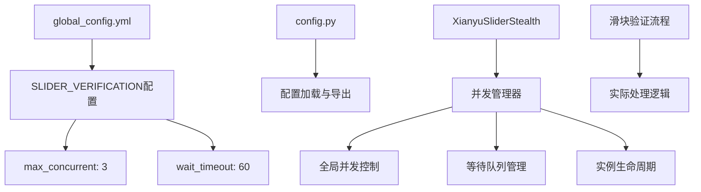
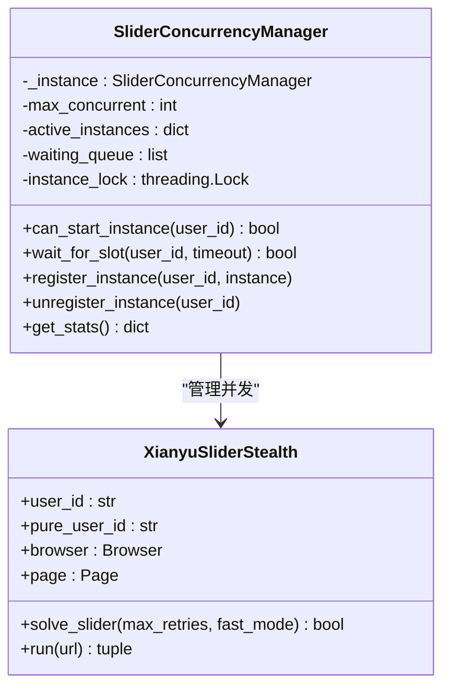
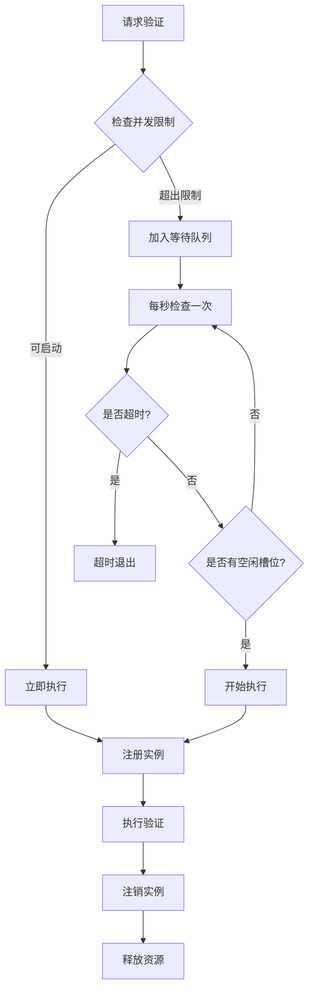
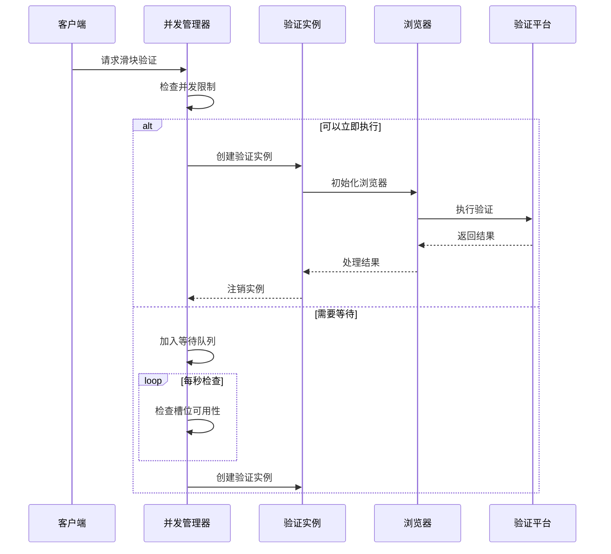
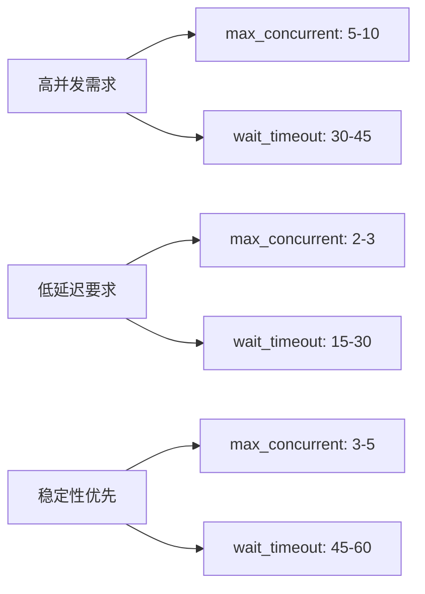
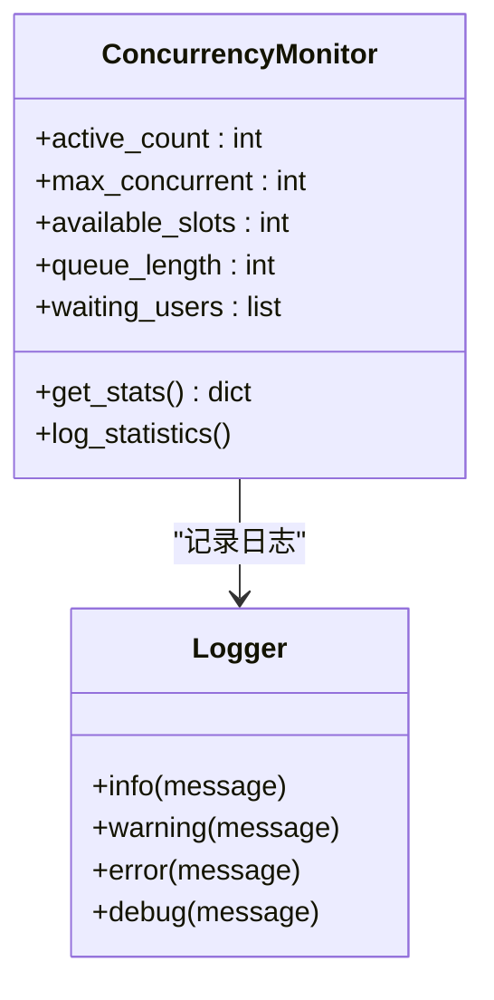

# 滑块验证配置

<cite>
**本文档中引用的文件**
- [config.py](file://config.py)
- [global_config.yml](file://global_config.yml)
- [utils/xianyu_slider_stealth.py](file://utils/xianyu_slider_stealth.py)
- [XianyuAutoAsync.py](file://XianyuAutoAsync.py)
- [utils/slider_patch.py](file://utils/slider_patch.py)
- [utils/item_search.py](file://utils/item_search.py)
</cite>

## 目录
1. [简介](#简介)
2. [配置结构分析](#配置结构分析)
3. [核心配置参数详解](#核心配置参数详解)
4. [并发控制机制](#并发控制机制)
5. [排队超时策略](#排队超时策略)
6. [实际处理流程](#实际处理流程)
7. [性能优化建议](#性能优化建议)
8. [监控与调试](#监控与调试)
9. [故障排除指南](#故障排除指南)
10. [总结](#总结)

## 简介

SLIDER_VERIFICATION配置项是闲鱼自动化系统中关键的安全控制组件，负责管理滑块验证请求的并发处理和资源分配。该配置通过max_concurrent和wait_timeout两个核心参数，实现了对验证服务负载的有效控制，防止因并发过高触发平台反爬机制，同时确保系统的稳定性和响应效率。

## 配置结构分析

### 配置文件组织



**图表来源**
- [global_config.yml](file://global_config.yml#L63-L66)
- [config.py](file://config.py#L100-L103)

### 配置参数定义

SLIDER_VERIFICATION配置在多个层面得到体现：

| 配置项 | 默认值 | 类型 | 描述 |
|--------|--------|------|------|
| max_concurrent | 3 | 整数 | 最大同时处理的滑块验证请求数量 |
| wait_timeout | 60 | 整数 | 等待可用槽位的超时时间（秒） |

**章节来源**
- [config.py](file://config.py#L100-L103)
- [global_config.yml](file://global_config.yml#L63-L65)

## 核心配置参数详解

### max_concurrent: 并发限制机制

max_concurrent参数控制同时处理的滑块验证请求数量，其设计原理如下：

#### 并发控制架构



**图表来源**
- [utils/xianyu_slider_stealth.py](file://utils/xianyu_slider_stealth.py#L35-L143)

#### 并发限制的作用机制

1. **防止单用户过度消耗资源**
   - 每个用户实例只能占用一个并发槽位
   - 避免某个用户长时间占用验证资源

2. **保护平台反爬机制**
   - 限制同时处理的验证请求数量
   - 防止触发平台的异常流量检测

3. **保证系统稳定性**
   - 控制内存和CPU使用率
   - 避免系统资源耗尽

**章节来源**
- [utils/xianyu_slider_stealth.py](file://utils/xianyu_slider_stealth.py#L58-L61)

### wait_timeout: 排队超时策略

wait_timeout参数定义了等待可用并发槽位的超时时间，采用动态排队机制：

#### 超时策略流程



**图表来源**
- [utils/xianyu_slider_stealth.py](file://utils/xianyu_slider_stealth.py#L63-L94)

#### 超时策略的优势

1. **平衡处理效率与资源占用**
   - 60秒的超时时间既不过于保守也不过于激进
   - 给予足够的时间处理复杂验证场景

2. **避免无限阻塞**
   - 超时后自动从队列中移除
   - 防止系统资源被长期占用

3. **用户体验优化**
   - 明确的超时反馈
   - 支持重试机制

**章节来源**
- [utils/xianyu_slider_stealth.py](file://utils/xianyu_slider_stealth.py#L65-L94)

## 实际处理流程

### 滑块验证处理逻辑

滑块验证的实际处理遵循严格的流程控制：



**图表来源**
- [utils/xianyu_slider_stealth.py](file://utils/xianyu_slider_stealth.py#L266-L276)
- [XianyuAutoAsync.py](file://XianyuAutoAsync.py#L1726-L1751)

### 轨迹生成与验证流程

基于SLIDER_VERIFICATION配置的轨迹生成流程：

1. **参数初始化**
   - 从配置读取max_concurrent和wait_timeout
   - 设置默认轨迹参数范围

2. **历史数据分析**
   - 基于成功记录优化轨迹参数
   - 动态调整步数、延迟、抖动等参数

3. **轨迹生成**
   - 生成符合人类行为模式的滑动轨迹
   - 包含自然的加速和减速过程

4. **验证执行**
   - 使用Playwright模拟用户操作
   - 处理各种验证场景（普通滑块、刮刮乐等）

**章节来源**
- [utils/xianyu_slider_stealth.py](file://utils/xianyu_slider_stealth.py#L244-L298)

## 性能优化建议

### 配置参数调整策略

根据不同的使用场景，可以调整以下参数以优化性能：

#### 高负载场景优化



#### 超时调整建议

| 场景 | max_concurrent | wait_timeout | 说明 |
|------|----------------|--------------|------|
| 日常使用 | 3 | 60 | 平衡性能与稳定性 |
| 批量处理 | 5 | 45 | 提高吞吐量 |
| 网络延迟高 | 2 | 90 | 增加容错时间 |
| 服务器资源充足 | 8 | 30 | 提升处理能力 |

### 监控并发数优化

#### 并发统计指标

```python
# 获取并发统计信息
stats = concurrency_manager.get_stats()
print(f"活跃实例: {stats['active_count']}")
print(f"最大并发: {stats['max_concurrent']}")
print(f"可用槽位: {stats['available_slots']}")
print(f"等待队列: {stats['queue_length']}")
```

#### 优化策略

1. **动态调整并发数**
   - 根据系统负载动态调整max_concurrent
   - 在低峰期适当增加并发数

2. **监控等待队列**
   - 当等待队列长度超过阈值时降低并发数
   - 避免系统过载

3. **资源使用监控**
   - 监控CPU和内存使用率
   - 根据资源情况调整并发策略

**章节来源**
- [utils/xianyu_slider_stealth.py](file://utils/xianyu_slider_stealth.py#L131-L140)

## 监控与调试

### 并发管理器监控

并发管理器提供了完整的监控功能：



**图表来源**
- [utils/xianyu_slider_stealth.py](file://utils/xianyu_slider_stealth.py#L131-L140)

### 调试信息记录

系统会记录详细的调试信息：

1. **实例注册/注销**
   - 用户ID、时间戳
   - 当前活跃实例数量

2. **等待队列状态**
   - 队列长度变化
   - 用户进入/离开队列

3. **超时处理**
   - 超时原因分析
   - 重试机制记录

**章节来源**
- [utils/xianyu_slider_stealth.py](file://utils/xianyu_slider_stealth.py#L80-L93)
- [utils/xianyu_slider_stealth.py](file://utils/xianyu_slider_stealth.py#L112-L114)

## 故障排除指南

### 常见问题及解决方案

#### 1. 滑块验证超时

**症状**: 验证请求长时间无响应或超时

**原因分析**:
- 并发数设置过低
- 等待超时时间不足
- 网络连接不稳定

**解决方案**:
```yaml
# 修改global_config.yml
SLIDER_VERIFICATION:
  max_concurrent: 5  # 增加并发数
  wait_timeout: 90   # 增加等待时间
```

#### 2. 验证失败率高

**症状**: 滑块验证经常失败

**原因分析**:
- 轨迹参数不够真实
- 浏览器特征不够真实
- 验证算法过于激进

**解决方案**:
- 启用轨迹学习功能
- 增加浏览器特征多样性
- 调整验证策略参数

#### 3. 系统资源占用过高

**症状**: CPU或内存使用率持续高位

**原因分析**:
- 并发数设置过高
- 实例清理不及时
- 内存泄漏

**解决方案**:
```yaml
# 减少并发数
SLIDER_VERIFICATION:
  max_concurrent: 2  # 降低并发数
  wait_timeout: 60   # 保持合理超时
```

### 性能调优建议

1. **定期清理临时文件**
   - 清理浏览器临时目录
   - 删除过期的日志文件

2. **监控系统资源**
   - 定期检查CPU和内存使用
   - 监控磁盘空间使用

3. **优化网络连接**
   - 使用稳定的网络环境
   - 配置适当的网络超时

**章节来源**
- [utils/xianyu_slider_stealth.py](file://utils/xianyu_slider_stealth.py#L268-L271)

## 总结

SLIDER_VERIFICATION配置项在闲鱼自动化系统中发挥着关键作用，通过max_concurrent和wait_timeout两个参数实现了对滑块验证请求的精细化管理。合理的配置能够：

1. **保护系统稳定性**
   - 通过并发限制防止资源耗尽
   - 通过超时机制避免无限阻塞

2. **提升处理效率**
   - 动态排队机制提高资源利用率
   - 智能超时策略平衡性能与稳定性

3. **增强用户体验**
   - 明确的错误反馈
   - 支持重试和降级处理

4. **适应不同场景**
   - 支持动态调整配置参数
   - 提供丰富的监控和调试功能

通过深入理解这些配置参数的作用机制，并根据实际使用场景进行适当调整，可以显著提升自动化系统的稳定性和处理效率，同时有效规避平台反爬机制的风险。