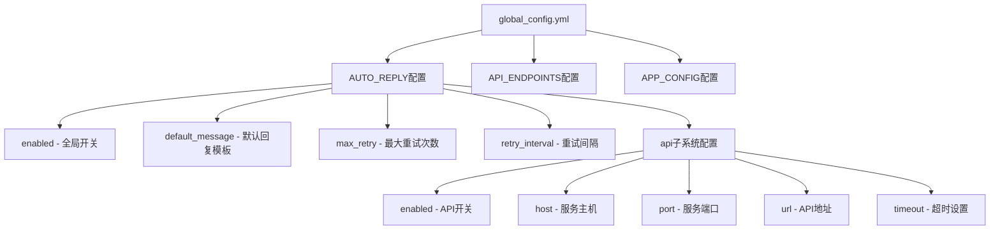
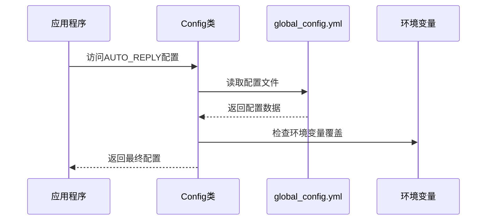
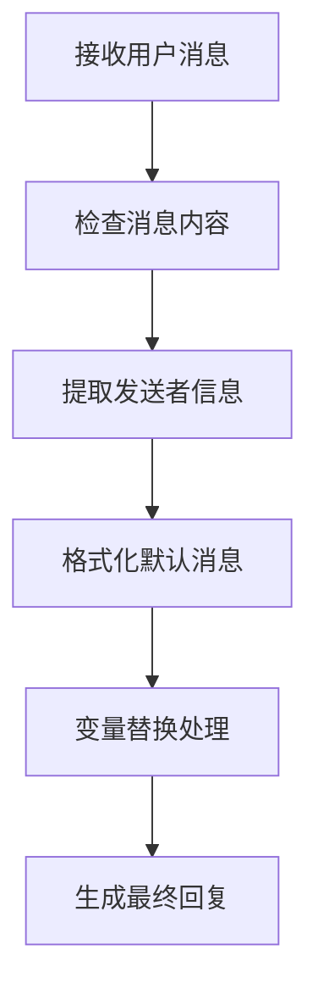
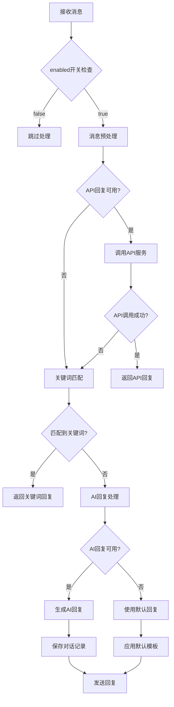
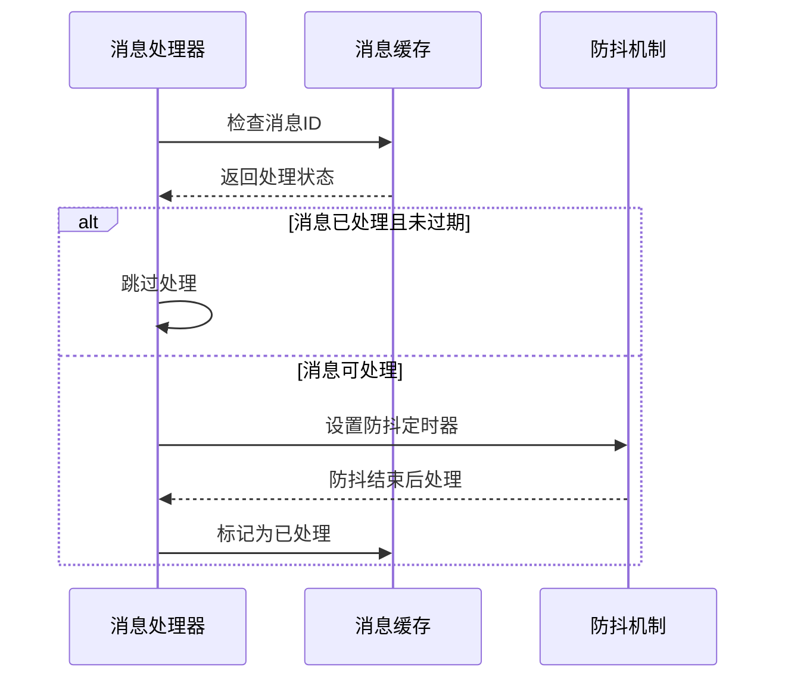
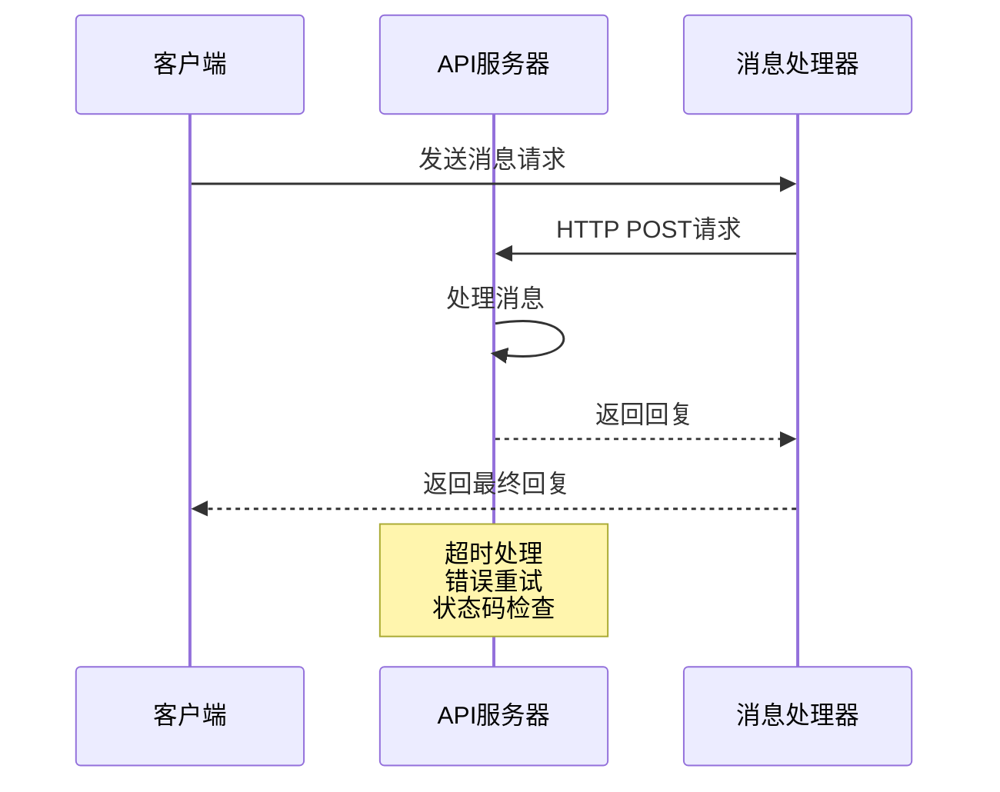
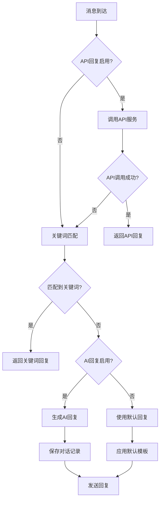
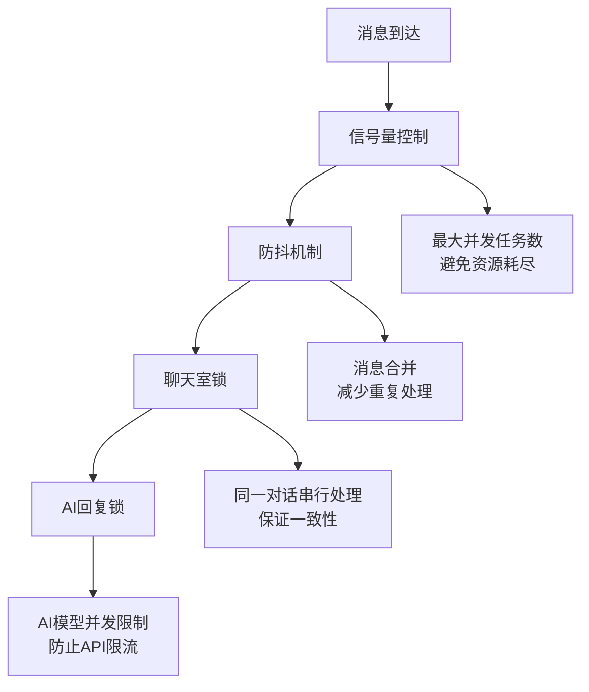

# 自动回复配置详解

<cite>
**本文档引用的文件**
- [config.py](file://config.py)
- [global_config.yml](file://global_config.yml)
- [ai_reply_engine.py](file://ai_reply_engine.py)
- [reply_server.py](file://reply_server.py)
- [XianyuAutoAsync.py](file://XianyuAutoAsync.py)
- [db_manager.py](file://db_manager.py)
- [cookie_manager.py](file://cookie_manager.py)
- [docker-compose.yml](file://docker-compose.yml)
- [docker-compose-cn.yml](file://docker-compose-cn.yml)
</cite>

## 目录
1. [简介](#简介)
2. [配置文件结构](#配置文件结构)
3. [核心配置参数详解](#核心配置参数详解)
4. [消息处理流程](#消息处理流程)
5. [重试机制与指数退避算法](#重试机制与指数退避算法)
6. [API回复子系统](#api回复子系统)
7. [AI回复与关键词匹配优先级](#ai回复与关键词匹配优先级)
8. [高并发性能调优](#高并发性能调优)
9. [配置示例与最佳实践](#配置示例与最佳实践)
10. [故障排除指南](#故障排除指南)

## 简介

AUTO_REPLY模块是闲鱼自动回复系统的核心组件，负责处理用户消息并提供智能回复。该模块支持多种回复方式，包括AI回复、关键词匹配回复和默认回复，并具备完善的重试机制和性能优化策略。

## 配置文件结构

### 主配置文件架构



**图表来源**
- [global_config.yml](file://global_config.yml#L10-L20)
- [config.py](file://config.py#L108-L117)

### 配置加载机制

系统通过Config类统一管理配置加载和访问：



**图表来源**
- [config.py](file://config.py#L12-L32)

**章节来源**
- [config.py](file://config.py#L1-L126)
- [global_config.yml](file://global_config.yml#L1-L77)

## 核心配置参数详解

### enabled开关控制

`enabled`参数控制全局自动回复功能的启停：

| 参数 | 类型 | 默认值 | 描述 |
|------|------|--------|------|
| enabled | boolean | true | 启用或禁用整个自动回复功能 |

**作用机制：**
- 当设置为`false`时，系统完全跳过自动回复处理
- 影响所有消息处理流程，包括AI回复、关键词匹配和默认回复
- 适用于维护模式或临时关闭自动回复的场景

### default_message回复模板

`default_message`作为兜底回复模板，支持动态变量替换：

| 变量 | 描述 | 示例值 |
|------|------|--------|
| {send_user_name} | 发送者用户名 | "亲爱的张老板" |

**变量替换机制：**


**图表来源**
- [XianyuAutoAsync.py](file://XianyuAutoAsync.py#L7132-L7136)

### max_retry和retry_interval重试策略

这两个参数协同工作，实现智能重试机制：

| 参数 | 类型 | 默认值 | 描述 |
|------|------|--------|------|
| max_retry | integer | 3 | 最大重试次数 |
| retry_interval | integer | 5 | 初始重试间隔（秒） |

**指数退避算法应用场景：**
- WebSocket连接断开后的重连
- API调用失败后的重试
- 网络不稳定情况下的恢复

**章节来源**
- [global_config.yml](file://global_config.yml#L18-L20)
- [XianyuAutoAsync.py](file://XianyuAutoAsync.py#L453-L465)

## 消息处理流程

### 完整消息处理链路



**图表来源**
- [XianyuAutoAsync.py](file://XianyuAutoAsync.py#L7115-L7137)

### 消息去重与防重复机制

系统实现了完善的消息去重机制：



**图表来源**
- [XianyuAutoAsync.py](file://XianyuAutoAsync.py#L6955-L6994)

**章节来源**
- [XianyuAutoAsync.py](file://XianyuAutoAsync.py#L3174-L7137)

## 重试机制与指数退避算法

### 错误类型与重试策略

系统根据不同的错误类型采用相应的重试策略：

```mermaid
graph TD
A[错误发生] --> B{错误类型判断}
B --> |WebSocket断开| C[短延迟重试<br/>min(3*失败次数, 15秒)]
B --> |网络连接问题| D[长延迟重试<br/>min(10*失败次数, 60秒)]
B --> |其他未知错误| E[中等延迟重试<br/>min(5*失败次数, 30秒)]
C --> F[执行重试]
D --> F
E --> F
F --> G{重试成功?}
G --> |是| H[恢复正常处理]
G --> |否| I{达到最大重试次数?}
I --> |是| J[放弃重试]
I --> |否| A
```

**图表来源**
- [XianyuAutoAsync.py](file://XianyuAutoAsync.py#L453-L465)

### 重试配置参数

| 参数 | 环境变量 | 默认值 | 说明 |
|------|----------|--------|------|
| max_retry | AUTO_REPLY_MAX_RETRY | 3 | 最大重试次数 |
| retry_interval | AUTO_REPLY_RETRY_INTERVAL | 5 | 初始重试间隔（秒） |

**章节来源**
- [XianyuAutoAsync.py](file://XianyuAutoAsync.py#L453-L465)

## API回复子系统

### API服务配置参数

API回复子系统提供了灵活的外部服务集成能力：

| 参数 | 类型 | 默认值 | 描述 |
|------|------|--------|------|
| enabled | boolean | false | 启用API回复服务 |
| host | string | 0.0.0.0 | 绑定的网络接口 |
| port | integer | 8080 | 服务监听端口 |
| url | string | http://localhost:8080/xianyu/reply | API调用地址 |
| timeout | integer | 10 | 请求超时时间（秒） |

### API调用流程



**图表来源**
- [reply_server.py](file://reply_server.py#L6859-L6864)

### API回复模板变量

API回复支持以下模板变量：

| 变量名 | 类型 | 描述 |
|--------|------|------|
| send_user_id | string | 发送者用户ID |
| send_user_name | string | 发送者用户名 |
| send_message | string | 原始消息内容 |

**章节来源**
- [global_config.yml](file://global_config.yml#L12-L16)
- [reply_server.py](file://reply_server.py#L1-L800)

## AI回复与关键词匹配优先级

### 回复优先级决策流程

系统按照以下优先级顺序选择回复方式：



**图表来源**
- [XianyuAutoAsync.py](file://XianyuAutoAsync.py#L7115-L7137)

### AI回复引擎配置

AI回复功能通过专门的引擎管理：

| 配置项 | 类型 | 默认值 | 描述 |
|--------|------|--------|------|
| ai_enabled | boolean | false | 启用AI回复功能 |
| model_name | string | qwen-plus | AI模型名称 |
| api_key | string | - | API密钥 |
| base_url | string | https://dashscope.aliyuncs.com/compatible-mode/v1 | API基础URL |
| max_discount_percent | integer | 10 | 最大折扣百分比 |
| max_discount_amount | integer | 100 | 最大折扣金额 |
| max_bargain_rounds | integer | 3 | 最大议价轮数 |

### 关键词匹配机制

关键词匹配支持两种级别：

1. **账号级关键词**：每个账号可配置专属关键词
2. **全局关键词**：系统级通用关键词

**章节来源**
- [ai_reply_engine.py](file://ai_reply_engine.py#L237-L274)
- [db_manager.py](file://db_manager.py#L150-L166)

## 高并发性能调优

### 并发控制策略

系统实现了多层次的并发控制：



**图表来源**
- [XianyuAutoAsync.py](file://XianyuAutoAsync.py#L6866-L6875)

### 性能调优建议

#### 1. 合理设置重试参数

```yaml
AUTO_REPLY:
  max_retry: 3          # 建议值：2-5
  retry_interval: 5     # 建议值：3-10秒
```

#### 2. 并发控制配置

```yaml
# Docker环境配置
AUTO_REPLY_MAX_RETRY: 3
AUTO_REPLY_RETRY_INTERVAL: 5
MESSAGE_DEBOUNCE_DELAY: 10  # 防抖延迟
```

#### 3. 资源监控指标

| 指标 | 建议阈值 | 监控方法 |
|------|----------|----------|
| 活跃消息处理任务数 | < 100 | 日志记录 |
| API调用成功率 | > 95% | 监控告警 |
| AI回复响应时间 | < 5秒 | 性能监控 |

### 消息风暴防护

系统通过以下机制防止消息风暴：

1. **消息去重**：基于消息ID的去重机制
2. **防抖处理**：延迟处理，合并连续消息
3. **并发限制**：信号量控制并发任务数量
4. **超时控制**：设置合理的超时时间

**章节来源**
- [XianyuAutoAsync.py](file://XianyuAutoAsync.py#L6866-L6994)

## 配置示例与最佳实践

### 生产环境配置示例

```yaml
# global_config.yml
AUTO_REPLY:
  enabled: true
  default_message: '亲爱的"{send_user_name}"老板您好！所有宝贝都可以拍，秒发货的哈~不满意的话可以直接申请退款哈~'
  max_retry: 3
  retry_interval: 5
  
  api:
    enabled: false
    host: 0.0.0.0
    port: 8080
    url: http://localhost:8080/xianyu/reply
    timeout: 10
```

### 开发环境配置

```yaml
# 开发环境使用本地API服务
AUTO_REPLY:
  api:
    enabled: true
    host: 0.0.0.0
    port: 8080
    url: http://localhost:8080/xianyu/reply
    timeout: 5  # 开发环境可适当缩短超时时间
```

### 环境变量配置

```bash
# Docker环境配置
export AUTO_REPLY_ENABLED=true
export AUTO_REPLY_MAX_RETRY=3
export AUTO_REPLY_RETRY_INTERVAL=5
export AUTO_REPLY_API_TIMEOUT=10
```

### 最佳实践建议

1. **定期监控**：监控API调用成功率和响应时间
2. **渐进式部署**：先在小范围内测试新配置
3. **备份配置**：定期备份配置文件
4. **版本控制**：将配置文件纳入版本控制系统

## 故障排除指南

### 常见问题诊断

#### 1. API回复不工作

**症状**：设置了API回复但无响应
**排查步骤**：
- 检查`AUTO_REPLY.api.enabled`是否为`true`
- 验证API服务是否正常运行
- 检查网络连接和防火墙设置

#### 2. AI回复效果不佳

**症状**：AI回复质量不高或不回复
**排查步骤**：
- 检查AI模型配置是否正确
- 验证API密钥有效性
- 检查商品信息是否完整

#### 3. 关键词匹配失效

**症状**：关键词设置后无响应
**排查步骤**：
- 检查关键词格式是否正确
- 验证关键词匹配逻辑
- 检查账号状态是否启用

### 日志分析

系统提供了详细的日志记录：

```python
# 关键日志位置
logger.info(f"检测到意图: {intent} (账号: {cookie_id})")
logger.warning(f"API调用超时")
logger.error(f"AI回复生成失败 {cookie_id}: {e}")
```

### 性能优化建议

1. **监控资源使用**：定期检查CPU和内存使用情况
2. **优化关键词**：精简关键词列表，提高匹配效率
3. **调整超时时间**：根据网络状况调整API超时设置
4. **负载均衡**：在高并发场景下考虑分布式部署

**章节来源**
- [ai_reply_engine.py](file://ai_reply_engine.py#L414-L420)
- [reply_server.py](file://reply_server.py#L6859-L6864)