# 功能控制

<cite>
**本文档引用的文件**
- [config.py](file://config.py)
- [global_config.yml](file://global_config.yml)
- [ai_reply_engine.py](file://ai_reply_engine.py)
- [db_manager.py](file://db_manager.py)
- [reply_server.py](file://reply_server.py)
- [order_status_handler.py](file://order_status_handler.py)
- [XianyuAutoAsync.py](file://XianyuAutoAsync.py)
- [utils/ws_utils.py](file://utils/ws_utils.py)
</cite>

## 目录
1. [概述](#概述)
2. [系统架构](#系统架构)
3. [核心功能开关](#核心功能开关)
4. [多用户系统控制](#多用户系统控制)
5. [用户注册功能控制](#用户注册功能控制)
6. [自动回复功能控制](#自动回复功能控制)
7. [AI回复功能控制](#ai回复功能控制)
8. [超时控制机制](#超时控制机制)
9. [消息管理机制](#消息管理机制)
10. [配置管理](#配置管理)
11. [总结](#总结)

## 概述

本文档详细说明了闲鱼自动回复系统中各功能开关的控制逻辑及其对系统业务的影响。系统采用多层次的功能控制机制，通过配置文件、数据库设置和环境变量等多种方式实现灵活的功能开关管理。

## 系统架构

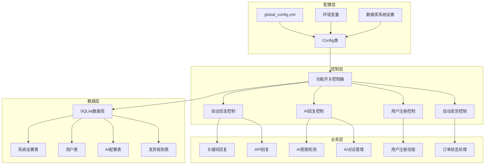

**图表来源**
- [config.py](file://config.py#L5-L126)
- [db_manager.py](file://db_manager.py#L16-L800)

## 核心功能开关

### 功能开关架构

系统通过三层架构实现功能控制：

1. **配置文件层**：通过 `global_config.yml` 定义基础功能开关
2. **数据库层**：通过 `system_settings` 表动态管理功能开关
3. **环境变量层**：通过环境变量覆盖默认配置

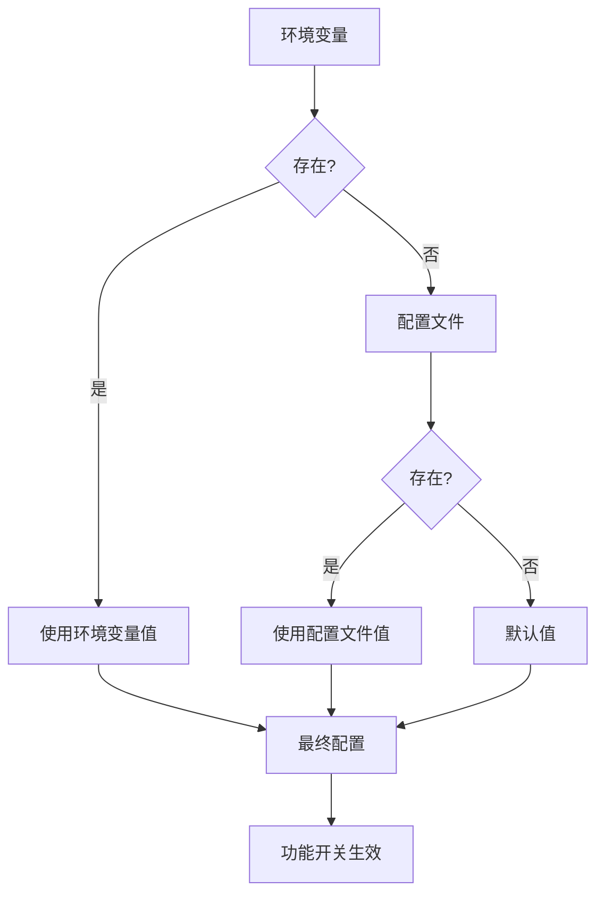

**节来源**
- [config.py](file://config.py#L34-L53)
- [global_config.yml](file://global_config.yml#L1-L77)

## 多用户系统控制

### 数据库隔离机制

系统通过用户ID实现数据库层面的完全隔离：

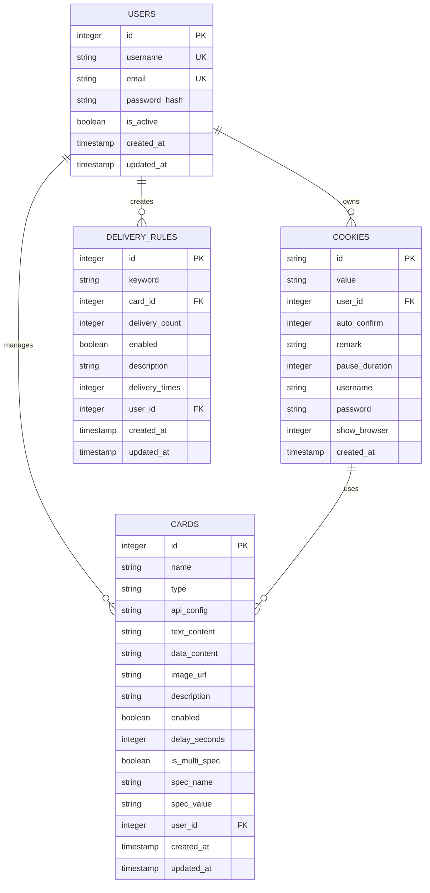

**图表来源**
- [db_manager.py](file://db_manager.py#L70-L300)

### 多用户权限管理

| 功能模块 | 用户隔离实现 | 权限控制 |
|---------|-------------|----------|
| 用户管理 | `user_id` 外键约束 | 每个用户只能访问自己的数据 |
| Cookie管理 | `user_id` 外键约束 | 账号数据完全隔离 |
| 卡券管理 | `user_id` 外键约束 | 卡券资源按用户分配 |
| 发货规则 | `user_id` 外键约束 | 规则配置用户专属 |
| AI配置 | `user_id` 外键约束 | AI设置用户独立 |

**节来源**
- [db_manager.py](file://db_manager.py#L237-L245)
- [db_manager.py](file://db_manager.py#L658-L668)

## 用户注册功能控制

### 注册开关控制逻辑

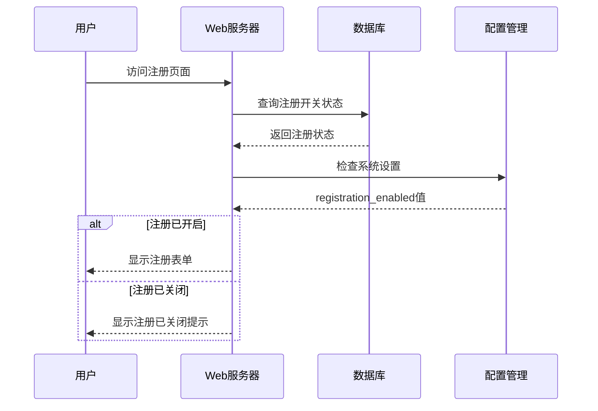

**图表来源**
- [reply_server.py](file://reply_server.py#L443-L471)
- [reply_server.py](file://reply_server.py#L2685-L2765)

### 注册功能状态管理

| 状态 | 数据库值 | 页面行为 | API响应 |
|------|----------|----------|---------|
| 开启 | `'true'` | 显示注册链接 | 正常响应注册请求 |
| 关闭 | `'false'` | 隐藏注册链接 | 403 Forbidden |
| 未设置 | `NULL` | 显示注册链接 | 正常响应注册请求 |

**节来源**
- [reply_server.py](file://reply_server.py#L2685-L2765)
- [db_manager.py](file://db_manager.py#L426-L438)

## 自动回复功能控制

### 自动回复开关层级

系统采用多层级的自动回复控制机制：

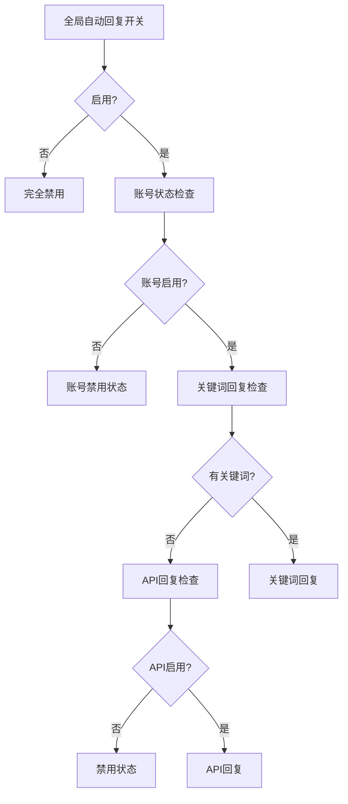

**图表来源**
- [config.py](file://config.py#L108-L116)
- [reply_server.py](file://reply_server.py#L263-L285)

### 自动回复配置详解

| 配置项 | 默认值 | 控制逻辑 | 影响范围 |
|--------|--------|----------|----------|
| `AUTO_REPLY.enabled` | `true` | 全局自动回复开关 | 整个系统 |
| `AUTO_REPLY.api.enabled` | `false` | API回复开关 | API回复功能 |
| `AUTO_REPLY.max_retry` | `3` | 最大重试次数 | 消息发送失败处理 |
| `AUTO_REPLY.retry_interval` | `5` | 重试间隔（秒） | 重试调度 |

**节来源**
- [global_config.yml](file://global_config.yml#L10-L21)
- [config.py](file://config.py#L108-L116)

## AI回复功能控制

### AI回复激活机制

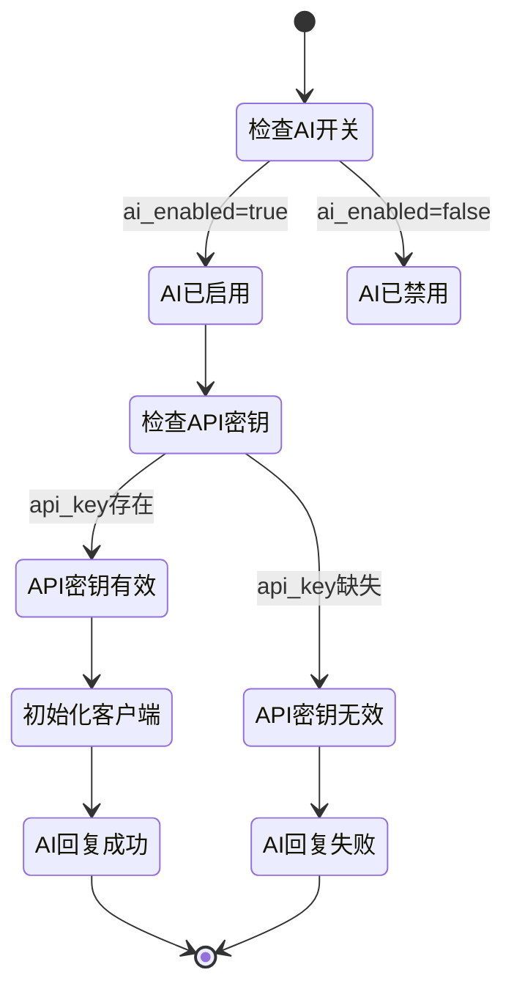

**图表来源**
- [ai_reply_engine.py](file://ai_reply_engine.py#L232-L236)
- [ai_reply_engine.py](file://ai_reply_engine.py#L62-L82)

### AI回复配置参数

| 参数 | 默认值 | 说明 | 影响 |
|------|--------|------|------|
| `ai_enabled` | `false` | AI回复总开关 | 控制AI功能启用 |
| `model_name` | `'qwen-plus'` | AI模型名称 | 决定使用哪个模型 |
| `api_key` | `''` | API密钥 | 认证和计费 |
| `base_url` | `'https://dashscope.aliyuncs.com/compatible-mode/v1'` | API基础URL | 服务提供商 |
| `max_discount_percent` | `10` | 最大折扣百分比 | 议价上限 |
| `max_discount_amount` | `100` | 最大折扣金额 | 议价上限 |
| `max_bargain_rounds` | `3` | 最大议价轮数 | 议价次数限制 |

**节来源**
- [db_manager.py](file://db_manager.py#L152-L165)
- [ai_reply_engine.py](file://ai_reply_engine.py#L62-L82)

### AI回复模型检测

系统支持多种AI模型的自动检测和适配：

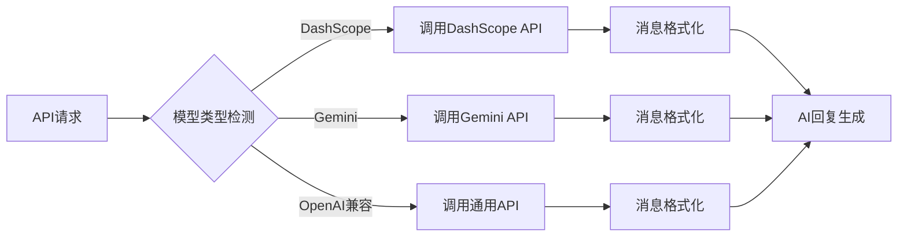

**图表来源**
- [ai_reply_engine.py](file://ai_reply_engine.py#L83-L93)
- [ai_reply_engine.py](file://ai_reply_engine.py#L95-L99)

## 自动发货功能控制

### 自动发货开关控制

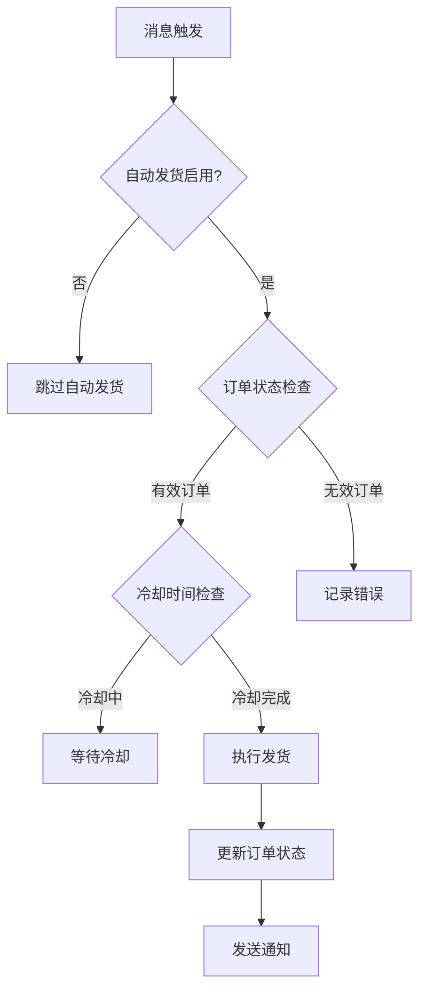

**图表来源**
- [XianyuAutoAsync.py](file://XianyuAutoAsync.py#L798-L848)
- [order_status_handler.py](file://order_status_handler.py#L192-L307)

### 发货规则配置

| 规则类型 | 配置项 | 说明 | 示例 |
|----------|--------|------|------|
| 关键词触发 | `keyword` | 触发发货的关键词 | `'自动发货'` |
| 卡券关联 | `card_id` | 关联的卡券ID | `1` |
| 发货数量 | `delivery_count` | 单次发货数量 | `1` |
| 延时设置 | `delay_seconds` | 发货延时（秒） | `0` |
| 多规格支持 | `is_multi_spec` | 是否支持多规格 | `false` |

**节来源**
- [db_manager.py](file://db_manager.py#L3033-L3574)

## 超时控制机制

### 超时配置体系

系统通过多个层次的超时控制确保系统稳定性：

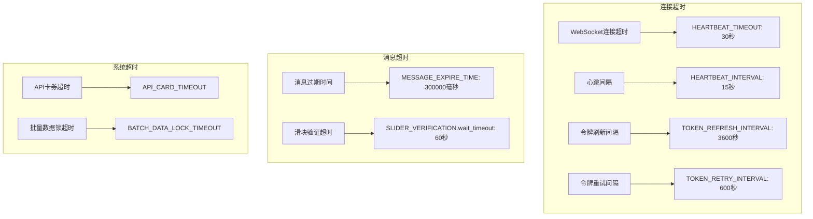

**图表来源**
- [config.py](file://config.py#L95-L100)
- [global_config.yml](file://global_config.yml#L47-L62)

### 超时控制参数详解

| 超时类型 | 参数名 | 默认值 | 说明 | 影响 |
|----------|--------|--------|------|------|
| 心跳超时 | `HEARTBEAT_TIMEOUT` | `30` | 心跳响应超时时间（秒） | WebSocket连接稳定性 |
| 心跳间隔 | `HEARTBEAT_INTERVAL` | `15` | 心跳发送间隔（秒） | 连接监控频率 |
| 令牌刷新 | `TOKEN_REFRESH_INTERVAL` | `3600` | 令牌刷新间隔（秒） | 认证有效性 |
| 令牌重试 | `TOKEN_RETRY_INTERVAL` | `600` | 令牌重试间隔（秒） | 认证失败处理 |
| 消息过期 | `MESSAGE_EXPIRE_TIME` | `300000` | 消息过期时间（毫秒） | 消息队列管理 |
| 滑块超时 | `SLIDER_VERIFICATION.wait_timeout` | `60` | 滑块验证等待超时（秒） | 验证流程控制 |

**节来源**
- [config.py](file://config.py#L95-L100)
- [global_config.yml](file://global_config.yml#L47-L62)

## 消息管理机制

### 消息生命周期管理

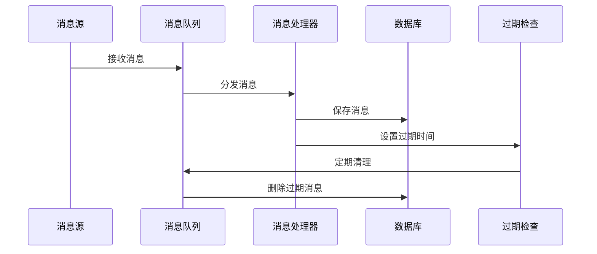

**图表来源**
- [XianyuAutoAsync.py](file://XianyuAutoAsync.py#L711-L7775)
- [utils/ws_utils.py](file://utils/ws_utils.py#L1-L89)

### WebSocket通信管理

| 管理项 | 配置参数 | 默认值 | 说明 |
|--------|----------|--------|------|
| 连接状态 | `connection_state` | `DISCONNECTED` | WebSocket连接状态 |
| 连接失败计数 | `connection_failures` | `0` | 连续连接失败次数 |
| 最大失败次数 | `max_connection_failures` | `5` | 最大连续失败阈值 |
| 心跳间隔 | `heartbeat_interval` | `15` | 心跳发送间隔（秒） |
| 心跳超时 | `heartbeat_timeout` | `30` | 心跳响应超时（秒） |
| 重连延迟 | `reconnect_delay` | `5` | 重连等待时间（秒） |

**节来源**
- [XianyuAutoAsync.py](file://XianyuAutoAsync.py#L29-L37)
- [utils/ws_utils.py](file://utils/ws_utils.py#L7-L16)

## 配置管理

### 配置加载优先级

系统采用分层配置加载机制：

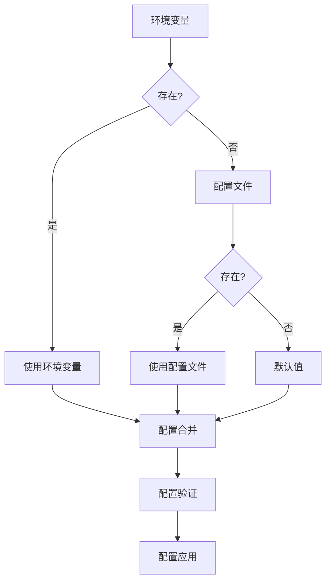

**图表来源**
- [config.py](file://config.py#L34-L53)
- [global_config.yml](file://global_config.yml#L1-L77)

### 配置热更新支持

系统支持部分配置的热更新，无需重启服务：

| 配置类别 | 支持热更新 | 更新方式 | 生效时间 |
|----------|------------|----------|----------|
| 用户设置 | ✅ | 实时更新 | 立即生效 |
| 系统设置 | ✅ | 实时更新 | 立即生效 |
| AI配置 | ⚠️ | 需要重载 | 下次请求生效 |
| 数据库配置 | ❌ | 需要重启 | 重启后生效 |

**节来源**
- [db_manager.py](file://db_manager.py#L2406-L2420)

## 总结

闲鱼自动回复系统通过多层次的功能控制机制实现了灵活而稳定的系统管理：

1. **分层控制架构**：通过配置文件、数据库和环境变量实现三级控制
2. **用户隔离机制**：完全的数据隔离确保多用户环境下的安全性
3. **精细化开关控制**：每个功能模块都有独立的开关和配置选项
4. **智能超时管理**：多层次的超时控制保证系统稳定性
5. **实时配置更新**：支持部分配置的热更新，提高运维效率

这种设计使得系统能够在复杂的生产环境中稳定运行，同时为不同规模的用户提供灵活的配置选项。