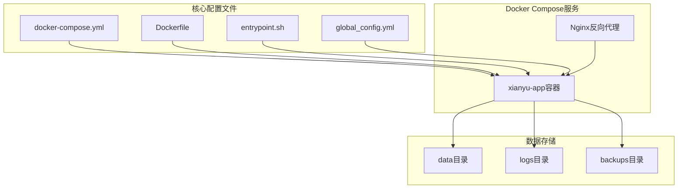
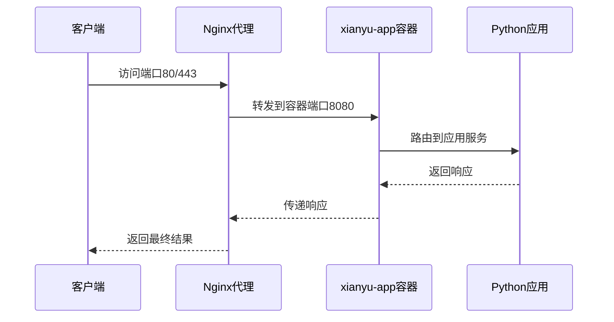
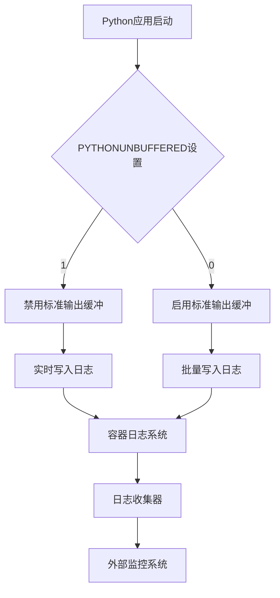
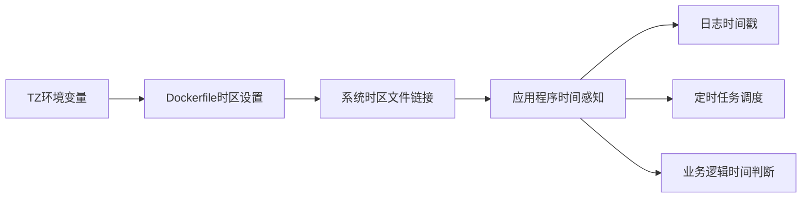
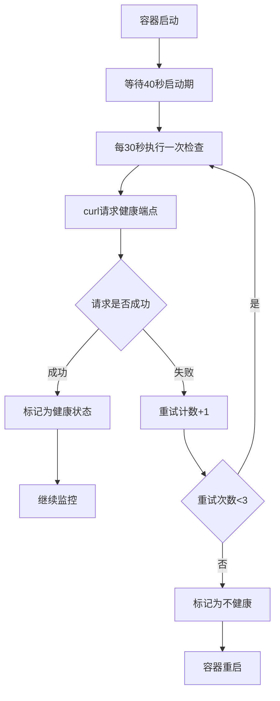
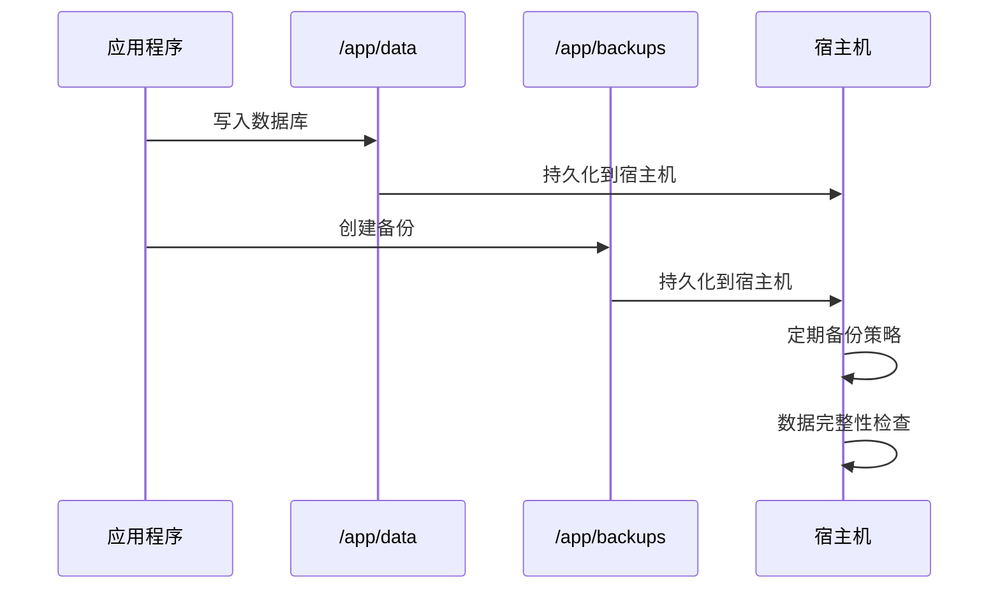
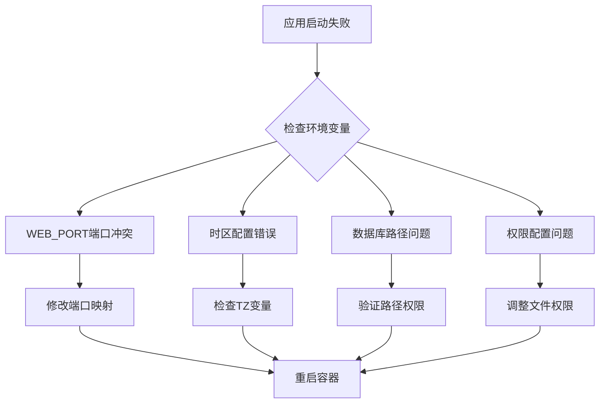

# 基础环境变量

<cite>
**本文档引用的文件**
- [docker-compose.yml](file://docker-compose.yml)
- [Dockerfile](file://Dockerfile)
- [entrypoint.sh](file://entrypoint.sh)
- [Start.py](file://Start.py)
- [config.py](file://config.py)
- [global_config.yml](file://global_config.yml)
</cite>

## 目录
1. [简介](#简介)
2. [项目结构概览](#项目结构概览)
3. [核心环境变量详解](#核心环境变量详解)
4. [端口映射机制](#端口映射机制)
5. [Python运行时配置](#python运行时配置)
6. [时区与时钟配置](#时区与时钟配置)
7. [调试与开发模式](#调试与开发模式)
8. [健康检查配置](#健康检查配置)
9. [数据持久化配置](#数据持久化配置)
10. [性能优化配置](#性能优化配置)
11. [故障排除指南](#故障排除指南)
12. [总结](#总结)

## 简介

本文档详细解析了闲鱼自动回复系统中docker-compose.yml文件定义的基础环境变量及其作用机制。该系统采用容器化部署架构，通过精心设计的环境变量配置实现了灵活的服务管理和运行时优化。

## 项目结构概览

该项目采用现代化的容器化部署架构，主要组件包括：



**图表来源**
- [docker-compose.yml](file://docker-compose.yml#L1-L106)
- [Dockerfile](file://Dockerfile#L1-L138)

## 核心环境变量详解

### 基础运行时变量

#### PYTHONUNBUFFERED变量

**作用机制**：
- 控制Python标准输出流的缓冲行为
- 设置值为1时禁用缓冲，实现实时日志输出
- 在Docker环境中尤为重要，确保日志能够及时写入容器日志系统

**配置位置**：
- Dockerfile中预设：`ENV PYTHONUNBUFFERED=1`
- docker-compose.yml中可覆盖：`- PYTHONUNBUFFERED=${PYTHONUNBUFFERED:-1}`

**技术影响**：
- 避免日志延迟，便于实时监控
- 减少调试时的等待时间
- 提高开发效率和问题定位速度

#### PYTHONDONTWRITEBYTECODE变量

**作用机制**：
- 控制Python是否生成.pyc字节码文件
- 设置值为1时禁用字节码文件生成
- 减少磁盘I/O操作，提高容器启动速度

**配置位置**：
- Dockerfile中预设：`ENV PYTHONDONTWRITEBYTECODE=1`
- docker-compose.yml中可覆盖：`- PYTHONDONTWRITEBYTECODE=${PYTHONDONTWRITEBYTECODE:-1}`

**技术影响**：
- 减少容器启动时间
- 降低磁盘空间占用
- 避免字节码文件冲突问题

#### TZ时区变量

**作用机制**：
- 设置容器内部系统时区
- 影响系统时间、日志记录和定时任务
- 在Dockerfile中通过时区文件链接实现配置

**配置位置**：
- Dockerfile中预设：`ENV TZ=Asia/Shanghai`
- docker-compose.yml中可覆盖：`- TZ=${TZ:-Asia/Shanghai}`

**技术影响**：
- 确保日志时间戳准确性
- 支持定时任务按本地时间执行
- 保证系统时间与部署环境一致

**章节来源**
- [docker-compose.yml](file://docker-compose.yml#L23-L25)
- [Dockerfile](file://Dockerfile#L5-L7)

### 应用配置变量

#### 数据库路径配置

**DB_PATH变量**：
- 指定SQLite数据库文件存储路径
- 默认值：`/app/data/xianyu_data.db`
- 影响：决定数据库文件的物理存储位置

#### 日志级别配置

**LOG_LEVEL变量**：
- 控制应用日志输出级别
- 默认值：`INFO`
- 可选值：DEBUG、INFO、WARNING、ERROR、CRITICAL

#### 管理员配置

**管理员凭据变量**：
- `ADMIN_USERNAME`: 管理员用户名，默认为`admin`
- `ADMIN_PASSWORD`: 管理员密码，默认为`admin123`
- `JWT_SECRET_KEY`: JWT令牌密钥，默认为`default-secret-key`

#### 会话配置

**SESSION_TIMEOUT变量**：
- 设置会话超时时间（秒）
- 默认值：`3600`（1小时）

**章节来源**
- [docker-compose.yml](file://docker-compose.yml#L26-L35)

## 端口映射机制

### WEB_PORT端口控制

**端口映射原理**：


**图表来源**
- [docker-compose.yml](file://docker-compose.yml#L11-L12)
- [Dockerfile](file://Dockerfile#L128)

**配置细节**：
- 容器内部端口：8080（EXPOSE 8080）
- 外部映射端口：`${WEB_PORT:-8080}`
- 默认端口8080，可通过环境变量覆盖

**端口映射机制**：
1. **环境变量优先级**：`${WEB_PORT:-8080}`表示如果WEB_PORT未设置，则使用默认值8080
2. **动态配置能力**：支持在同一主机上运行多个实例
3. **负载均衡友好**：标准化的8080端口便于反向代理配置

**章节来源**
- [docker-compose.yml](file://docker-compose.yml#L11-L12)

## Python运行时配置

### 实时日志输出机制

**PYTHONUNBUFFERED配置效果**：



**图表来源**
- [Dockerfile](file://Dockerfile#L5-L6)
- [entrypoint.sh](file://entrypoint.sh#L16-L17)

**技术优势**：
- **实时监控**：日志立即可见，便于问题诊断
- **调试效率**：减少等待时间，提高开发体验
- **运维便利**：容器日志系统能够及时捕获应用状态

### 字节码文件控制

**PYTHONDONTWRITEBYTECODE配置效果**：

| 配置值 | 行为 | 性能影响 | 适用场景 |
|--------|------|----------|----------|
| 1 (禁用) | 不生成.pyc文件 | 启动更快，磁盘占用少 | 开发环境、容器部署 |
| 0 (启用) | 生成.pyc文件 | 启动稍慢，后续运行快 | 生产环境、频繁重启 |

**章节来源**
- [Dockerfile](file://Dockerfile#L5-L6)
- [docker-compose.yml](file://docker-compose.yml#L23-L24)

## 时区与时钟配置

### TZ时区设置影响

**时区配置链路**：



**图表来源**
- [Dockerfile](file://Dockerfile#L104-L105)
- [entrypoint.sh](file://entrypoint.sh#L12)

**具体影响**：

1. **日志记录**：
   - 时间戳准确反映本地时间
   - 便于跨时区团队协作
   - 支持日志分析和审计

2. **定时任务**：
   - 确保定时任务按本地时间执行
   - 避免因时区差异导致的任务延迟
   - 支持业务相关的定时操作

3. **业务逻辑**：
   - 时间敏感功能正常运行
   - 用户体验时间显示准确
   - 数据统计时间维度正确

**章节来源**
- [Dockerfile](file://Dockerfile#L104-L105)
- [docker-compose.yml](file://docker-compose.yml#L25)

## 调试与开发模式

### DEBUG变量配置

**DEBUG模式启用效果**：

| 功能特性 | DEBUG=false | DEBUG=true |
|----------|-------------|------------|
| 错误页面显示 | 简化错误信息 | 详细堆栈跟踪 |
| 自动重载 | 禁用 | 启用（开发时） |
| 调试工具 | 禁用 | 启用 |
| 性能开销 | 最小 | 较高 |
| 安全性 | 高 | 较低 |

### RELOAD变量配置

**RELOAD功能机制**：
- 开发环境下自动重启应用
- 监控代码变更并触发重启
- 提高开发迭代效率
- 仅在DEBUG模式下有效

**配置示例**：
```yaml
environment:
  - DEBUG=${DEBUG:-false}
  - RELOAD=${RELOAD:-false}
```

**章节来源**
- [docker-compose.yml](file://docker-compose.yml#L28-L29)

## 健康检查配置

### 健康检查执行逻辑

**健康检查配置详解**：



**图表来源**
- [docker-compose.yml](file://docker-compose.yml#L63-L68)
- [Dockerfile](file://Dockerfile#L131-L133)

**健康检查参数**：

| 参数 | 值 | 说明 |
|------|-----|------|
| test | ["CMD", "curl", "-f", "http://localhost:8080/health"] | 健康检查命令 |
| interval | 30s | 检查间隔时间 |
| timeout | 10s | 单次检查超时时间 |
| retries | 3 | 失败重试次数 |
| start_period | 40s | 启动等待时间 |

**健康检查端点**：
- URL：`http://localhost:8080/health`
- 检查内容：Cookie管理器状态、数据库连接状态、系统资源使用情况
- 响应格式：JSON格式的健康状态报告

**失败重试机制**：
1. **初始等待**：容器启动后等待40秒，确保应用完全初始化
2. **定期检查**：每30秒执行一次健康检查
3. **超时控制**：每次检查最多等待10秒
4. **重试策略**：连续失败3次才判定为不健康
5. **自动恢复**：不健康容器会被Docker自动重启

**章节来源**
- [docker-compose.yml](file://docker-compose.yml#L63-L68)
- [Dockerfile](file://Dockerfile#L131-L133)

## 数据持久化配置

### VOLUMES卷挂载机制

**卷挂载配置详解**：

```mermaid
graph TB
subgraph "宿主机目录"
A[data目录]
B[logs目录]
C[backups目录]
D[global_config.yml]
end
subgraph "容器内部路径"
E[/app/data
F:/app/logs
G:/app/backups
H:/app/global_config.yml
end
A --> E
B --> F
C --> G
D --> H
subgraph "挂载类型"
I[读写权限: rw]
J[只读权限: ro]
end
A -.-> I
B -.-> I
C -.-> I
D -.-> J
```

**图表来源**
- [docker-compose.yml](file://docker-compose.yml#L13-L21)

**卷挂载配置表**：

| 宿主机路径 | 容器路径 | 挂载类型 | 用途说明 |
|------------|----------|----------|----------|
| `./data` | `/app/data` | rw | SQLite数据库文件存储 |
| `./logs` | `/app/logs` | rw | 应用日志文件存储 |
| `./backups` | `/app/backups` | rw | 数据库备份文件存储 |
| `./global_config.yml` | `/app/global_config.yml` | ro | 全局配置文件只读挂载 |

### 数据持久化策略

**目录用途说明**：

1. **/app/data目录**：
   - 存储主数据库文件：`xianyu_data.db`
   - 存储统计数据库：`user_stats.db`
   - 支持数据库迁移和备份
   - 确保数据在容器重启后仍然可用

2. **/app/logs目录**：
   - 存储应用运行日志
   - 支持日志轮转和压缩
   - 便于问题排查和性能分析
   - 集成外部日志收集系统

3. **/app/backups目录**：
   - 存储数据库备份文件
   - 支持自动备份和手动备份
   - 提供数据恢复能力
   - 防止数据丢失风险

**数据保护机制**：



**图表来源**
- [entrypoint.sh](file://entrypoint.sh#L21-L23)
- [Dockerfile](file://Dockerfile#L118-L120)

**章节来源**
- [docker-compose.yml](file://docker-compose.yml#L13-L21)
- [entrypoint.sh](file://entrypoint.sh#L21-L23)

## 性能优化配置

### 资源限制配置

**内存和CPU限制**：

| 配置项 | 默认值 | 说明 | 环境变量覆盖 |
|--------|--------|------|--------------|
| 内存限制 | 2048MB | 容器最大内存使用量 | MEMORY_LIMIT |
| CPU限制 | 2.0核 | 容器最大CPU使用量 | CPU_LIMIT |
| 内存预留 | 512MB | 容器最小内存保证 | MEMORY_RESERVATION |
| CPU预留 | 0.5核 | 容器最小CPU保证 | CPU_RESERVATION |

**资源配置策略**：
- **内存管理**：防止内存泄漏导致的OOM问题
- **CPU控制**：避免容器占用过多CPU资源
- **资源隔离**：确保多个容器间的资源公平分配

**章节来源**
- [docker-compose.yml](file://docker-compose.yml#L70-L77)

## 故障排除指南

### 常见环境变量问题

**问题诊断流程**：



**常见问题及解决方案**：

1. **端口冲突**：
   - 检查WEB_PORT环境变量
   - 确认宿主机端口可用性
   - 修改docker-compose.yml中的端口映射

2. **时区问题**：
   - 验证TZ环境变量设置
   - 检查系统时区同步
   - 确认日志时间戳准确性

3. **权限问题**：
   - 检查卷挂载权限
   - 验证容器用户配置
   - 确认文件系统权限

4. **健康检查失败**：
   - 检查应用启动状态
   - 验证健康检查端点
   - 调整健康检查参数

**章节来源**
- [entrypoint.sh](file://entrypoint.sh#L8-L15)
- [docker-compose.yml](file://docker-compose.yml#L63-L68)

## 总结

闲鱼自动回复系统的docker-compose.yml文件通过精心设计的环境变量配置，实现了以下核心功能：

1. **灵活的运行时配置**：通过环境变量覆盖机制，支持不同部署环境的需求
2. **高效的开发体验**：实时日志输出和自动重载功能提升开发效率
3. **可靠的数据持久化**：通过卷挂载实现数据持久化和备份策略
4. **完善的健康监控**：集成健康检查机制确保服务稳定性
5. **优化的性能管理**：资源限制配置防止资源滥用

这些环境变量配置不仅体现了现代容器化应用的最佳实践，也为系统的可维护性和可扩展性奠定了坚实基础。通过合理配置这些变量，可以确保系统在各种部署环境中稳定、高效地运行。