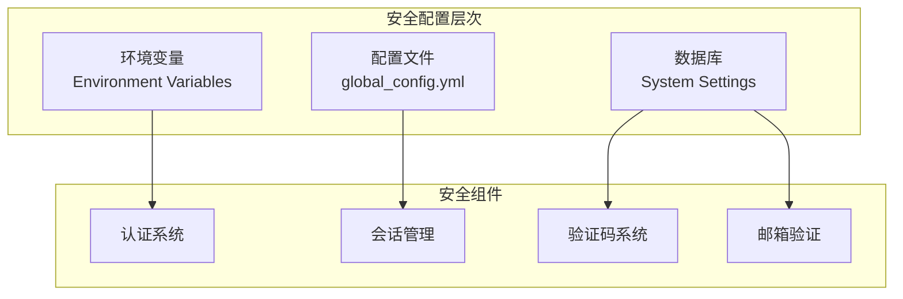
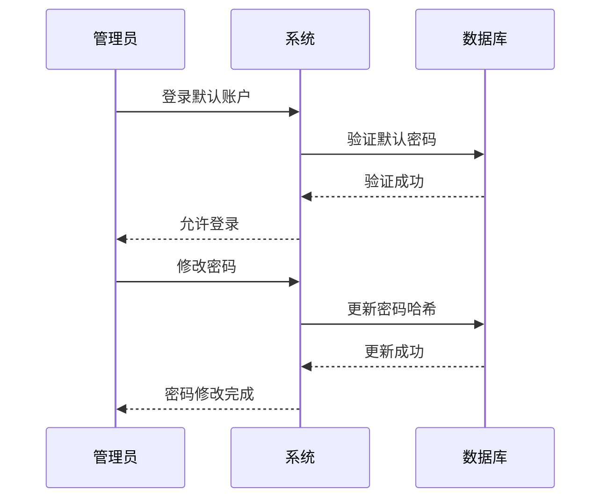
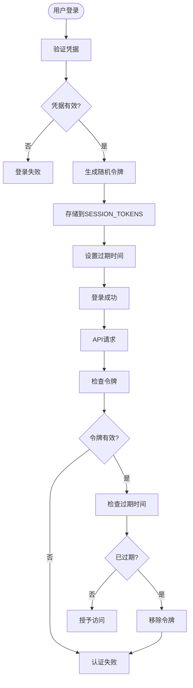
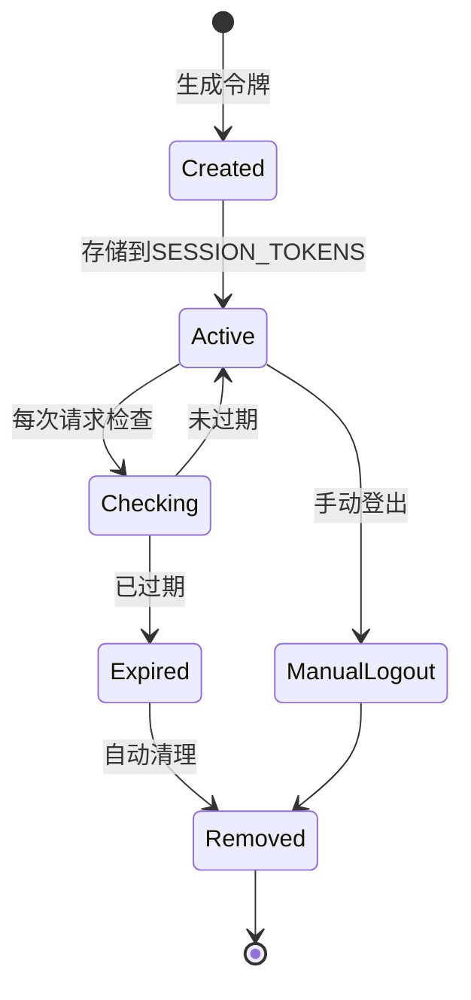
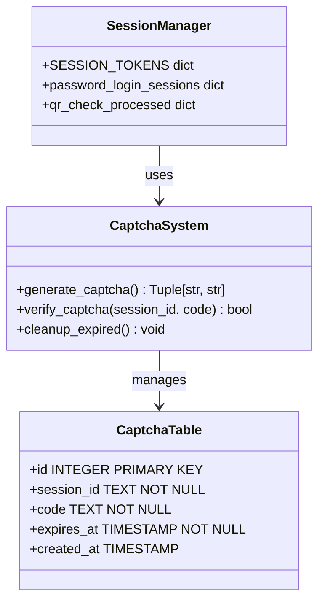
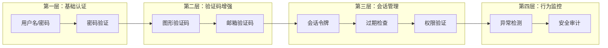
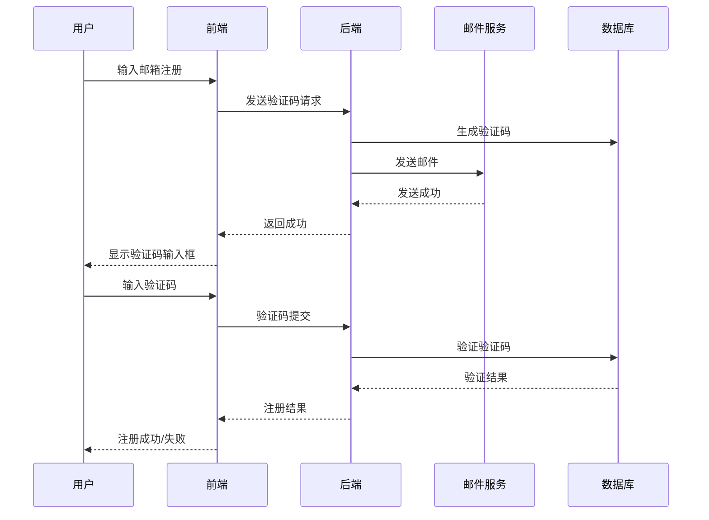
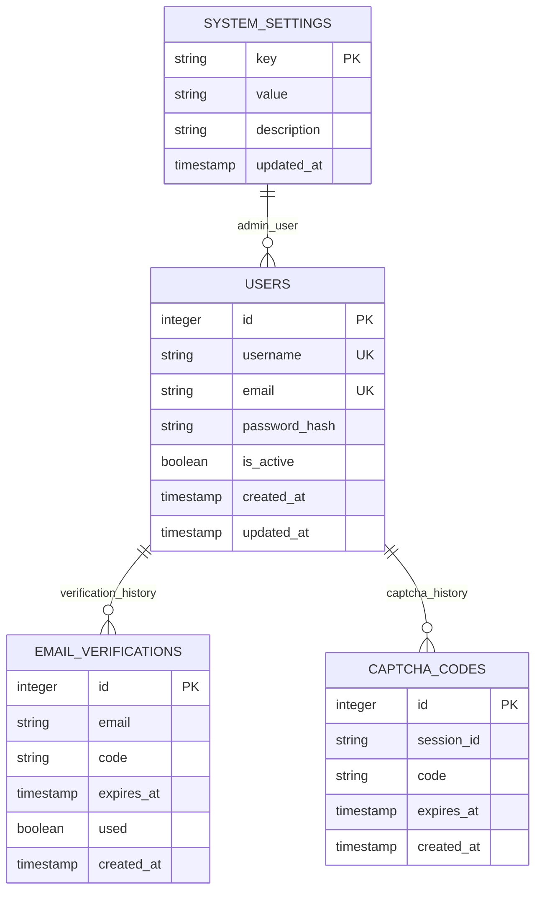
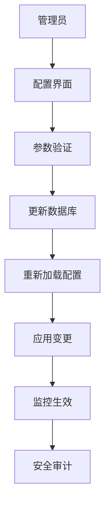
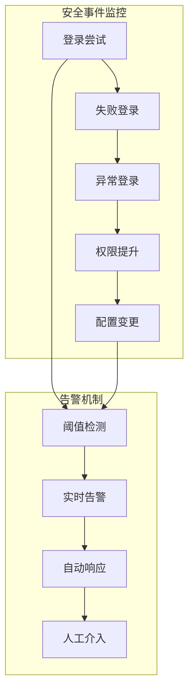

# 安全配置

<cite>
**本文档引用的文件**
- [global_config.yml](file://global_config.yml)
- [config.py](file://config.py)
- [Start.py](file://Start.py)
- [reply_server.py](file://reply_server.py)
- [db_manager.py](file://db_manager.py)
- [docker-compose.yml](file://docker-compose.yml)
- [docker-compose-cn.yml](file://docker-compose-cn.yml)
- [README.md](file://README.md)
</cite>

## 目录
1. [简介](#简介)
2. [核心安全配置概述](#核心安全配置概述)
3. [管理员账户安全配置](#管理员账户安全配置)
4. [JWT令牌与会话管理](#jwt令牌与会话管理)
5. [验证码与多因素认证](#验证码与多因素认证)
6. [邮箱验证机制](#邮箱验证机制)
7. [系统安全配置详解](#系统安全配置详解)
8. [安全配置最佳实践](#安全配置最佳实践)
9. [故障排除指南](#故障排除指南)
10. [总结](#总结)

## 简介

本系统采用多层次的安全架构，通过环境变量、配置文件和数据库设置相结合的方式，提供了全面的安全防护机制。本文档详细阐述了系统中各项安全配置的要求、实现机制以及最佳实践，帮助管理员建立健壮的安全体系。

## 核心安全配置概述

系统安全配置主要通过以下三个层面进行管理：

### 环境变量配置
系统支持通过环境变量覆盖默认配置，提供灵活的安全参数调整能力。

### 配置文件管理
通过 `global_config.yml` 文件集中管理核心业务配置，包括API端点、超时设置等。

### 数据库安全设置
通过数据库表结构和系统设置表维护动态安全配置。



**图表来源**
- [docker-compose.yml](file://docker-compose.yml#L36-L59)
- [global_config.yml](file://global_config.yml#L1-L77)

## 管理员账户安全配置

### 默认管理员账户风险

系统默认提供管理员账户，存在以下安全风险：

| 配置项 | 默认值 | 安全风险 | 建议值 |
|--------|--------|----------|--------|
| ADMIN_USERNAME | admin | 易受暴力破解攻击 | 自定义强用户名 |
| ADMIN_PASSWORD | admin123 | 弱密码，易被猜测 | 至少12位复杂密码 |
| 初始化机制 | 首次创建数据库时自动生成 | 缺乏初始密码管理 | 立即修改默认密码 |

### 安全替换策略

#### 1. 密码强度要求
- 长度：至少12位字符
- 复杂度：包含大小写字母、数字和特殊符号
- 唯一性：避免使用常见词汇和模式

#### 2. 密码管理流程


**图表来源**
- [reply_server.py](file://reply_server.py#L683-L705)
- [db_manager.py](file://db_manager.py#L606-L634)

#### 3. 密码存储安全
系统采用SHA-256哈希算法存储密码，确保即使数据库泄露也无法直接获取明文密码。

**章节来源**
- [reply_server.py](file://reply_server.py#L42-L43)
- [db_manager.py](file://db_manager.py#L623-L628)

## JWT令牌与会话管理

### JWT_SECRET_KEY核心作用

虽然代码中未显式使用JWT，但系统实现了基于令牌的会话管理机制：

#### 令牌生成与验证机制


**图表来源**
- [reply_server.py](file://reply_server.py#L178-L200)

#### 会话超时设置的安全意义

| 配置参数 | 默认值 | 安全意义 | 推荐设置 |
|----------|--------|----------|----------|
| SESSION_TIMEOUT | 3600秒 | 防止会话劫持 | 1800-3600秒 |
| TOKEN_EXPIRE_TIME | 24小时 | 限制令牌有效期 | 4-8小时 |
| 自动清理 | 定期清理过期会话 | 减少内存占用 | 每小时清理 |

### 访问令牌有效期控制

#### 令牌生命周期管理


**图表来源**
- [reply_server.py](file://reply_server.py#L194-L198)

**章节来源**
- [reply_server.py](file://reply_server.py#L45-L46)
- [docker-compose.yml](file://docker-compose.yml#L36-L42)

## 验证码与多因素认证

### CAPTCHA_ENABLED验证码功能

#### 验证码系统架构


**图表来源**
- [db_manager.py](file://db_manager.py#L2539-L2545)
- [reply_server.py](file://reply_server.py#L178-L200)

#### 防止自动化攻击的防护价值

| 防护措施 | 实现方式 | 安全效果 |
|----------|----------|----------|
| 图形验证码 | 动态生成4位数字验证码 | 防止机器人批量攻击 |
| 验证码过期 | 1小时自动过期清理 | 限制攻击窗口期 |
| 会话绑定 | 验证码与session_id关联 | 防止跨会话攻击 |
| 请求频率限制 | 前端防抖和后端验证 | 限制请求频率 |

### 多因素安全控制协同机制

#### 多层防护体系


**图表来源**
- [reply_server.py](file://reply_server.py#L708-L722)
- [db_manager.py](file://db_manager.py#L2676-L2690)

**章节来源**
- [docker-compose.yml](file://docker-compose.yml#L40-L41)
- [reply_server.py](file://reply_server.py#L708-L722)

## 邮箱验证机制

### EMAIL_VERIFICATION_ENABLED邮箱验证

#### 邮箱验证流程


**图表来源**
- [db_manager.py](file://db_manager.py#L2676-L2690)
- [reply_server.py](file://reply_server.py#L860-L875)

#### 用户注册安全保障

| 安全特性 | 实现机制 | 防护目标 |
|----------|----------|----------|
| 邮箱唯一性 | 数据库唯一约束 | 防止重复注册 |
| 验证码时效 | 15分钟过期机制 | 限制攻击时间窗口 |
| 验证码加密 | 数据库存储加密值 | 防止验证码泄露 |
| 注册开关 | 系统配置控制 | 灵活管理注册功能 |

**章节来源**
- [docker-compose.yml](file://docker-compose.yml#L39-L40)
- [db_manager.py](file://db_manager.py#L2676-L2690)

## 系统安全配置详解

### 关键安全配置参数

#### 会话与认证配置


**图表来源**
- [db_manager.py](file://db_manager.py#L74-L106)
- [config.py](file://config.py#L97-L102)

#### 环境变量安全配置

| 环境变量 | 默认值 | 安全要求 | 用途说明 |
|----------|--------|----------|----------|
| SESSION_TIMEOUT | 3600 | 生产环境建议300-1800 | 会话超时时间 |
| TOKEN_EXPIRE_TIME | 86400 | 根据业务需求调整 | 访问令牌有效期 |
| CAPTCHA_ENABLED | true | 建议启用 | 防止自动化攻击 |
| EMAIL_VERIFICATION_ENABLED | true | 建议启用 | 用户注册验证 |
| MULTIUSER_ENABLED | true | 根据需求配置 | 多用户系统开关 |

### 动态安全配置管理

#### 系统设置表结构
系统通过 `system_settings` 表动态管理安全配置：



**图表来源**
- [reply_server.py](file://reply_server.py#L2646-L2681)

**章节来源**
- [config.py](file://config.py#L97-L102)
- [reply_server.py](file://reply_server.py#L2646-L2681)

## 安全配置最佳实践

### 部署阶段安全配置

#### 1. 环境隔离
- 开发、测试、生产环境使用不同的配置文件
- 敏感配置通过环境变量注入，避免硬编码
- 定期轮换环境变量中的密钥和密码

#### 2. 权限最小化原则
- 数据库连接使用专用账户，限制最小必要权限
- 应用程序账户仅具有执行所需功能的权限
- 定期审查和更新权限设置

#### 3. 网络安全配置
- 使用HTTPS协议保护传输安全
- 配置防火墙规则限制不必要的端口访问
- 实施IP白名单机制

### 运维阶段安全监控

#### 1. 日志监控


#### 2. 定期安全审计
- 每月检查用户权限分配
- 季度评估密码策略有效性
- 半年度进行渗透测试

#### 3. 备份与恢复
- 定期备份安全配置和用户数据
- 测试备份恢复流程的有效性
- 确保备份数据的加密存储

### 开发阶段安全编码

#### 1. 输入验证
- 对所有用户输入进行严格的验证和过滤
- 实施SQL注入和XSS防护措施
- 使用参数化查询防止注入攻击

#### 2. 错误处理
- 避免在错误信息中泄露敏感信息
- 记录详细的错误日志用于安全分析
- 实施适当的错误处理机制

## 故障排除指南

### 常见安全配置问题

#### 1. 管理员密码问题
**问题症状**：无法登录管理员账户
**排查步骤**：
1. 检查数据库中admin用户的密码哈希值
2. 验证密码是否正确（使用相同的哈希算法）
3. 确认用户账户是否被禁用

**解决方案**：
```sql
-- 重置管理员密码
UPDATE users SET password_hash = SHA256('new_secure_password') WHERE username = 'admin';
```

#### 2. 会话超时问题
**问题症状**：用户频繁需要重新登录
**排查步骤**：
1. 检查SESSION_TIMEOUT配置值
2. 验证客户端时间同步
3. 确认服务器负载情况

**解决方案**：
调整会话超时时间，根据用户使用习惯优化配置。

#### 3. 验证码失效问题
**问题症状**：验证码无法正常工作
**排查步骤**：
1. 检查数据库中验证码表的数据
2. 验证验证码生成算法
3. 确认邮件发送服务状态

**解决方案**：
清理过期验证码，重启验证码服务。

### 性能优化建议

#### 1. 会话管理优化
- 定期清理过期会话令牌
- 实施会话池化减少内存占用
- 使用分布式缓存提高性能

#### 2. 验证码系统优化
- 实施验证码预生成机制
- 使用CDN加速验证码图片加载
- 优化验证码生成算法

**章节来源**
- [reply_server.py](file://reply_server.py#L194-L198)
- [db_manager.py](file://db_manager.py#L2539-L2545)

## 总结

本系统的安全配置体系采用了多层次、全方位的防护策略，通过环境变量、配置文件和数据库的协同配合，构建了完整的安全防护框架。

### 核心安全特性
- **强身份认证**：基于用户名密码和多种验证方式的混合认证
- **会话安全**：完善的会话管理和令牌过期机制
- **防护机制**：验证码系统和多因素认证的双重保障
- **动态配置**：灵活的系统设置和实时安全策略调整

### 持续改进建议
1. **定期安全评估**：每季度进行安全配置审查和漏洞扫描
2. **监控告警完善**：建立更精细的安全事件监控和告警机制
3. **应急响应计划**：制定详细的安全事件响应和恢复预案
4. **安全培训**：定期对运维人员进行安全意识和技能培训

通过遵循本文档的安全配置指南和最佳实践，可以确保系统在生产环境中保持高水平的安全性，有效防范各种安全威胁和攻击。