# 环境变量管理

<cite>
**本文档引用的文件**
- [docker-compose.yml](file://docker-compose.yml)
- [docker-compose-cn.yml](file://docker-compose-cn.yml)
- [Dockerfile](file://Dockerfile)
- [entrypoint.sh](file://entrypoint.sh)
- [config.py](file://config.py)
- [global_config.yml](file://global_config.yml)
- [Start.py](file://Start.py)
- [db_manager.py](file://db_manager.py)
- [ai_reply_engine.py](file://ai_reply_engine.py)
</cite>

## 目录
1. [简介](#简介)
2. [环境变量优先级机制](#环境变量优先级机制)
3. [核心环境变量详解](#核心环境变量详解)
4. [Python运行时配置](#python运行时配置)
5. [时区与时区设置](#时区与时区设置)
6. [数据库配置与数据持久化](#数据库配置与数据持久化)
7. [日志系统配置](#日志系统配置)
8. [安全配置](#安全配置)
9. [多用户系统配置](#多用户系统配置)
10. [AI回复系统配置](#ai回复系统配置)
11. [资源限制配置](#资源限制配置)
12. [生产环境安全配置](#生产环境安全配置)
13. [故障排除指南](#故障排除指南)
14. [总结](#总结)

## 简介

本系统采用多层次的环境变量管理体系，通过Docker Compose的环境变量优先级机制、Dockerfile的基础配置、以及应用程序级别的动态配置加载，实现了灵活且安全的部署配置管理。这种设计确保了系统在不同部署环境（开发、测试、生产）中的一致性和安全性。

## 环境变量优先级机制

### Docker Compose环境变量优先级

系统采用`${VAR_NAME:-default}`语法实现环境变量的优雅降级机制：

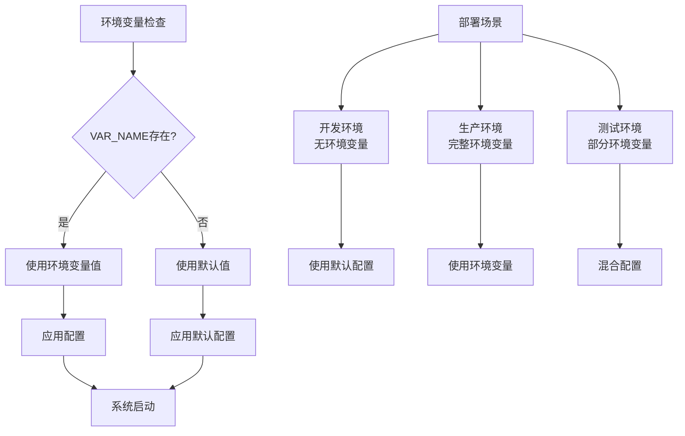

**图表来源**
- [docker-compose.yml](file://docker-compose.yml#L11-L77)
- [docker-compose-cn.yml](file://docker-compose-cn.yml#L11-L77)

### 优先级层次结构

1. **运行时环境变量**（最高优先级）
2. **Docker Compose环境变量**（中等优先级）
3. **Dockerfile ENV指令**（基础配置）
4. **应用程序默认值**（最低优先级）

**章节来源**
- [docker-compose.yml](file://docker-compose.yml#L23-L77)
- [Dockerfile](file://Dockerfile#L5-L8)

## 核心环境变量详解

### 基础运行时配置

| 环境变量 | 默认值 | 说明 | 影响范围 |
|---------|--------|------|----------|
| `PYTHONUNBUFFERED` | `1` | 禁用Python缓冲，实时输出日志 | Python进程 |
| `PYTHONDONTWRITEBYTECODE` | `1` | 不生成.pyc字节码文件 | Python包管理 |
| `TZ` | `Asia/Shanghai` | 时区设置，影响日志时间和任务调度 | 全局时区 |
| `DB_PATH` | `/app/data/xianyu_data.db` | SQLite数据库文件路径 | 数据持久化 |

### 系统行为控制

| 环境变量 | 默认值 | 说明 | 安全影响 |
|---------|--------|------|----------|
| `LOG_LEVEL` | `INFO` | 日志级别控制 | 调试能力 |
| `DEBUG` | `false` | 调试模式开关 | 安全风险 |
| `RELOAD` | `false` | 开发时自动重载 | 性能影响 |
| `SQL_LOG_ENABLED` | `true` | SQL语句日志开关 | 安全审计 |
| `SQL_LOG_LEVEL` | `INFO` | SQL日志级别 | 审计详细度 |

**章节来源**
- [docker-compose.yml](file://docker-compose.yml#L23-L32)
- [entrypoint.sh](file://entrypoint.sh#L8-L15)

## Python运行时配置

### PYTHONUNBUFFERED的作用机制

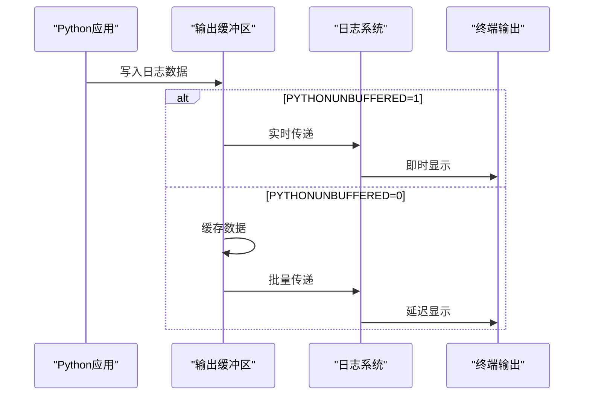

**图表来源**
- [Dockerfile](file://Dockerfile#L5-L6)
- [entrypoint.sh](file://entrypoint.sh#L16-L17)

### PYTHONDONTWRITEBYTECODE配置

该配置防止Python生成`.pyc`文件，具有以下优势：

1. **减少磁盘I/O**：避免频繁的文件写入操作
2. **简化部署**：减少容器层的文件变更
3. **提高安全性**：防止字节码泄露源代码信息
4. **优化性能**：减少启动时的字节码编译开销

**章节来源**
- [Dockerfile](file://Dockerfile#L5-L6)
- [entrypoint.sh](file://entrypoint.sh#L16-L17)

## 时区与时区设置

### TZ环境变量的重要性

时区设置影响多个系统组件：

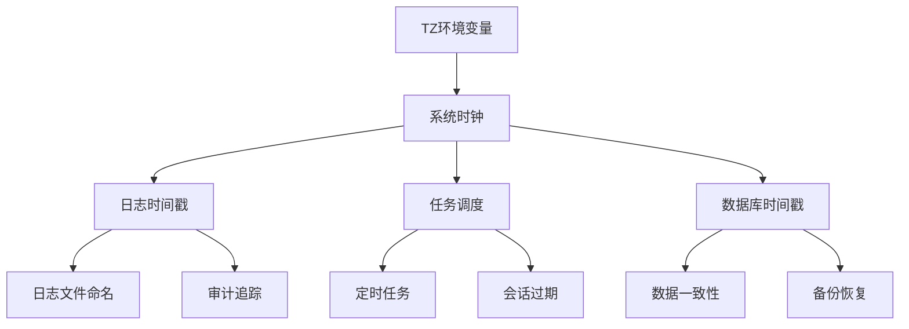

**图表来源**
- [Dockerfile](file://Dockerfile#L104-L105)
- [docker-compose.yml](file://docker-compose.yml#L25)

### 时区配置最佳实践

1. **统一时区**：确保所有组件使用相同的时间区域
2. **UTC vs 地区时**：推荐使用UTC进行内部处理，地区时用于用户界面
3. **夏令时处理**：考虑自动调整机制
4. **时区验证**：启动时验证时区配置的有效性

**章节来源**
- [Dockerfile](file://Dockerfile#L104-L105)
- [entrypoint.sh](file://entrypoint.sh#L12)

## 数据库配置与数据持久化

### DB_PATH配置原理

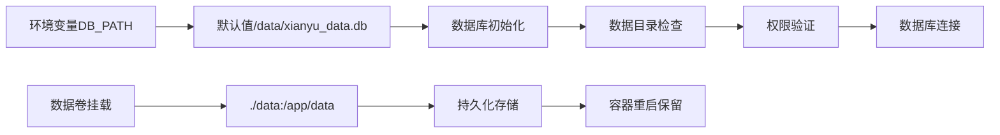

**图表来源**
- [db_manager.py](file://db_manager.py#L22-L23)
- [docker-compose.yml](file://docker-compose.yml#L15)

### 数据持久化策略

| 配置项 | 默认值 | 作用 | 备份策略 |
|-------|--------|------|----------|
| `DB_PATH` | `/app/data/xianyu_data.db` | 主数据库文件 | 定期备份 |
| `./data` | 宿主机目录 | 数据卷挂载 | 自动同步 |
| `./backups` | 宿主机目录 | 备份存储 | 时间序列 |

### 数据库迁移机制

系统具备自动数据库迁移能力：

1. **启动时检查**：检测旧数据库文件位置
2. **自动迁移**：将旧文件移动到新位置
3. **冲突处理**：当新旧文件同时存在时的决策逻辑
4. **备份创建**：迁移过程中的自动备份

**章节来源**
- [db_manager.py](file://db_manager.py#L22-L47)
- [Start.py](file://Start.py#L63-L137)

## 日志系统配置

### LOG_LEVEL配置体系

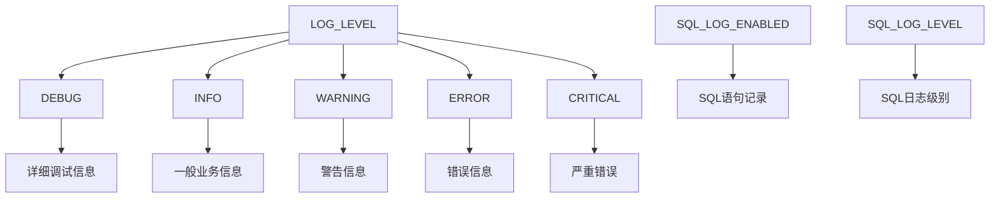

**图表来源**
- [docker-compose.yml](file://docker-compose.yml#L27-L32)
- [global_config.yml](file://global_config.yml#L49-L56)

### SQL日志配置详解

| 配置项 | 默认值 | 功能 | 性能影响 |
|-------|--------|------|----------|
| `SQL_LOG_ENABLED` | `true` | 启用SQL语句日志 | 中等性能损失 |
| `SQL_LOG_LEVEL` | `INFO` | SQL日志级别 | 调试详细度 |
| 日志格式 | 结构化JSON | 便于分析 | 存储空间 |

### 日志级别最佳实践

1. **开发环境**：`DEBUG`级别，详细跟踪
2. **测试环境**：`INFO`级别，关注业务流程
3. **生产环境**：`WARNING`及以上，减少I/O开销
4. **性能监控**：定期分析日志模式

**章节来源**
- [db_manager.py](file://db_manager.py#L54-L61)
- [global_config.yml](file://global_config.yml#L49-L56)

## 安全配置

### 管理员账户配置

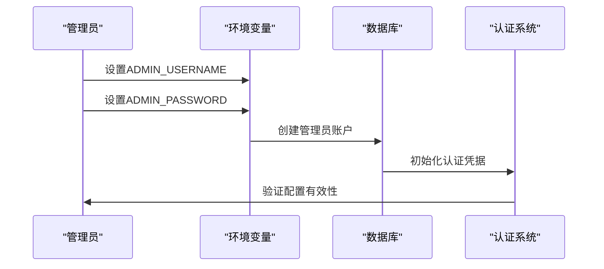

**图表来源**
- [docker-compose.yml](file://docker-compose.yml#L33-L34)
- [entrypoint.sh](file://entrypoint.sh#L34-L41)

### JWT_SECRET_KEY安全机制

JWT密钥在身份认证中发挥核心作用：

| 配置项 | 默认值 | 安全要求 | 生成建议 |
|-------|--------|----------|----------|
| `JWT_SECRET_KEY` | `default-secret-key` | 强随机性 | 32字节随机字符串 |
| 密钥长度 | ≥256位 | 加密强度 | 使用密码学安全随机数 |
| 密钥轮换 | 定期更新 | 安全策略 | 自动化轮换机制 |

### 会话超时配置

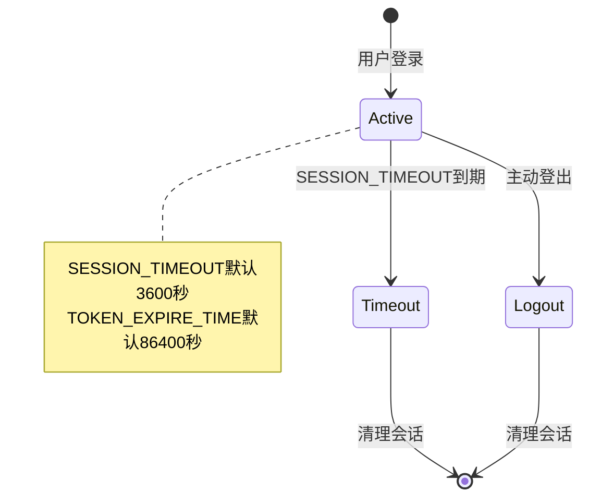

**图表来源**
- [docker-compose.yml](file://docker-compose.yml#L36)
- [docker-compose.yml](file://docker-compose.yml#L42)

**章节来源**
- [docker-compose.yml](file://docker-compose.yml#L33-L36)
- [docker-compose.yml](file://docker-compose.yml#L42)

## 多用户系统配置

### 多用户系统架构

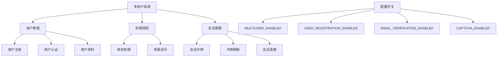

**图表来源**
- [docker-compose.yml](file://docker-compose.yml#L38-L41)

### 用户注册与验证

| 配置项 | 默认值 | 功能 | 安全影响 |
|-------|--------|------|----------|
| `MULTIUSER_ENABLED` | `true` | 启用多用户功能 | 功能可用性 |
| `USER_REGISTRATION_ENABLED` | `true` | 允许用户注册 | 访问控制 |
| `EMAIL_VERIFICATION_ENABLED` | `true` | 邮箱验证 | 账户安全 |
| `CAPTCHA_ENABLED` | `true` | 图形验证码 | 防止机器人 |

### 令牌管理机制

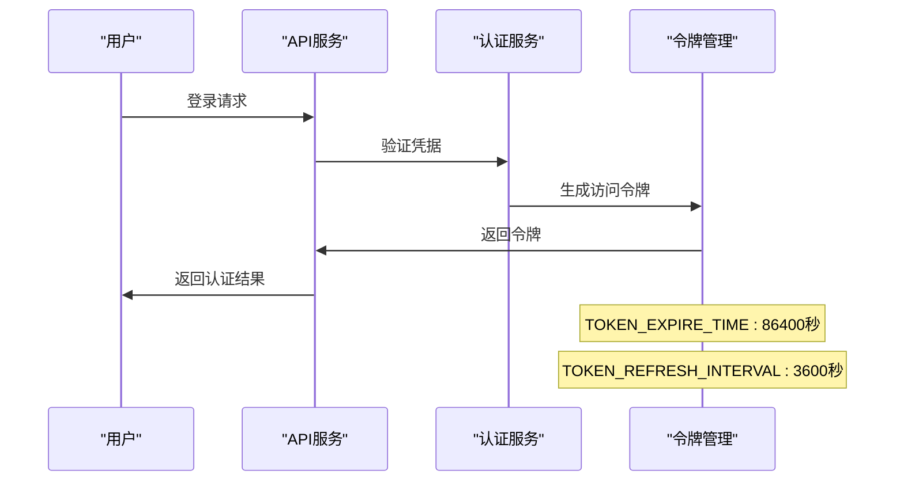

**图表来源**
- [docker-compose.yml](file://docker-compose.yml#L42)
- [docker-compose.yml](file://docker-compose.yml#L57-L58)

**章节来源**
- [docker-compose.yml](file://docker-compose.yml#L38-L41)
- [docker-compose.yml](file://docker-compose.yml#L42-L58)

## AI回复系统配置

### AI系统架构

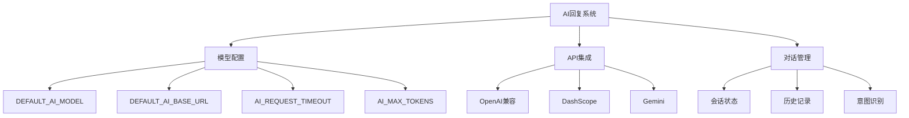

**图表来源**
- [docker-compose.yml](file://docker-compose.yml#L48-L53)
- [ai_reply_engine.py](file://ai_reply_engine.py#L62-L81)

### AI模型配置详解

| 配置项 | 默认值 | 支持模型 | 适用场景 |
|-------|--------|----------|----------|
| `AI_REPLY_ENABLED` | `false` | 通用开关 | 功能控制 |
| `DEFAULT_AI_MODEL` | `qwen-plus` | qwen系列、gpt系列 | 回复质量 |
| `DEFAULT_AI_BASE_URL` | `https://dashscope.aliyuncs.com/compatible-mode/v1` | 阿里云、OpenAI | 服务商选择 |
| `AI_REQUEST_TIMEOUT` | `30` | 秒 | 网络稳定性 |
| `AI_MAX_TOKENS` | `100` | 令牌数 | 回复长度 |

### AI回复流程

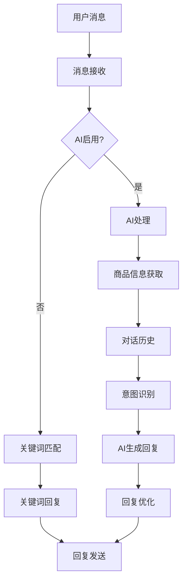

**图表来源**
- [ai_reply_engine.py](file://ai_reply_engine.py#L62-L81)
- [docker-compose.yml](file://docker-compose.yml#L48-L53)

**章节来源**
- [docker-compose.yml](file://docker-compose.yml#L48-L53)
- [ai_reply_engine.py](file://ai_reply_engine.py#L62-L81)

## 资源限制配置

### 资源限制机制

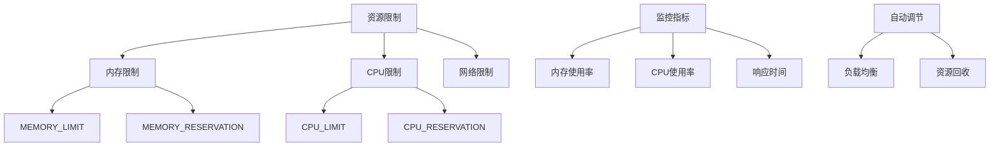

**图表来源**
- [docker-compose.yml](file://docker-compose.yml#L72-L77)

### 资源配置参数

| 配置项 | 默认值 | 单位 | 调优建议 |
|-------|--------|------|----------|
| `MEMORY_LIMIT` | `2048` | MB | 根据应用需求 |
| `MEMORY_RESERVATION` | `512` | MB | 预留缓冲 |
| `CPU_LIMIT` | `2.0` | 核数 | CPU密集型应用 |
| `CPU_RESERVATION` | `0.5` | 核数 | 基础服务 |

### 性能监控与调优

1. **内存监控**：定期检查内存使用趋势
2. **CPU分析**：识别性能瓶颈
3. **自动扩展**：根据负载动态调整
4. **资源回收**：及时释放不用的资源

**章节来源**
- [docker-compose.yml](file://docker-compose.yml#L72-L77)

## 生产环境安全配置

### 密钥生成与管理

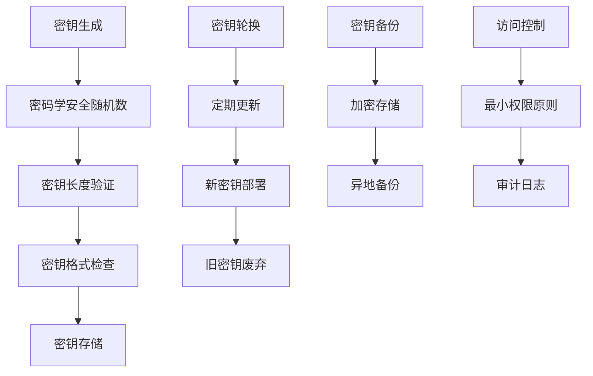

### 敏感信息保护清单

| 类别 | 配置项 | 安全要求 | 保护措施 |
|------|--------|----------|----------|
| 认证 | `JWT_SECRET_KEY` | 强随机性 | 环境变量隔离 |
| 数据库 | `DATABASE_PASSWORD` | 加密存储 | 密钥管理服务 |
| API | `API_KEYS` | 逐个管理 | 访问令牌 |
| 系统 | `ADMIN_PASSWORD` | 复杂度要求 | 定期更换 |

### 配置审计机制

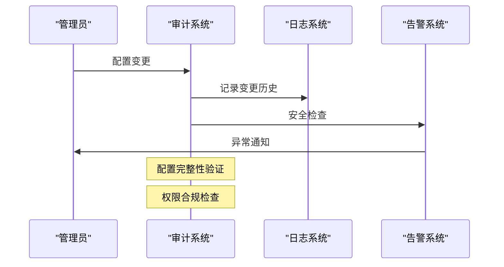

### 生产环境配置模板

```yaml
# 生产环境安全配置示例
environment:
  # 安全配置
  JWT_SECRET_KEY: "${SECURE_JWT_SECRET}"
  ADMIN_USERNAME: "${PROD_ADMIN_USER}"
  ADMIN_PASSWORD: "${SECURE_ADMIN_PASSWORD}"
  
  # 性能配置
  MEMORY_LIMIT: "4096M"
  CPU_LIMIT: "4.0"
  
  # 安全增强
  SQL_LOG_ENABLED: "false"
  DEBUG: "false"
  
  # 监控配置
  LOG_LEVEL: "INFO"
  TZ: "Asia/Shanghai"
```

**章节来源**
- [docker-compose.yml](file://docker-compose.yml#L35)
- [docker-compose.yml](file://docker-compose.yml#L28-L32)

## 故障排除指南

### 常见环境变量问题

| 问题类型 | 症状 | 解决方案 | 预防措施 |
|---------|------|----------|----------|
| 变量未设置 | 使用默认值 | 检查环境变量定义 | 配置验证脚本 |
| 类型错误 | 程序异常 | 格式化变量值 | 类型检查 |
| 权限问题 | 访问被拒绝 | 调整文件权限 | 权限审计 |
| 时区错误 | 时间不一致 | 同一时区设置 | 时区验证 |

### 调试环境变量

```bash
# 检查环境变量
echo "当前环境变量检查:"
echo "PYTHONUNBUFFERED: ${PYTHONUNBUFFERED:-未设置}"
echo "TZ: ${TZ:-未设置}"
echo "DB_PATH: ${DB_PATH:-未设置}"
echo "JWT_SECRET_KEY: ${JWT_SECRET_KEY:-未设置}"

# 验证配置文件
ls -la /app/global_config.yml
cat /app/global_config.yml | grep -E "(ADMIN_|JWT_|DB_PATH)"

# 检查数据库连接
python -c "
import os
import sqlite3
db_path = os.getenv('DB_PATH', 'data/xianyu_data.db')
conn = sqlite3.connect(db_path)
cursor = conn.cursor()
cursor.execute('SELECT name FROM sqlite_master WHERE type=\"table\"')
tables = cursor.fetchall()
print(f'数据库表结构: {tables}')
"
```

### 性能问题诊断

1. **资源监控**：检查CPU和内存使用情况
2. **日志分析**：分析错误日志和性能日志
3. **数据库优化**：检查SQL查询性能
4. **网络诊断**：验证外部API连接

**章节来源**
- [entrypoint.sh](file://entrypoint.sh#L8-L15)
- [Start.py](file://Start.py#L63-L137)

## 总结

本系统的环境变量管理体系体现了现代容器化应用的最佳实践：

### 核心优势

1. **灵活性**：多层次的配置优先级机制
2. **安全性**：完善的密钥管理和访问控制
3. **可维护性**：清晰的配置分类和文档
4. **可扩展性**：模块化的功能开关设计

### 最佳实践要点

1. **环境隔离**：不同环境使用独立的配置
2. **安全优先**：敏感信息通过环境变量注入
3. **监控到位**：完整的日志和性能监控
4. **文档完善**：详细的配置说明和故障排除指南

### 部署建议

1. **开发环境**：使用默认配置，启用详细日志
2. **测试环境**：模拟生产配置，重点测试功能
3. **生产环境**：严格的安全配置，定期审计
4. **监控告警**：建立完善的监控和告警机制

通过这套完整的环境变量管理体系，系统能够在各种部署场景下稳定运行，同时保证了安全性和可维护性。