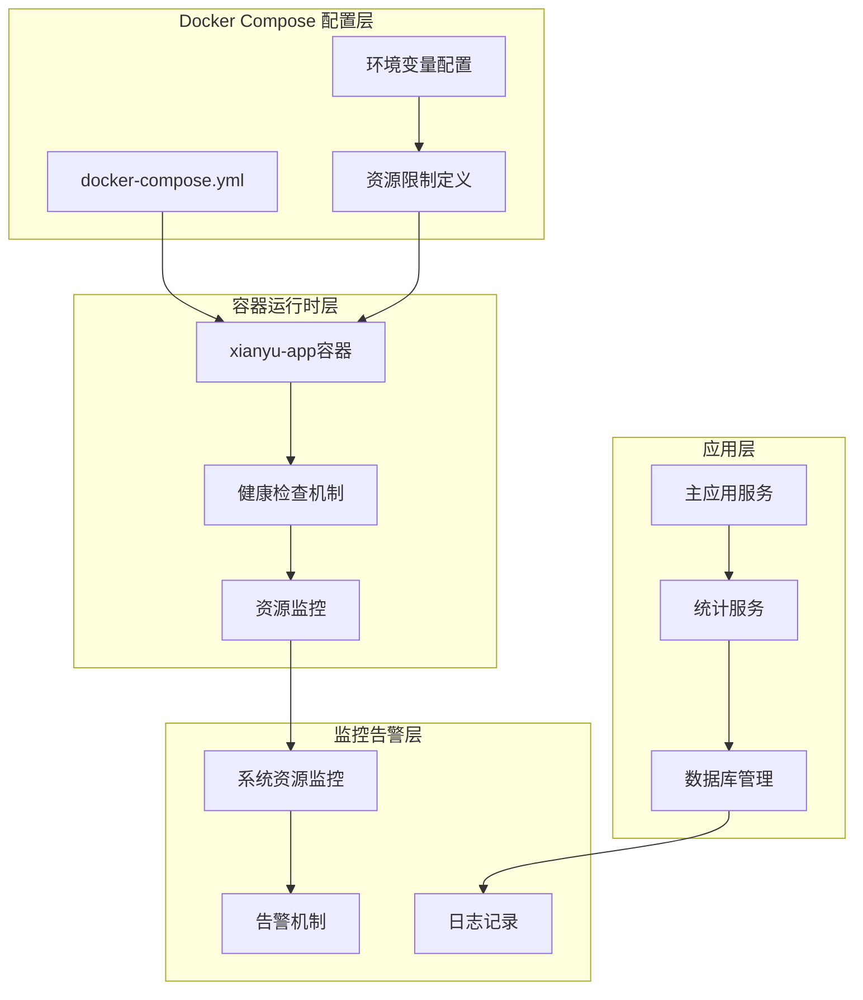
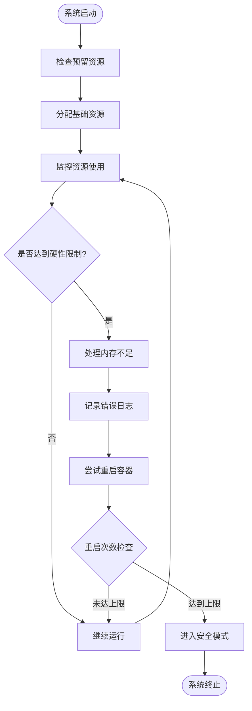
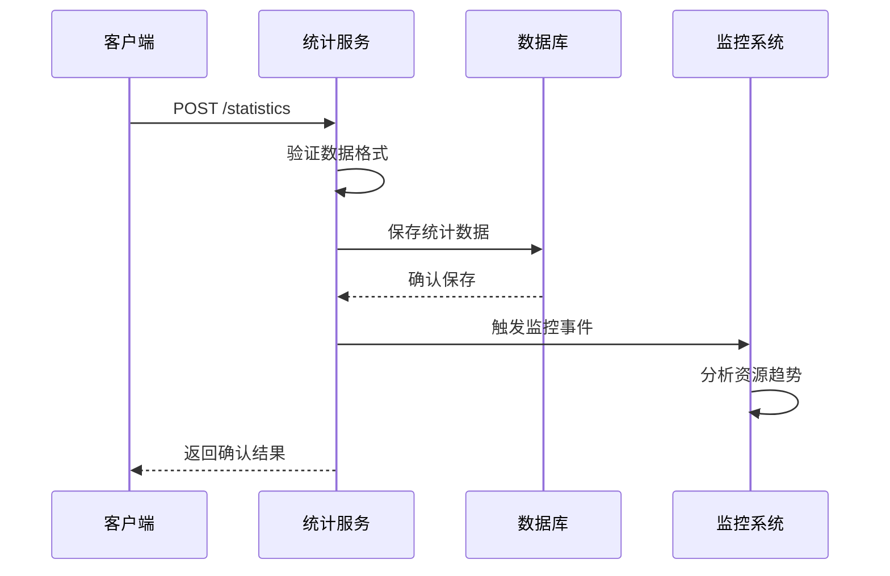
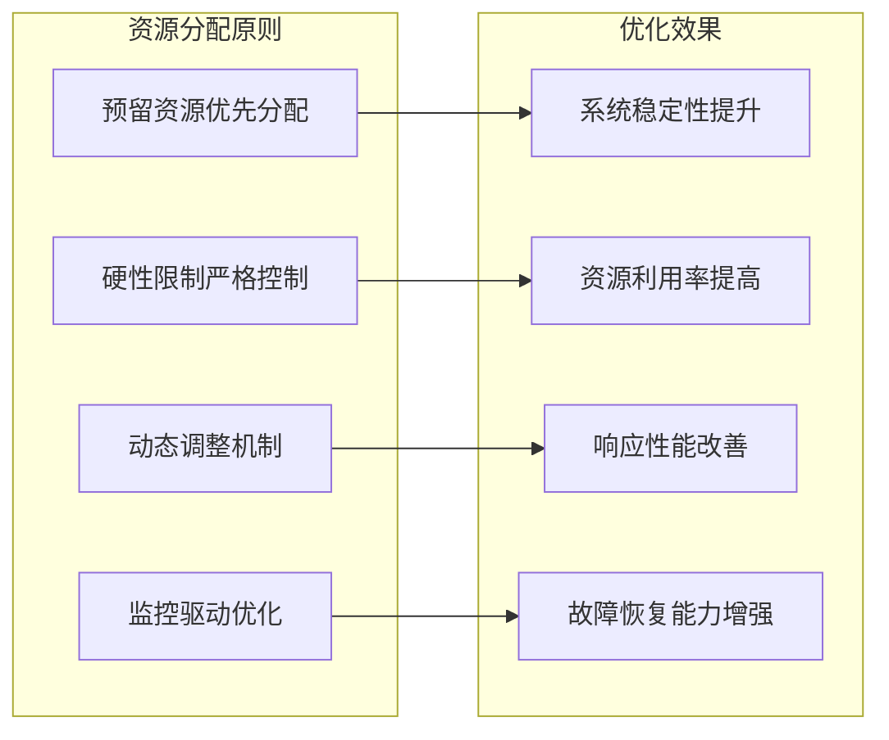
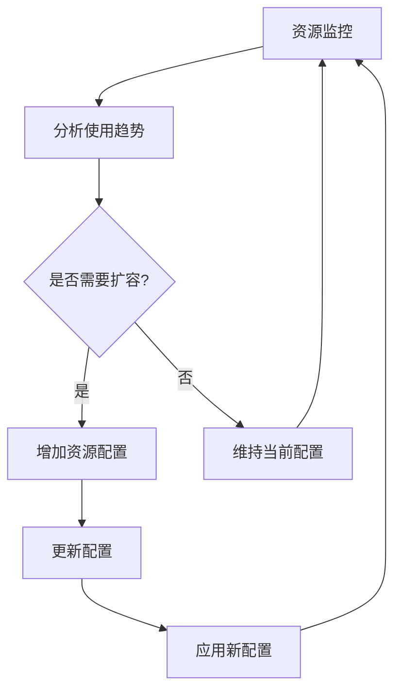
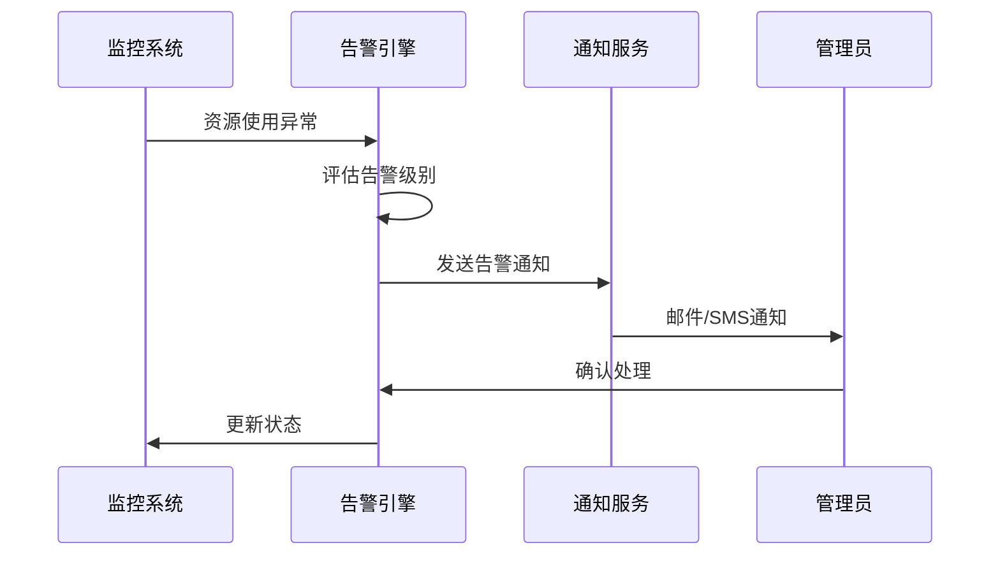

# 资源管理

<cite>
**本文档引用的文件**
- [docker-compose.yml](file://docker-compose.yml)
- [docker-compose-cn.yml](file://docker-compose-cn.yml)
- [Dockerfile](file://Dockerfile)
- [Dockerfile-cn](file://Dockerfile-cn)
- [global_config.yml](file://global_config.yml)
- [config.py](file://config.py)
- [reply_server.py](file://reply_server.py)
- [simple_stats_server.py](file://simple_stats_server.py)
- [usage_statistics.py](file://usage_statistics.py)
- [db_manager.py](file://db_manager.py)
- [docker-deploy.sh](file://docker-deploy.sh)
</cite>

## 目录
1. [简介](#简介)
2. [Docker资源限制配置架构](#docker资源限制配置架构)
3. [核心资源限制机制](#核心资源限制机制)
4. [资源监控与健康检查](#资源监控与健康检查)
5. [性能优化策略](#性能优化策略)
6. [部署规模资源配置建议](#部署规模资源配置建议)
7. [故障排除与告警机制](#故障排除与告警机制)
8. [最佳实践指南](#最佳实践指南)
9. [总结](#总结)

## 简介

本项目采用Docker容器化部署，通过精心设计的资源限制配置机制来确保系统的稳定性和性能。该系统实现了多层次的资源管理策略，包括内存限制、CPU限制、预留资源分配以及实时监控等核心功能。

## Docker资源限制配置架构

### 整体架构设计



**图表来源**
- [docker-compose.yml](file://docker-compose.yml#L69-L78)
- [reply_server.py](file://reply_server.py#L373-L418)

### 资源限制配置层次

系统采用三层资源管理架构：

1. **编排层限制**：通过Docker Compose定义的硬性资源边界
2. **运行时限制**：容器内部的资源使用控制
3. **应用层限制**：应用程序级别的资源使用优化

**章节来源**
- [docker-compose.yml](file://docker-compose.yml#L69-L78)
- [docker-compose-cn.yml](file://docker-compose-cn.yml#L69-L78)

## 核心资源限制机制

### MEMORY_LIMIT 和 CPU_LIMIT 硬性限制

#### 内存硬性限制 (MEMORY_LIMIT)

系统设置了2GB的内存硬性限制，这是容器能够使用的最大内存容量：

```yaml
memory: ${MEMORY_LIMIT:-2048}M
```

**关键特性：**
- **硬性上限**：容器无法突破此内存限制
- **OOM保护**：当内存使用接近上限时触发内存不足处理
- **系统稳定性**：防止内存泄漏导致系统崩溃

#### CPU硬性限制 (CPU_LIMIT)

系统配置了2.0个CPU核心的硬性限制：

```yaml
cpus: '${CPU_LIMIT:-2.0}'
```

**关键特性：**
- **CPU配额**：严格限制容器的CPU使用量
- **公平调度**：确保多个容器间的CPU资源公平分配
- **性能保证**：防止CPU资源被单一容器独占

### MEMORY_RESERVATION 和 CPU_RESERVATION 预留资源

#### 内存预留 (MEMORY_RESERVATION)

系统预留了512MB的内存资源：

```yaml
memory: ${MEMORY_RESERVATION:-512}M
```

**预留资源的作用：**
- **优先级保证**：确保容器获得基本的内存资源
- **启动优化**：支持应用快速启动和初始化
- **缓冲空间**：为突发流量提供额外的内存缓冲

#### CPU预留 (CPU_RESERVATION)

系统预留了0.5个CPU核心：

```yaml
cpus: '${CPU_RESERVATION:-0.5}'
```

**预留资源的作用：**
- **基础计算能力**：确保容器具备基本的计算能力
- **任务调度优化**：提高容器在调度器中的优先级
- **响应性能**：保证关键任务的及时响应

### 资源限制与系统负载平衡策略



**图表来源**
- [reply_server.py](file://reply_server.py#L373-L418)
- [docker-compose.yml](file://docker-compose.yml#L69-L78)

**章节来源**
- [docker-compose.yml](file://docker-compose.yml#L69-L78)
- [docker-compose-cn.yml](file://docker-compose-cn.yml#L69-L78)

## 资源监控与健康检查

### 健康检查机制

系统实现了多层次的健康检查机制：

#### 容器级健康检查

```yaml
healthcheck:
  test: ["CMD", "curl", "-f", "http://localhost:8080/health"]
  interval: 30s
  timeout: 10s
  retries: 3
  start_period: 40s
```

**健康检查特点：**
- **定期检测**：每30秒执行一次健康检查
- **超时控制**：10秒超时时间，防止检查阻塞
- **重试机制**：最多3次重试机会
- **启动延迟**：40秒启动期，确保应用充分初始化

#### 应用级健康检查

系统在应用层面实现了详细的健康检查：

```python
@app.get('/health')
async def health_check():
    # 检查Cookie管理器状态
    manager_status = "ok" if cookie_manager.manager is not None else "error"
    
    # 检查数据库连接
    try:
        db_manager.get_all_cookies()
        db_status = "ok"
    except Exception:
        db_status = "error"
    
    # 获取系统状态
    import psutil
    cpu_percent = psutil.cpu_percent(interval=1)
    memory_info = psutil.virtual_memory()
```

**系统状态监控指标：**
- **CPU使用率**：实时监控CPU占用情况
- **内存使用率**：监控内存占用百分比
- **可用内存**：检查系统剩余可用内存
- **服务状态**：验证各子服务的运行状态

### 资源使用统计与监控

#### 用户统计服务

系统提供了专门的用户统计服务来监控资源使用情况：



**图表来源**
- [simple_stats_server.py](file://simple_stats_server.py#L97-L111)
- [usage_statistics.py](file://usage_statistics.py#L137-L144)

#### 系统资源监控

系统集成了psutil库进行实时资源监控：

```python
import psutil

# 获取CPU使用率
cpu_percent = psutil.cpu_percent(interval=1)

# 获取内存信息
memory_info = psutil.virtual_memory()
memory_percent = memory_info.percent
memory_available = memory_info.available
```

**监控指标包括：**
- **CPU使用率**：实时CPU占用百分比
- **内存使用率**：内存占用百分比
- **可用内存**：系统剩余可用内存
- **进程统计**：容器内进程数量和状态

**章节来源**
- [docker-compose.yml](file://docker-compose.yml#L63-L68)
- [reply_server.py](file://reply_server.py#L373-L418)
- [simple_stats_server.py](file://simple_stats_server.py#L97-L111)

## 性能优化策略

### 资源使用优化

#### 内存优化策略

1. **垃圾回收优化**
   - 合理配置Python垃圾回收参数
   - 及时释放不再使用的对象引用
   - 使用内存池减少内存分配开销

2. **缓存策略优化**
   - 实现智能缓存淘汰机制
   - 控制缓存大小避免内存溢出
   - 使用弱引用防止循环引用

#### CPU优化策略

1. **异步处理优化**
   - 使用asyncio实现非阻塞I/O
   - 合理配置并发连接数
   - 优化数据库查询性能

2. **算法优化**
   - 使用高效的数据结构
   - 减少不必要的计算
   - 实现批量处理机制

### 资源分配策略



**章节来源**
- [reply_server.py](file://reply_server.py#L373-L418)
- [usage_statistics.py](file://usage_statistics.py#L137-L144)

## 部署规模资源配置建议

### 小规模部署 (1-5用户)

**推荐资源配置：**
```yaml
deploy:
  resources:
    limits:
      memory: 1024M
      cpus: '1.0'
    reservations:
      memory: 256M
      cpus: '0.25'
```

**适用场景：**
- 个人使用
- 小团队协作
- 开发测试环境

### 中规模部署 (5-20用户)

**推荐资源配置：**
```yaml
deploy:
  resources:
    limits:
      memory: 2048M
      cpus: '2.0'
    reservations:
      memory: 512M
      cpus: '0.5'
```

**适用场景：**
- 中小型企业
- 团队开发
- 生产测试环境

### 大规模部署 (20+用户)

**推荐资源配置：**
```yaml
deploy:
  resources:
    limits:
      memory: 4096M
      cpus: '4.0'
    reservations:
      memory: 1024M
      cpus: '1.0'
```

**适用场景：**
- 企业级应用
- 高并发访问
- 生产环境部署

### 动态资源配置策略



**章节来源**
- [docker-compose.yml](file://docker-compose.yml#L69-L78)
- [docker-compose-cn.yml](file://docker-compose-cn.yml#L69-L78)

## 故障排除与告警机制

### 资源不足时的系统行为

#### 内存不足处理

当容器内存使用接近硬性限制时，系统会采取以下措施：

1. **内存压力检测**
   ```python
   memory_info = psutil.virtual_memory()
   if memory_info.percent > 90:
       # 触发内存警告
       logger.warning(f"内存使用率过高: {memory_info.percent}%")
   ```

2. **OOM处理机制**
   - 自动触发垃圾回收
   - 清理临时缓存数据
   - 记录详细的错误日志

#### CPU资源不足处理

当CPU使用率持续过高时：

1. **CPU限流检测**
   ```python
   cpu_percent = psutil.cpu_percent(interval=1)
   if cpu_percent > 95:
       # 降低处理优先级
       # 减少并发任务数量
   ```

2. **降级服务策略**
   - 暂停非关键任务
   - 限制API请求频率
   - 优先处理重要业务

### 告警策略配置

#### 告警级别定义

| 告警级别 | 触发条件 | 处理措施 |
|---------|---------|---------|
| 信息级 | 正常使用范围 | 记录日志 |
| 警告级 | 资源使用率>80% | 发送告警通知 |
| 严重级 | 资源使用率>95% | 自动扩容或降级 |
| 危险级 | 资源使用率>100% | 系统保护机制 |

#### 告警通知机制



**图表来源**
- [usage_statistics.py](file://usage_statistics.py#L137-L144)
- [reply_server.py](file://reply_server.py#L1400-L1484)

### 故障恢复机制

#### 自动恢复策略

1. **容器重启**
   - 达到重启次数上限时自动重启
   - 重启间隔递增策略
   - 重启失败时进入安全模式

2. **资源重分配**
   - 动态调整资源分配
   - 优先保证核心服务
   - 平衡各容器资源需求

**章节来源**
- [reply_server.py](file://reply_server.py#L373-L418)
- [usage_statistics.py](file://usage_statistics.py#L137-L144)
- [db_manager.py](file://db_manager.py#L1-L200)

## 最佳实践指南

### 配置优化建议

#### 环境变量配置

```bash
# 生产环境配置
export MEMORY_LIMIT=2048M
export CPU_LIMIT=2.0
export MEMORY_RESERVATION=512M
export CPU_RESERVATION=0.5

# 开发环境配置
export MEMORY_LIMIT=1024M
export CPU_LIMIT=1.0
export MEMORY_RESERVATION=256M
export CPU_RESERVATION=0.25
```

#### 监控配置建议

1. **健康检查优化**
   - 调整检查间隔适应业务需求
   - 增加自定义健康检查指标
   - 实现多层次健康检查

2. **日志监控配置**
   - 启用详细的资源使用日志
   - 配置日志轮转和归档
   - 实现实时日志监控

### 性能调优策略

#### 系统级优化

1. **内核参数调优**
   ```bash
   # 优化文件描述符限制
   ulimit -n 65536
   
   # 优化进程限制
   ulimit -u 4096
   ```

2. **Docker配置优化**
   ```yaml
   # docker-daemon.json
   {
     "default-ulimits": {
       "nofile": {
         "Name": "nofile",
         "Soft": 65536,
         "Hard": 65536
       }
     }
   }
   ```

#### 应用级优化

1. **数据库优化**
   - 合理配置连接池大小
   - 优化查询语句性能
   - 实现数据库连接复用

2. **缓存策略优化**
   - 使用Redis作为缓存层
   - 实现智能缓存失效机制
   - 配置合适的缓存过期时间

### 安全配置建议

#### 资源隔离

1. **用户权限控制**
   ```yaml
   user: "1000:1000"  # 使用非root用户
   ```

2. **网络隔离**
   ```yaml
   networks:
     - xianyu-network
   ```

#### 安全监控

1. **资源使用审计**
   - 记录资源使用历史
   - 监控异常资源消耗
   - 实现资源使用报告

2. **访问控制**
   - 限制容器间通信
   - 配置网络安全策略
   - 实现资源访问权限控制

**章节来源**
- [docker-compose.yml](file://docker-compose.yml#L69-L78)
- [Dockerfile](file://Dockerfile#L125-L127)
- [config.py](file://config.py#L1-L126)

## 总结

本项目通过精心设计的Docker资源限制配置机制，实现了系统稳定性和性能的双重保障。主要特点包括：

### 核心优势

1. **严格的资源边界**：通过MEMORY_LIMIT和CPU_LIMIT设置硬性限制，确保系统稳定性
2. **合理的预留资源**：MEMORY_RESERVATION和CPU_RESERVATION保证基本服务可用性
3. **完善的监控体系**：多层次健康检查和实时资源监控
4. **智能告警机制**：基于资源使用情况的自动化告警和处理

### 技术创新

1. **动态资源管理**：支持根据实际负载动态调整资源配置
2. **智能故障恢复**：自动检测和处理资源不足情况
3. **全面的监控覆盖**：从容器到应用的全方位资源监控

### 应用价值

该资源管理机制不仅保证了系统的稳定运行，还为大规模部署提供了可靠的技术支撑。通过合理的资源配置和监控策略，可以有效提升系统的整体性能和用户体验。

这种资源管理方案特别适用于需要高可用性和稳定性的企业级应用场景，为构建可靠的分布式系统提供了宝贵的经验和参考。