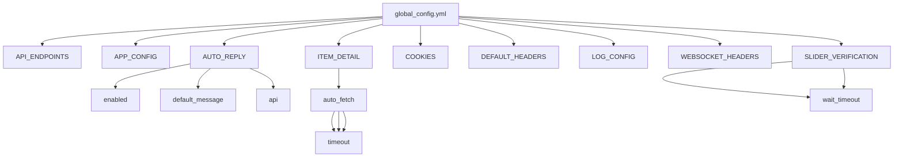
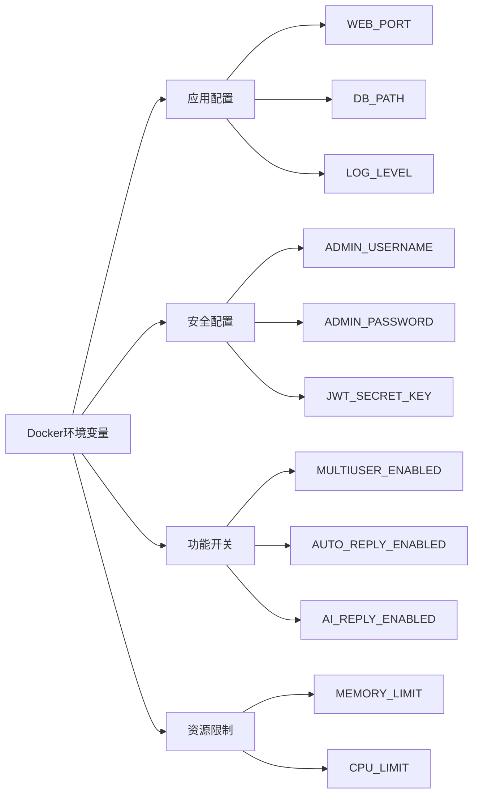
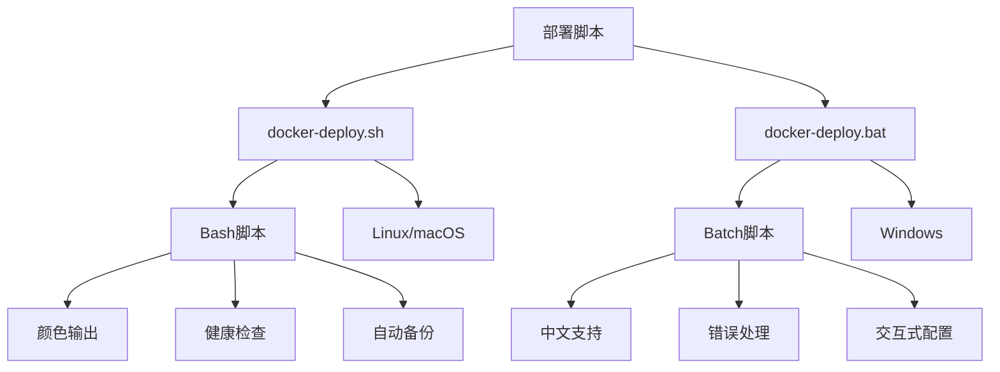

# 环境配置

<cite>
**本文档引用的文件**
- [global_config.yml](file://global_config.yml)
- [docker-compose.yml](file://docker-compose.yml)
- [docker-compose-cn.yml](file://docker-compose-cn.yml)
- [Dockerfile](file://Dockerfile)
- [Dockerfile-cn](file://Dockerfile-cn)
- [entrypoint.sh](file://entrypoint.sh)
- [config.py](file://config.py)
- [Start.py](file://Start.py)
- [db_manager.py](file://db_manager.py)
- [docker-deploy.sh](file://docker-deploy.sh)
- [docker-deploy.bat](file://docker-deploy.bat)
</cite>

## 目录
1. [简介](#简介)
2. [全局配置文件结构](#全局配置文件结构)
3. [Docker环境变量配置](#docker环境变量配置)
4. [环境变量优先级机制](#环境变量优先级机制)
5. [功能开关配置](#功能开关配置)
6. [安全配置建议](#安全配置建议)
7. [资源限制配置](#资源限制配置)
8. [部署脚本配置](#部署脚本配置)
9. [故障排除指南](#故障排除指南)

## 简介

本系统采用多层次的环境配置体系，通过`global_config.yml`全局配置文件和Docker环境变量实现灵活的配置管理。系统支持多用户、AI回复、自动发货等多种功能，并提供了完善的环境变量覆盖机制和安全配置选项。

## 全局配置文件结构

### global_config.yml核心配置

系统的核心配置通过`global_config.yml`文件管理，该文件采用YAML格式，包含以下主要配置类别：



**图表来源**
- [global_config.yml](file://global_config.yml#L1-L77)

#### 核心配置项说明

| 配置项 | 类型 | 默认值 | 说明 |
|--------|------|--------|------|
| `AUTO_REPLY.enabled` | Boolean | true | 是否启用自动回复功能 |
| `AUTO_REPLY.default_message` | String | 预设模板消息 | 默认的自动回复消息模板 |
| `ITEM_DETAIL.auto_fetch.enabled` | Boolean | true | 是否启用商品详情自动获取 |
| `SLIDER_VERIFICATION.max_concurrent` | Integer | 3 | 滑块验证最大并发数 |
| `TOKEN_REFRESH_INTERVAL` | Integer | 72000 | Token刷新间隔（秒） |

**章节来源**
- [global_config.yml](file://global_config.yml#L1-L77)

## Docker环境变量配置

### 核心环境变量列表

系统通过Docker环境变量提供灵活的配置覆盖机制，支持以下关键配置：



**图表来源**
- [docker-compose.yml](file://docker-compose.yml#L22-L77)

#### 应用配置变量

| 变量名 | 默认值 | 说明 | 优先级 |
|--------|--------|------|--------|
| `WEB_PORT` | 8080 | Web服务端口 | Docker Compose > 环境变量 > 默认值 |
| `DB_PATH` | /app/data/xianyu_data.db | 数据库文件路径 | Docker Compose > 环境变量 > 默认值 |
| `LOG_LEVEL` | INFO | 日志级别 | Docker Compose > 环境变量 > 默认值 |
| `DEBUG` | false | 调试模式 | Docker Compose > 环境变量 > 默认值 |

#### 安全配置变量

| 变量名 | 默认值 | 说明 | 安全建议 |
|--------|--------|------|----------|
| `ADMIN_USERNAME` | admin | 管理员用户名 | 强制修改为复杂用户名 |
| `ADMIN_PASSWORD` | admin123 | 管理员密码 | 强制修改为强密码 |
| `JWT_SECRET_KEY` | default-secret-key | JWT密钥 | 生成随机强密钥 |
| `SESSION_TIMEOUT` | 3600 | 会话超时时间（秒） | 根据业务需求调整 |

#### 功能开关变量

| 变量名 | 默认值 | 说明 | 生产环境建议 |
|--------|--------|------|-------------|
| `MULTIUSER_ENABLED` | true | 多用户系统启用 | true |
| `USER_REGISTRATION_ENABLED` | true | 用户注册启用 | true/false根据需求 |
| `EMAIL_VERIFICATION_ENABLED` | true | 邮箱验证启用 | true |
| `CAPTCHA_ENABLED` | true | 验证码启用 | true |
| `AUTO_REPLY_ENABLED` | true | 自动回复启用 | true |
| `AUTO_DELIVERY_ENABLED` | true | 自动发货启用 | true |
| `AI_REPLY_ENABLED` | false | AI回复启用 | false/true根据需求 |

**章节来源**
- [docker-compose.yml](file://docker-compose.yml#L22-L77)

## 环境变量优先级机制

### 优先级层次结构

系统采用多层优先级机制，确保配置的灵活性和可控性：

```mermaid
flowchart TD
A[配置加载顺序] --> B[1. 程序内部默认值]
A --> C[2. 环境变量]
A --> D[3. global_config.yml]
A --> E[4. 命令行参数]
B --> B1[硬编码默认值]
C --> C1[os.getenv优先]
C --> C2[${VAR:-default}语法]
D --> D1[YAML配置文件]
E --> E1[启动参数覆盖]
C1 --> C2["os.getenv('VAR', 'default')"]
C2 --> C3["${VAR:-default}语法"]
```

**图表来源**
- [Start.py](file://Start.py#L450-L451)
- [db_manager.py](file://db_manager.py#L22-L23)

### 默认值处理机制

系统使用`${VAR_NAME:-default}`语法处理环境变量的默认值：

```bash
# 示例：端口配置
WEB_PORT=${WEB_PORT:-8080}

# 示例：数据库路径
DB_PATH=${DB_PATH:-/app/data/xianyu_data.db}

# 示例：JWT密钥
JWT_SECRET_KEY=${JWT_SECRET_KEY:-default-secret-key}
```

这种机制确保：
1. **环境变量优先**：当环境变量存在时使用其值
2. **默认值兜底**：环境变量缺失时使用预设默认值
3. **配置灵活性**：支持不同环境的差异化配置

**章节来源**
- [docker-compose.yml](file://docker-compose.yml#L11-L77)

## 功能开关配置

### AI回复功能配置

系统提供灵活的AI回复功能开关：

```yaml
# AI回复配置示例
environment:
  - AI_REPLY_ENABLED=${AI_REPLY_ENABLED:-false}
  - DEFAULT_AI_MODEL=${DEFAULT_AI_MODEL:-qwen-plus}
  - DEFAULT_AI_BASE_URL=${DEFAULT_AI_BASE_URL:-https://dashscope.aliyuncs.com/compatible-mode/v1}
  - AI_REQUEST_TIMEOUT=${AI_REQUEST_TIMEOUT:-30}
  - AI_MAX_TOKENS=${AI_MAX_TOKENS:-100}
```

#### AI模型配置参数

| 参数 | 默认值 | 说明 | 性能影响 |
|------|--------|------|----------|
| `DEFAULT_AI_MODEL` | qwen-plus | AI模型名称 | 影响响应质量和速度 |
| `AI_REQUEST_TIMEOUT` | 30 | 请求超时时间（秒） | 影响用户体验 |
| `AI_MAX_TOKENS` | 100 | 最大令牌数 | 影响回复长度和成本 |

### 自动发货功能配置

```yaml
environment:
  - AUTO_DELIVERY_ENABLED=${AUTO_DELIVERY_ENABLED:-true}
  - AUTO_DELIVERY_TIMEOUT=${AUTO_DELIVERY_TIMEOUT:-30}
  - API_CARD_TIMEOUT=${API_CARD_TIMEOUT:-10}
```

### 多用户系统配置

```yaml
environment:
  - MULTIUSER_ENABLED=${MULTIUSER_ENABLED:-true}
  - USER_REGISTRATION_ENABLED=${USER_REGISTRATION_ENABLED:-true}
  - EMAIL_VERIFICATION_ENABLED=${EMAIL_VERIFICATION_ENABLED:-true}
  - CAPTCHA_ENABLED=${CAPTCHA_ENABLED:-true}
```

**章节来源**
- [docker-compose.yml](file://docker-compose.yml#L48-L54)

## 安全配置建议

### 密钥生成与管理

#### JWT密钥生成

```bash
# 生成强JWT密钥（32字节）
openssl rand -hex 32

# 生成强JWT密钥（64字节）
openssl rand -base64 64
```

#### 推荐的安全配置

```yaml
environment:
  # 强制修改管理员凭据
  - ADMIN_USERNAME=${ADMIN_USERNAME:-your_secure_username}
  - ADMIN_PASSWORD=${ADMIN_PASSWORD:-your_complex_password_123!}
  
  # 生成强JWT密钥
  - JWT_SECRET_KEY=${JWT_SECRET_KEY:-$(openssl rand -hex 32)}
  
  # 设置合理的会话超时
  - SESSION_TIMEOUT=${SESSION_TIMEOUT:-1800}  # 30分钟
  
  # 启用HTTPS（生产环境）
  - ENABLE_HTTPS=${ENABLE_HTTPS:-true}
```

### 会话安全配置

| 配置项 | 安全建议 | 说明 |
|--------|----------|------|
| `SESSION_TIMEOUT` | 1800-3600秒 | 根据业务需求设置 |
| `TOKEN_EXPIRE_TIME` | 86400秒 | 24小时 |
| `JWT_SECRET_KEY` | 64字节随机字符串 | 使用强加密算法 |

### 日志级别控制

```yaml
environment:
  # 开发环境
  - LOG_LEVEL=${LOG_LEVEL:-DEBUG}
  
  # 生产环境
  - LOG_LEVEL=${LOG_LEVEL:-INFO}
  
  # 安全敏感环境
  - LOG_LEVEL=${LOG_LEVEL:-WARNING}
```

**章节来源**
- [docker-compose.yml](file://docker-compose.yml#L27-L36)

## 资源限制配置

### 内存限制配置

系统通过`MEMORY_LIMIT`和`MEMORY_RESERVATION`控制内存使用：

```yaml
deploy:
  resources:
    limits:
      memory: ${MEMORY_LIMIT:-2048}M
    reservations:
      memory: ${MEMORY_RESERVATION:-512}M
```

#### 内存配置建议

| 场景 | MEMORY_LIMIT | MEMORY_RESERVATION | 说明 |
|------|--------------|-------------------|------|
| 小规模部署 | 1024M | 256M | 单用户场景 |
| 中等规模 | 2048M | 512M | 10-50用户 |
| 大规模部署 | 4096M+ | 1024M+ | 100+用户 |

### CPU限制配置

```yaml
deploy:
  resources:
    limits:
      cpus: '${CPU_LIMIT:-2.0}'
    reservations:
      cpus: '${CPU_RESERVATION:-0.5}'
```

#### CPU配置建议

| 场景 | CPU_LIMIT | CPU_RESERVATION | 说明 |
|------|-----------|-----------------|------|
| 轻量级 | 1.0 | 0.25 | 文本处理为主 |
| 标准级 | 2.0 | 0.5 | 包含图片处理 |
| 高负载 | 4.0+ | 1.0+ | AI处理密集 |

### 系统稳定性调优

```yaml
# 性能优化配置
environment:
  # 数据库连接池
  - MAX_DB_CONNECTIONS=${MAX_DB_CONNECTIONS:-10}
  
  # 并发处理限制
  - MAX_CONCURRENT_TASKS=${MAX_CONCURRENT_TASKS:-5}
  
  # 缓存配置
  - CACHE_TTL=${CACHE_TTL:-300}
```

**章节来源**
- [docker-compose.yml](file://docker-compose.yml#L70-L77)

## 部署脚本配置

### 部署脚本功能

系统提供两个部署脚本，分别支持Linux和Windows环境：



**图表来源**
- [docker-deploy.sh](file://docker-deploy.sh#L1-L361)
- [docker-deploy.bat](file://docker-deploy.bat#L1-L229)

### 部署命令参考

#### Linux部署脚本命令

```bash
# 快速部署
./docker-deploy.sh

# 初始化配置
./docker-deploy.sh init

# 构建镜像
./docker-deploy.sh build

# 启动服务
./docker-deploy.sh start

# 启动包含Nginx的服务
./docker-deploy.sh start with-nginx

# 查看状态
./docker-deploy.sh status

# 查看日志
./docker-deploy.sh logs

# 健康检查
./docker-deploy.sh health

# 更新部署
./docker-deploy.sh update

# 清理环境
./docker-deploy.sh cleanup
```

#### Windows部署脚本命令

```batch
# 快速部署
docker-deploy.bat

# 启动服务
docker-deploy.bat start

# 停止服务
docker-deploy.bat stop

# 查看状态
docker-deploy.bat status

# 查看日志
docker-deploy.bat logs

# 构建镜像
docker-deploy.bat build

# 清理环境
docker-deploy.bat cleanup
```

### 国内镜像支持

系统提供国内镜像支持，解决网络访问问题：

```bash
# 使用国内镜像构建
./docker-deploy.sh build

# 选择使用国内镜像
? 是否需要使用国内镜像(y/n): y
```

**章节来源**
- [docker-deploy.sh](file://docker-deploy.sh#L82-L87)
- [docker-deploy.bat](file://docker-deploy.bat#L87-L91)

## 故障排除指南

### 常见配置问题

#### 1. 端口冲突问题

```bash
# 检查端口占用
netstat -an | grep 8080

# 修改端口配置
export WEB_PORT=8081
docker-compose up -d
```

#### 2. 数据库连接问题

```bash
# 检查数据库文件权限
ls -la data/

# 检查数据库路径配置
echo $DB_PATH
```

#### 3. AI功能配置问题

```bash
# 检查AI配置
echo "AI Enabled: $AI_REPLY_ENABLED"
echo "Model: $DEFAULT_AI_MODEL"
echo "Base URL: $DEFAULT_AI_BASE_URL"
```

### 环境变量调试

```bash
# 查看所有环境变量
env | grep -E "(ADMIN_|JWT_|AI_|AUTO_)"

# 检查特定变量
echo $ADMIN_USERNAME
echo $JWT_SECRET_KEY
echo $AI_REPLY_ENABLED
```

### 日志分析

```bash
# 查看应用日志
docker-compose logs xianyu-app

# 查看实时日志
docker-compose logs -f xianyu-app

# 查看错误日志
docker-compose logs xianyu-app | grep ERROR
```

**章节来源**
- [docker-deploy.sh](file://docker-deploy.sh#L133-L140)
- [docker-deploy.bat](file://docker-deploy.bat#L156-L162)

## 总结

本系统的环境配置体系具有以下特点：

1. **多层次配置**：支持全局配置文件和环境变量的灵活组合
2. **优先级机制**：明确的配置优先级确保最佳的配置覆盖效果
3. **功能开关**：细粒度的功能控制满足不同部署需求
4. **安全配置**：内置安全最佳实践和建议
5. **资源管理**：完善的资源限制和性能调优机制
6. **部署自动化**：提供完整的部署脚本和工具

通过合理配置这些环境变量和参数，用户可以根据具体需求快速部署和优化系统，同时确保系统的安全性和稳定性。