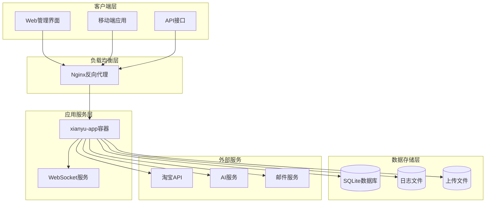
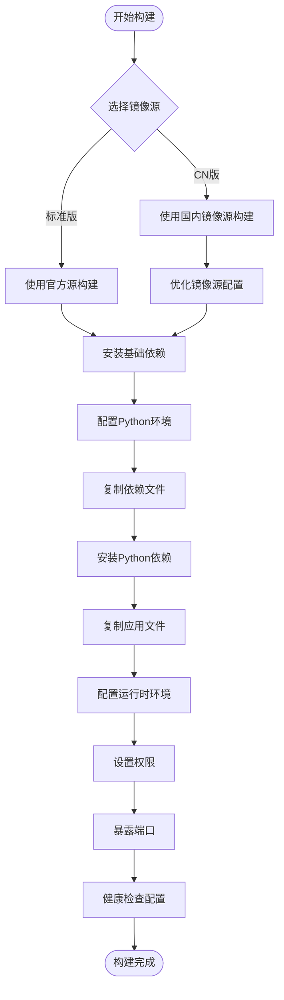
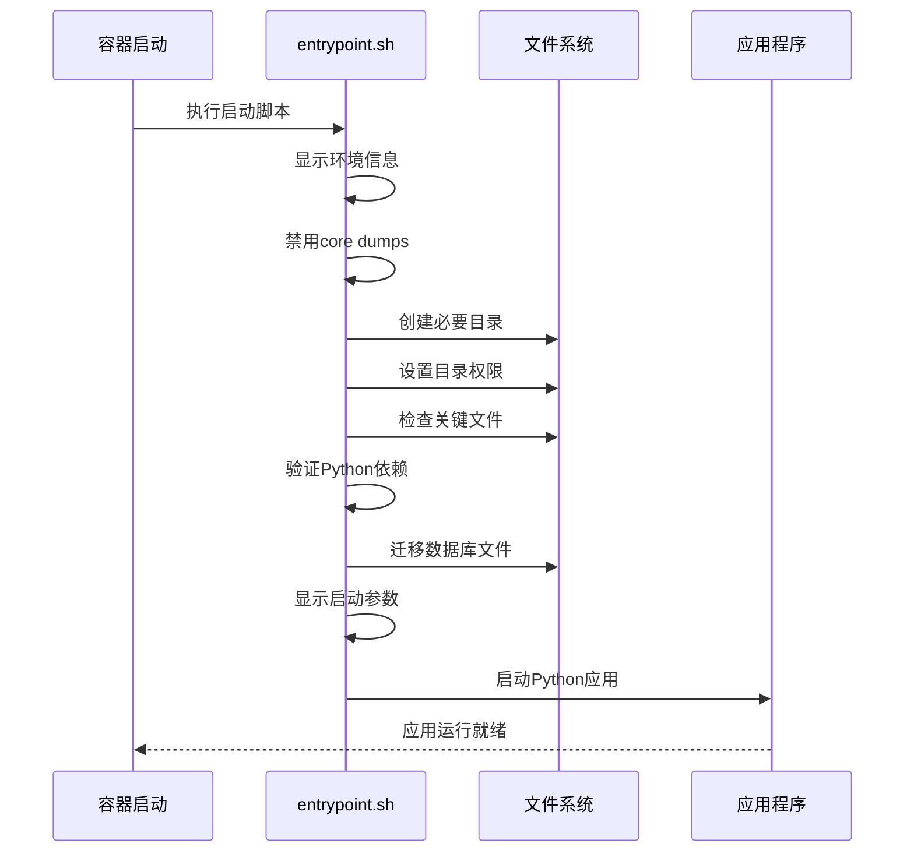
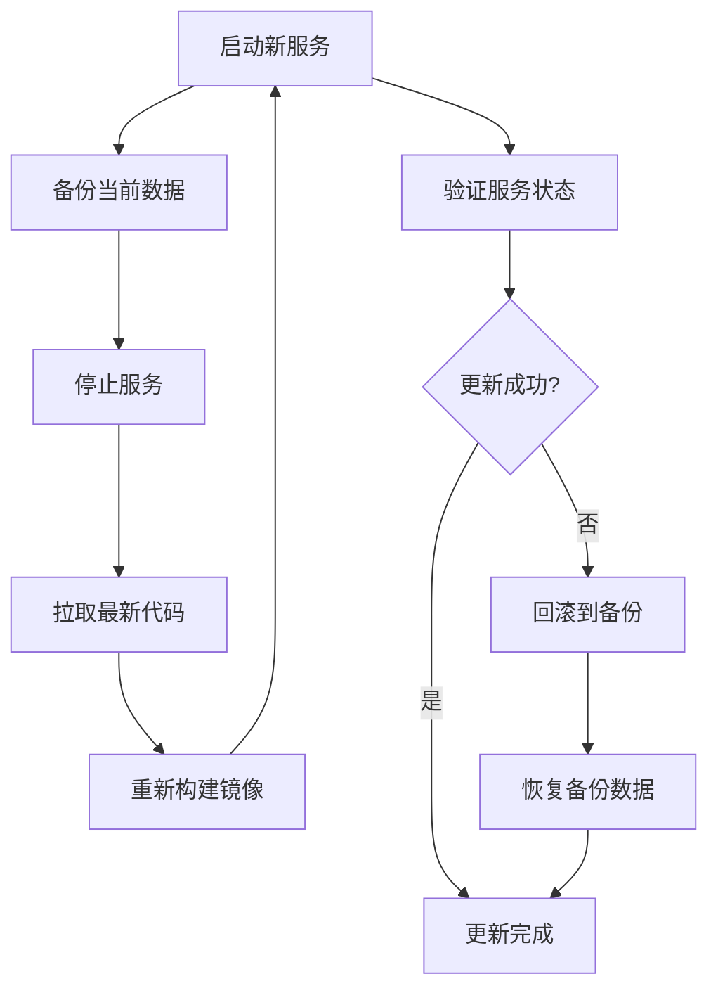
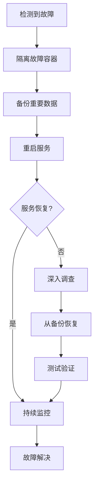

# 部署与运维指南

<cite>
**本文档引用的文件**
- [Dockerfile](file://Dockerfile)
- [Dockerfile-cn](file://Dockerfile-cn)
- [docker-compose.yml](file://docker-compose.yml)
- [docker-compose-cn.yml](file://docker-compose-cn.yml)
- [entrypoint.sh](file://entrypoint.sh)
- [requirements.txt](file://requirements.txt)
- [global_config.yml](file://global_config.yml)
- [nginx/nginx.conf](file://nginx/nginx.conf)
- [docker-deploy.sh](file://docker-deploy.sh)
- [docker-deploy.bat](file://docker-deploy.bat)
- [static/update_log.txt](file://static/update_log.txt)
</cite>

## 目录
1. [概述](#概述)
2. [系统架构](#系统架构)
3. [Docker镜像构建](#docker镜像构建)
4. [服务编排配置](#服务编排配置)
5. [启动脚本详解](#启动脚本详解)
6. [生产环境部署](#生产环境部署)
7. [版本更新管理](#版本更新管理)
8. [监控与维护](#监控与维护)
9. [故障排查](#故障排查)
10. [性能调优](#性能调优)

## 概述

闲鱼自动回复系统是一个基于Python开发的企业级多用户应用，支持自动回复、自动发货等功能。本指南详细说明了系统的部署与运维最佳实践，面向系统管理员和运维工程师。

### 核心特性
- **多用户支持**：支持企业级多用户并发使用
- **自动回复**：基于关键词和AI的智能回复系统
- **自动发货**：支持免拼发货和手动发货
- **Web管理界面**：提供直观的Web管理面板
- **高可用设计**：支持负载均衡和故障转移

## 系统架构



**架构图来源**
- [docker-compose.yml](file://docker-compose.yml#L1-L106)
- [nginx/nginx.conf](file://nginx/nginx.conf#L1-L124)

## Docker镜像构建

### 镜像源优化对比

系统提供了两个Dockerfile版本，针对不同网络环境进行了优化：

#### 标准版 Dockerfile
- **基础镜像**：python:3.11-slim-bookworm
- **特点**：使用官方Debian源，适合国际环境
- **适用场景**：海外部署或对镜像完整性要求较高的环境

#### 国内优化版 Dockerfile-cn
- **镜像源优化**：替换为中科大镜像源
- **Python包源**：使用清华大学TUNA镜像
- **网络优化**：显著提升构建速度
- **适用场景**：中国大陆地区部署



**图表来源**
- [Dockerfile](file://Dockerfile#L1-L138)
- [Dockerfile-cn](file://Dockerfile-cn#L1-L144)

### 构建步骤

1. **准备环境**
   ```bash
   # 检查Docker版本
   docker --version
   
   # 检查Compose版本
   docker-compose --version
   ```

2. **选择构建方式**
   ```bash
   # 标准版构建（推荐国际环境）
   docker-compose build
   
   # 国内版构建（推荐中国内地环境）
   docker-compose -f docker-compose-cn.yml build
   ```

3. **验证镜像**
   ```bash
   docker images | grep xianyu-auto-reply
   ```

**章节来源**
- [Dockerfile](file://Dockerfile#L1-L138)
- [Dockerfile-cn](file://Dockerfile-cn#L1-L144)

## 服务编排配置

### docker-compose.yml详解

系统采用Docker Compose进行服务编排，支持多种部署模式：

#### 应用服务配置

| 配置项 | 描述 | 默认值 | 说明 |
|--------|------|--------|------|
| image | 镜像名称 | xianyu-auto-reply:latest | 使用构建的镜像 |
| container_name | 容器名称 | xianyu-auto-reply | 方便识别和管理 |
| restart | 重启策略 | unless-stopped | 异常时自动重启 |
| user | 运行用户 | 0:0 | 使用root用户避免权限问题 |
| ports | 端口映射 | 8080:8080 | Web服务端口 |
| volumes | 数据卷挂载 | ./data:/app/data | 数据持久化 |

#### 环境变量配置

系统支持丰富的环境变量配置，满足不同部署需求：

| 环境变量 | 默认值 | 功能说明 |
|----------|--------|----------|
| WEB_PORT | 8080 | Web服务端口 |
| DB_PATH | /app/data/xianyu_data.db | 数据库文件路径 |
| LOG_LEVEL | INFO | 日志级别 |
| MULTIUSER_ENABLED | true | 多用户模式开关 |
| AUTO_REPLY_ENABLED | true | 自动回复功能开关 |
| AI_REPLY_ENABLED | false | AI回复功能开关 |

#### 资源限制配置

```yaml
deploy:
  resources:
    limits:
      memory: 2048M
      cpus: '2.0'
    reservations:
      memory: 512M
      cpus: '0.5'
```

### Nginx反向代理配置

系统支持可选的Nginx反向代理配置，提供负载均衡和SSL支持：

#### Nginx配置特点
- **上游服务器**：指向xianyu-app容器
- **Keep-Alive**：保持32个连接
- **Gzip压缩**：提升传输效率
- **安全头**：增强安全性

#### SSL配置（可选）
- 支持HTTPS访问
- 推荐配置：TLSv1.2+，ECDHE加密套件
- 支持HTTP/2协议

**章节来源**
- [docker-compose.yml](file://docker-compose.yml#L1-L106)
- [docker-compose-cn.yml](file://docker-compose-cn.yml#L1-L106)
- [nginx/nginx.conf](file://nginx/nginx.conf#L1-L124)

## 启动脚本详解

### entrypoint.sh功能分析

entrypoint.sh是容器启动的核心脚本，负责完整的环境初始化和应用启动：

#### 初始化流程



**图表来源**
- [entrypoint.sh](file://entrypoint.sh#L1-L94)

#### 关键功能模块

1. **环境检查**
   - Python版本验证
   - 工作目录确认
   - 时区设置
   - 数据库路径检查

2. **文件系统初始化**
   - 创建数据目录结构
   - 设置目录权限（777）
   - 检查配置文件存在性

3. **数据迁移**
   - 旧版本数据库迁移
   - 备份文件整理
   - 统计数据迁移

4. **应用启动**
   - 使用exec替换进程
   - 正确处理信号传递
   - 启动FastAPI应用

### 权限设置策略

系统采用宽松的权限设置（777），便于开发和调试，但在生产环境中建议：

```bash
# 生产环境推荐权限设置
chmod 755 /app
chmod 755 /app/data
chmod 644 /app/global_config.yml
```

**章节来源**
- [entrypoint.sh](file://entrypoint.sh#L1-L94)

## 生产环境部署

### 系统要求

#### 硬件要求
- **CPU**：至少2核心（推荐4核心以上）
- **内存**：最小512MB，推荐2GB以上
- **存储**：至少1GB可用空间
- **网络**：稳定的互联网连接

#### 软件要求
- Docker Engine 20.10+
- Docker Compose 2.0+
- 至少1GB可用内存

### 部署最佳实践

#### 1. 环境隔离
```bash
# 创建专用网络
docker network create --driver bridge xianyu-network

# 创建数据卷
docker volume create xianyu-data
docker volume create xianyu-logs
```

#### 2. 安全配置
```yaml
# 安全加固配置
environment:
  - TZ=Asia/Shanghai
  - LOG_LEVEL=INFO
  - DEBUG=false
  - RELOAD=false
```

#### 3. 监控配置
```yaml
# 健康检查配置
healthcheck:
  test: ["CMD", "curl", "-f", "http://localhost:8080/health"]
  interval: 30s
  timeout: 10s
  retries: 3
  start_period: 40s
```

### 配置文件管理

#### 全局配置文件结构
- **API端点配置**：淘宝API访问配置
- **自动回复配置**：关键词和AI回复设置
- **日志配置**：日志格式和轮转策略
- **WebSocket配置**：实时通信设置

#### 敏感信息保护
- 数据库密码：使用环境变量
- API密钥：配置文件只读
- JWT密钥：随机生成

**章节来源**
- [global_config.yml](file://global_config.yml#L1-L77)

## 版本更新管理

### 更新流程

系统提供了完整的版本更新机制，支持平滑升级：



**图表来源**
- [docker-deploy.sh](file://docker-deploy.sh#L225-L248)

### 更新脚本使用

#### Linux环境
```bash
# 快速更新
./docker-deploy.sh update

# 或者分步执行
./docker-deploy.sh backup
./docker-deploy.sh stop
./docker-deploy.sh build
./docker-deploy.sh start
```

#### Windows环境
```cmd
# 快速更新
docker-deploy.bat update

# 或者分步执行
docker-deploy.bat backup
docker-deploy.bat stop
docker-deploy.bat build
docker-deploy.bat start
```

### 版本追踪

系统通过update_log.txt记录版本更新内容：

#### 更新历史
1. **QQ直接回复功能**：支持QQ机器人直接回复闲鱼消息
2. **自动回复暂停优化**：支持设置为0的暂停时间
3. **关键词修改修复**：修复关键词无法修改的问题
4. **订单管理优化**：修复普通用户无法查看订单的问题
5. **发货界面简化**：删除发货数量字段，支持批量发货
6. **使用统计功能**：增加项目使用人数统计

**章节来源**
- [docker-deploy.sh](file://docker-deploy.sh#L225-L248)
- [docker-deploy.bat](file://docker-deploy.bat#L165-L174)
- [static/update_log.txt](file://static/update_log.txt#L1-L10)

## 监控与维护

### 健康检查

系统内置了完善的健康检查机制：

#### 容器健康检查
```yaml
HEALTHCHECK --interval=30s --timeout=10s --start-period=5s --retries=3 \
    CMD curl -f http://localhost:8080/health || exit 1
```

#### 应用健康检查
- **端点检查**：/health
- **响应时间**：< 10秒
- **重试次数**：3次
- **检查间隔**：30秒

### 日志管理

#### 日志配置
```yaml
LOG_CONFIG:
  level: INFO
  rotation: 1 day
  retention: 7 days
  compression: zip
  format: '<green>{time:YYYY-MM-DD HH:mm:ss.SSS}</green> | <level>{level: <8}</level> | <cyan>{name}</cyan>:<cyan>{function}</cyan>:<cyan>{line}</cyan> - <level>{message}</level>'
```

#### 日志轮转策略
- **按天轮转**：每天生成新的日志文件
- **保留期限**：7天自动清理
- **压缩存储**：使用ZIP压缩节省空间

### 性能监控

#### 关键指标
- **CPU使用率**：< 80%
- **内存使用率**：< 85%
- **磁盘空间**：预留20%可用空间
- **网络延迟**：< 100ms

#### 监控命令
```bash
# 查看服务状态
docker-compose ps

# 查看资源使用
docker stats $(docker-compose ps -q)

# 查看应用日志
docker-compose logs -f xianyu-app

# 查看Nginx日志
docker-compose logs -f nginx
```

**章节来源**
- [Dockerfile](file://Dockerfile#L131-L133)
- [docker-compose.yml](file://docker-compose.yml#L61-L69)
- [global_config.yml](file://global_config.yml#L49-L56)

## 故障排查

### 常见问题及解决方案

#### 1. 容器启动失败

**症状**：容器启动后立即退出
**排查步骤**：
```bash
# 查看容器日志
docker-compose logs xianyu-app

# 检查配置文件
docker-compose exec xianyu-app ls -la /app/

# 验证依赖安装
docker-compose exec xianyu-app python -c "import fastapi, uvicorn"
```

**解决方案**：
- 检查端口占用：`netstat -tulpn | grep 8080`
- 验证磁盘空间：`df -h`
- 检查权限设置：`ls -la data/`

#### 2. 网络连接问题

**症状**：无法访问Web界面
**排查步骤**：
```bash
# 检查端口监听
docker-compose exec xianyu-app netstat -tulpn

# 测试内部连接
docker-compose exec xianyu-app curl -f http://localhost:8080/health

# 检查防火墙规则
iptables -L
```

#### 3. 数据库连接问题

**症状**：应用提示数据库错误
**排查步骤**：
```bash
# 检查数据库文件
ls -la data/xianyu_data.db

# 验证数据库完整性
docker-compose exec xianyu-app sqlite3 /app/data/xianyu_data.db ".tables"

# 检查磁盘空间
df -h data/
```

### 故障恢复流程



### 调试工具

#### 实用命令集合
```bash
# 进入容器调试
docker-compose exec xianyu-app bash

# 查看详细日志
docker-compose logs --tail=100 xianyu-app

# 监控实时日志
docker-compose logs -f xianyu-app

# 检查网络连接
docker-compose exec xianyu-app ping www.taobao.com

# 验证DNS解析
docker-compose exec xianyu-app nslookup www.taobao.com
```

## 性能调优

### 并发连接数优化

#### Nginx配置优化
```nginx
# 连接数配置
worker_connections 1024;
keepalive_timeout 65;

# 缓冲区优化
client_body_buffer_size 128k;
client_max_body_size 10M;
```

#### 应用层优化
```yaml
# Uvicorn配置
environment:
  - UVICORN_WORKERS=4
  - UVICORN_HOST=0.0.0.0
  - UVICORN_PORT=8080
```

### 数据库连接池配置

#### SQLite优化建议
- **WAL模式**：启用写前日志模式
- **同步模式**：设置为NORMAL
- **缓存大小**：适当增大缓存页数

#### 连接池参数
```python
# 数据库连接配置
DATABASE_CONFIG = {
    'timeout': 30,
    'check_same_thread': False,
    'isolation_level': None
}
```

### 内存优化

#### JVM参数调整
```bash
# Python虚拟机优化
export PYTHONOPTIMIZE=1
export PYTHONDONTWRITEBYTECODE=1
```

#### 系统级优化
```bash
# 内核参数优化
echo 'vm.swappiness=10' >> /etc/sysctl.conf
echo 'vm.vfs_cache_pressure=50' >> /etc/sysctl.conf
```

### 存储优化

#### 数据卷配置
```yaml
volumes:
  - type: bind
    source: ./data
    target: /app/data
    consistency: cached
```

#### 文件系统优化
- 使用XFS或ext4文件系统
- 启用透明大页
- 优化I/O调度器

### 网络优化

#### TCP参数调优
```bash
# TCP优化参数
echo 'net.core.rmem_default = 262144' >> /etc/sysctl.conf
echo 'net.core.wmem_default = 262144' >> /etc/sysctl.conf
echo 'net.core.rmem_max = 16777216' >> /etc/sysctl.conf
echo 'net.core.wmem_max = 16777216' >> /etc/sysctl.conf
```

**章节来源**
- [nginx/nginx.conf](file://nginx/nginx.conf#L1-L124)
- [docker-compose.yml](file://docker-compose.yml#L61-L78)

## 备份与恢复

### 备份策略

#### 自动备份脚本
系统提供了完整的备份功能：

```bash
# 手动备份
./docker-deploy.sh backup

# 自动定时备份
0 2 * * * /path/to/docker-deploy.sh backup
```

#### 备份内容
- **数据库文件**：xianyu_data.db
- **用户统计数据**：user_stats.db
- **配置文件**：global_config.yml
- **上传文件**：static/uploads/images/

### 恢复流程

#### 完整恢复
```bash
# 停止服务
docker-compose down

# 恢复数据
cp backups/YYYYMMDD_HHMMSS/xianyu_data.db data/
cp backups/YYYYMMDD_HHMMSS/global_config.yml .

# 重启服务
docker-compose up -d
```

#### 部分恢复
```bash
# 只恢复数据库
docker-compose exec xianyu-app sqlite3 /app/data/xianyu_data.db ".restore /path/to/backup.db"
```

### 备份验证

#### 验证命令
```bash
# 检查备份完整性
ls -la backups/
sqlite3 data/xianyu_data.db ".schema"

# 验证数据一致性
docker-compose exec xianyu-app python -c "
import sqlite3
conn = sqlite3.connect('/app/data/xianyu_data.db')
cursor = conn.cursor()
cursor.execute('SELECT COUNT(*) FROM users')
print('用户数量:', cursor.fetchone()[0])
"
```

## 总结

本部署与运维指南涵盖了闲鱼自动回复系统的完整生命周期管理，从镜像构建到生产部署，从日常维护到故障处理。通过遵循本指南的最佳实践，可以确保系统的稳定运行和高效维护。

### 关键要点
1. **选择合适的镜像源**：根据网络环境选择标准版或国内优化版
2. **合理配置资源限制**：避免资源耗尽导致的服务中断
3. **定期备份数据**：确保数据安全和业务连续性
4. **监控系统健康**：及时发现和解决问题
5. **保持系统更新**：获得最新的功能和安全修复

### 后续建议
- 建立完善的监控告警体系
- 制定详细的应急预案
- 定期进行灾难恢复演练
- 持续优化系统性能